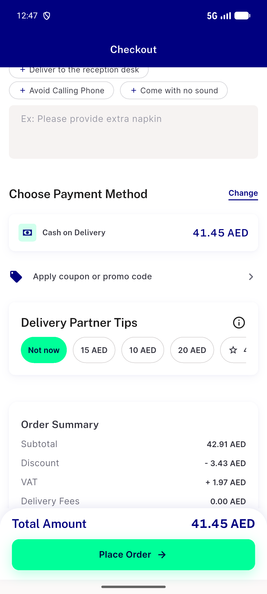
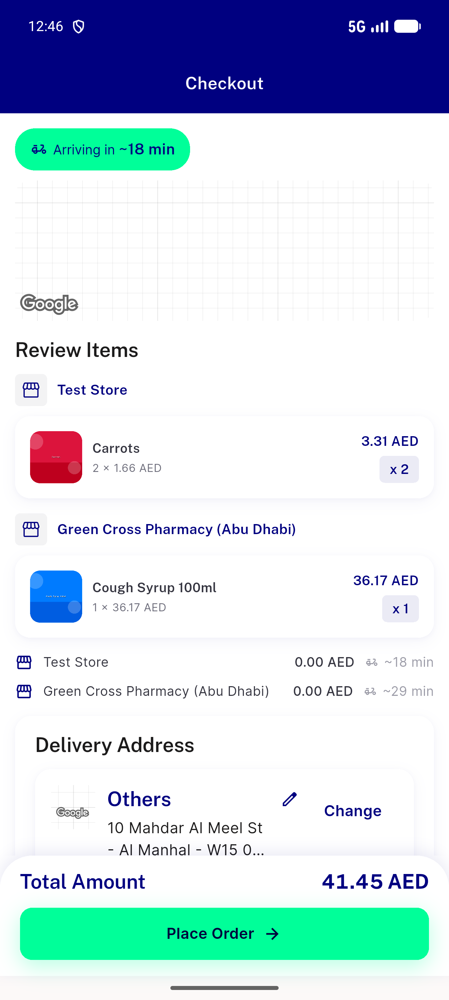
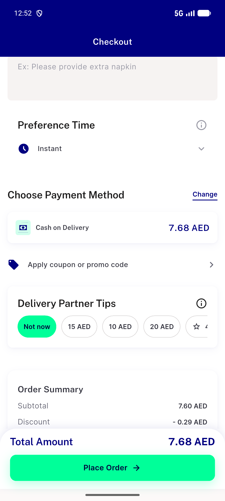
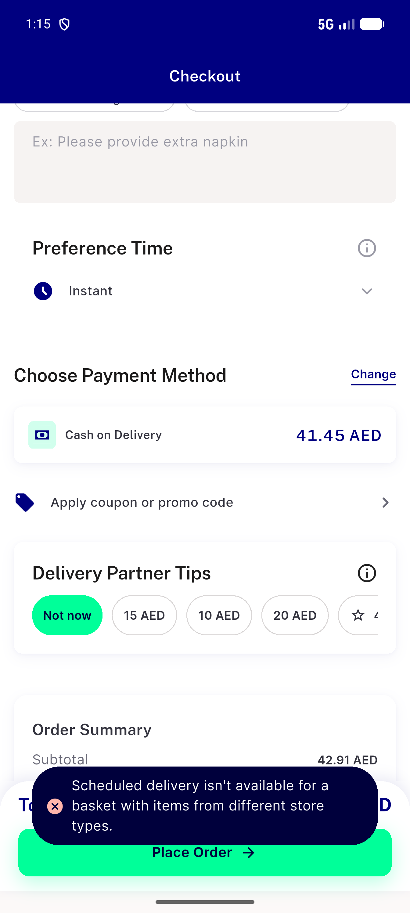
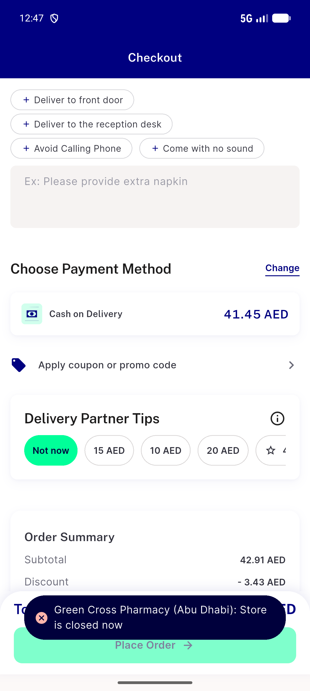
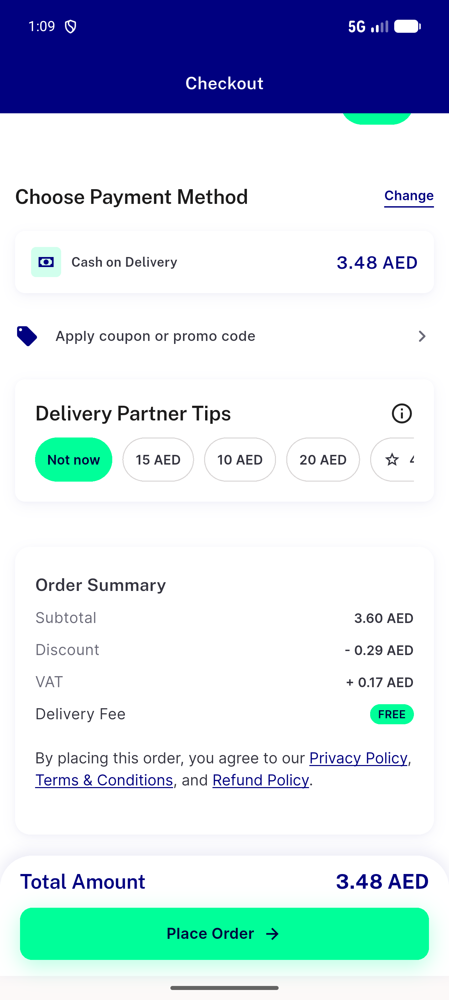
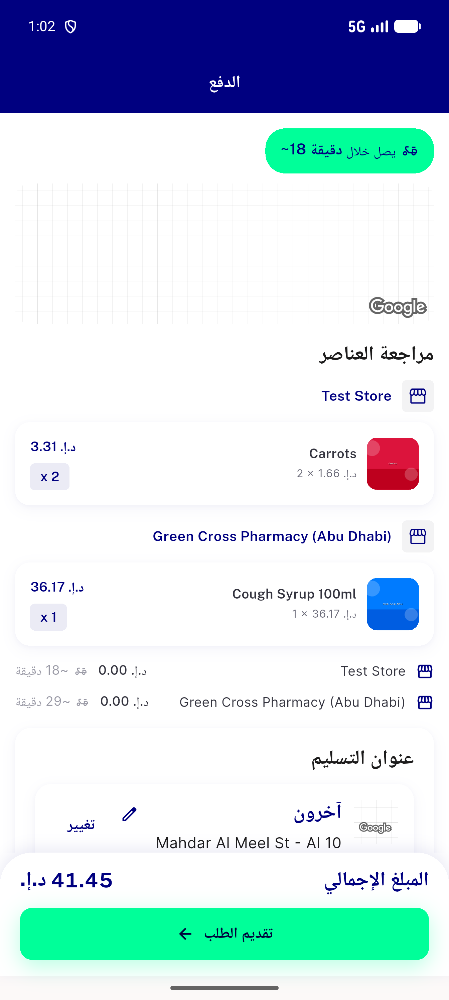
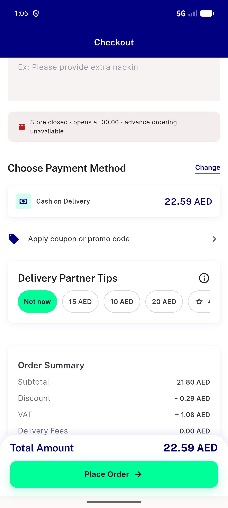

# QA Evidence — NEARS-3848

**NEARS-3848 QA [8] cycle 0 - PASS (mixed basket ASAP-only + per-store ETA)**

**10 screenshot(s).** Click any thumbnail for full resolution.

<table>
<tr>
<td align="center" width="33%"> ac1 mixed checkout note to payment en</td>
<td align="center" width="33%"> ac1 mixed checkout top en</td>
<td align="center" width="33%"> ac3 same module 2store picker visible en</td>
</tr>
<tr>
<td align="center" width="33%"> ac5 mixed asap only 403 snackbar en</td>
<td align="center" width="33%"> ac6b closed nonfood store refused en</td>
<td align="center" width="33%"> acreg flag off single module picker en</td>
</tr>
<tr>
<td align="center" width="33%"> bug closed notice shows lead store opening time</td>
<td align="center" width="33%"> bug first listed slot placed as asap</td>
<td align="center" width="33%"> rtl ar mixed checkout top</td>
</tr>
<tr>
<td align="center" width="33%"> scope4 mixed closed food notice en</td>
</tr>
</table>

### Other artifacts
- [`a11y-ac1-mixed-checkout-en-pos1.xml`](a11y-ac1-mixed-checkout-en-pos1.xml)
- [`a11y-ac1-mixed-checkout-en-pos2.xml`](a11y-ac1-mixed-checkout-en-pos2.xml)
- [`a11y-ac1-mixed-checkout-en-pos3.xml`](a11y-ac1-mixed-checkout-en-pos3.xml)
- [`a11y-ac3-same-module-2store-picker-en.xml`](a11y-ac3-same-module-2store-picker-en.xml)
- [`a11y-ac5-mixed-asap-only-403-snackbar-en.xml`](a11y-ac5-mixed-asap-only-403-snackbar-en.xml)
- [`a11y-rtl-ar-mixed-checkout-pos1.xml`](a11y-rtl-ar-mixed-checkout-pos1.xml)
- [`a11y-rtl-ar-mixed-checkout-pos2.xml`](a11y-rtl-ar-mixed-checkout-pos2.xml)
- [`a11y-rtl-ar-mixed-checkout-pos3.xml`](a11y-rtl-ar-mixed-checkout-pos3.xml)
- [`a11y-scope4-mixed-closed-food-notice-en.xml`](a11y-scope4-mixed-closed-food-notice-en.xml)
- [`ac2-mixed-place-request-bodies.log`](ac2-mixed-place-request-bodies.log)
- [`ac3-same-module-schedule-at-bodies.log`](ac3-same-module-schedule-at-bodies.log)
- [`ac5-mixed-asap-only-403.log`](ac5-mixed-asap-only-403.log)
- [`ac6a-mixed-no-slots-not-blocked.log`](ac6a-mixed-no-slots-not-blocked.log)
- [`ac6a-positive-control-same-module-select-a-time.log`](ac6a-positive-control-same-module-select-a-time.log)
- [`acreg-flag-off-single-module-schedule-at.log`](acreg-flag-off-single-module-schedule-at.log)
- [`bug-closed-notice-shows-lead-store-opening-time.log`](bug-closed-notice-shows-lead-store-opening-time.log)
- [`bug-first-listed-slot-placed-as-asap.log`](bug-first-listed-slot-placed-as-asap.log)
- [`progress.md`](progress.md)
- [`scope4-mixed-closed-food-preflight-block.log`](scope4-mixed-closed-food-preflight-block.log)

---
*From `nears/docs/qa-evidence/NEARS-3848/` · public-repo scrub policy (no live secrets; verified clean).*
