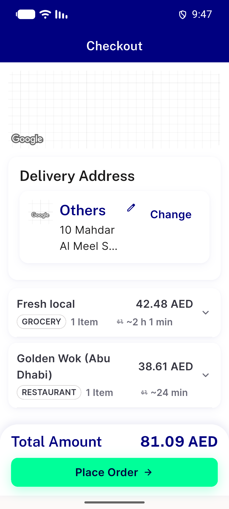
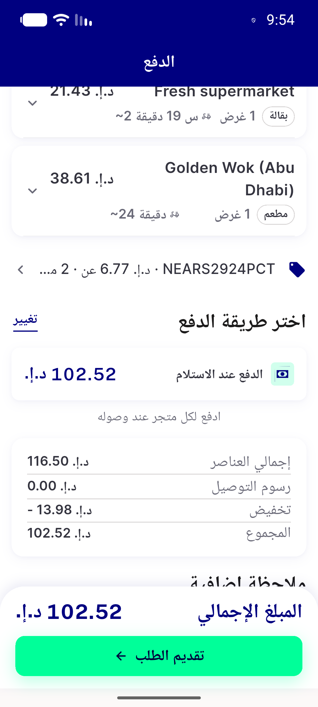
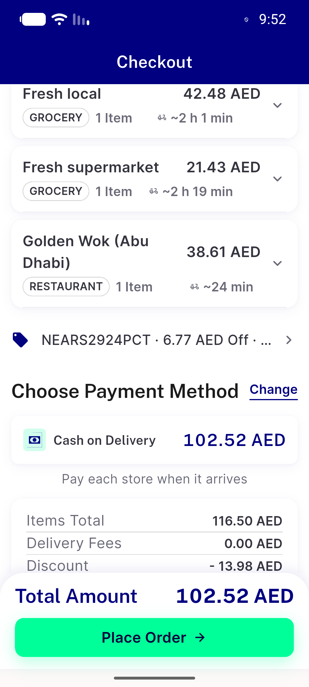
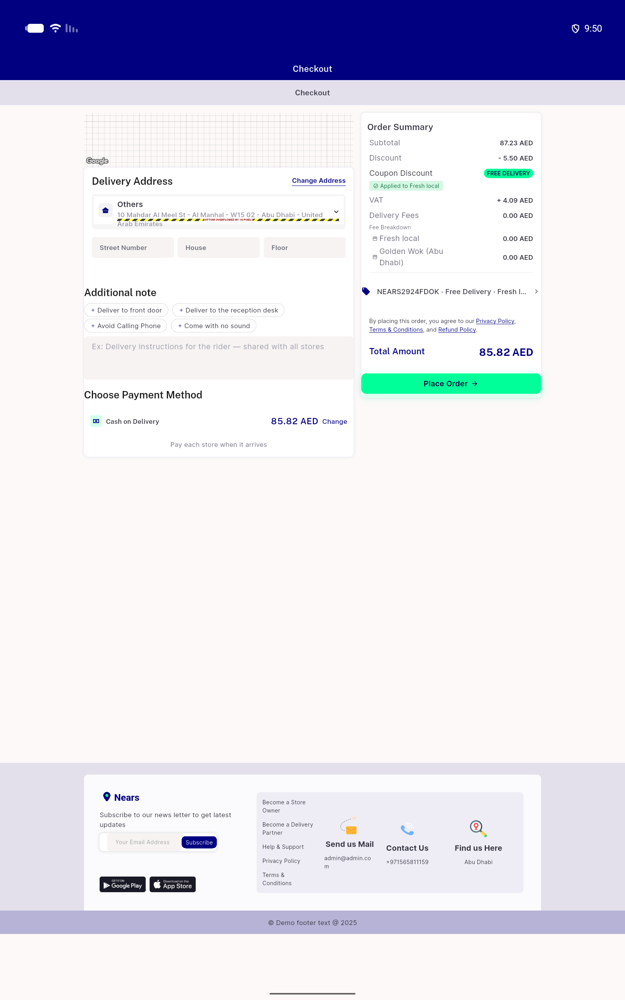
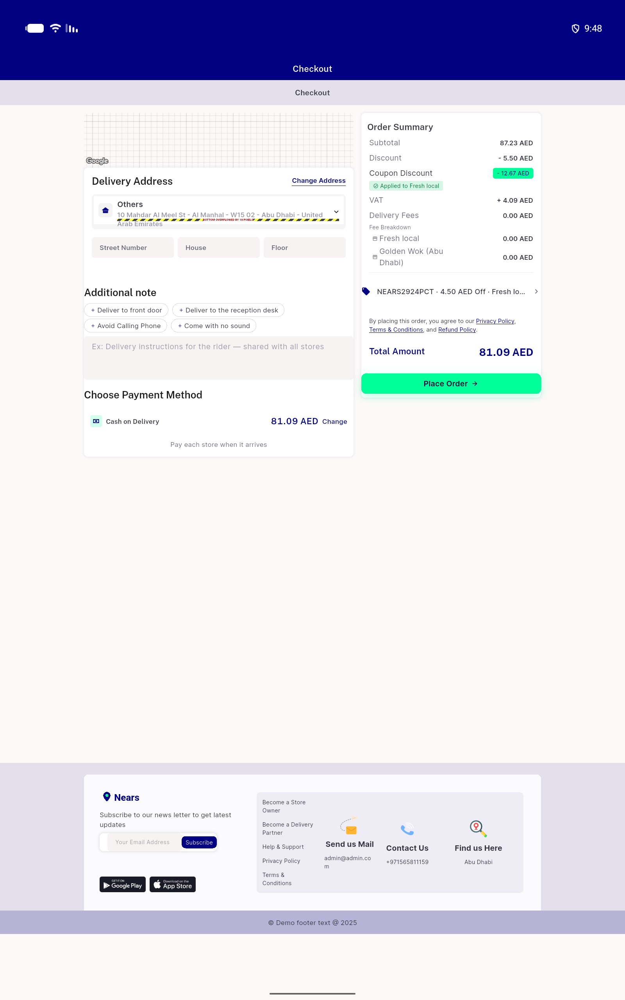
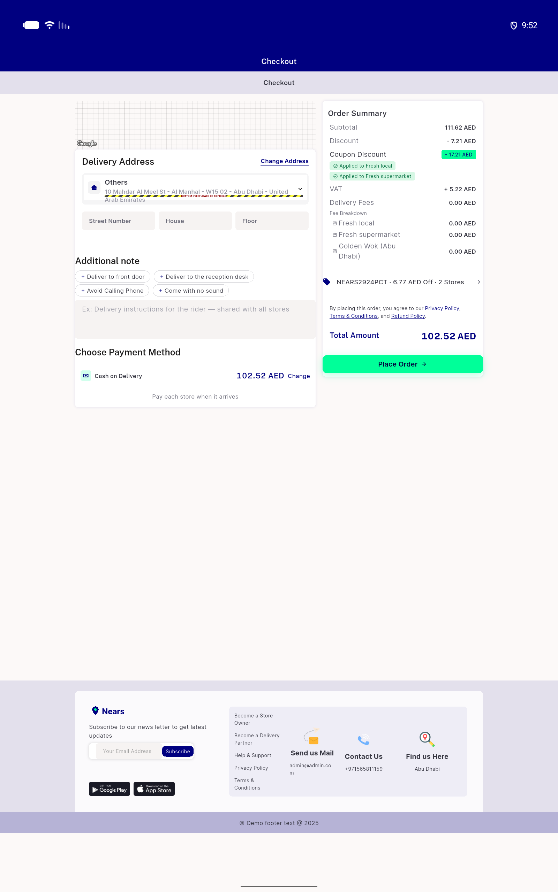
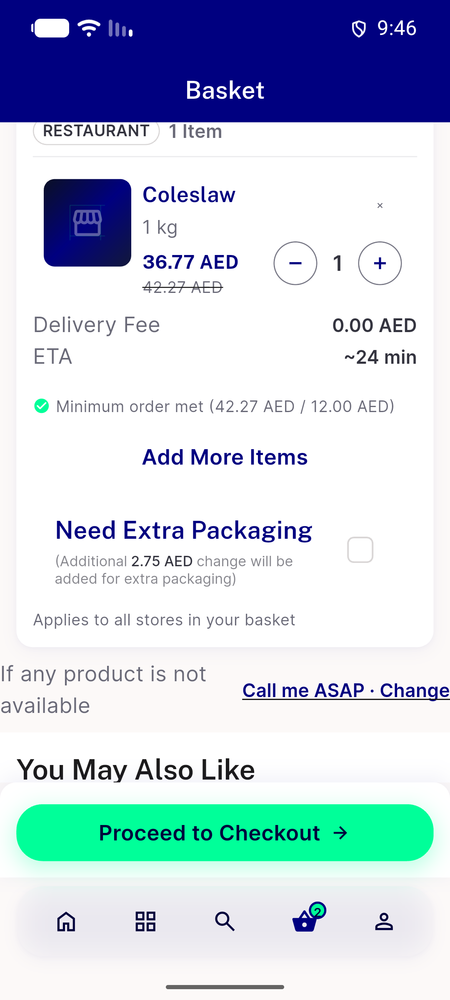
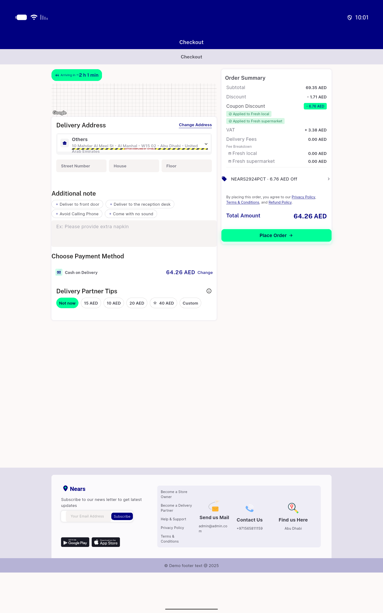
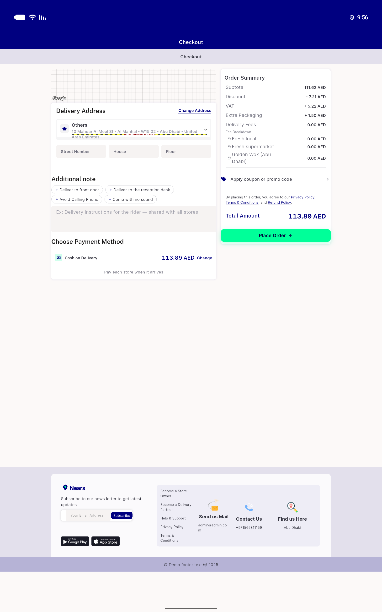

# QA Evidence — NEARS-3849

**NEARS-3849 QA PASS (cycle 0) - coupon result per store + per-store packaging**

**10 screenshot(s).** Click any thumbnail for full resolution.

<table>
<tr>
<td align="center" width="33%"> ac2 c1 mobile label one store</td>
<td align="center" width="33%"> ac2 c2 ar rtl label two stores</td>
<td align="center" width="33%"> ac2 c2 mobile label two stores</td>
</tr>
<tr>
<td align="center" width="33%"> ac2 c3 wide free delivery</td>
<td align="center" width="33%"> ac3 c1 wide chip one store</td>
<td align="center" width="33%"> ac3 c2 wide chip two stores</td>
</tr>
<tr>
<td align="center" width="33%"> ac6 cart golden wok packaging 2.75</td>
<td align="center" width="33%"> acreg same module wide legacy</td>
<td align="center" width="33%"> acreg wide lead store packaging row</td>
</tr>
<tr>
<td align="center" width="33%"> bug ar off mistranslation</td>
</tr>
</table>

### Other artifacts
- [`bug-ar-off-mistranslation.log`](bug-ar-off-mistranslation.log)
- [`bug-cart-eta-stale-locale.log`](bug-cart-eta-stale-locale.log)
- [`bug-cart-packaging-switch-unlabelled.log`](bug-cart-packaging-switch-unlabelled.log)
- [`bug-delivery-route-preview-raw-key.log`](bug-delivery-route-preview-raw-key.log)
- [`group-validate-excerpts.log`](group-validate-excerpts.log)
- [`progress.md`](progress.md)

---
*From `nears/docs/qa-evidence/NEARS-3849/` · public-repo scrub policy (no live secrets; verified clean).*
