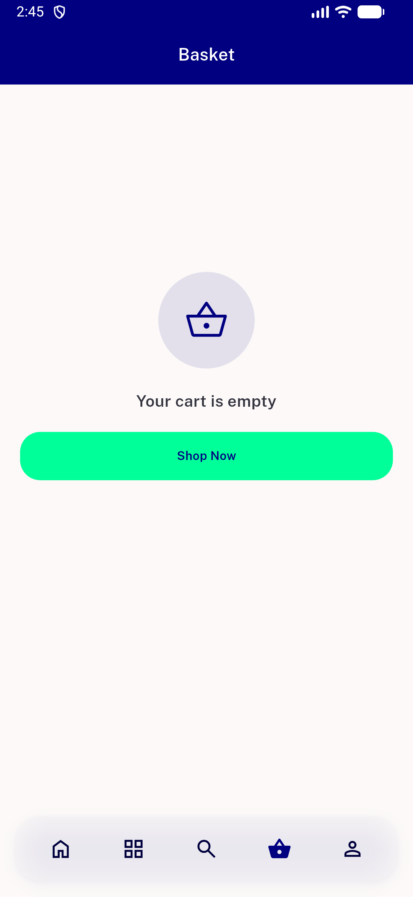
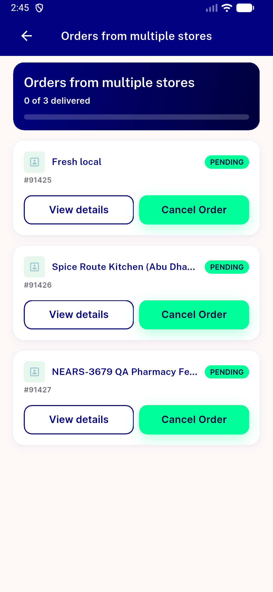
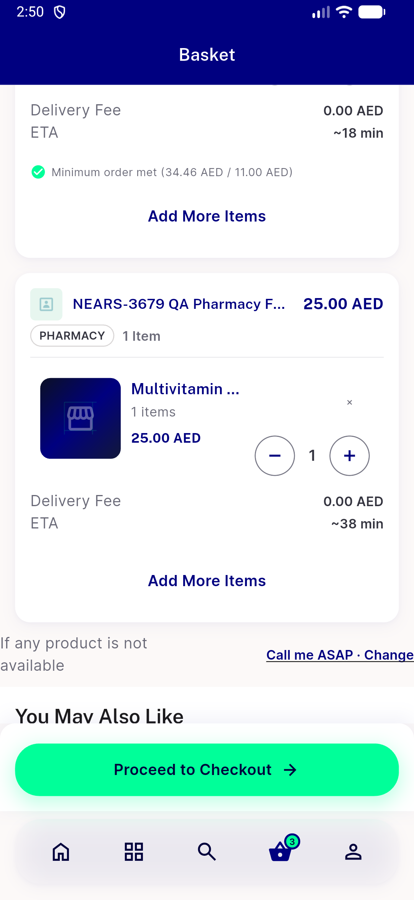
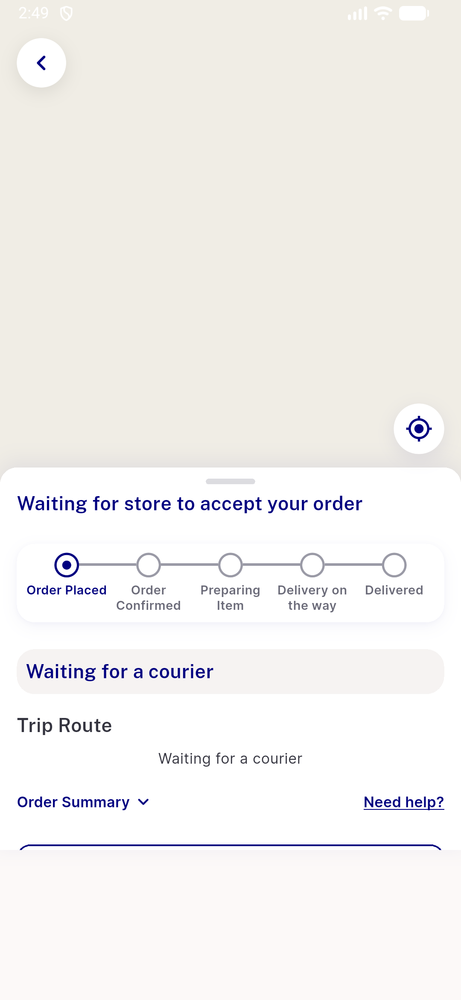
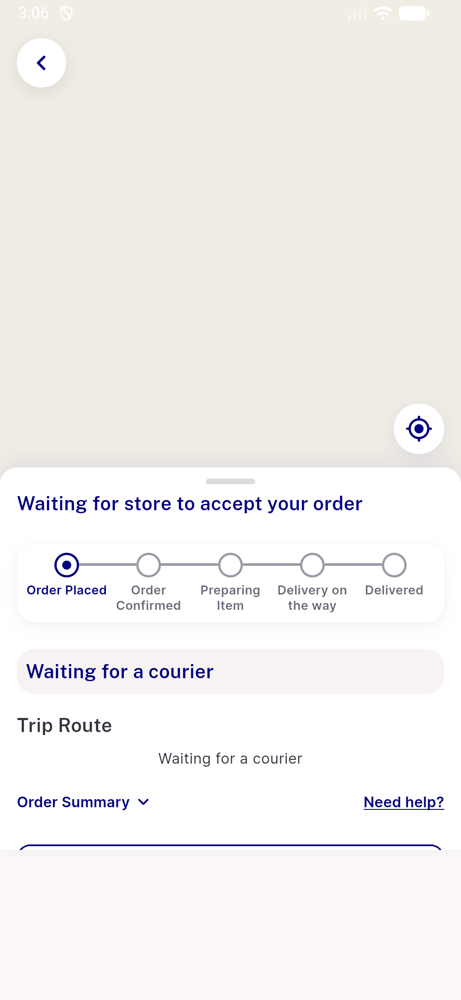
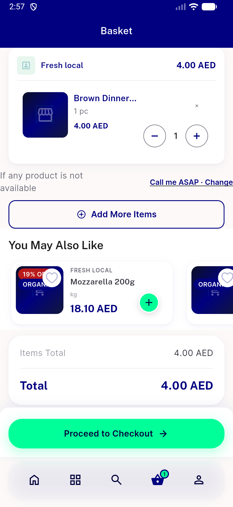

# QA Evidence — NEARS-3850

**NEARS-3850 QA PASS - post-order basket-wide clear (flag ON) + flag-OFF unchanged, fault-injected log branches live**

**11 screenshot(s).** Click any thumbnail for full resolution.

<table>
<tr>
<td align="center" width="33%"> ac1 basket after empty</td>
<td align="center" width="33%"> ac1 basket before 3 modules</td>
<td align="center" width="33%"> ac1 bottom nav badge before vs after</td>
</tr>
<tr>
<td align="center" width="33%"> ac1 group tracking 3 orders</td>
<td align="center" width="33%"> ac2 basket after campaign order 3 rows</td>
<td align="center" width="33%"> ac2 campaign order tracking</td>
</tr>
<tr>
<td align="center" width="33%"> acreg flagoff tracking</td>
<td align="center" width="33%"> d1 single basket kept row</td>
<td align="center" width="33%"> d1 single tracking reached</td>
</tr>
<tr>
<td align="center" width="33%"> d2 tracking reached</td>
<td align="center" width="33%"> reg logout basket empty</td>
</tr>
</table>

### Other artifacts
- [`app-cart-clear-lines.log`](app-cart-clear-lines.log)
- [`progress.md`](progress.md)
- [`proxy-requests.log`](proxy-requests.log)

---
*From `nears/docs/qa-evidence/NEARS-3850/` · public-repo scrub policy (no live secrets; verified clean).*
