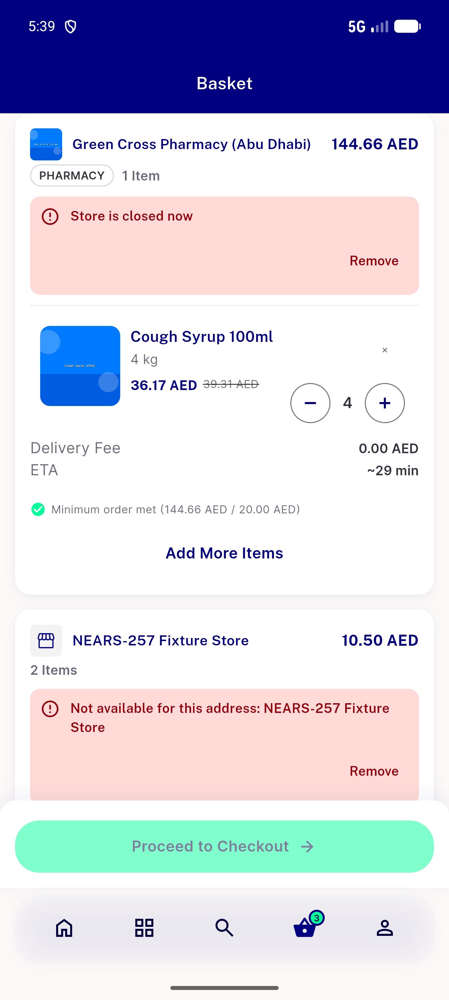
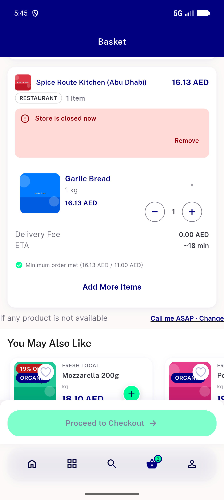
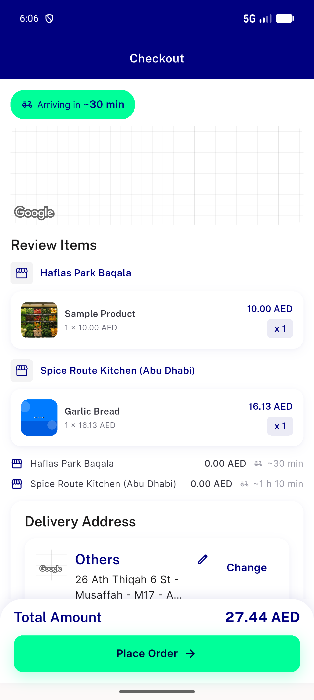
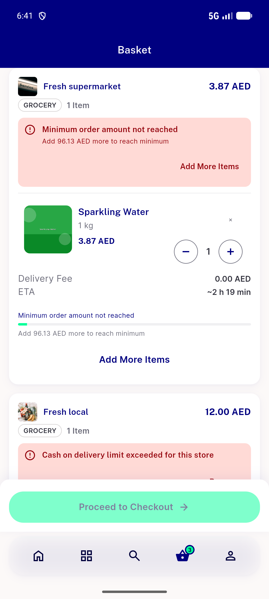

# QA Evidence — NEARS-3851

**NEARS-3851 cycle-1 delta re-QA @ f0bf72089: PASS (D1-D6, D8); D7 unreachable through UI (NEARS-3625 guard)**

**4 screenshot(s).** Click any thumbnail for full resolution.

<table>
<tr>
<td align="center" width="33%"> ac1 cart closed and out of zone cards</td>
<td align="center" width="33%"> ac3 ac10 late close returned to cart scrolled</td>
<td align="center" width="33%"> bug ac7 basket eta is lead store eta</td>
</tr>
<tr>
<td align="center" width="33%"> c1 d1 codcap and minimum cards default config</td>
</tr>
</table>

### Other artifacts
- [`ac1-below-minimum-card-zone-digital-on-dump.xml`](ac1-below-minimum-card-zone-digital-on-dump.xml)
- [`ac1-cart-a11y-dump.xml`](ac1-cart-a11y-dump.xml)
- [`ac11-s3-rx-item-card-dump.xml`](ac11-s3-rx-item-card-dump.xml)
- [`ac3-return-to-cart-dump.xml`](ac3-return-to-cart-dump.xml)
- [`ac9a-guest-returned-to-cart-dump.xml`](ac9a-guest-returned-to-cart-dump.xml)
- [`bug-ac7-basket-eta-dump.xml`](bug-ac7-basket-eta-dump.xml)
- [`bug-cart-preflight-codcap-masked-checkout-dump.xml`](bug-cart-preflight-codcap-masked-checkout-dump.xml)
- [`bug-cart-preflight-digital-in-cash-only-zone.log`](bug-cart-preflight-digital-in-cash-only-zone.log)
- [`c1-d1-dump.xml`](c1-d1-dump.xml)
- [`c1-d1-proxy-requests.log`](c1-d1-proxy-requests.log)
- [`c1-d2-reask-proxy-requests.log`](c1-d2-reask-proxy-requests.log)
- [`c1-d6a-queued-retry-proxy-requests.log`](c1-d6a-queued-retry-proxy-requests.log)
- [`c1-d6a-store-failed-card-dump.xml`](c1-d6a-store-failed-card-dump.xml)
- [`c1-d6b-place403-returned-dump.xml`](c1-d6b-place403-returned-dump.xml)
- [`c1-d6c-named-toast-dump.xml`](c1-d6c-named-toast-dump.xml)
- [`c1-d7-unserviceable-address-redirect-dump.xml`](c1-d7-unserviceable-address-redirect-dump.xml)
- [`c1-qa_proxy.py.txt`](c1-qa_proxy.py.txt)
- [`cash-notice-i-blocking-dump.xml`](cash-notice-i-blocking-dump.xml)
- [`cash-notice-ii-advisory-dump.xml`](cash-notice-ii-advisory-dump.xml)
- [`cash-notice-iii-advisory-dump.xml`](cash-notice-iii-advisory-dump.xml)
- [`progress.md`](progress.md)
- [`step0`](step0)

---
*From `nears/docs/qa-evidence/NEARS-3851/` · public-repo scrub policy (no live secrets; verified clean).*
