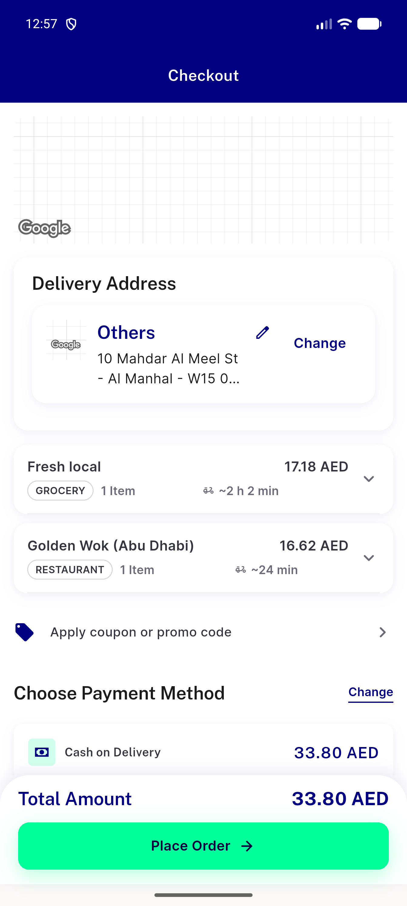
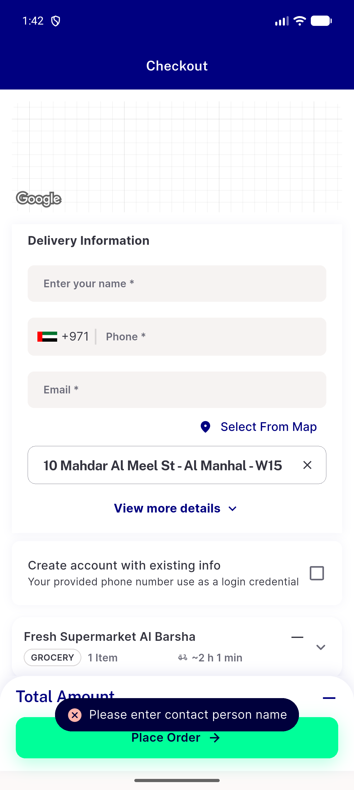
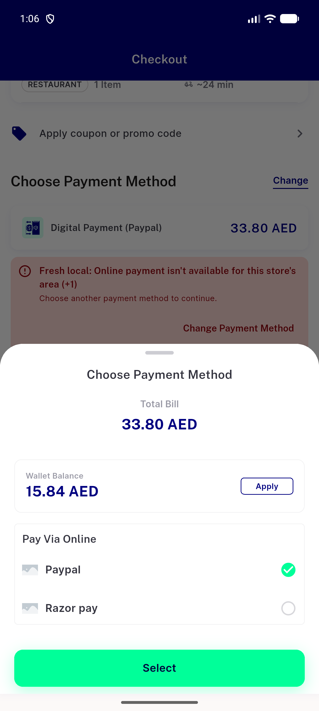
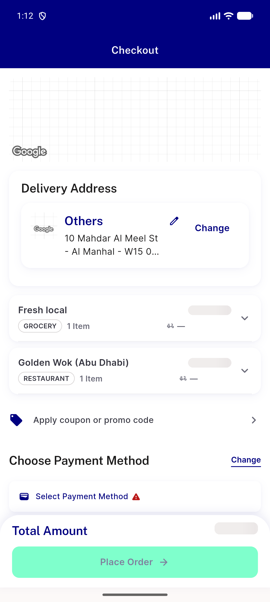

# QA Evidence — NEARS-3852

**NEARS-3852 [8] QA PASS (2 non-blocking task bugs) - HEAD 37e157dd8, emulator-5660, private DB nears_qa_3852**

**4 screenshot(s).** Click any thumbnail for full resolution.

<table>
<tr>
<td align="center" width="33%"> c1 checkout mixed mobile top en</td>
<td align="center" width="33%"> c10 tap name missing toast</td>
<td align="center" width="33%"> c18 sheet open card behind</td>
</tr>
<tr>
<td align="center" width="33%"> c6 pending skeletons</td>
</tr>
</table>

### Other artifacts
- [`bug-c14-double-fail-on-4c-exit.log`](bug-c14-double-fail-on-4c-exit.log)
- [`bug-coupon-store-fail-generic-retry-dump.xml`](bug-coupon-store-fail-generic-retry-dump.xml)
- [`bug-coupon-store-fail-generic-retry.log`](bug-coupon-store-fail-generic-retry.log)
- [`c1-checkout-bottom-dump.xml`](c1-checkout-bottom-dump.xml)
- [`c1-checkout-top-dump.xml`](c1-checkout-top-dump.xml)
- [`c10-address-only-missing-dump.xml`](c10-address-only-missing-dump.xml)
- [`c10-email-only-missing-dump.xml`](c10-email-only-missing-dump.xml)
- [`c10-guest-needs-input-top-dump.xml`](c10-guest-needs-input-top-dump.xml)
- [`c10-last-input-pending-dump.xml`](c10-last-input-pending-dump.xml)
- [`c10-last-input-resolved-dump.xml`](c10-last-input-resolved-dump.xml)
- [`c10-name-only-missing-dump.xml`](c10-name-only-missing-dump.xml)
- [`c10-number-only-missing-dump.xml`](c10-number-only-missing-dump.xml)
- [`c10-pair-address-name-dump.xml`](c10-pair-address-name-dump.xml)
- [`c10-pair-number-email-dump.xml`](c10-pair-number-email-dump.xml)
- [`c10-tap-all-missing-dump.xml`](c10-tap-all-missing-dump.xml)
- [`c10-whitespace-name-dump.xml`](c10-whitespace-name-dump.xml)
- [`c10b-cleared-after-resolve-dump.xml`](c10b-cleared-after-resolve-dump.xml)
- [`c10b-cleared-block-dump.xml`](c10b-cleared-block-dump.xml)
- [`c10b-refilled-dump.xml`](c10b-refilled-dump.xml)
- [`c11-after-dismiss-block-dump.xml`](c11-after-dismiss-block-dump.xml)
- [`c11-after-dismiss-dump.xml`](c11-after-dismiss-dump.xml)
- [`c11-cash-refused-at-place-dump.xml`](c11-cash-refused-at-place-dump.xml)
- [`c12-no-method-block-dump.xml`](c12-no-method-block-dump.xml)
- [`c12-no-method-dump.xml`](c12-no-method-dump.xml)
- [`c12-no-method-reprobe-dump.xml`](c12-no-method-reprobe-dump.xml)
- [`c13-codcap-dump.xml`](c13-codcap-dump.xml)
- [`c13-codcap-selector-dump.xml`](c13-codcap-selector-dump.xml)
- [`c13-codcap-sheet-dump.xml`](c13-codcap-sheet-dump.xml)
- [`c14-c15-guest-returned-dump.xml`](c14-c15-guest-returned-dump.xml)
- [`c14-returned-to-cart-loggedin-dump.xml`](c14-returned-to-cart-loggedin-dump.xml)
- [`c16-allcodcap-dump.xml`](c16-allcodcap-dump.xml)
- [`c16-allcodcap-selector-dump.xml`](c16-allcodcap-selector-dump.xml)
- [`c16-place403-codcap-dump.xml`](c16-place403-codcap-dump.xml)
- [`c16-place403-codcap-selector-dump.xml`](c16-place403-codcap-selector-dump.xml)
- [`c16-placetime-codcap-dump.xml`](c16-placetime-codcap-dump.xml)
- [`c16-placetime-codcap-selector-dump.xml`](c16-placetime-codcap-selector-dump.xml)
- [`c17-refusal-card-dump.xml`](c17-refusal-card-dump.xml)
- [`c18-method-changed-card-dropped-dump.xml`](c18-method-changed-card-dropped-dump.xml)
- [`c18-sheet-open-card-stays-dump.xml`](c18-sheet-open-card-stays-dump.xml)
- [`c19-confirm-sheet-live-place-dump.xml`](c19-confirm-sheet-live-place-dump.xml)
- [`c19-confirm-sheet-mixed-dump.xml`](c19-confirm-sheet-mixed-dump.xml)
- [`c2-c19-after-place-dump.xml`](c2-c19-after-place-dump.xml)
- [`c2-store-line-expanded-dump.xml`](c2-store-line-expanded-dump.xml)
- [`c20-320dp-ar-dump.xml`](c20-320dp-ar-dump.xml)
- [`c20-320dp-en-dump.xml`](c20-320dp-en-dump.xml)
- [`c20-320dp-en-storelines-dump.xml`](c20-320dp-en-storelines-dump.xml)
- [`c20-after-retry-dump.xml`](c20-after-retry-dump.xml)
- [`c20-ar-kept-refusal-dump.xml`](c20-ar-kept-refusal-dump.xml)
- [`c20-card-320dp-en-dump.xml`](c20-card-320dp-en-dump.xml)
- [`c20-confirm-sheet-320dp-dump.xml`](c20-confirm-sheet-320dp-dump.xml)
- [`c20-tooltip-open-dump.xml`](c20-tooltip-open-dump.xml)
- [`c21-3851-remove-guest-dump.xml`](c21-3851-remove-guest-dump.xml)
- [`c21-buynow-prescription-dump.xml`](c21-buynow-prescription-dump.xml)
- [`c21-flagoff-basket-dump.xml`](c21-flagoff-basket-dump.xml)
- [`c21-flagoff-checkout-bottom-dump.xml`](c21-flagoff-checkout-bottom-dump.xml)
- [`c21-flagoff-checkout-dump.xml`](c21-flagoff-checkout-dump.xml)
- [`c21-nonmixed-confirm-sheet-dump.xml`](c21-nonmixed-confirm-sheet-dump.xml)
- [`c21-same-module-bottom-dump.xml`](c21-same-module-bottom-dump.xml)
- [`c21-same-module-multistore-bottom-dump.xml`](c21-same-module-multistore-bottom-dump.xml)
- [`c21-same-module-multistore-top-dump.xml`](c21-same-module-multistore-top-dump.xml)
- [`c21-same-module-top-dump.xml`](c21-same-module-top-dump.xml)
- [`c21-single-store-guest-bottom-dump.xml`](c21-single-store-guest-bottom-dump.xml)
- [`c21-single-store-guest-dump.xml`](c21-single-store-guest-dump.xml)
- [`c22-wide-confirm-sheet-dump.xml`](c22-wide-confirm-sheet-dump.xml)
- [`c22-wide-coupon-store13-fail-dump.xml`](c22-wide-coupon-store13-fail-dump.xml)
- [`c22-wide-mixed-dump.xml`](c22-wide-mixed-dump.xml)
- [`c22-wide-same-module-dump.xml`](c22-wide-same-module-dump.xml)
- [`c3-partial-pay-block-dump.xml`](c3-partial-pay-block-dump.xml)
- [`c3-partial-pay-top-dump.xml`](c3-partial-pay-top-dump.xml)
- [`c4-c20-ar-payment-block-dump.xml`](c4-c20-ar-payment-block-dump.xml)
- [`c5-c22-wide-coupon-applied-dump.xml`](c5-c22-wide-coupon-applied-dump.xml)
- [`c5-c22-wide-coupon-removed-dump.xml`](c5-c22-wide-coupon-removed-dump.xml)
- [`c5-coupon-applied-block-dump.xml`](c5-coupon-applied-block-dump.xml)
- [`c5-coupon-applied-mobile-dump.xml`](c5-coupon-applied-mobile-dump.xml)
- [`c5-coupon-removed-dump.xml`](c5-coupon-removed-dump.xml)
- [`c5-mobile-coupon-store13-fail-dump.xml`](c5-mobile-coupon-store13-fail-dump.xml)
- [`c6-pending-block-dump.xml`](c6-pending-block-dump.xml)
- [`c6-pending-dump.xml`](c6-pending-dump.xml)
- [`c7-probe500-block-dump.xml`](c7-probe500-block-dump.xml)
- [`c7-probe500-dump.xml`](c7-probe500-dump.xml)
- [`c7-validnoamounts-dump.xml`](c7-validnoamounts-dump.xml)
- [`c8-fee-unresolved-dump.xml`](c8-fee-unresolved-dump.xml)
- [`c8-stock-block-dump.xml`](c8-stock-block-dump.xml)
- [`c8-tax-unresolved-dump.xml`](c8-tax-unresolved-dump.xml)
- [`c9-baseline-nofree-dump.xml`](c9-baseline-nofree-dump.xml)
- [`c9-block-dump.xml`](c9-block-dump.xml)
- [`c9-fee-fail-probe-ok-dump.xml`](c9-fee-fail-probe-ok-dump.xml)
- [`c9-retry-inflight-dump.xml`](c9-retry-inflight-dump.xml)
- [`c9-retry-resolved-dump.xml`](c9-retry-resolved-dump.xml)
- [`fixtures.log`](fixtures.log)
- [`followup-proceed-disabled-after-oob-cart-delete-dump.xml`](followup-proceed-disabled-after-oob-cart-delete-dump.xml)
- [`progress.md`](progress.md)
- [`qa_proxy.py.txt`](qa_proxy.py.txt)

---
*From `nears/docs/qa-evidence/NEARS-3852/` · public-repo scrub policy (no live secrets; verified clean).*
