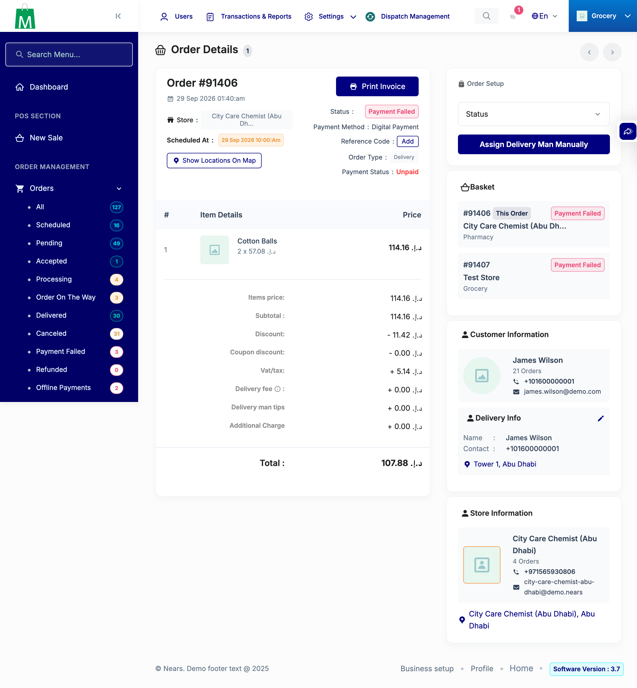
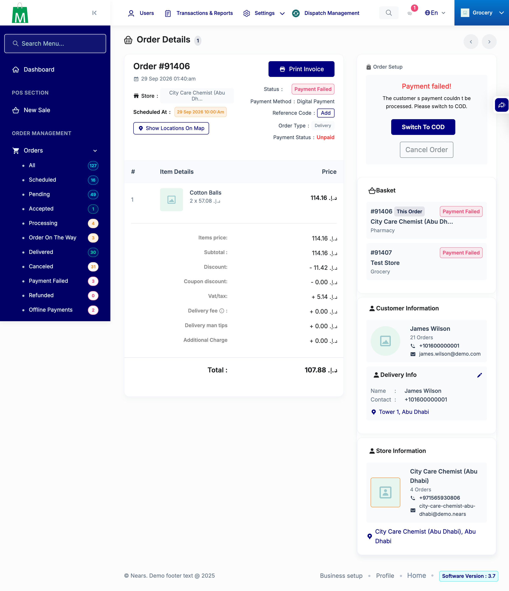
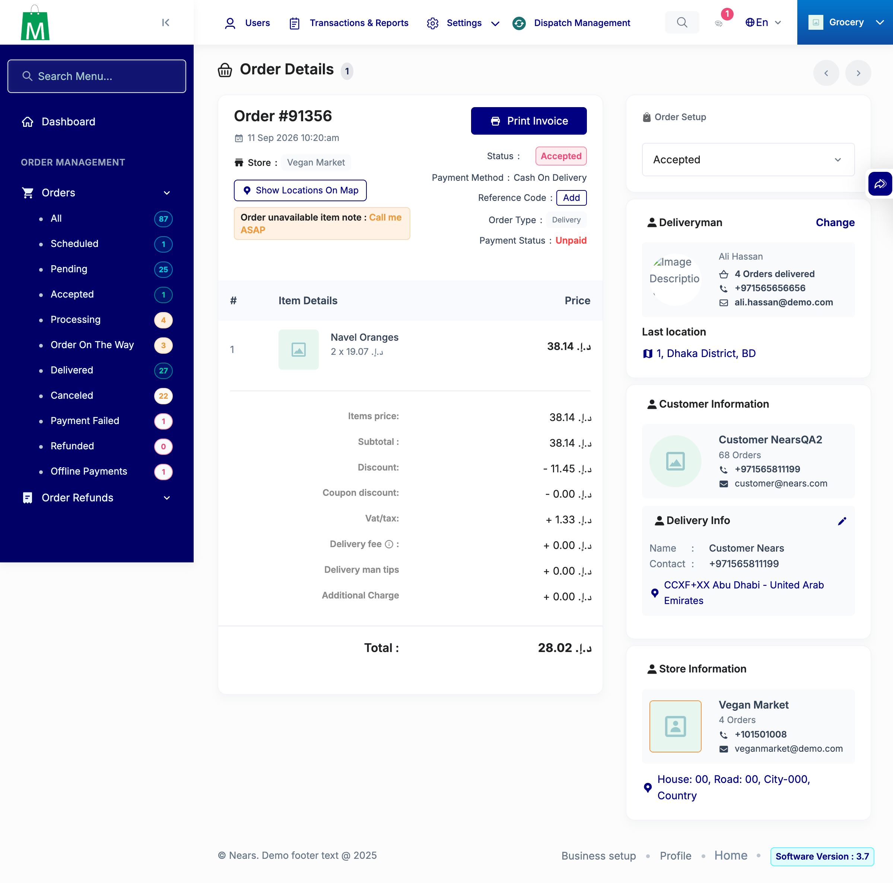
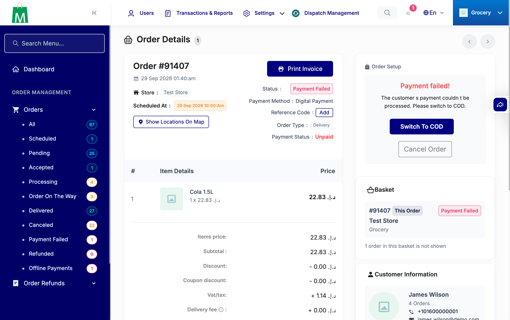
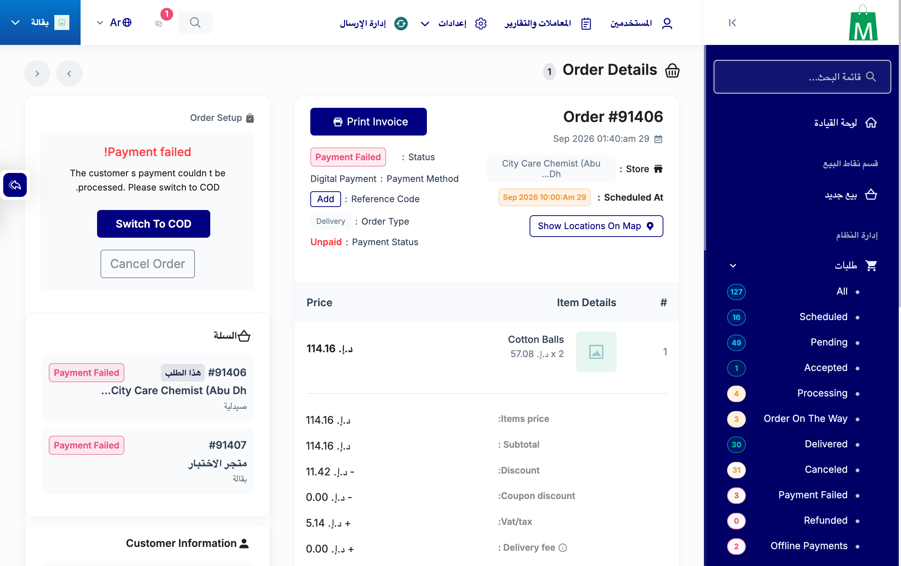

# QA Evidence — NEARS-3853

**NEARS-3853 admin basket card — QA PASS (5 shots + 1 bug log)**

**5 screenshot(s).** Click any thumbnail for full resolution.

<table>
<tr>
<td align="center" width="33%"> ac1 all details 91406 master</td>
<td align="center" width="33%"> ac1 details 91406 master</td>
<td align="center" width="33%"> ac2 nongroup 91356 no card</td>
</tr>
<tr>
<td align="center" width="33%"> ac3 zone employee 91407 hidden line</td>
<td align="center" width="33%"> rtl ar 91406 card viewport</td>
</tr>
</table>

### Other artifacts
- [`bug-cross-zone-invoice-exposure.log`](bug-cross-zone-invoice-exposure.log)

---
*From `nears/docs/qa-evidence/NEARS-3853/` · public-repo scrub policy (no live secrets; verified clean).*
