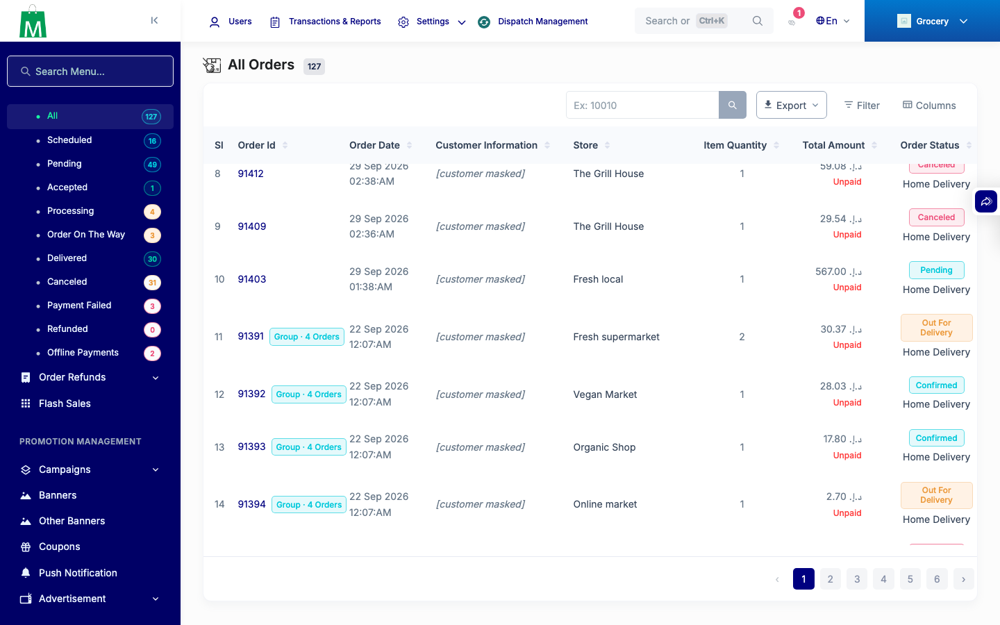
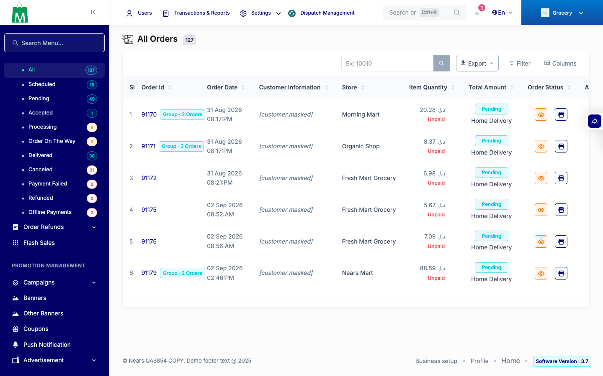
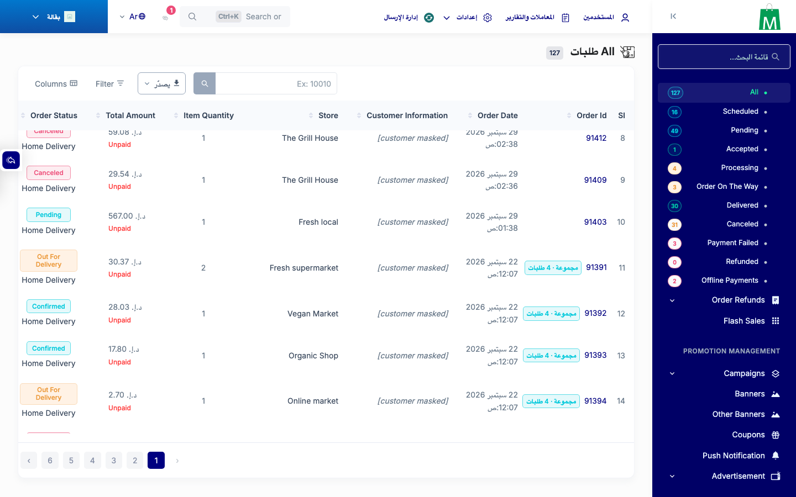

# QA Evidence — NEARS-3854

**PASS: NEARS-3854 admin group badge count + search partial badge + export Group id (web, private DB copy, 205be4800)**

**3 screenshot(s).** Click any thumbnail for full resolution.

<table>
<tr>
<td align="center" width="33%"> ac1 list en badge</td>
<td align="center" width="33%"> ac2 ajax search badge</td>
<td align="center" width="33%"> ar list badge rtl</td>
</tr>
</table>

### Other artifacts
- [`export-parsed.txt`](export-parsed.txt)
- [`progress.md`](progress.md)

---
*From `nears/docs/qa-evidence/NEARS-3854/` · public-repo scrub policy (no live secrets; verified clean).*
