# QA Evidence — NEARS-3860

**NEARS-3860 [8] delta-1 evidence: F cart flag + fetch bound, AC2 refund status (wallet_add_refund=1)**

**23 screenshot(s).** Click any thumbnail for full resolution.

<table>
<tr>
<td align="center" width="33%"><a href="a1-ac7-confirm-sheet-mixed-coupon.png">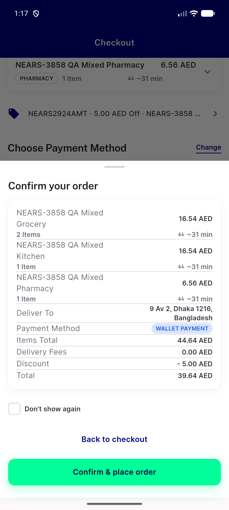</a> a1 ac7 confirm sheet mixed coupon</td>
<td align="center" width="33%"><a href="a2-probe-failed-checkout.png">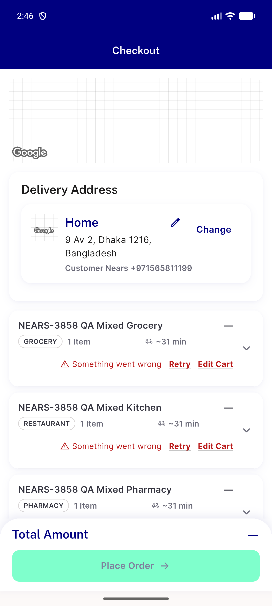</a> a2 probe failed checkout</td>
<td align="center" width="33%"><a href="a2-probe-pending-checkout.png">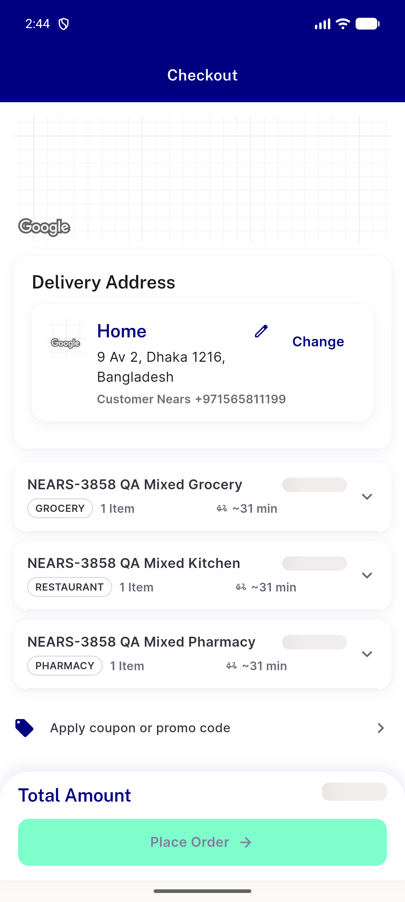</a> a2 probe pending checkout</td>
</tr>
<tr>
<td align="center" width="33%"><a href="a3-wide-checkout-mixed-coupon.png">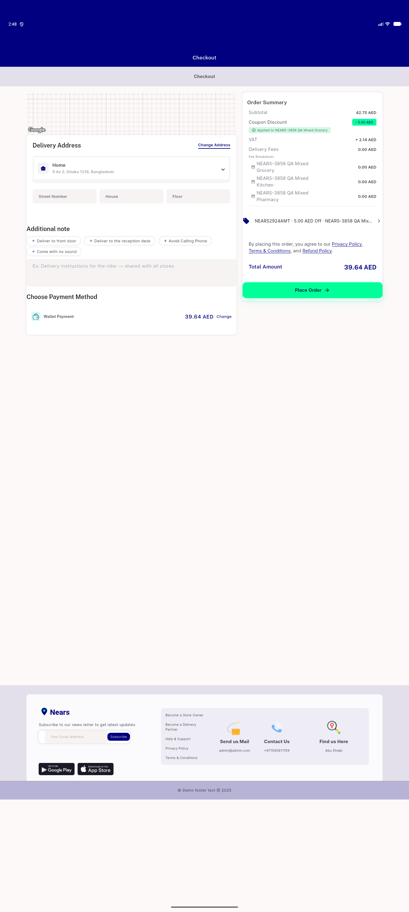</a> a3 wide checkout mixed coupon</td>
<td align="center" width="33%"><a href="a3-wide-confirm-sheet.png">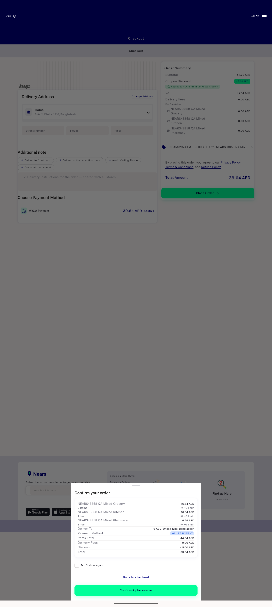</a> a3 wide confirm sheet</td>
<td align="center" width="33%"><a href="ac2-all-tab-top-no-group.png">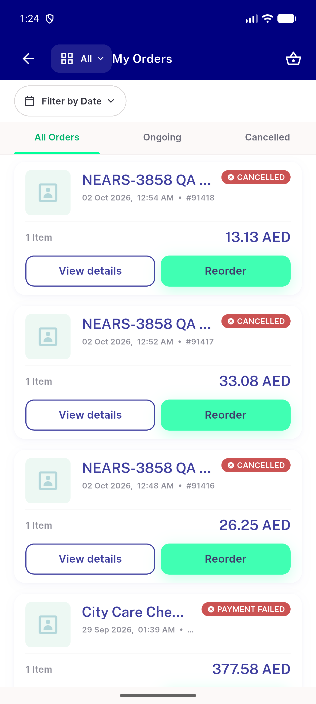</a> ac2 all tab top no group</td>
</tr>
<tr>
<td align="center" width="33%"><a href="ac2-c1-group-card-ongoing-cancelled-child.png">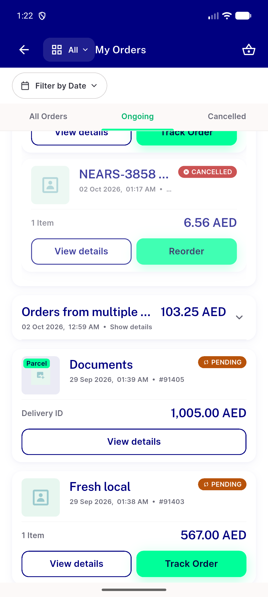</a> ac2 c1 group card ongoing cancelled child</td>
<td align="center" width="33%"><a href="ac2-cancelled-tab-top.png">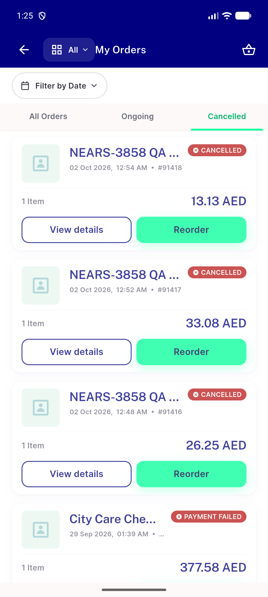</a> ac2 cancelled tab top</td>
<td align="center" width="33%"><a href="ac3-refund-request-amount-20.75.png">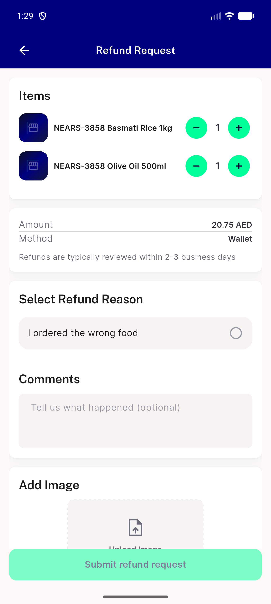</a> ac3 refund request amount 20.75</td>
</tr>
<tr>
<td align="center" width="33%"><a href="ac7c-coupon-refused-before-placement-toast.png">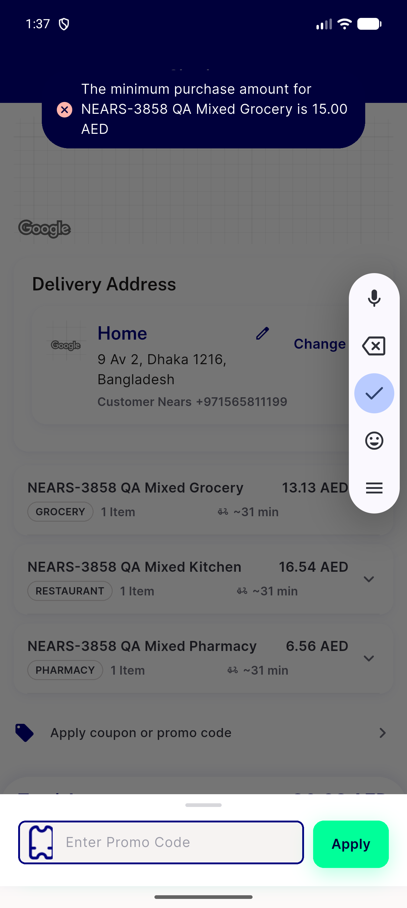</a> ac7c coupon refused before placement toast</td>
<td align="center" width="33%"><a href="ac9-cart-packaging-card-grocery-only.png">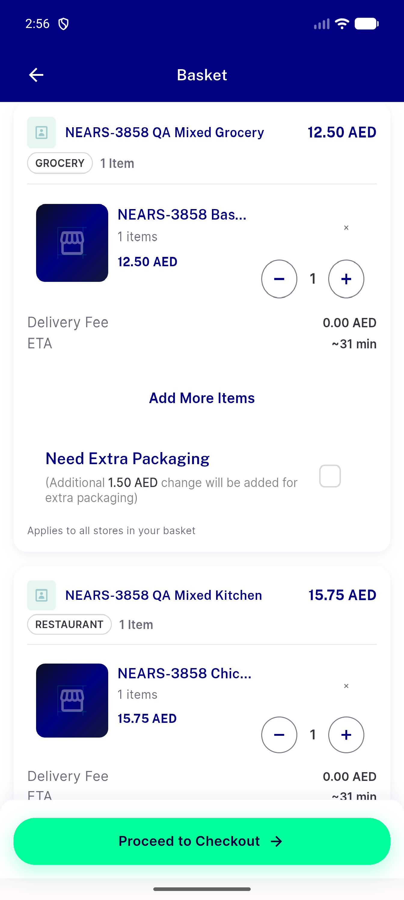</a> ac9 cart packaging card grocery only</td>
<td align="center" width="33%"> bug group screen a11y empty after back</td>
</tr>
<tr>
<td align="center" width="33%"><a href="c2-d1-sheet-store-closed.png">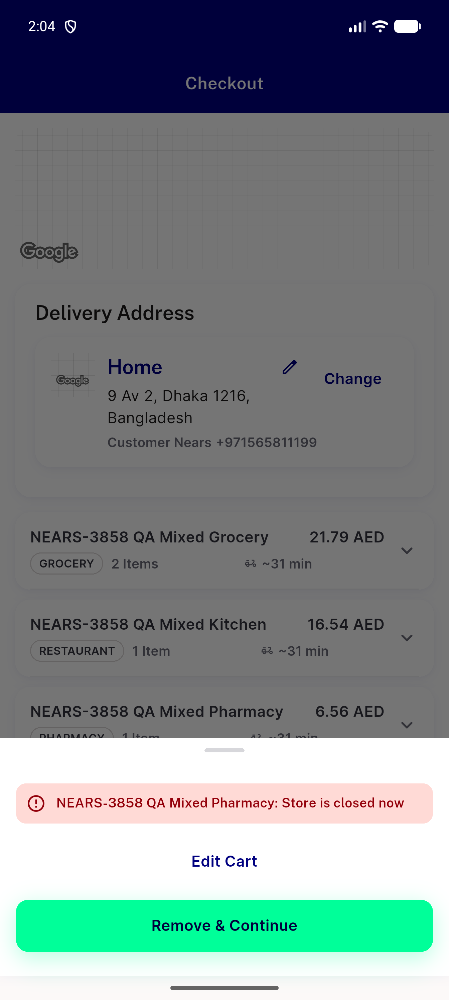</a> c2 d1 sheet store closed</td>
<td align="center" width="33%"><a href="c2-forced-confirm-after-remove.png">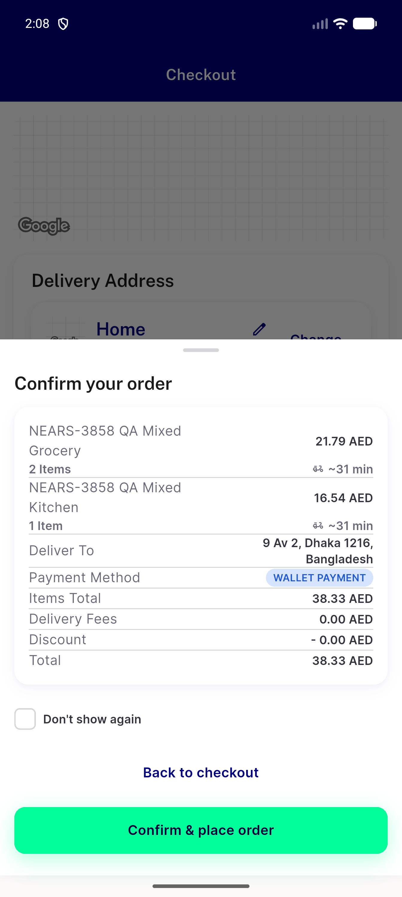</a> c2 forced confirm after remove</td>
<td align="center" width="33%"> d1 control pill frame</td>
</tr>
<tr>
<td align="center" width="33%"><a href="d1-frame-2.png">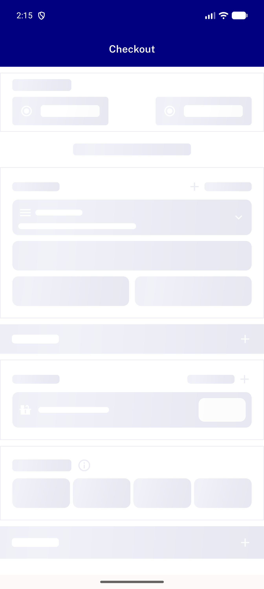</a> d1 frame 2</td>
<td align="center" width="33%"><a href="d1-notice-before-confirm-tap.png">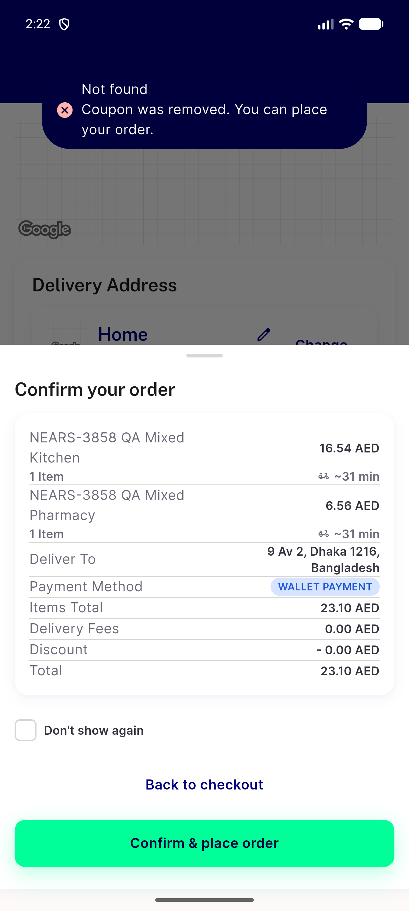</a> d1 notice before confirm tap</td>
<td align="center" width="33%"><a href="delta-ac2-child-details.png">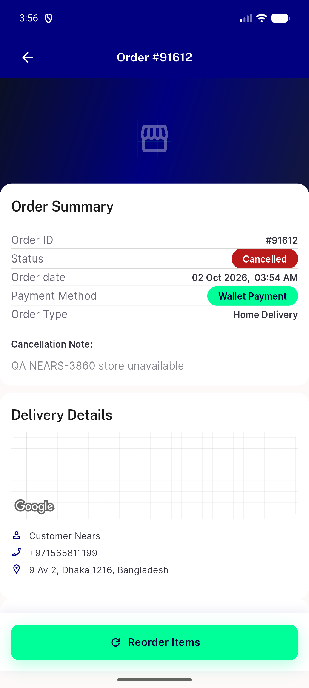</a> delta ac2 child details</td>
</tr>
<tr>
<td align="center" width="33%"><a href="delta-ac2-group-card-ongoing.png">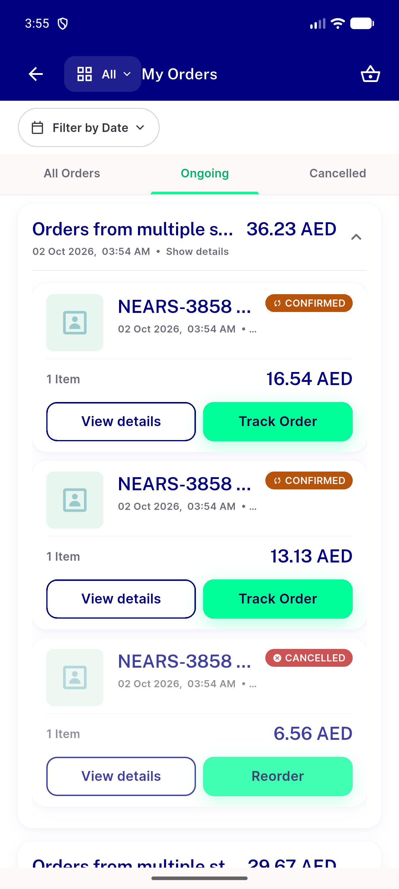</a> delta ac2 group card ongoing</td>
<td align="center" width="33%"><a href="delta-f-cart-direct-addr60-flag-by-name.png">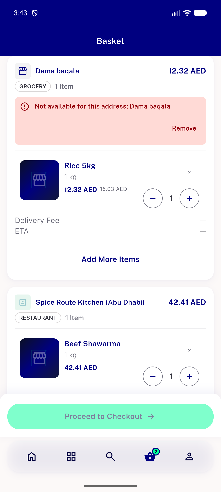</a> delta f cart direct addr60 flag by name</td>
<td align="center" width="33%"><a href="delta-f-editcart-from-block.png">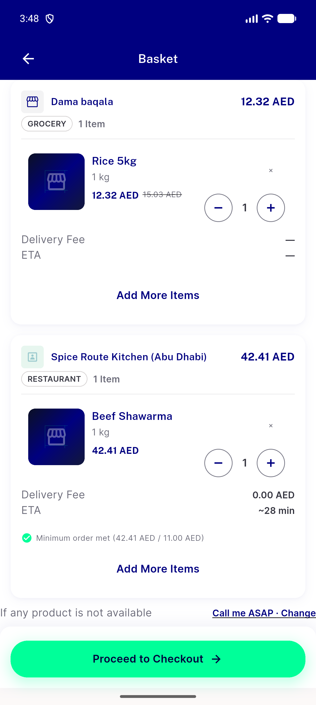</a> delta f editcart from block</td>
</tr>
<tr>
<td align="center" width="33%"><a href="f-checkout-addr60-outofzone.png">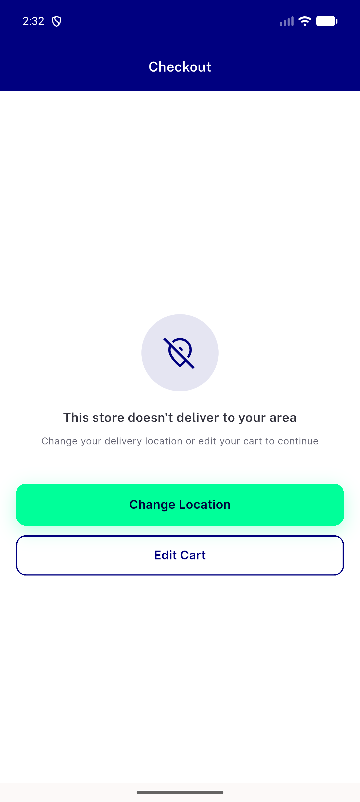</a> f checkout addr60 outofzone</td>
<td align="center" width="33%"><a href="obs-basketbar-stale-after-pharmacy-add.png">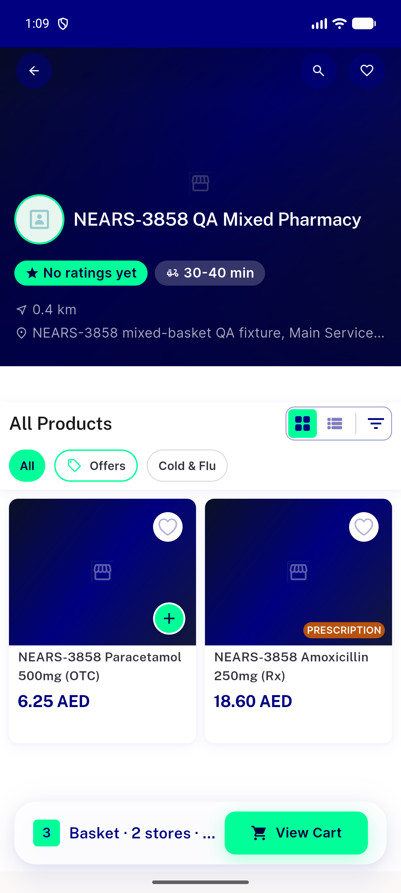</a> obs basketbar stale after pharmacy add</td>
</tr>
</table>

### Other artifacts
- [`bug-a3-wide-cartitem-width-budget.log`](bug-a3-wide-cartitem-width-budget.log)
- [`bug-cart-add-list-race.log`](bug-cart-add-list-race.log)
- [`bug-customer-settings-form-zeroes-wallet.log`](bug-customer-settings-form-zeroes-wallet.log)
- [`bug-cvatsum-wide-vat-precoupon.log`](bug-cvatsum-wide-vat-precoupon.log)
- [`bug-f-outofzone-fullpage-not-row.log`](bug-f-outofzone-fullpage-not-row.log)
- [`bug-group-screen-a11y-empty-after-back.xml`](bug-group-screen-a11y-empty-after-back.xml)
- [`bug-group-screen-blank-after-back.log`](bug-group-screen-blank-after-back.log)
- [`delta-ac2-evidence.log`](delta-ac2-evidence.log)
- [`delta-ac2-group-card-ongoing.xml`](delta-ac2-group-card-ongoing.xml)
- [`delta-f-cart-direct-addr60.xml`](delta-f-cart-direct-addr60.xml)
- [`delta-f-editcart-from-block.xml`](delta-f-editcart-from-block.xml)
- [`delta-f-evidence.log`](delta-f-evidence.log)

---
*From `nears/docs/qa-evidence/NEARS-3860/` · public-repo scrub policy (no live secrets; verified clean).*
