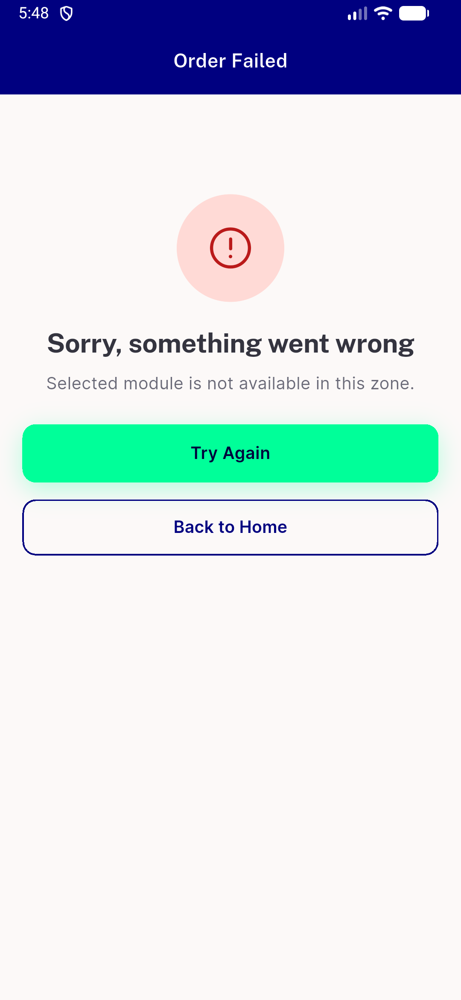

# QA Evidence — NEARS-3874

**QA cycle 0: AC1-AC4/AC6 PASS on fix/NEARS-3874-parcel-module@0794251ec**

**1 screenshot(s).** Click any thumbnail for full resolution.

<table>
<tr>
<td align="center" width="33%"> ac6 failed order module message</td>
</tr>
</table>

### Other artifacts
- [`be-log-excerpt.log`](be-log-excerpt.log)
- [`db-orders.txt`](db-orders.txt)
- [`fe-fail-line.log`](fe-fail-line.log)
- [`progress.md`](progress.md)

---
*From `nears/docs/qa-evidence/NEARS-3874/` · public-repo scrub policy (no live secrets; verified clean).*
