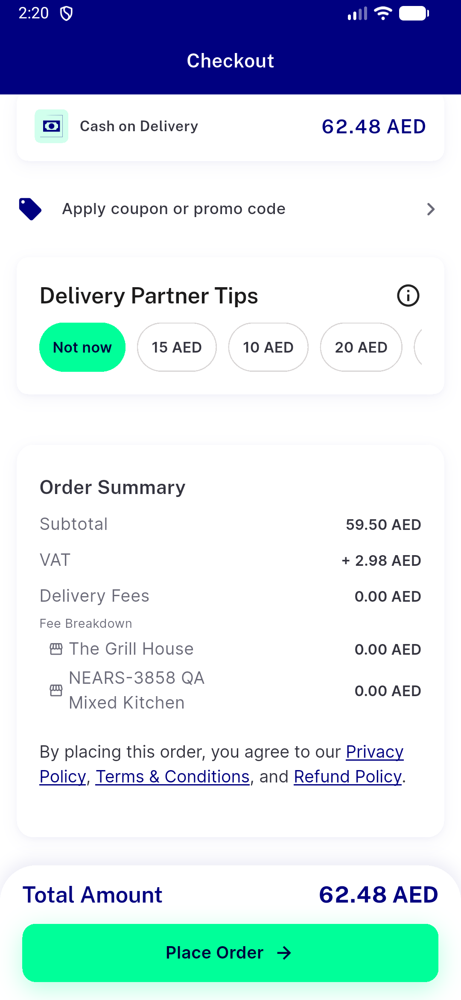
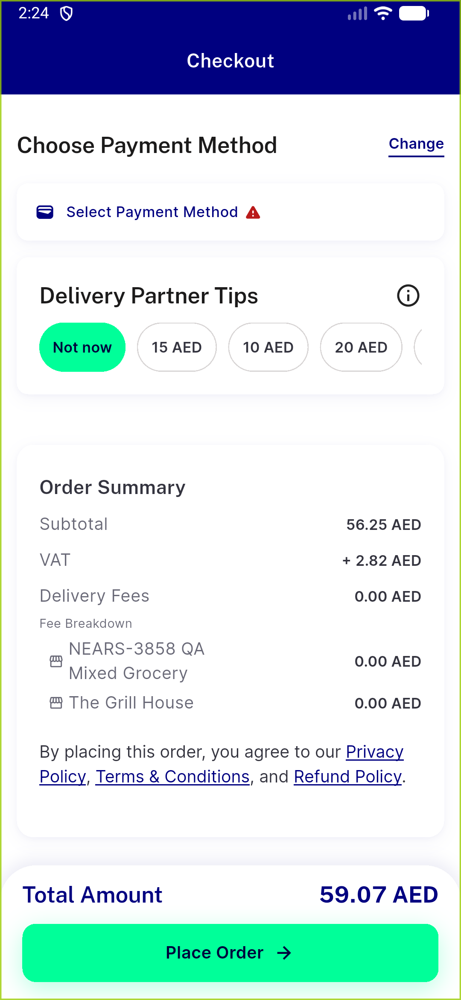
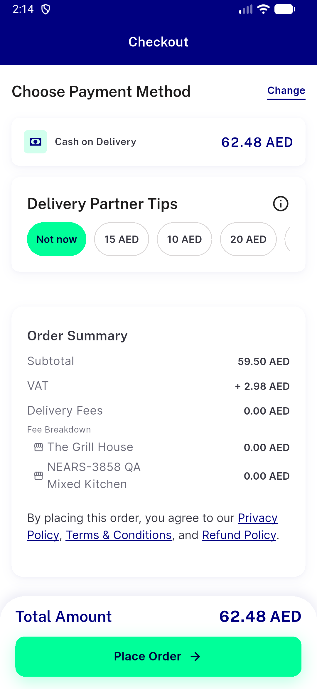

# QA Evidence — NEARS-3879

**PASS: guest 2-store get-Tax 200 both stores, VAT 2.98 total 62.48, flag ON/OFF, placed order tax matches, logged-in unchanged**

**6 screenshot(s).** Click any thumbnail for full resolution.

<table>
<tr>
<td align="center" width="33%"> ac2 flagON guest 2store summary</td>
<td align="center" width="33%"> ac3 flagOFF loggedin 2store summary</td>
<td align="center" width="33%"> ac3 flagON loggedin 2store summary</td>
</tr>
<tr>
<td align="center" width="33%"> ac4 preplace guest summary</td>
<td align="center" width="33%"> extra flagON guest crossmodule summary</td>
<td align="center" width="33%"> k3 flagOFF guest 2store summary</td>
</tr>
</table>

### Other artifacts
- [`ac1-curl-controls.log`](ac1-curl-controls.log)
- [`ac1-flutter-test-RED-control-mutation.log`](ac1-flutter-test-RED-control-mutation.log)
- [`ac1-flutter-test-group-tax-guest-id.log`](ac1-flutter-test-group-tax-guest-id.log)
- [`ac1-laravel-log-join.log`](ac1-laravel-log-join.log)
- [`ac1-laravel-log-window.log`](ac1-laravel-log-window.log)
- [`ac2-flagON-app-log-slice.log`](ac2-flagON-app-log-slice.log)
- [`ac2-flagON-guest-2store-summary.a11y.xml`](ac2-flagON-guest-2store-summary.a11y.xml)
- [`ac2-independent-recompute.txt`](ac2-independent-recompute.txt)
- [`ac3-flagOFF-loggedin-2store-summary.a11y.xml`](ac3-flagOFF-loggedin-2store-summary.a11y.xml)
- [`ac3-flagOFF-loggedin-app-log-slice.log`](ac3-flagOFF-loggedin-app-log-slice.log)
- [`ac3-flagOFF-loggedin-confirm-sheet.a11y.xml`](ac3-flagOFF-loggedin-confirm-sheet.a11y.xml)
- [`ac3-flagON-loggedin-2store-summary.a11y.xml`](ac3-flagON-loggedin-2store-summary.a11y.xml)
- [`ac3-flagON-loggedin-app-log-slice.log`](ac3-flagON-loggedin-app-log-slice.log)
- [`ac3-flagON-loggedin-confirm-sheet.a11y.xml`](ac3-flagON-loggedin-confirm-sheet.a11y.xml)
- [`ac3-loggedin-curl-bearer-control.log`](ac3-loggedin-curl-bearer-control.log)
- [`ac4-app-log-slice.log`](ac4-app-log-slice.log)
- [`ac4-confirm-sheet.a11y.xml`](ac4-confirm-sheet.a11y.xml)
- [`ac4-placed-order-db-readout.txt`](ac4-placed-order-db-readout.txt)
- [`ac4-preplace-guest-summary.a11y.xml`](ac4-preplace-guest-summary.a11y.xml)
- [`automated-checkout-screen-widget-test.log`](automated-checkout-screen-widget-test.log)
- [`db-after-shared.txt`](db-after-shared.txt)
- [`db-before-shared.txt`](db-before-shared.txt)
- [`extra-flagON-guest-crossmodule-app-log-slice.log`](extra-flagON-guest-crossmodule-app-log-slice.log)
- [`extra-flagON-guest-crossmodule-summary.a11y.xml`](extra-flagON-guest-crossmodule-summary.a11y.xml)
- [`k3-flagOFF-app-log-slice.log`](k3-flagOFF-app-log-slice.log)
- [`k3-flagOFF-confirm-sheet.a11y.xml`](k3-flagOFF-confirm-sheet.a11y.xml)
- [`k3-flagOFF-guest-2store-summary.a11y.xml`](k3-flagOFF-guest-2store-summary.a11y.xml)
- [`progress.md`](progress.md)

---
*From `nears/docs/qa-evidence/NEARS-3879/` · public-repo scrub policy (no live secrets; verified clean).*
