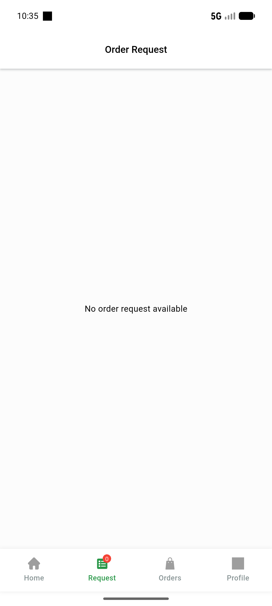
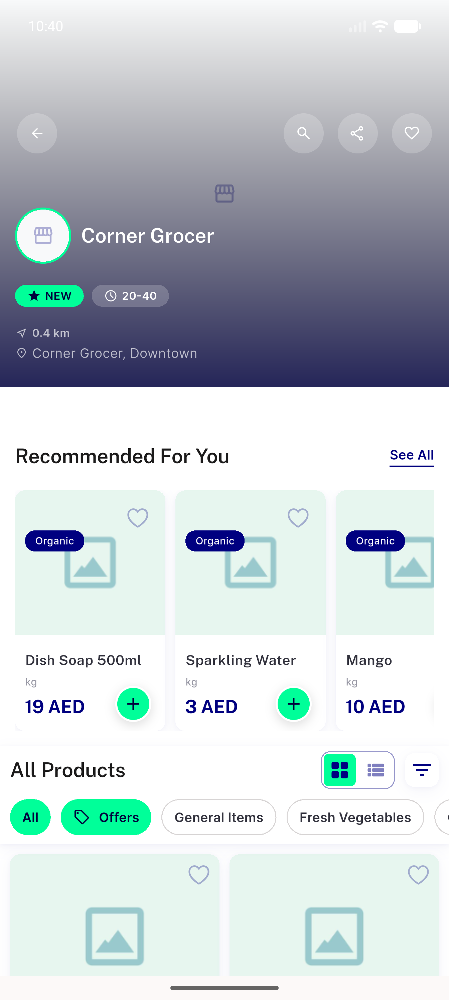
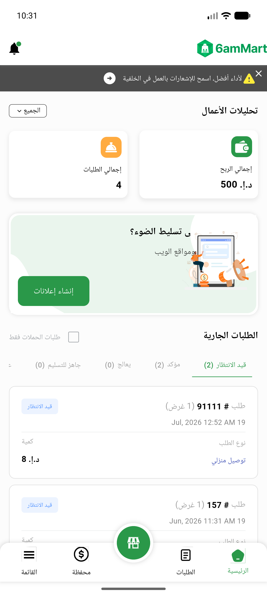

# QA Evidence — NEARS-388

**PASS — envelope + clamp + object-contract proofs**

**3 screenshot(s).** Click any thumbnail for full resolution.

<table>
<tr>
<td align="center" width="33%"> deliveryapp order request</td>
<td align="center" width="33%"> userapp store details</td>
<td align="center" width="33%"> vendorapp running orders</td>
</tr>
</table>

### Other artifacts
- [`backend-envelope-curl.log`](backend-envelope-curl.log)

---
*From `nears/docs/qa-evidence/NEARS-388/` · public-repo scrub policy (no live secrets; verified clean).*
