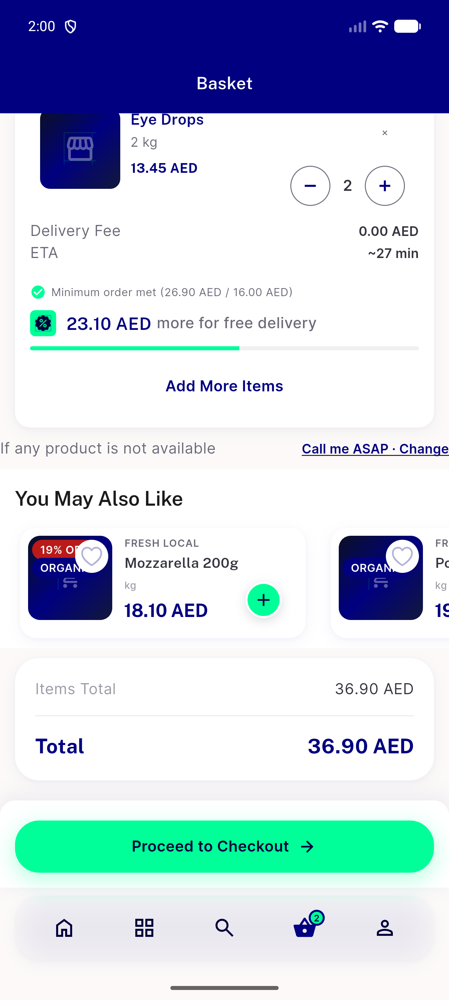
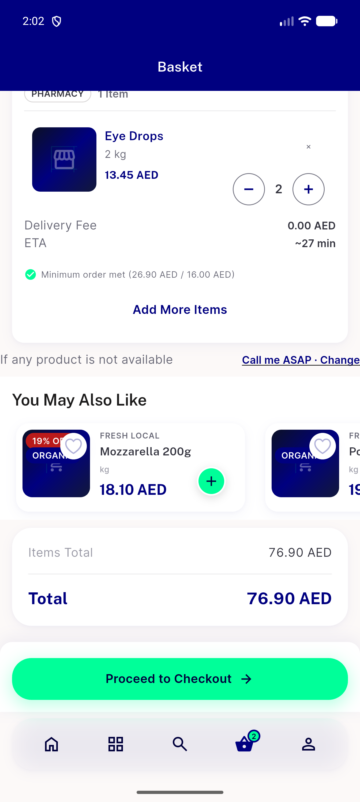
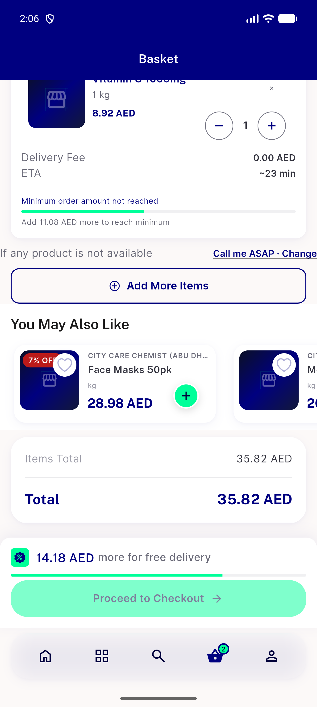
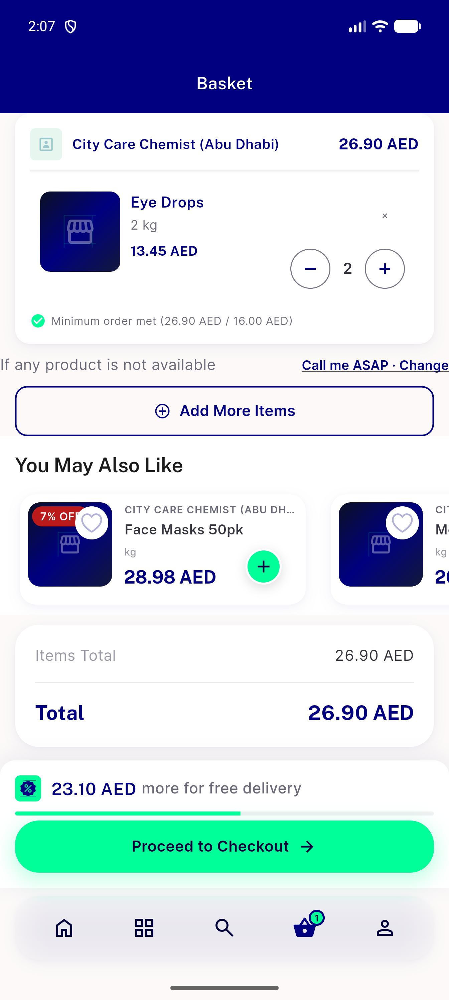

# QA Evidence — NEARS-3881

**PASS: per-section free-delivery rows on mixed basket (AC1-3, AC-REG), 320/360 x 1.0/1.3 x EN/AR**

**8 screenshot(s).** Click any thumbnail for full resolution.

<table>
<tr>
<td align="center" width="33%"> ac1 bottom section 58 remaining 23.10</td>
<td align="center" width="33%"> ac1 store12 at threshold row gone</td>
<td align="center" width="33%"> ac1 top section 12 remaining 40</td>
</tr>
<tr>
<td align="center" width="33%"> ac2 promo all stores no rows</td>
<td align="center" width="33%"> ac2 store58 free delivery1 no row</td>
<td align="center" width="33%"> ac3 flagoff single store checkoutbutton row</td>
</tr>
<tr>
<td align="center" width="33%"> ac3 flagon single module two stores</td>
<td align="center" width="33%"> ac3 flagon single store</td>
</tr>
</table>

### Other artifacts
- [`a11y-mixed-cart-bottom.xml`](a11y-mixed-cart-bottom.xml)
- [`a11y-mixed-cart-top.xml`](a11y-mixed-cart-top.xml)
- [`bug-basket-1.3x-font-overflow.log`](bug-basket-1.3x-font-overflow.log)
- [`bug-search-results-semantics-assertion.log`](bug-search-results-semantics-assertion.log)
- [`matrix`](matrix)
- [`progress.md`](progress.md)

---
*From `nears/docs/qa-evidence/NEARS-3881/` · public-repo scrub policy (no live secrets; verified clean).*
