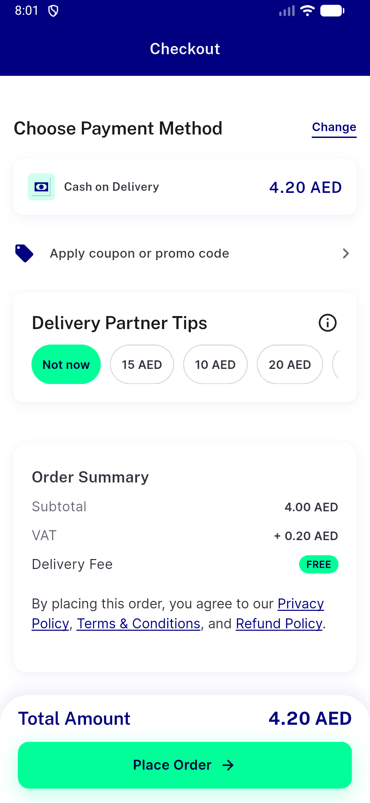
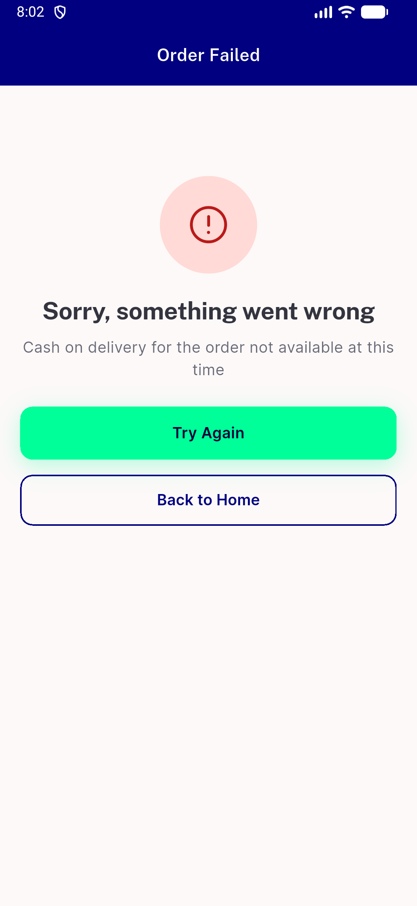
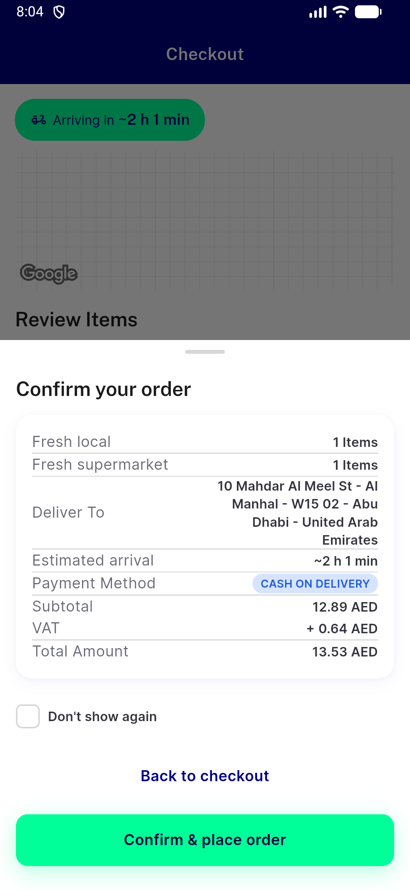
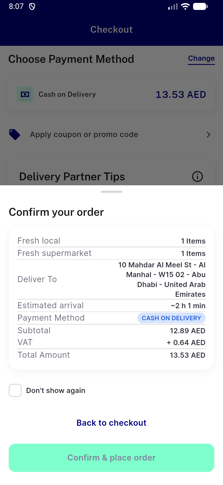
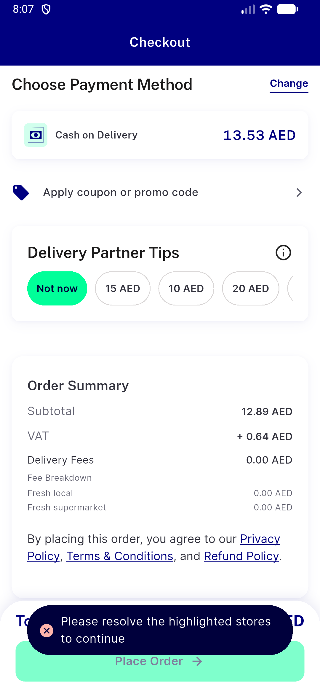
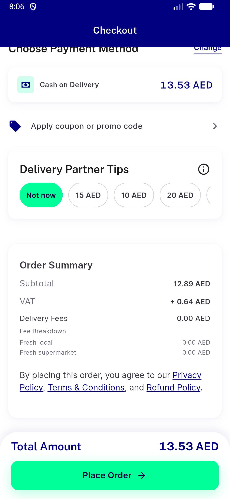
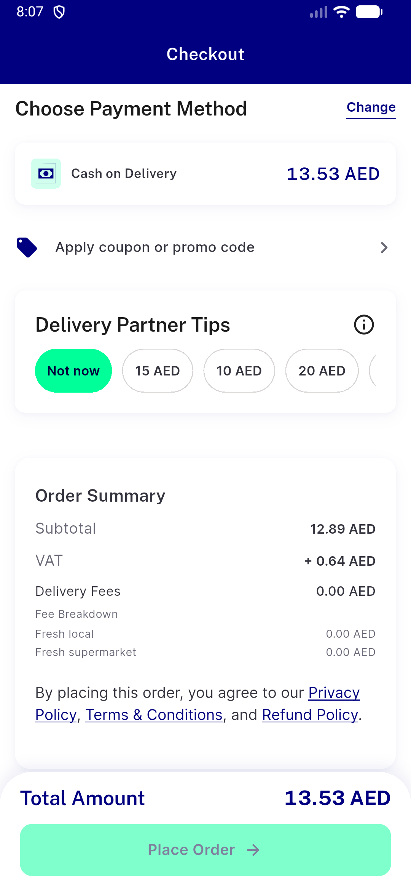
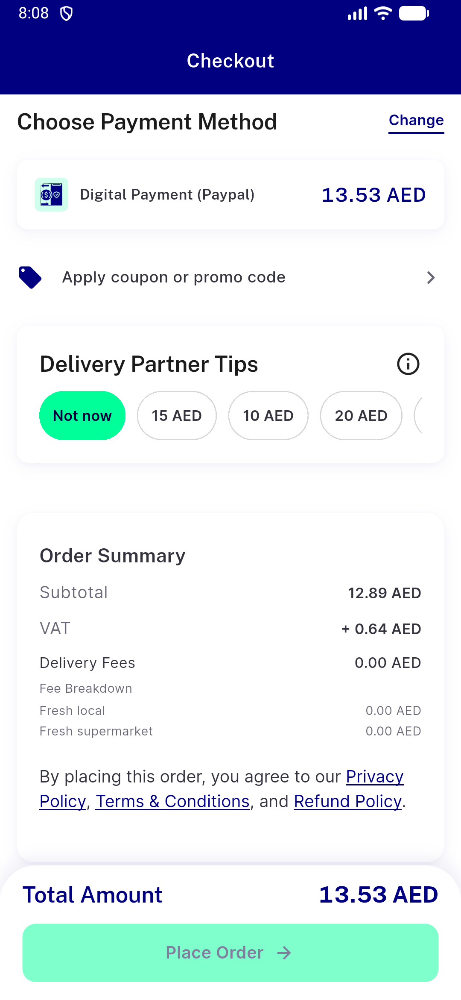

# QA Evidence — NEARS-3887

**QA: NEARS-3887 payment-method availability - API ACs PASS; pre-fix client findings B/C**

**10 screenshot(s).** Click any thumbnail for full resolution.

<table>
<tr>
<td align="center" width="33%"> dev A0 checkout payment</td>
<td align="center" width="33%"> dev A1 order failed</td>
<td align="center" width="33%"> dev B after confirm 3</td>
</tr>
<tr>
<td align="center" width="33%"> dev B second tap</td>
<td align="center" width="33%"> dev C after confirm 2</td>
<td align="center" width="33%"> dev C after confirm 3</td>
</tr>
<tr>
<td align="center" width="33%"> dev C0 checkout payment</td>
<td align="center" width="33%"> dev C1 cta after toast</td>
<td align="center" width="33%"> dev C2 cta after method change</td>
</tr>
<tr>
<td align="center" width="33%"> dev C3 recovered after cart edit</td>
</tr>
</table>

### Other artifacts
- [`api-ac1-groupplace-digital-off.txt`](api-ac1-groupplace-digital-off.txt)
- [`api-ac1-place-digital-off.txt`](api-ac1-place-digital-off.txt)
- [`api-ac1-validate-digital-off.txt`](api-ac1-validate-digital-off.txt)
- [`api-ac2-groupplace-cash-off.txt`](api-ac2-groupplace-cash-off.txt)
- [`api-ac2-place-cash-off.txt`](api-ac2-place-cash-off.txt)
- [`api-ac2-validate-cash-off.txt`](api-ac2-validate-cash-off.txt)
- [`api-ac3-groupplace-cash-zone0.txt`](api-ac3-groupplace-cash-zone0.txt)
- [`api-ac3-place-cash-zone0.txt`](api-ac3-place-cash-zone0.txt)
- [`api-ac3-validate-cash-zone0.txt`](api-ac3-validate-cash-zone0.txt)
- [`api-ac4-groupplace-digital-zone0.txt`](api-ac4-groupplace-digital-zone0.txt)
- [`api-ac4-place-digital-zone0.txt`](api-ac4-place-digital-zone0.txt)
- [`api-ac4-validate-digital-zone0.txt`](api-ac4-validate-digital-zone0.txt)
- [`api-baseline-validate-cash.txt`](api-baseline-validate-cash.txt)
- [`api-grp-place-cash-store13-badzone.txt`](api-grp-place-cash-store13-badzone.txt)
- [`api-grp-place-cash-store13-first.txt`](api-grp-place-cash-store13-first.txt)
- [`api-grp-validate-cash-store13-badzone.txt`](api-grp-validate-cash-store13-badzone.txt)
- [`api-grp-validate-cash-store13-first.txt`](api-grp-validate-cash-store13-first.txt)
- [`api-neg1-validate-digital-other-method-ok.txt`](api-neg1-validate-digital-other-method-ok.txt)
- [`api-neg2-validate-cash-zones00.txt`](api-neg2-validate-cash-zones00.txt)
- [`api-neg2-validate-partial-zones00.txt`](api-neg2-validate-partial-zones00.txt)
- [`api-neg2-validate-wallet-zones00.txt`](api-neg2-validate-wallet-zones00.txt)
- [`api-neg3-place-cash-store12-zoneON-while-other-zone-off.txt`](api-neg3-place-cash-store12-zoneON-while-other-zone-off.txt)
- [`api-neg4-groupplace-module-unavailable-wins.txt`](api-neg4-groupplace-module-unavailable-wins.txt)
- [`api-neg4-validate-module-unavailable-wins.txt`](api-neg4-validate-module-unavailable-wins.txt)
- [`api-neg5-basketON-groupplace-cash.txt`](api-neg5-basketON-groupplace-cash.txt)
- [`api-neg5-basketON-validate-cash.txt`](api-neg5-basketON-validate-cash.txt)
- [`api-neg5-basketON-validate-digital-ok.txt`](api-neg5-basketON-validate-digital-ok.txt)
- [`api-other403-offline-status.txt`](api-other403-offline-status.txt)
- [`api-other403-order-type.txt`](api-other403-order-type.txt)
- [`api-rca-put-payment-method-zone-cash0.txt`](api-rca-put-payment-method-zone-cash0.txt)
- [`api-rcb-groupplace-partial-digital-off.txt`](api-rcb-groupplace-partial-digital-off.txt)
- [`bug-rca-put-payment-method-ignores-zone.log`](bug-rca-put-payment-method-ignores-zone.log)
- [`bug-rcb-group-partial-ignores-digital-off.log`](bug-rcb-group-partial-ignores-digital-off.log)
- [`bug-scenarioB-global-off-validate-403-silent.log`](bug-scenarioB-global-off-validate-403-silent.log)
- [`bug-scenarioC-honest-client-dead-end.log`](bug-scenarioC-honest-client-dead-end.log)
- [`dev-A-be-log.txt`](dev-A-be-log.txt)
- [`dev-A-logcat-fail.log`](dev-A-logcat-fail.log)
- [`dev-B-be-log.txt`](dev-B-be-log.txt)
- [`dev-B-logcat-fail.log`](dev-B-logcat-fail.log)
- [`dev-C-logcat-fail.log`](dev-C-logcat-fail.log)
- [`progress.md`](progress.md)

---
*From `nears/docs/qa-evidence/NEARS-3887/` · public-repo scrub policy (no live secrets; verified clean).*
