# QA Evidence — NEARS-3893

**PASS + delta AC2-reverse live**

**23 screenshot(s).** Click any thumbnail for full resolution.

<table>
<tr>
<td align="center" width="33%"> home food ambient rail</td>
<td align="center" width="33%"><a href="ac1-flagon-food-ambient-search-oos-grocery-soldout.png">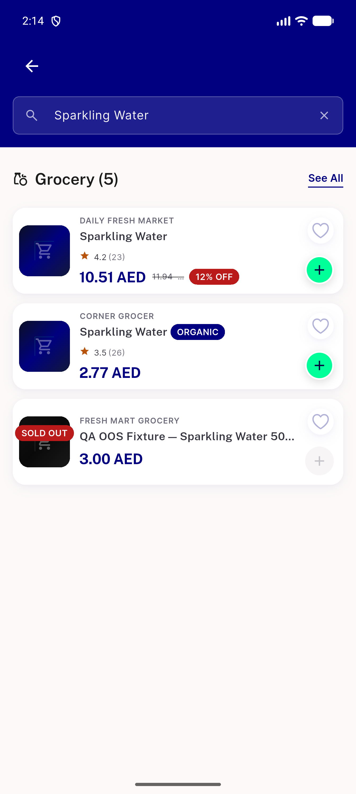</a> ac1 flagon food ambient search oos grocery soldout</td>
<td align="center" width="33%"><a href="ac1-flagon-grocery-ambient-search-veggie.png">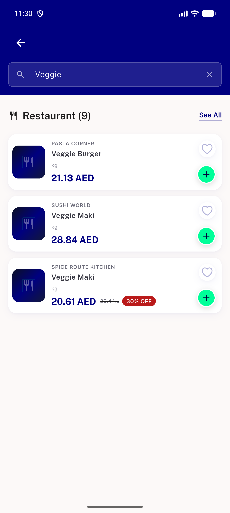</a> ac1 flagon grocery ambient search veggie</td>
</tr>
<tr>
<td align="center" width="33%"> ac1 flagon grocery ambient search veggieburger</td>
<td align="center" width="33%"><a href="ac2-flagon-food-ambient-basket-redapple-row.png">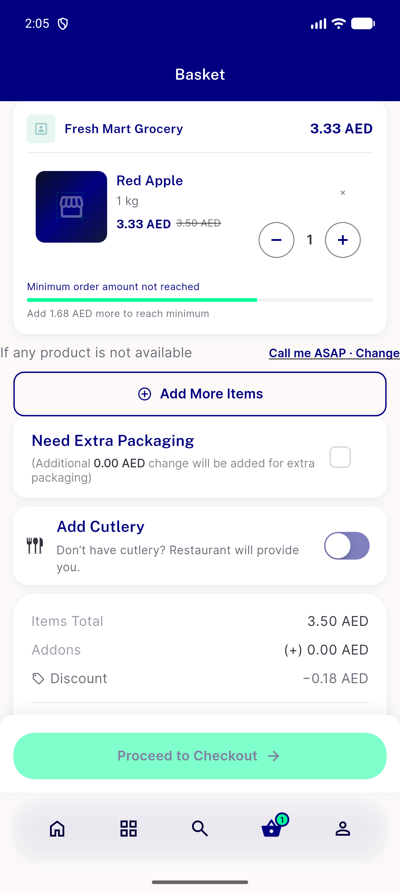</a> ac2 flagon food ambient basket redapple row</td>
<td align="center" width="33%"><a href="ac2-flagon-food-ambient-basket-sheet-redapple.png">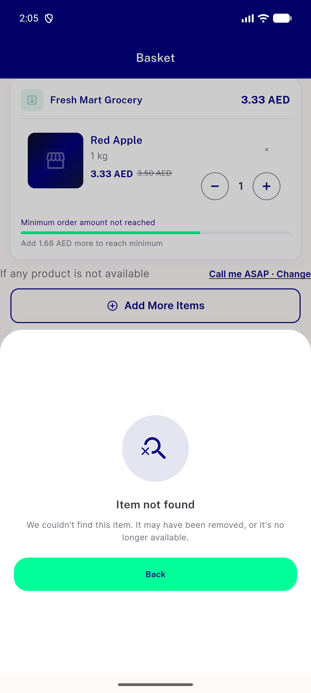</a> ac2 flagon food ambient basket sheet redapple</td>
</tr>
<tr>
<td align="center" width="33%"><a href="ac2-flagon-food-ambient-flashsale-grocery-rail.png">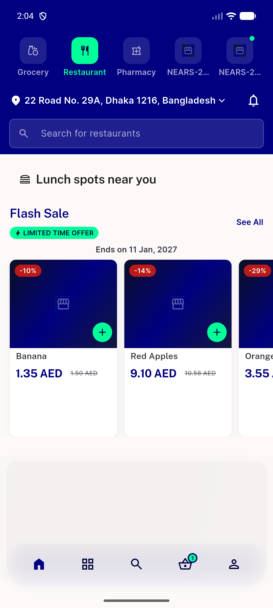</a> ac2 flagon food ambient flashsale grocery rail</td>
<td align="center" width="33%"><a href="ac2-flagon-food-ambient-sheet-grocery-item-redapple.png">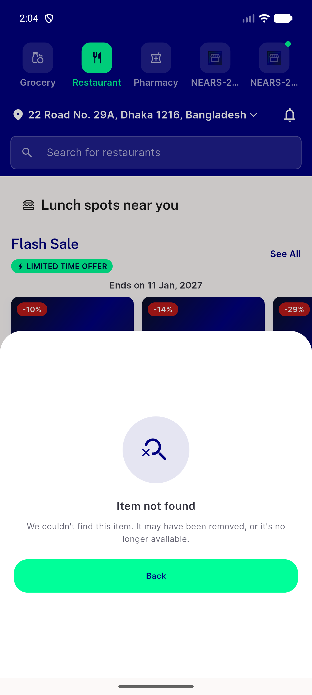</a> ac2 flagon food ambient sheet grocery item redapple</td>
<td align="center" width="33%"><a href="ac2-flagon-food-ambient-sheet-item408.png">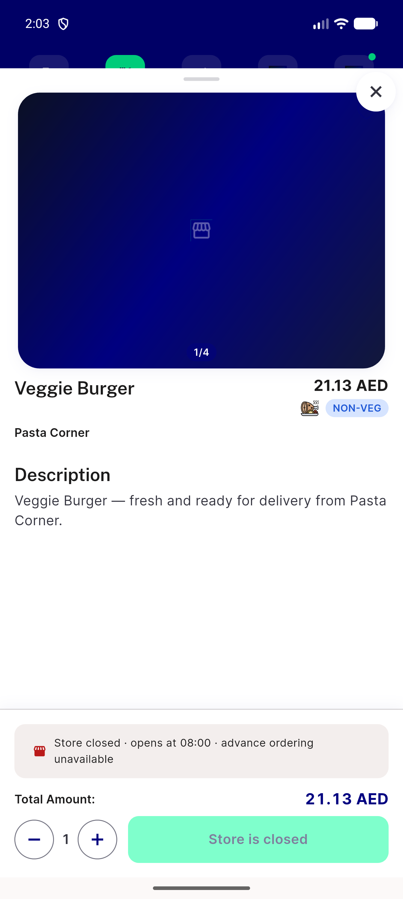</a> ac2 flagon food ambient sheet item408</td>
</tr>
<tr>
<td align="center" width="33%"><a href="ac2-flagon-grocery-ambient-basket-mixed.png">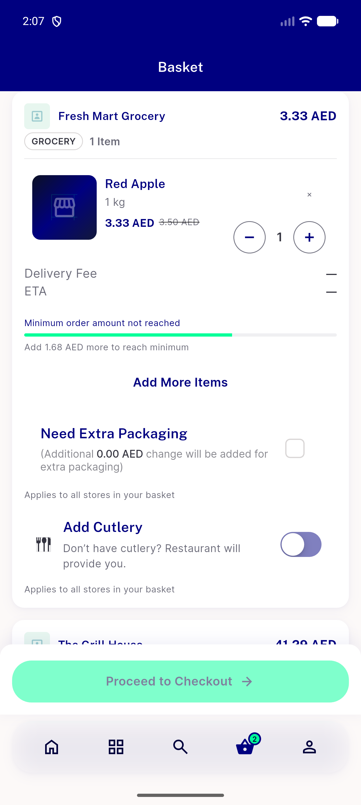</a> ac2 flagon grocery ambient basket mixed</td>
<td align="center" width="33%"><a href="ac2-flagon-grocery-ambient-basket-sheet-onionrings-food-unit.png">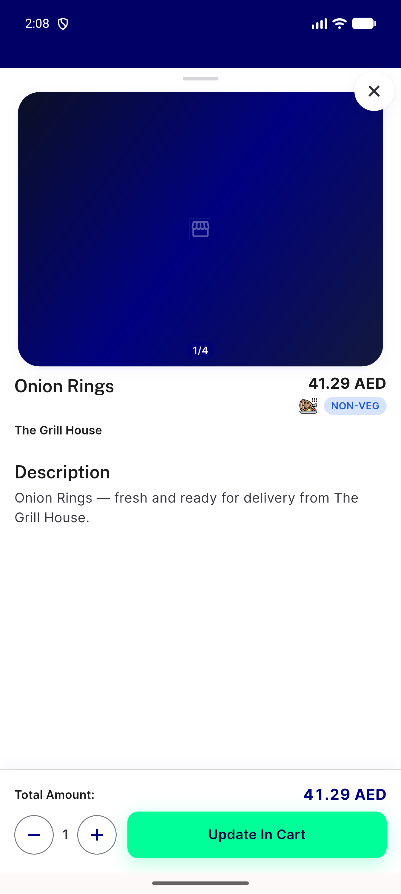</a> ac2 flagon grocery ambient basket sheet onionrings food unit</td>
<td align="center" width="33%"><a href="ac2-flagon-grocery-ambient-sheet-item18.png">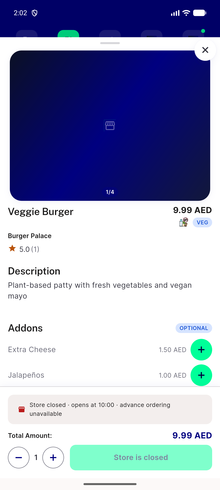</a> ac2 flagon grocery ambient sheet item18</td>
</tr>
<tr>
<td align="center" width="33%"><a href="ac2-reverse-ambient-proof-restaurant-tab-selected.png">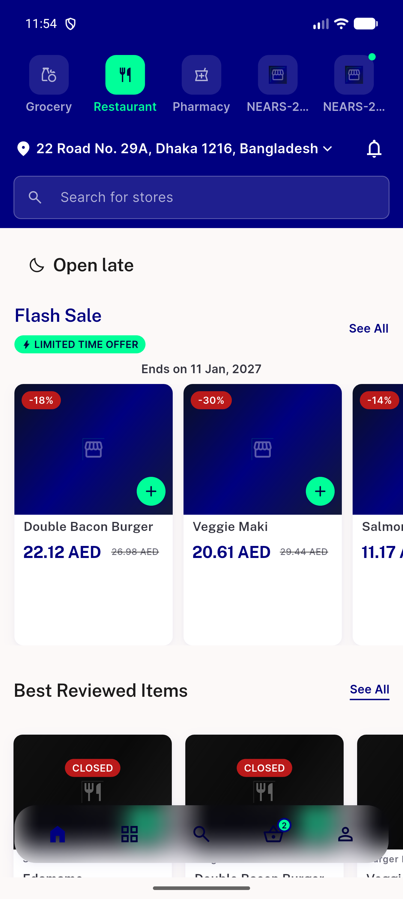</a> ac2 reverse ambient proof restaurant tab selected</td>
<td align="center" width="33%"><a href="ac2-reverse-food-ambient-sheet-redapple-unit-chip.png">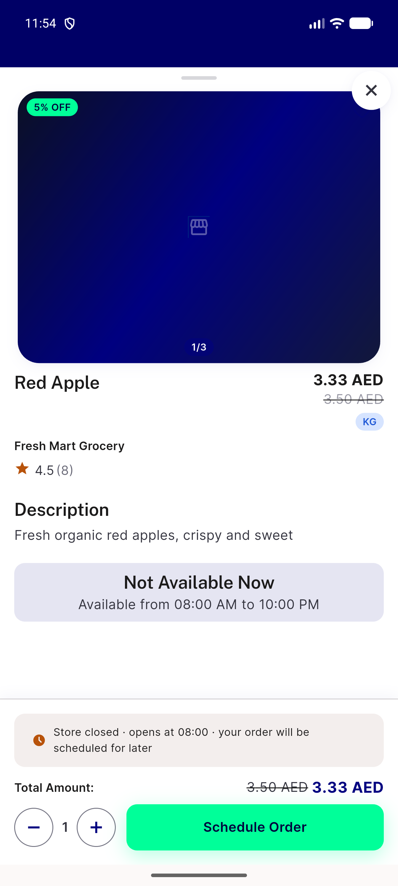</a> ac2 reverse food ambient sheet redapple unit chip</td>
<td align="center" width="33%"><a href="ac2-rtl-arabic-sheet-item18-chip.png">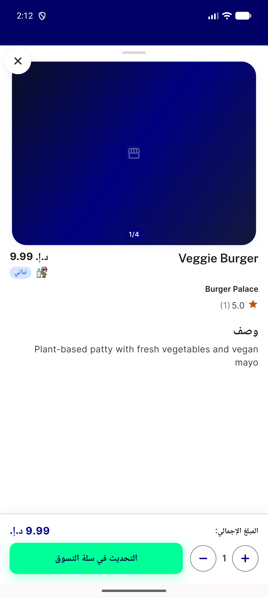</a> ac2 rtl arabic sheet item18 chip</td>
</tr>
<tr>
<td align="center" width="33%"><a href="ac2-scale1.3-sheet-item18-chip.png">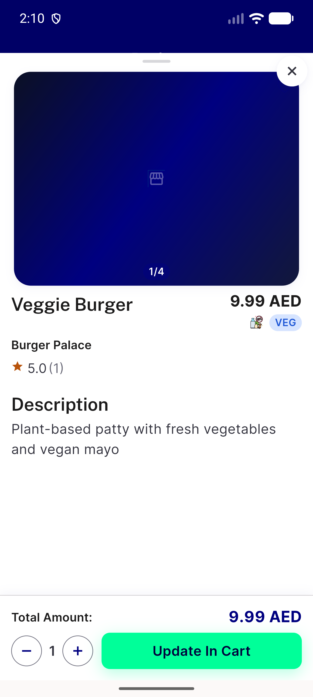</a> ac2 scale1.3 sheet item18 chip</td>
<td align="center" width="33%"><a href="ac3-flagoff-food-ambient-sheet-item18.png">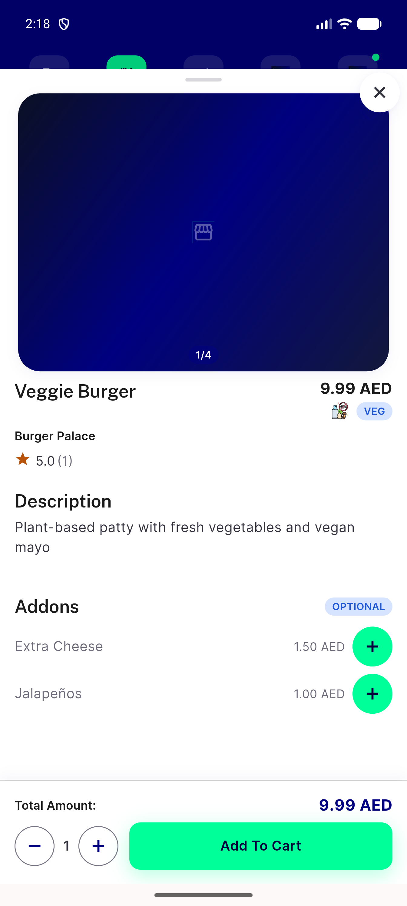</a> ac3 flagoff food ambient sheet item18</td>
<td align="center" width="33%"><a href="ac3-flagoff-grocery-ambient-search-veggieburger.png">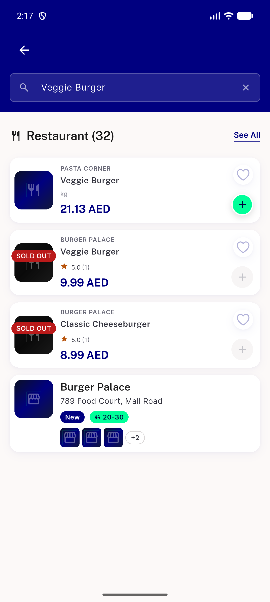</a> ac3 flagoff grocery ambient search veggieburger</td>
</tr>
<tr>
<td align="center" width="33%"><a href="delta-food-ambient-home-before-basket.png">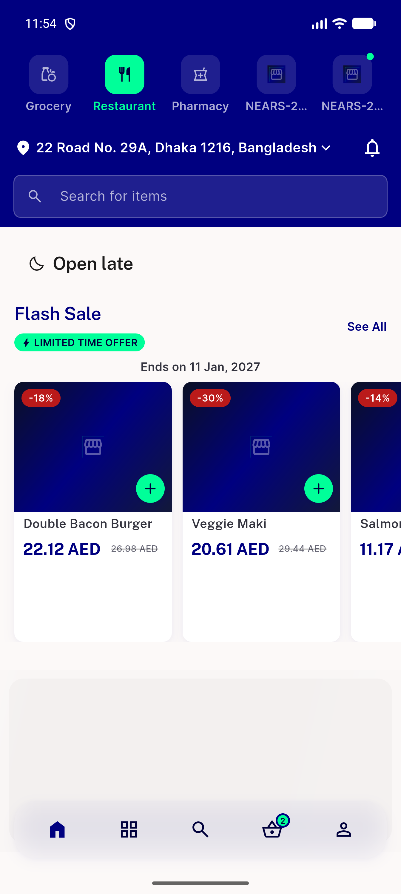</a> delta food ambient home before basket</td>
<td align="center" width="33%"><a href="reg-inline-add-stepper-instock-card.png">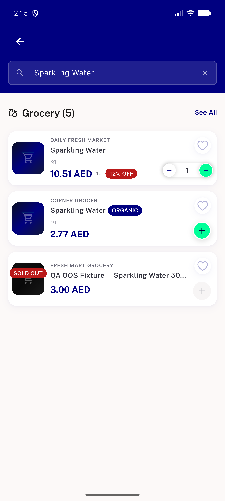</a> reg inline add stepper instock card</td>
<td align="center" width="33%"><a href="x1-food-ambient-search-veggieburger-no-kg.png">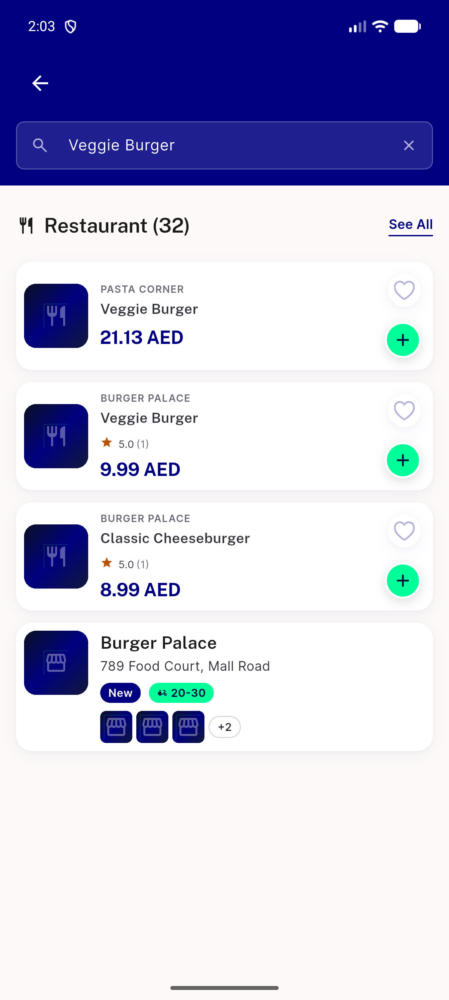</a> x1 food ambient search veggieburger no kg</td>
</tr>
<tr>
<td align="center" width="33%"> x1 grocery ambient search sparkling unit kg</td>
<td align="center" width="33%"><a href="x2-grocery-ambient-basket-sheet-item18-addons.png">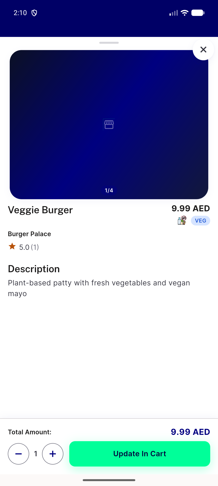</a> x2 grocery ambient basket sheet item18 addons</td>
</tr>
</table>

### Other artifacts
- [`ambient-proof-dump.xml`](ambient-proof-dump.xml)
- [`bug-item-details-404-mismatched-ambient.log`](bug-item-details-404-mismatched-ambient.log)

---
*From `nears/docs/qa-evidence/NEARS-3893/` · public-repo scrub policy (no live secrets; verified clean).*
