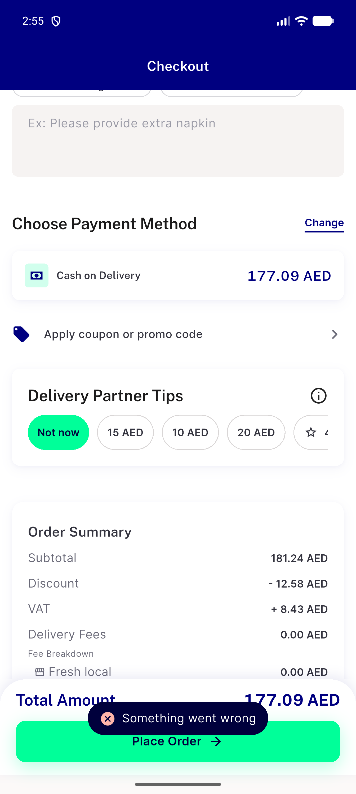
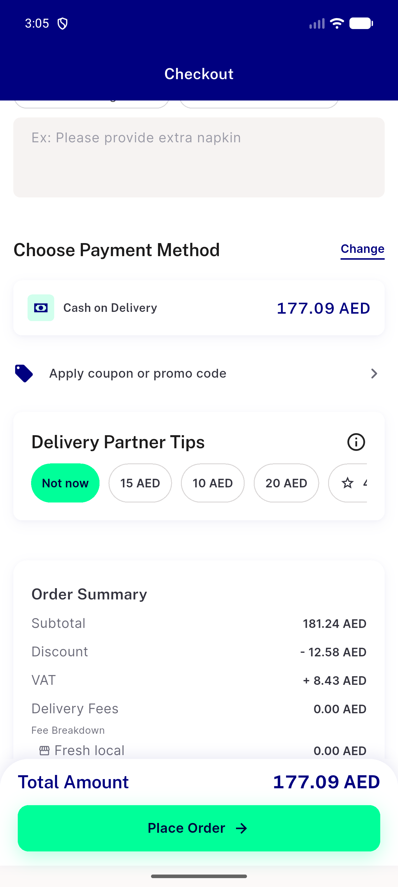
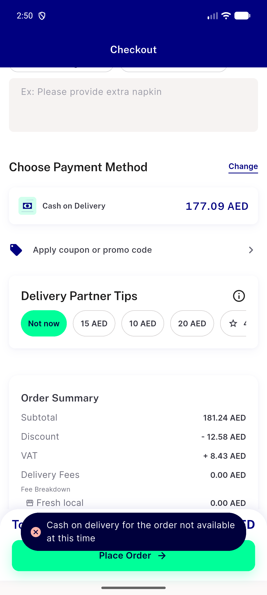
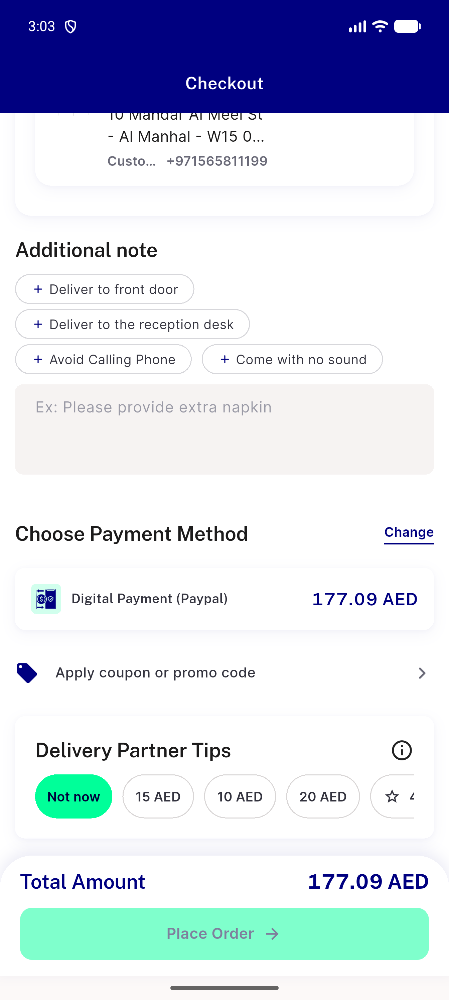
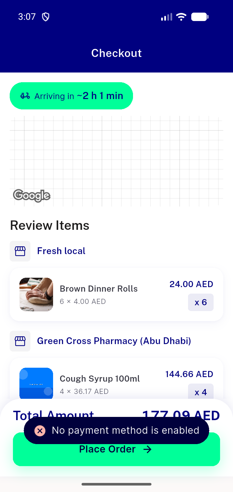
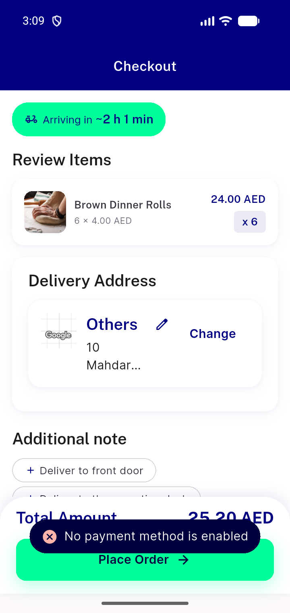
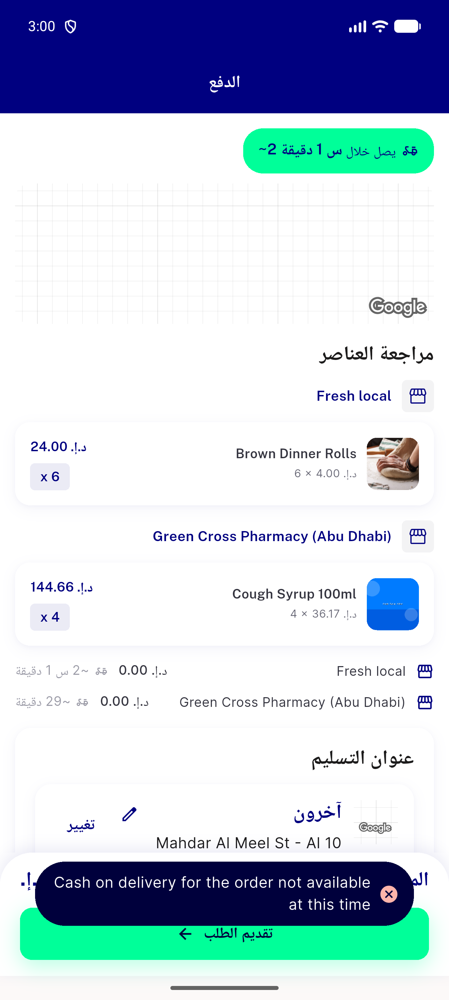

# QA Evidence — NEARS-3894

**NEARS-3894 QA [8] cycle 0 - PASS (group refusals visible: sheet dismissed, server 4xx copy / generic fallback)**

**11 screenshot(s).** Click any thumbnail for full resolution.

<table>
<tr>
<td align="center" width="33%"> ac1 5xx</td>
<td align="center" width="33%"> ac1 place403</td>
<td align="center" width="33%"> ac1 validate403 cod</td>
</tr>
<tr>
<td align="center" width="33%"> ac1 validate403 digital</td>
<td align="center" width="33%"> ac2 mixed cash unavailable</td>
<td align="center" width="33%"> ac2 zone gate card</td>
</tr>
<tr>
<td align="center" width="33%"> ac3 network</td>
<td align="center" width="33%"> ac4 group 360dp</td>
<td align="center" width="33%"> ac4 single 360dp</td>
</tr>
<tr>
<td align="center" width="33%"> ar ac1 validate403 cod</td>
<td align="center" width="33%"> ar generic network</td>
</tr>
</table>

### Other artifacts
- [`ac1-5xx.log`](ac1-5xx.log)
- [`ac1-5xx.xml`](ac1-5xx.xml)
- [`ac1-place403-proxy.log`](ac1-place403-proxy.log)
- [`ac1-place403.log`](ac1-place403.log)
- [`ac1-place403.xml`](ac1-place403.xml)
- [`ac1-validate403-cod.log`](ac1-validate403-cod.log)
- [`ac1-validate403-cod.xml`](ac1-validate403-cod.xml)
- [`ac1-validate403-digital.log`](ac1-validate403-digital.log)
- [`ac1-validate403-digital.xml`](ac1-validate403-digital.xml)
- [`ac2-mixed-cash-b.xml`](ac2-mixed-cash-b.xml)
- [`ac2-mixed-cash-unavailable.log`](ac2-mixed-cash-unavailable.log)
- [`ac2-mixed-cash.xml`](ac2-mixed-cash.xml)
- [`ac2-zone-gate-b.xml`](ac2-zone-gate-b.xml)
- [`ac2-zone-gate-card.log`](ac2-zone-gate-card.log)
- [`ac2-zone-gate.xml`](ac2-zone-gate.xml)
- [`ac3-network.log`](ac3-network.log)
- [`ac3-network.xml`](ac3-network.xml)
- [`ac4-group-360dp.log`](ac4-group-360dp.log)
- [`ac4-group-360dp.xml`](ac4-group-360dp.xml)
- [`ac4-single-360dp.log`](ac4-single-360dp.log)
- [`ac4-single-360dp.xml`](ac4-single-360dp.xml)
- [`acreg-placed.log`](acreg-placed.log)
- [`acreg-placed.xml`](acreg-placed.xml)
- [`ar-ac1-validate403-cod.log`](ar-ac1-validate403-cod.log)
- [`ar-ac1-validate403-cod.xml`](ar-ac1-validate403-cod.xml)
- [`ar-generic-network.log`](ar-generic-network.log)
- [`ar-generic-network.xml`](ar-generic-network.xml)
- [`bug-preexisting-checkout-overflow-360dp.log`](bug-preexisting-checkout-overflow-360dp.log)
- [`flagoff-validate403-group-order.log`](flagoff-validate403-group-order.log)
- [`flagoff-validate403-group-order.xml`](flagoff-validate403-group-order.xml)
- [`flagoff-validate500.log`](flagoff-validate500.log)
- [`flagoff-validate500.xml`](flagoff-validate500.xml)
- [`progress.md`](progress.md)
- [`regress-direct-network.log`](regress-direct-network.log)
- [`regress-direct-network.xml`](regress-direct-network.xml)
- [`regress-dontshow-direct-path.log`](regress-dontshow-direct-path.log)
- [`regress-dontshow-direct-path.xml`](regress-dontshow-direct-path.xml)
- [`regress-group-closed-food.log`](regress-group-closed-food.log)
- [`regress-group-closed-food.xml`](regress-group-closed-food.xml)
- [`regress-guest-presheet.log`](regress-guest-presheet.log)
- [`regress-guest-presheet.xml`](regress-guest-presheet.xml)
- [`regress-single-closed-food.log`](regress-single-closed-food.log)
- [`regress-single-closed-food.xml`](regress-single-closed-food.xml)

---
*From `nears/docs/qa-evidence/NEARS-3894/` · public-repo scrub policy (no live secrets; verified clean).*
