# QA Evidence — NEARS-3898

**PASS - NEARS-3898 same-module group surge: AC1-4 + AC-LOG live on emulator-5580, own :8198 @ b116967ee, DB copy multi_food_db_qa3898**

**20 screenshot(s).** Click any thumbnail for full resolution.

<table>
<tr>
<td align="center" width="33%"> cart sameModule flagOFF 12 13 both 6.00</td>
<td align="center" width="33%"><a href="02-checkout-sameModule-flagOFF-perstore-rows.png">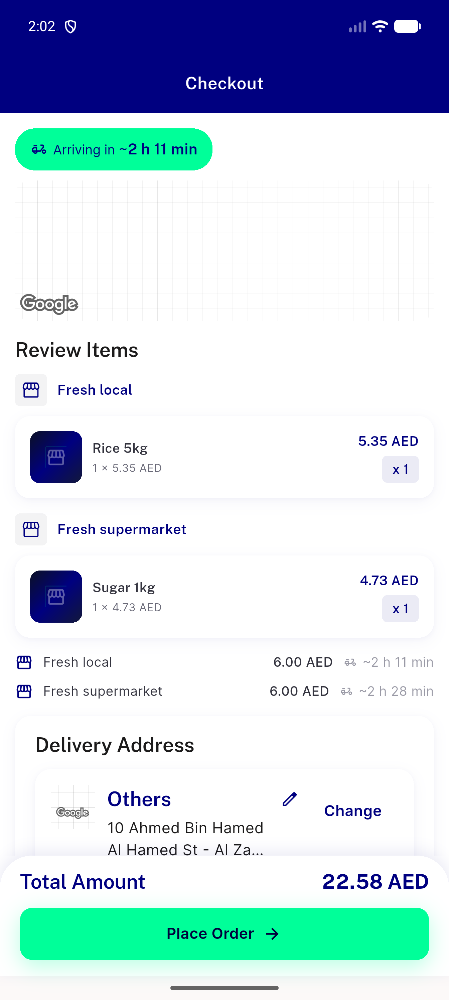</a> checkout sameModule flagOFF perstore rows</td>
<td align="center" width="33%"><a href="03-checkout-sameModule-flagOFF-summary-12.00-breakdown-6+6-total-22.58.png">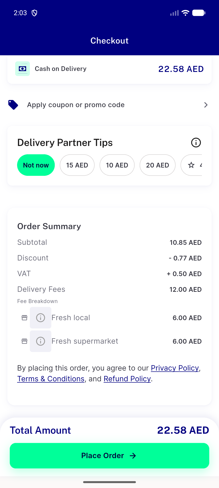</a> checkout sameModule flagOFF summary 12.00 breakdown 6+6 total 22.58</td>
</tr>
<tr>
<td align="center" width="33%"><a href="04-checkout-surge-note-tooltip-Fresh-local.png">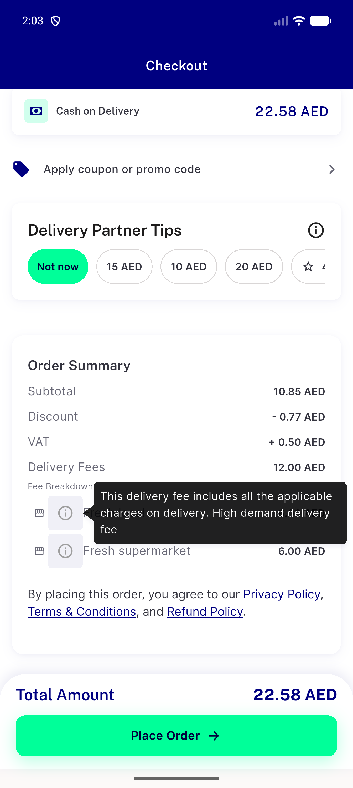</a> checkout surge note tooltip Fresh local</td>
<td align="center" width="33%"><a href="05-placed-group-91418-91419-flagOFF.png">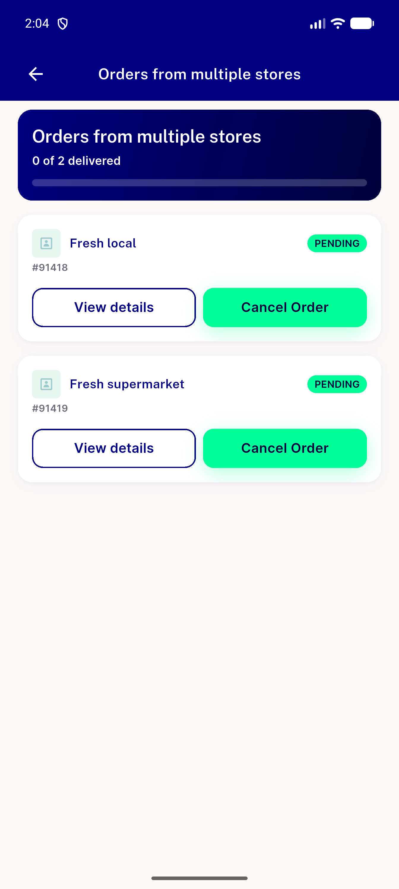</a> placed group 91418 91419 flagOFF</td>
<td align="center" width="33%"> cart sameModule flagON 12 13</td>
</tr>
<tr>
<td align="center" width="33%"> checkout sameModule flagON summary 12.00 6+6</td>
<td align="center" width="33%"><a href="08-checkout-flagON-surge-note-tooltip-Fresh-supermarket.png">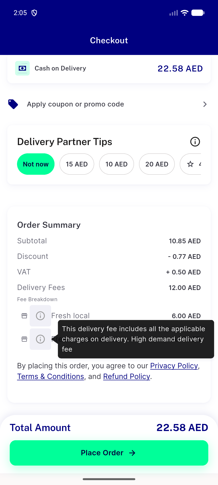</a> checkout flagON surge note tooltip Fresh supermarket</td>
<td align="center" width="33%"> placed group 91422 91423 flagON</td>
</tr>
<tr>
<td align="center" width="33%"><a href="10-cart-mixed-flagON-12-6.00-49-1.00.png">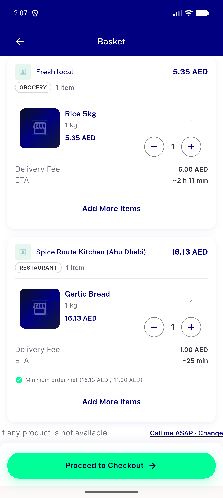</a> cart mixed flagON 12 6.00 49 1.00</td>
<td align="center" width="33%"><a href="11-checkout-mixed-flagON-perstore-rows.png">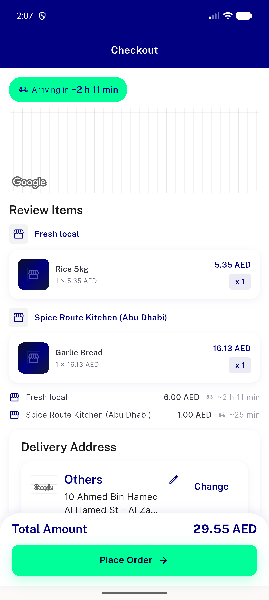</a> checkout mixed flagON perstore rows</td>
<td align="center" width="33%"><a href="12-checkout-mixed-flagON-summary-7.00-6+1.png">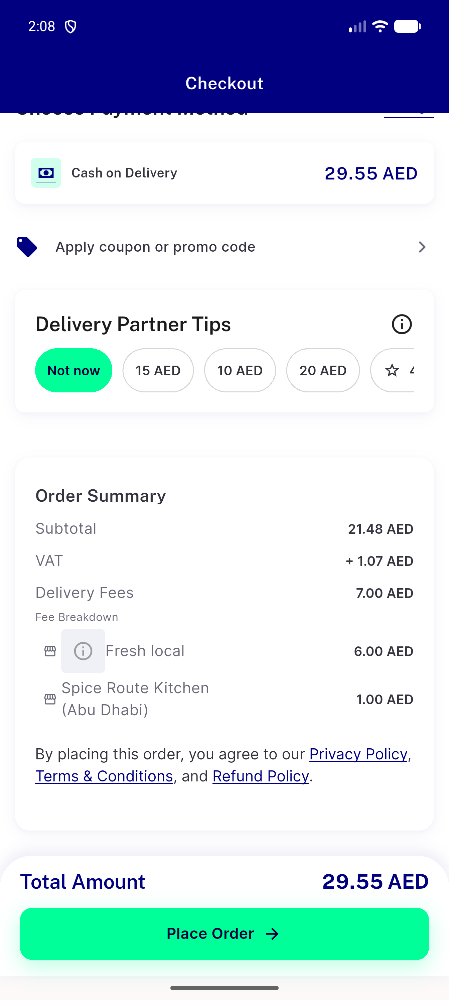</a> checkout mixed flagON summary 7.00 6+1</td>
</tr>
<tr>
<td align="center" width="33%"> placed mixed 91428 91429 flagON</td>
<td align="center" width="33%"><a href="14-control-cart-sameModule-pharmacy-noSurge-58-1.00-55-free.png">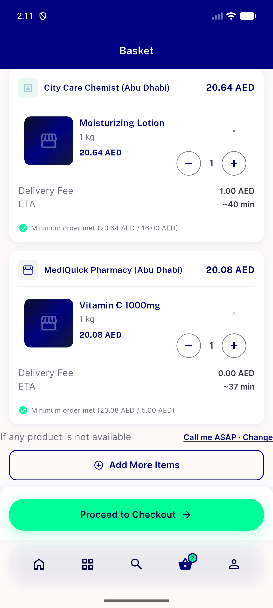</a> control cart sameModule pharmacy noSurge 58 1.00 55 free</td>
<td align="center" width="33%"><a href="15-control-checkout-sameModule-noSurge-summary-1.00.png">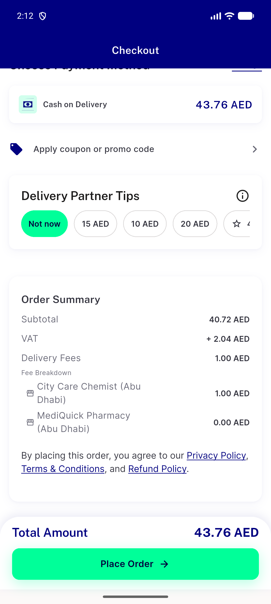</a> control checkout sameModule noSurge summary 1.00</td>
</tr>
<tr>
<td align="center" width="33%"><a href="16-regression-singleStore-noSurge-58-fee-1.00.png">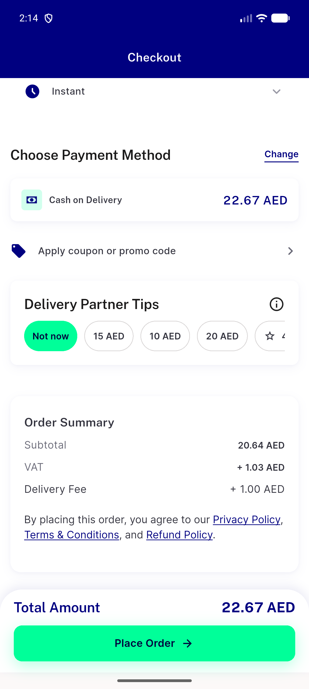</a> regression singleStore noSurge 58 fee 1.00</td>
<td align="center" width="33%"><a href="17-regression-singleStore-surge-12-fee-6.00.png">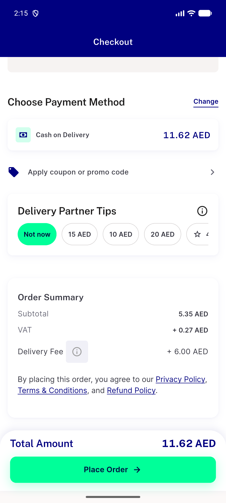</a> regression singleStore surge 12 fee 6.00</td>
<td align="center" width="33%"> aclog cart surge endpoint 500 fees fall to base 1.00</td>
</tr>
<tr>
<td align="center" width="33%"> aclog checkout perstore base 1.00 under 500</td>
<td align="center" width="33%"><a href="20-percent-variant-cart-sameModule-50pct-1.50.png">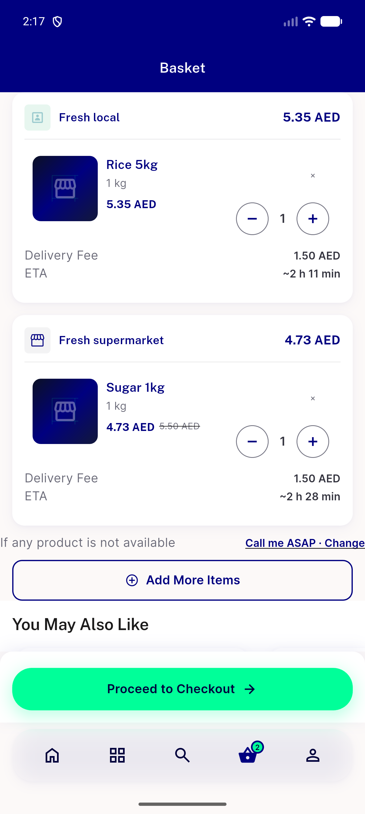</a> percent variant cart sameModule 50pct 1.50</td>
</tr>
</table>

### Other artifacts
- [`ac1-ac2-flagOFF-child-orders.log`](ac1-ac2-flagOFF-child-orders.log)
- [`ac3-flagON-child-orders.log`](ac3-flagON-child-orders.log)
- [`ac4-mixed-flagON-child-orders.log`](ac4-mixed-flagON-child-orders.log)
- [`aclog-surge-endpoint-500.log`](aclog-surge-endpoint-500.log)
- [`bug-group-vat-rounding-0.01.log`](bug-group-vat-rounding-0.01.log)
- [`progress.md`](progress.md)

---
*From `nears/docs/qa-evidence/NEARS-3898/` · public-repo scrub policy (no live secrets; verified clean).*
