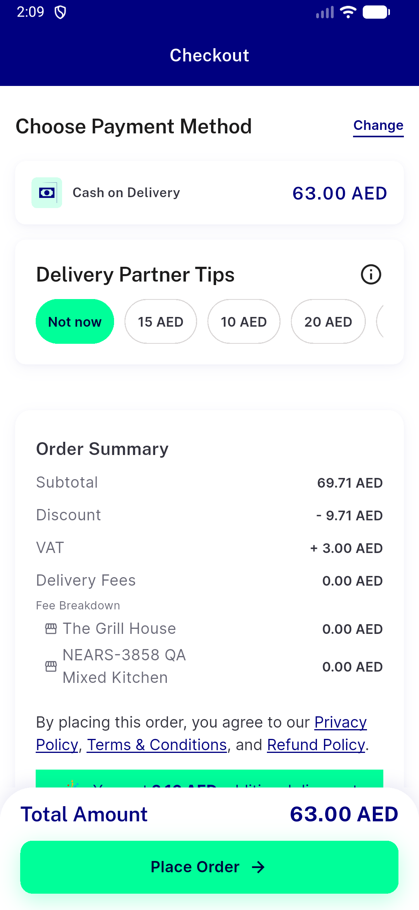
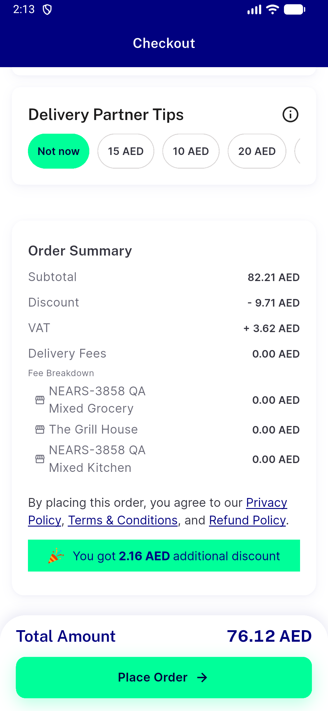
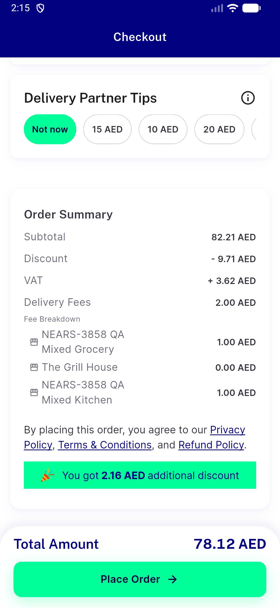
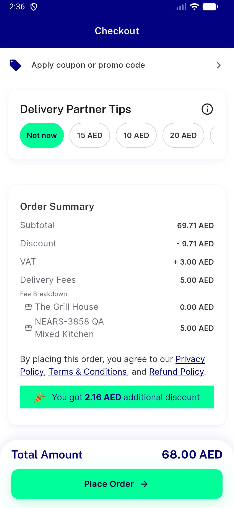
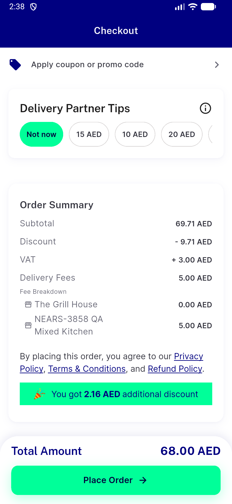
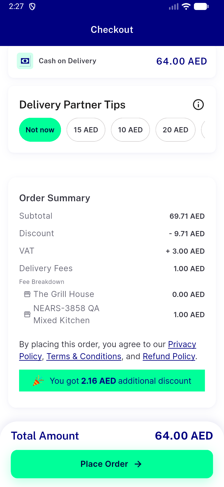
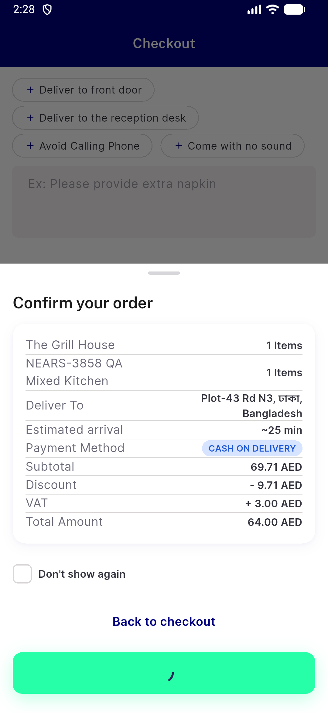

# QA Evidence — NEARS-3906

**QA cycle 1 (AC5 delta): FAIL - AC5 WARN unreachable for a null-latitude address (checkout stuck on distance-gated shimmer); no user route; route ii/iii NOT FIRED**

**9 screenshot(s).** Click any thumbnail for full resolution.

<table>
<tr>
<td align="center" width="33%"> ac1 flagON guest 2store food summary</td>
<td align="center" width="33%"> ac2 flagON guest mixed 3store summary</td>
<td align="center" width="33%"> ac2b flagON guest mixed paid delivery summary</td>
</tr>
<tr>
<td align="center" width="33%"> ac3 flagOFF loggedin 2store food summary</td>
<td align="center" width="33%"> ac3 flagON loggedin 2store food summary</td>
<td align="center" width="33%"> ac4 flagOFF guest 2store food summary</td>
</tr>
<tr>
<td align="center" width="33%"> d4 edit case 1 before edit</td>
<td align="center" width="33%"> d4 edit case 2 after edit</td>
<td align="center" width="33%"> edge guest group place result</td>
</tr>
</table>

### Other artifacts
- [`ac1-flagON-guest-2store-food-summary.a11y.txt`](ac1-flagON-guest-2store-food-summary.a11y.txt)
- [`ac2-flagON-guest-mixed-3store-summary.a11y.txt`](ac2-flagON-guest-mixed-3store-summary.a11y.txt)
- [`ac2b-flagON-guest-mixed-paid-delivery-summary.a11y.txt`](ac2b-flagON-guest-mixed-paid-delivery-summary.a11y.txt)
- [`ac3-flagOFF-loggedin-2store-food-summary.a11y.txt`](ac3-flagOFF-loggedin-2store-food-summary.a11y.txt)
- [`ac3-flagON-loggedin-2store-food-summary.a11y.txt`](ac3-flagON-loggedin-2store-food-summary.a11y.txt)
- [`ac4-flagOFF-guest-2store-food-summary.a11y.txt`](ac4-flagOFF-guest-2store-food-summary.a11y.txt)
- [`ac5-i-cold-injection-gated.log`](ac5-i-cold-injection-gated.log)
- [`ac5-i-inprocess-injection-no-warn-shimmer.log`](ac5-i-inprocess-injection-no-warn-shimmer.log)
- [`ac5-ii-guest-group-place-success-no-warn.log`](ac5-ii-guest-group-place-success-no-warn.log)
- [`ac5-iii-loggedin-null-lat-address-list-500.log`](ac5-iii-loggedin-null-lat-address-list-500.log)
- [`ac5-o1-negative-control-lat-present.log`](ac5-o1-negative-control-lat-present.log)
- [`ac5-o3-control-lat-restored.log`](ac5-o3-control-lat-restored.log)
- [`ac6-flutter-test.log`](ac6-flutter-test.log)
- [`bug-search-results-semantics-assertion.log`](bug-search-results-semantics-assertion.log)
- [`d4-edit-case-1-before-edit.a11y.txt`](d4-edit-case-1-before-edit.a11y.txt)
- [`d4-edit-case-2-after-edit.a11y.txt`](d4-edit-case-2-after-edit.a11y.txt)
- [`d4-edit-case-3-confirm-sheet.a11y.txt`](d4-edit-case-3-confirm-sheet.a11y.txt)
- [`d4-edit-case-placed-order.log`](d4-edit-case-placed-order.log)
- [`progress.md`](progress.md)
- [`reg-single-store-guest-summary.a11y.txt`](reg-single-store-guest-summary.a11y.txt)
- [`reg-single-store-loggedin-summary.a11y.txt`](reg-single-store-loggedin-summary.a11y.txt)

---
*From `nears/docs/qa-evidence/NEARS-3906/` · public-repo scrub policy (no live secrets; verified clean).*
