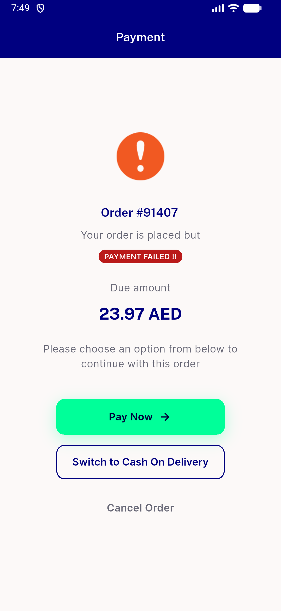
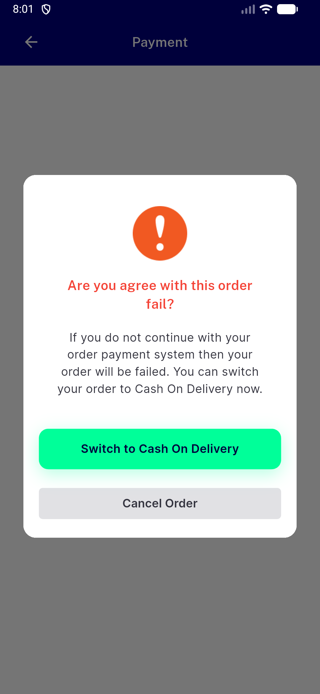
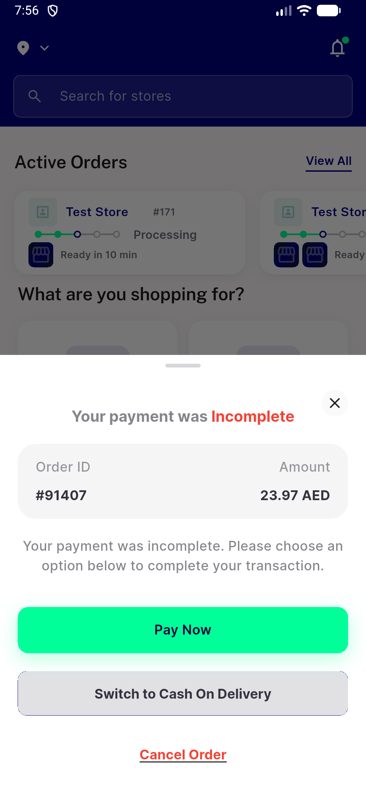
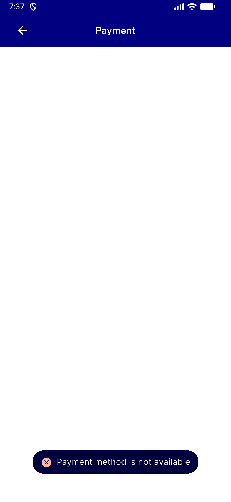
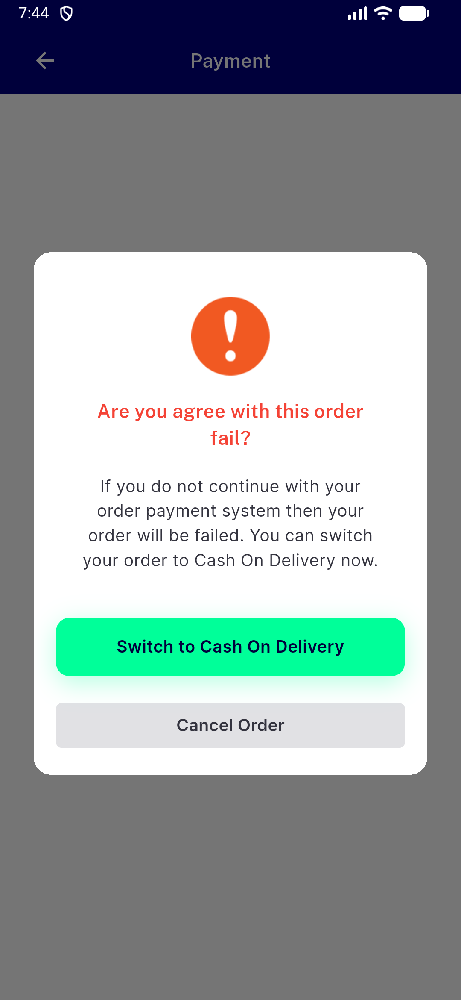

# QA Evidence — NEARS-3909

**PASS: NEARS-3909 branch bbbd63dfa carries payload cod_eligible; base d160b0fa4 wrong in both directions**

**18 screenshot(s).** Click any thumbnail for full resolution.

<table>
<tr>
<td align="center" width="33%"> base caseA a home prompt</td>
<td align="center" width="33%"> base caseA a payfailed dialog</td>
<td align="center" width="33%"> base caseA b digital payment failed screen</td>
</tr>
<tr>
<td align="center" width="33%"> base caseA b payfailed dialog</td>
<td align="center" width="33%"> base caseA c payfailed dialog</td>
<td align="center" width="33%"> base caseB b digital payment failed screen</td>
</tr>
<tr>
<td align="center" width="33%"> base caseB b payfailed dialog</td>
<td align="center" width="33%"> base caseB2 b digital payment failed screen</td>
<td align="center" width="33%"> base caseB2 b payfailed dialog</td>
</tr>
<tr>
<td align="center" width="33%"> branch caseA a after switch tap</td>
<td align="center" width="33%"> branch caseA a home prompt</td>
<td align="center" width="33%"> branch caseA a payfailed dialog</td>
</tr>
<tr>
<td align="center" width="33%"> branch caseA b digital payment failed screen</td>
<td align="center" width="33%"> branch caseA b payfailed dialog</td>
<td align="center" width="33%"> branch caseA c after switch tap</td>
</tr>
<tr>
<td align="center" width="33%"> branch caseB b payfailed dialog</td>
<td align="center" width="33%"> branch caseB2 b digital payment failed screen</td>
<td align="center" width="33%"> branch caseB2 b payfailed dialog</td>
</tr>
</table>

### Other artifacts
- [`instrument-logproxy.py`](instrument-logproxy.py)
- [`probe-caseA.txt`](probe-caseA.txt)
- [`probe-caseB.txt`](probe-caseB.txt)
- [`progress.md`](progress.md)
- [`proxy-base-caseA-a-b-raw.log`](proxy-base-caseA-a-b-raw.log)
- [`proxy-base-caseA-c-raw.log`](proxy-base-caseA-c-raw.log)
- [`proxy-base-caseB-b-raw.log`](proxy-base-caseB-b-raw.log)
- [`proxy-base-caseB2-raw.log`](proxy-base-caseB2-raw.log)
- [`proxy-branch-caseA-a-b-raw.log`](proxy-branch-caseA-a-b-raw.log)
- [`proxy-branch-caseB-b.log`](proxy-branch-caseB-b.log)
- [`proxy-branch-caseB2-raw.log`](proxy-branch-caseB2-raw.log)

---
*From `nears/docs/qa-evidence/NEARS-3909/` · public-repo scrub policy (no live secrets; verified clean).*
