# QA Evidence — NEARS-3910

**NEARS-3910 QA PASS - wallet partial apply blocked when cod remainder unpayable (EN/AR, base repro)**

**15 screenshot(s).** Click any thumbnail for full resolution.

<table>
<tr>
<td align="center" width="33%"><a href="ac1-inherited-split-dropped-on-open-AR.png">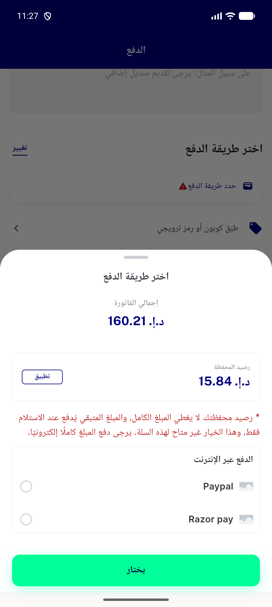</a> ac1 inherited split dropped on open AR</td>
<td align="center" width="33%"><a href="ac1-inherited-split-dropped-on-open-EN.png">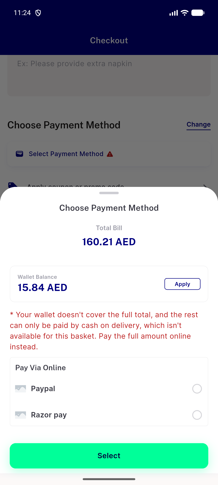</a> ac1 inherited split dropped on open EN</td>
<td align="center" width="33%"> ac1 mixed apply blocked online EN</td>
</tr>
<tr>
<td align="center" width="33%"><a href="ac2-v1-apply-blocked-online-offered-EN.png">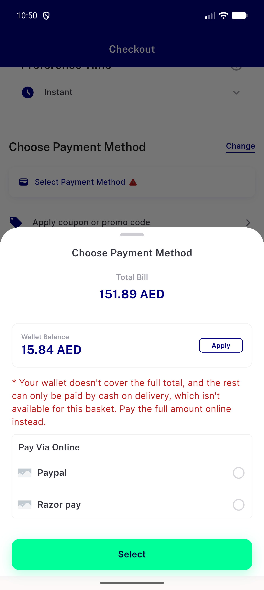</a> ac2 v1 apply blocked online offered EN</td>
<td align="center" width="33%"><a href="ac4-cod-cash-offered-split-starts-EN.png">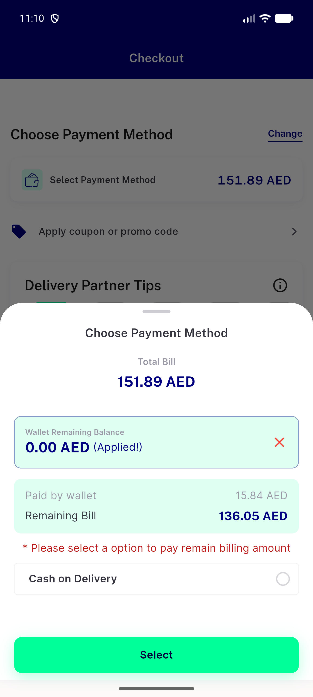</a> ac4 cod cash offered split starts EN</td>
<td align="center" width="33%"><a href="ac4-post-order-pay-now-sheet-EN.png">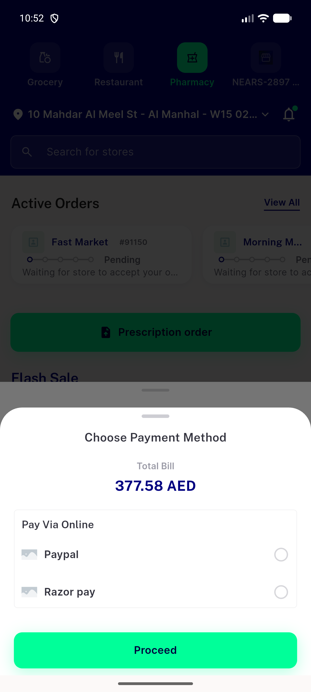</a> ac4 post order pay now sheet EN</td>
</tr>
<tr>
<td align="center" width="33%"><a href="base-ac1-mixed-apply-dead-end-EN.png">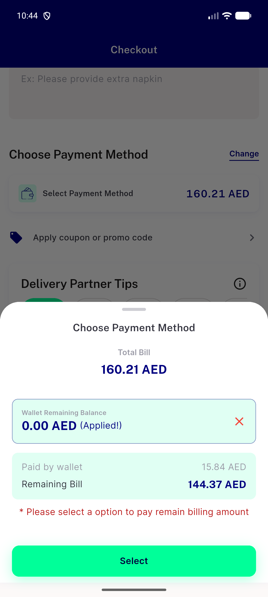</a> base ac1 mixed apply dead end EN</td>
<td align="center" width="33%"><a href="base-ac2-single-store-flagoff-apply-dead-end-EN.png">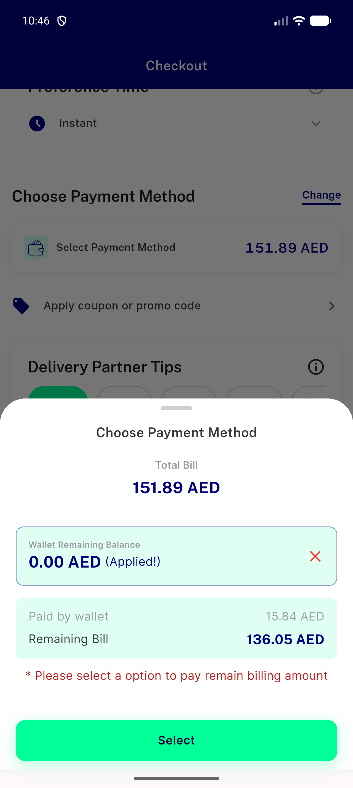</a> base ac2 single store flagoff apply dead end EN</td>
<td align="center" width="33%"><a href="v1-apply-blocked-AR-320dp-1.3x.png">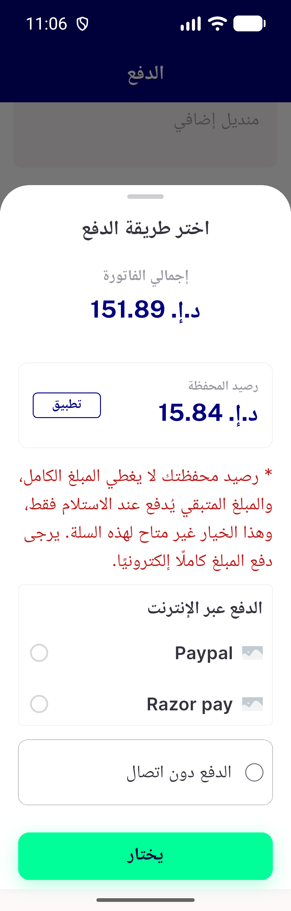</a> v1 apply blocked AR 320dp 1.3x</td>
</tr>
<tr>
<td align="center" width="33%"><a href="v1-apply-blocked-EN-320dp-1.3x.png">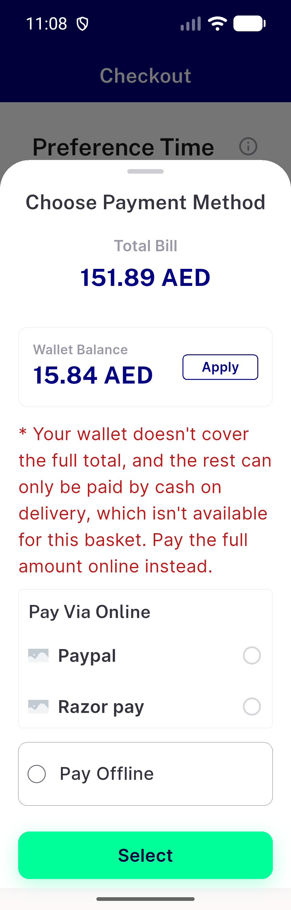</a> v1 apply blocked EN 320dp 1.3x</td>
<td align="center" width="33%"><a href="v1-apply-blocked-online-and-offline-offered-AR.png">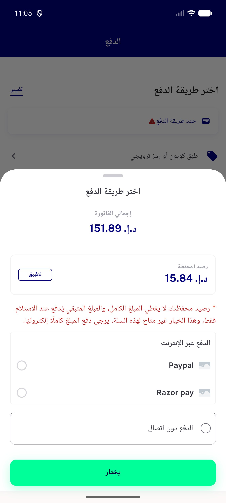</a> v1 apply blocked online and offline offered AR</td>
<td align="center" width="33%"><a href="v2-apply-blocked-offline-offered-AR.png">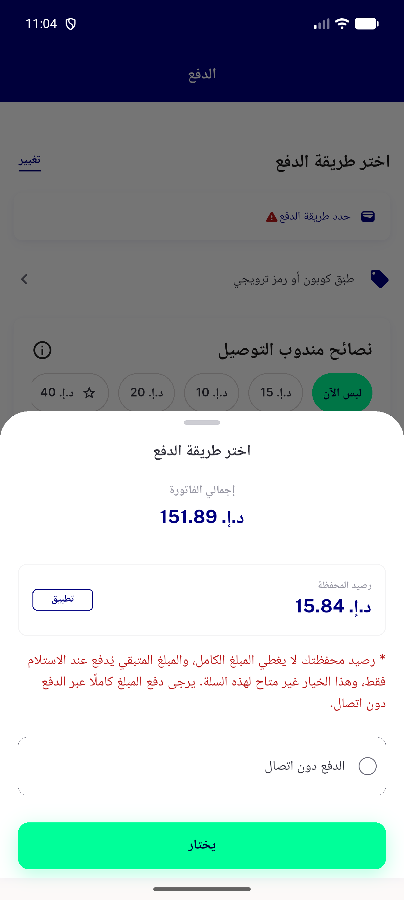</a> v2 apply blocked offline offered AR</td>
</tr>
<tr>
<td align="center" width="33%"><a href="v2-apply-blocked-offline-offered-EN.png">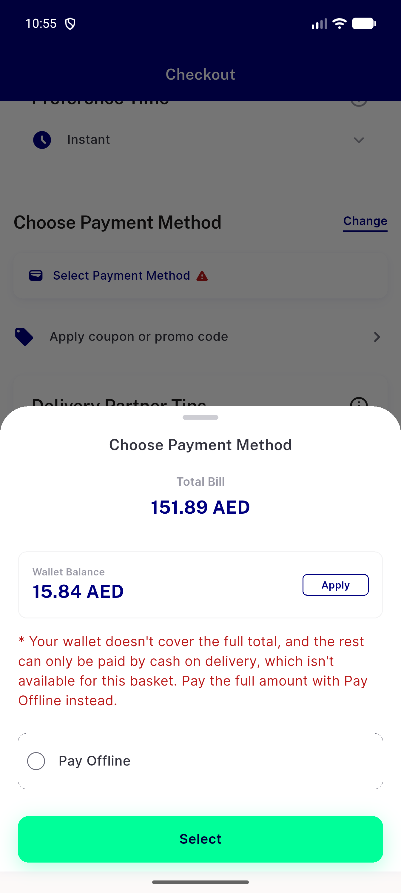</a> v2 apply blocked offline offered EN</td>
<td align="center" width="33%"><a href="v3-apply-blocked-no-method-AR.png">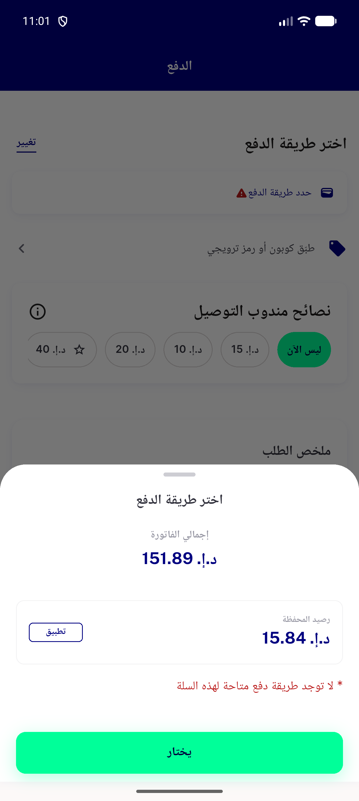</a> v3 apply blocked no method AR</td>
<td align="center" width="33%"><a href="v3-apply-blocked-no-method-EN.png">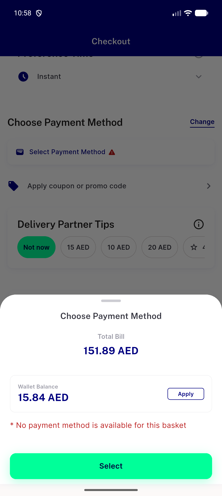</a> v3 apply blocked no method EN</td>
</tr>
</table>

### Other artifacts
- [`bug-preexisting-checkout-overflow-320dp-1.3x.log`](bug-preexisting-checkout-overflow-320dp-1.3x.log)
- [`progress.md`](progress.md)

---
*From `nears/docs/qa-evidence/NEARS-3910/` · public-repo scrub policy (no live secrets; verified clean).*
