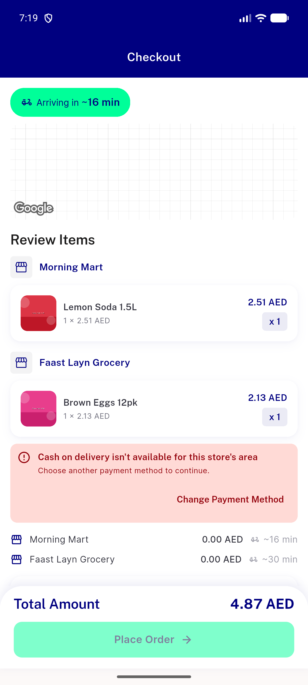
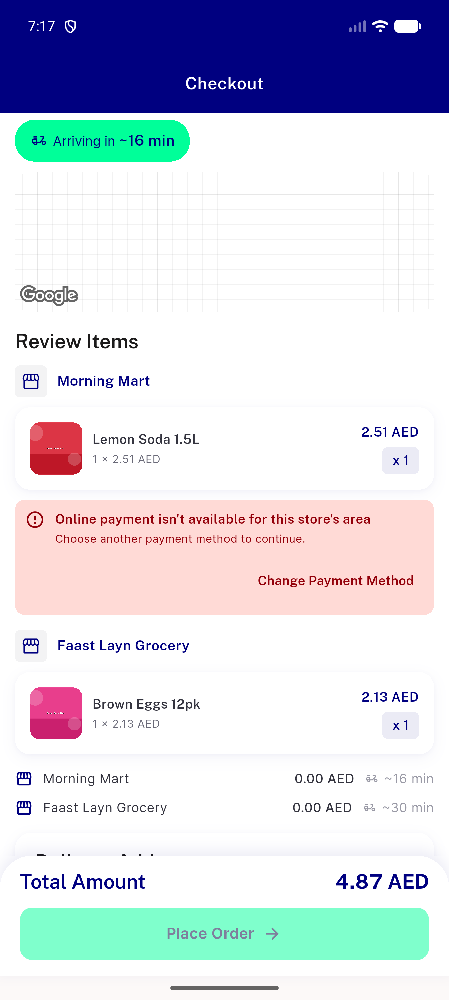
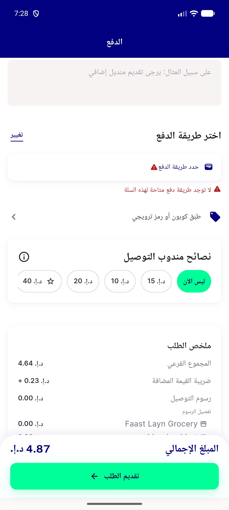
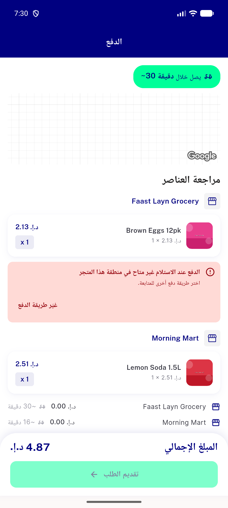
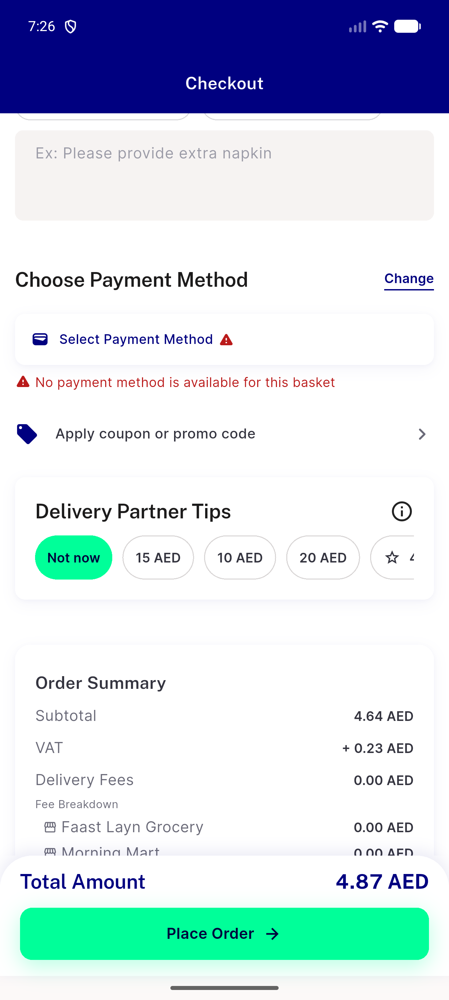
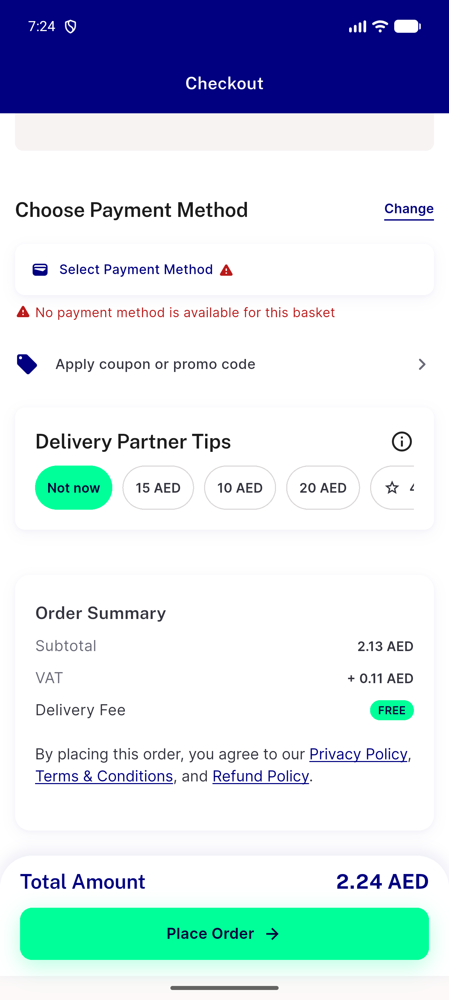
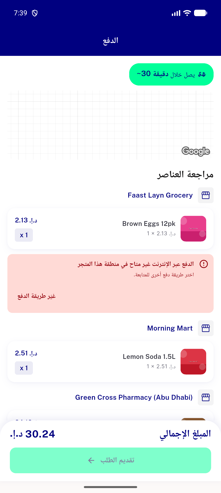
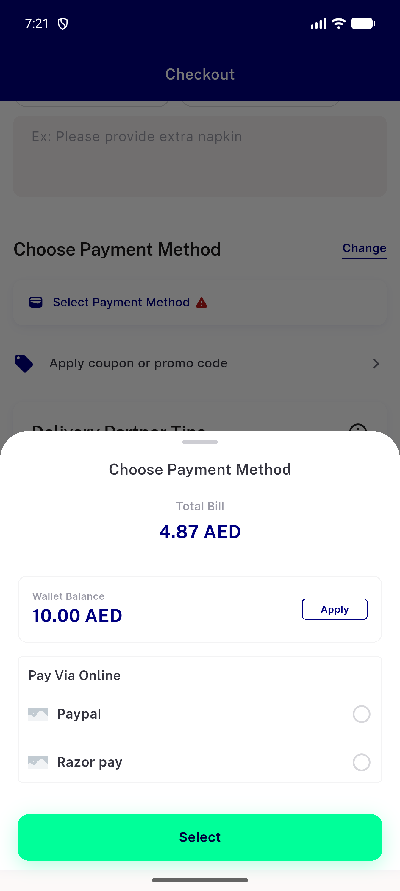
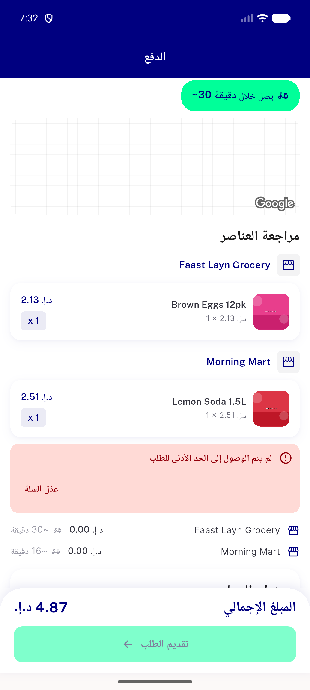

# QA Evidence — NEARS-3911

**NEARS-3911 QA fix-cycle 0: PASS - AC1-AC4 live on emulator-5556, flag OFF+ON, 0 orders**

**10 screenshot(s).** Click any thumbnail for full resolution.

<table>
<tr>
<td align="center" width="33%"> ac1 cash card revalidate en</td>
<td align="center" width="33%"> ac1 digital card en</td>
<td align="center" width="33%"> ac3 ac4a no method ar</td>
</tr>
<tr>
<td align="center" width="33%"> ac3 cash card ar rtl</td>
<td align="center" width="33%"> ac3 digital card ar rtl</td>
<td align="center" width="33%"> ac4a multi store no method en</td>
</tr>
<tr>
<td align="center" width="33%"> ac4b single store no method en</td>
<td align="center" width="33%"> d6 flagon mixed digital card ar</td>
<td align="center" width="33%"> precheck multistore cash hidden</td>
</tr>
<tr>
<td align="center" width="33%"> reg min order card ar</td>
</tr>
</table>

### Other artifacts
- [`ac1-digital-card-en.nodes.txt`](ac1-digital-card-en.nodes.txt)
- [`ac3-digital-card-ar-rtl.nodes.txt`](ac3-digital-card-ar-rtl.nodes.txt)
- [`progress.md`](progress.md)

---
*From `nears/docs/qa-evidence/NEARS-3911/` · public-repo scrub policy (no live secrets; verified clean).*
