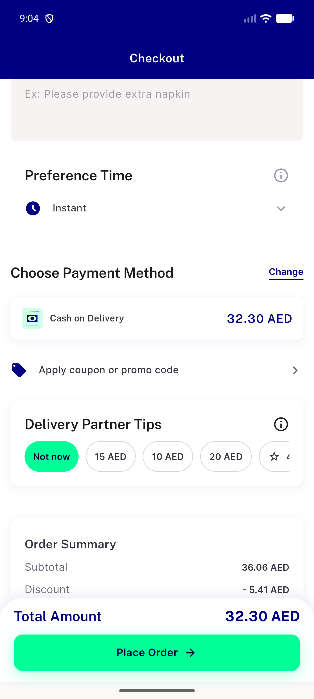
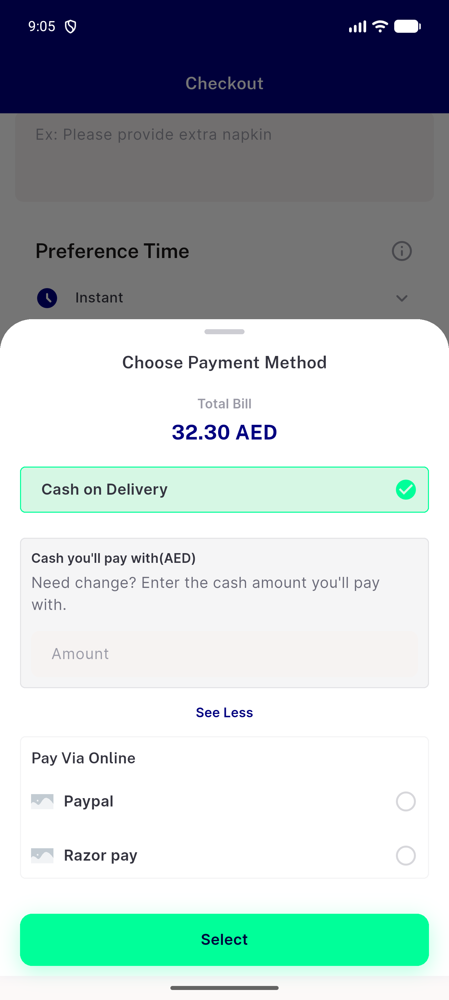
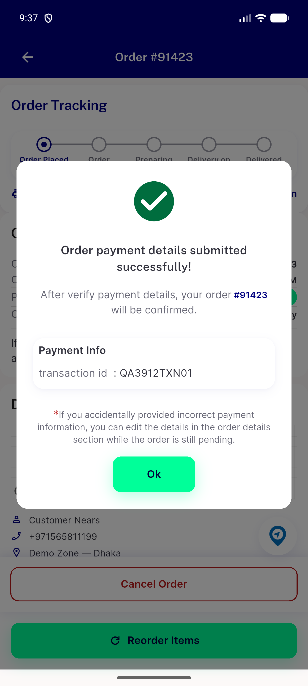
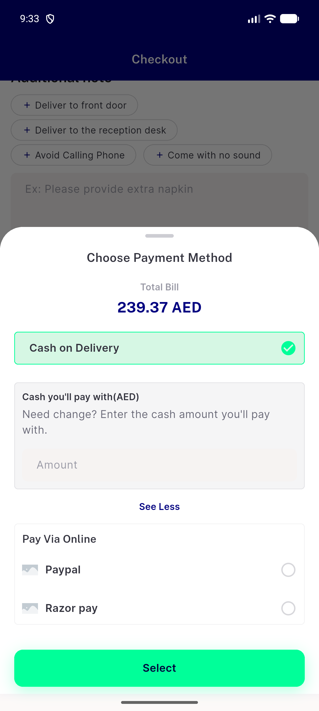
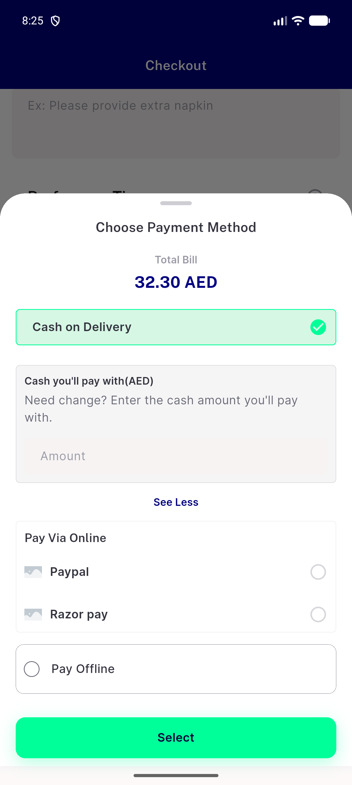
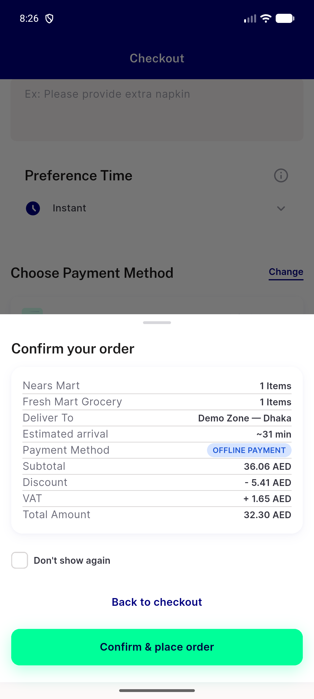

# QA Evidence — NEARS-3912

**NEARS-3912 [8] post-fix QA PASS @4e6ce3aae: AC3 offline hidden on multi-store (EN+AR, flag OFF+ON), 0 group refusals w/ positive validate+place on :8112; AC4 single-store offline order #91423 placed**

**7 screenshot(s).** Click any thumbnail for full resolution.

<table>
<tr>
<td align="center" width="33%"> fix ac3 checkout payment section</td>
<td align="center" width="33%"> fix ac3 payment sheet multistore</td>
<td align="center" width="33%"> fix ac4 offline order submitted</td>
</tr>
<tr>
<td align="center" width="33%"> fix scope3 mixed flagon payment sheet</td>
<td align="center" width="33%"> fix ux7b payment sheet multistore ar</td>
<td align="center" width="33%"> repro ac1 payment sheet pay offline offered</td>
</tr>
<tr>
<td align="center" width="33%"> repro ac2 after confirm</td>
</tr>
</table>

### Other artifacts
- [`bug-offline-form-amount-stale.log`](bug-offline-form-amount-stale.log)
- [`bug-search-results-rendertable-semantics-assert.log`](bug-search-results-rendertable-semantics-assert.log)
- [`fix-ac3-backend.log`](fix-ac3-backend.log)
- [`fix-ac3-checkout-payment-section.a11y.xml`](fix-ac3-checkout-payment-section.a11y.xml)
- [`fix-ac3-payment-sheet-multistore.a11y.xml`](fix-ac3-payment-sheet-multistore.a11y.xml)
- [`fix-ac4-offline-order-submitted.a11y.xml`](fix-ac4-offline-order-submitted.a11y.xml)
- [`fix-ac4-payment-sheet-single-store.a11y.xml`](fix-ac4-payment-sheet-single-store.a11y.xml)
- [`fix-scope3-mixed-flagon-checkout.a11y.xml`](fix-scope3-mixed-flagon-checkout.a11y.xml)
- [`fix-scope3-mixed-flagon-payment-sheet.a11y.xml`](fix-scope3-mixed-flagon-payment-sheet.a11y.xml)
- [`fix-scope4-stale-pick-checkout.a11y.xml`](fix-scope4-stale-pick-checkout.a11y.xml)
- [`fix-ux7b-payment-sheet-multistore-ar.a11y.xml`](fix-ux7b-payment-sheet-multistore-ar.a11y.xml)
- [`progress.md`](progress.md)
- [`repro-ac1-payment-sheet.a11y.xml`](repro-ac1-payment-sheet.a11y.xml)
- [`repro-ac2-after-confirm.a11y.xml`](repro-ac2-after-confirm.a11y.xml)
- [`repro-ac2-backend.log`](repro-ac2-backend.log)
- [`repro-ac2-client.log`](repro-ac2-client.log)

---
*From `nears/docs/qa-evidence/NEARS-3912/` · public-repo scrub policy (no live secrets; verified clean).*
