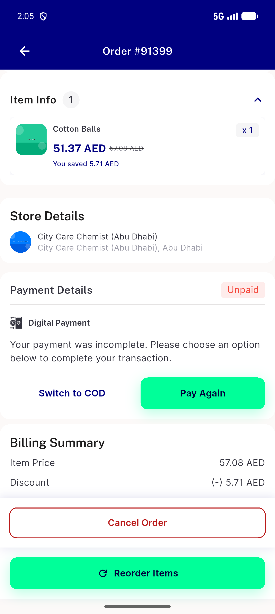
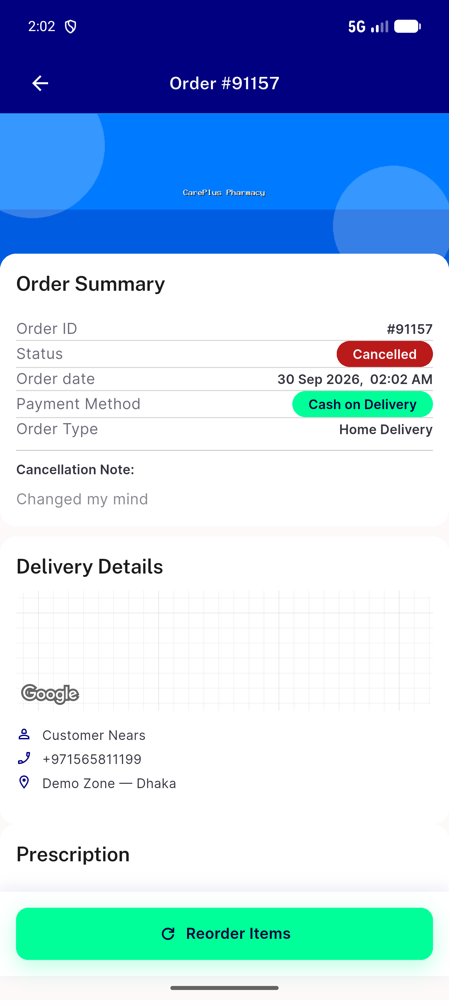
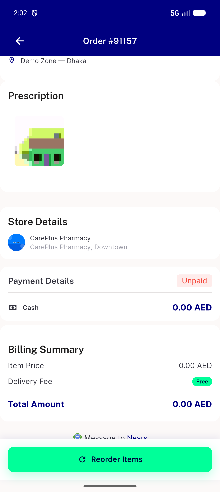
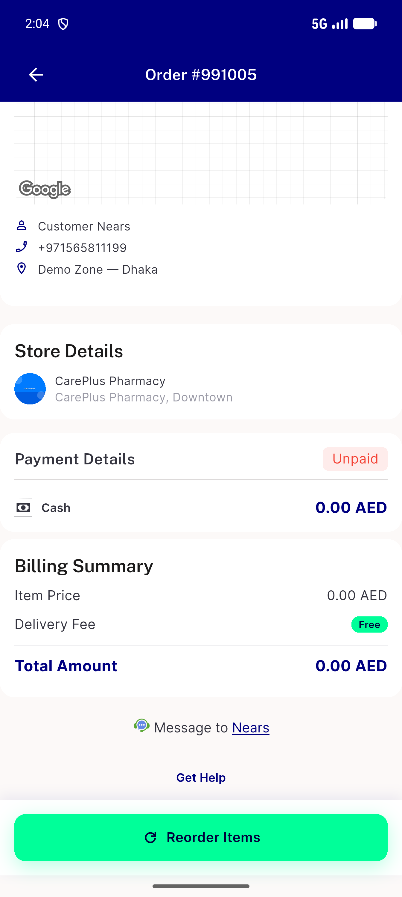
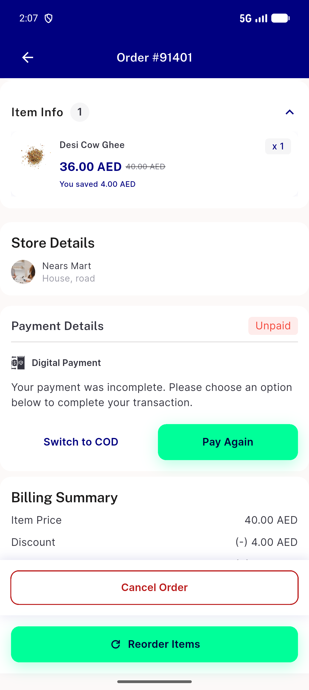
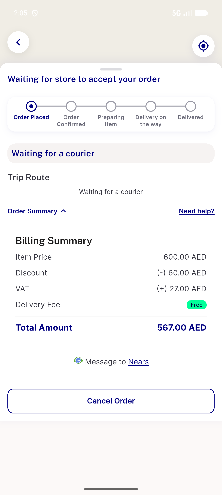

# QA Evidence — NEARS-3918

**PASS - order_attachment_full_url real URLs / [] (API matrix + UserApp live)**

**6 screenshot(s).** Click any thumbnail for full resolution.

<table>
<tr>
<td align="center" width="33%"> ac userapp pharmacy no rx order 91399</td>
<td align="center" width="33%"> ac2 userapp order 91157 details</td>
<td align="center" width="33%"> ac2 userapp order 91157 prescription section</td>
</tr>
<tr>
<td align="center" width="33%"> ac4 userapp order 991005 empty attachment</td>
<td align="center" width="33%"> dls details billing summary nonpharmacy 91401</td>
<td align="center" width="33%"> dls tracking sheet billing summary order 91403</td>
</tr>
</table>

### Other artifacts
- [`api-matrix.md`](api-matrix.md)

---
*From `nears/docs/qa-evidence/NEARS-3918/` · public-repo scrub policy (no live secrets; verified clean).*
