# QA Evidence — NEARS-3919

**QA PASS - checkout closed-store notice names each closed store with its own opening time**

**27 screenshot(s).** Click any thumbnail for full resolution.

<table>
<tr>
<td align="center" width="33%"><a href="A-ar-320dp-1.0x.png">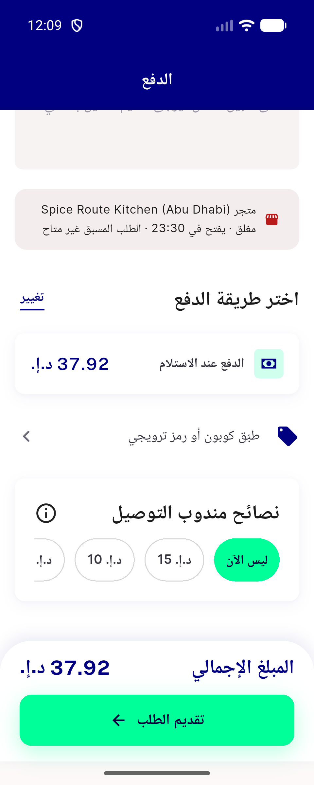</a> A ar 320dp 1.0x</td>
<td align="center" width="33%"><a href="A-ar-320dp-1.3x.png">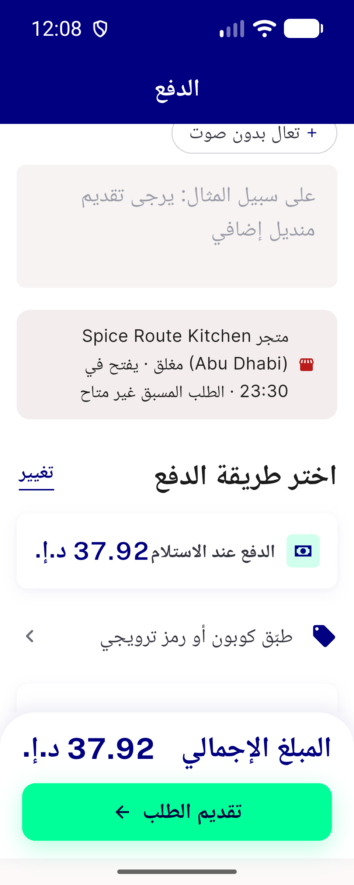</a> A ar 320dp 1.3x</td>
<td align="center" width="33%"><a href="A-ar-360dp-1.0x.png">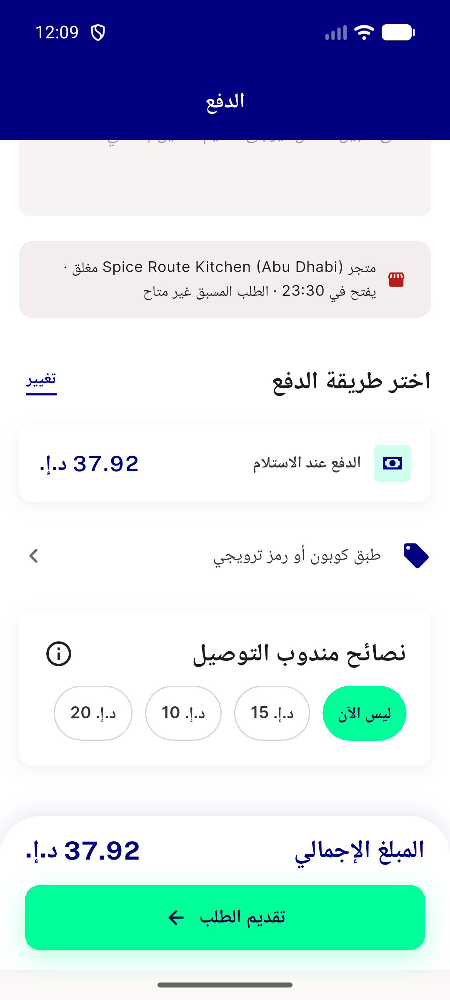</a> A ar 360dp 1.0x</td>
</tr>
<tr>
<td align="center" width="33%"><a href="A-ar-360dp-1.3x.png">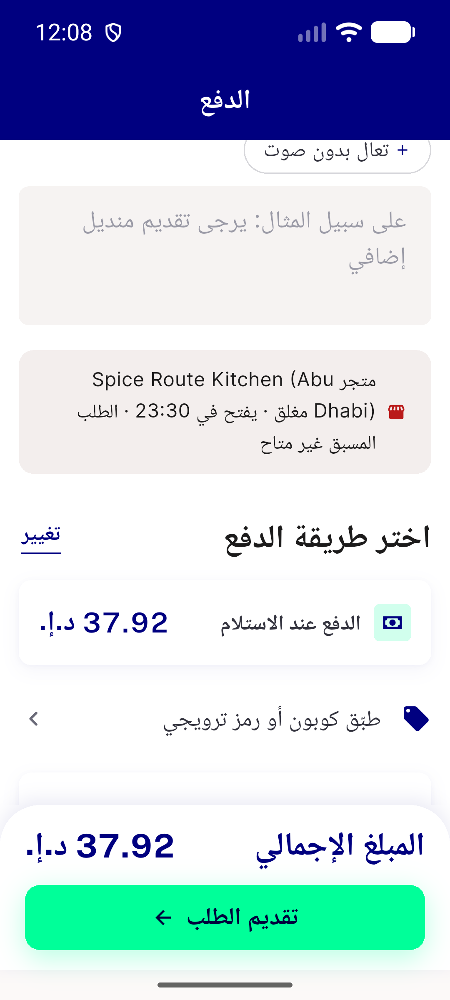</a> A ar 360dp 1.3x</td>
<td align="center" width="33%"><a href="A-en-320dp-1.0x.png">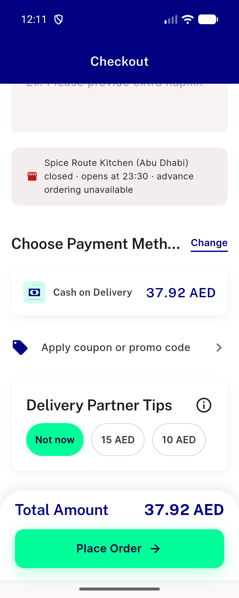</a> A en 320dp 1.0x</td>
<td align="center" width="33%"><a href="A-en-320dp-1.3x.png">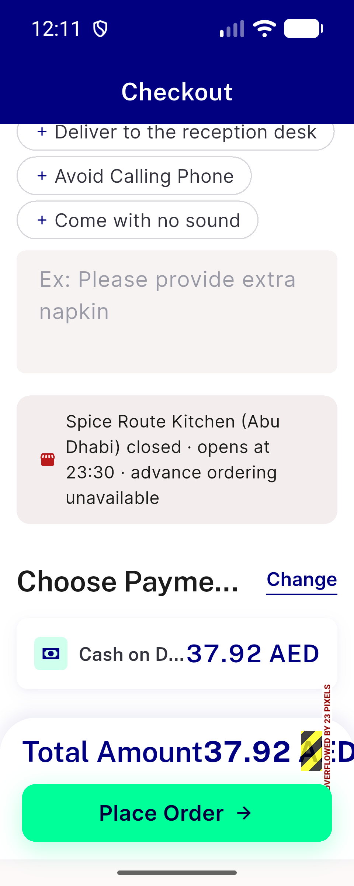</a> A en 320dp 1.3x</td>
</tr>
<tr>
<td align="center" width="33%"> A en 360dp 1.0x</td>
<td align="center" width="33%"><a href="A-en-360dp-1.3x.png">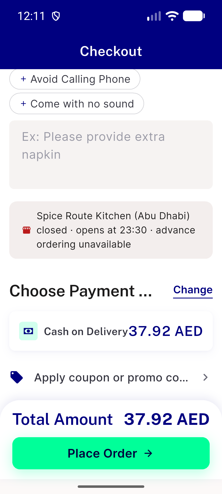</a> A en 360dp 1.3x</td>
<td align="center" width="33%"><a href="A-mixed-one-closed-ar-1.0x-448dp.png">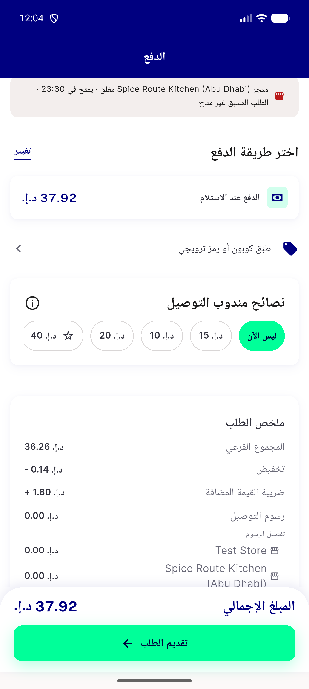</a> A mixed one closed ar 1.0x 448dp</td>
</tr>
<tr>
<td align="center" width="33%"><a href="A-mixed-one-closed-en-1.0x-448dp.png">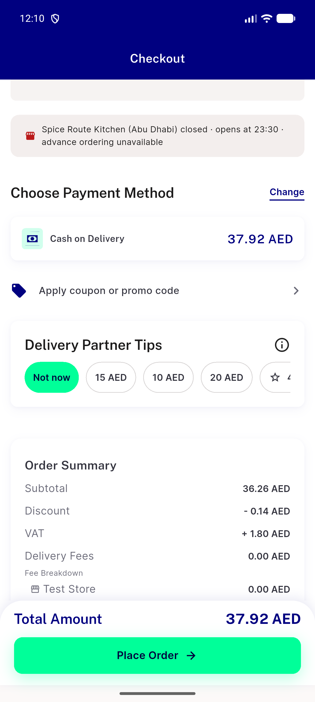</a> A mixed one closed en 1.0x 448dp</td>
<td align="center" width="33%"><a href="B-two-closed-ar-1.0x-448dp.png">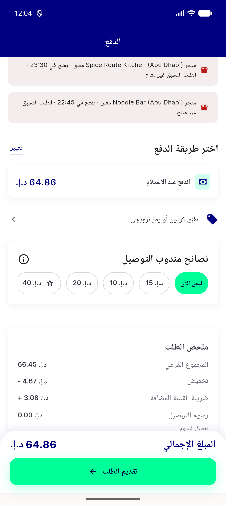</a> B two closed ar 1.0x 448dp</td>
<td align="center" width="33%"> C ar 320dp 1.0x</td>
</tr>
<tr>
<td align="center" width="33%"> C ar 320dp 1.3x</td>
<td align="center" width="33%"> C ar 360dp 1.0x</td>
<td align="center" width="33%"><a href="C-ar-360dp-1.3x.png">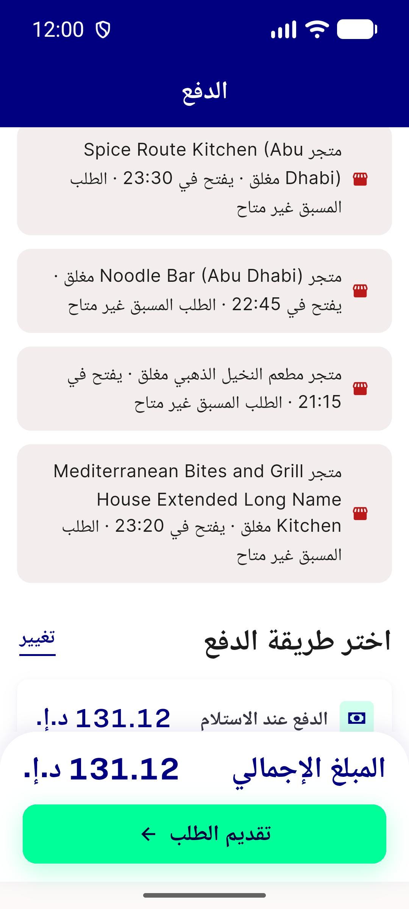</a> C ar 360dp 1.3x</td>
</tr>
<tr>
<td align="center" width="33%"><a href="C-en-320dp-1.0x.png">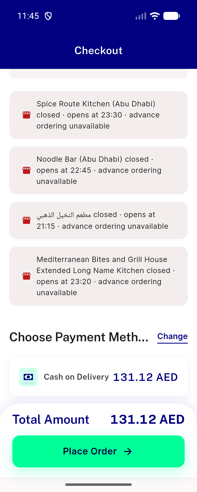</a> C en 320dp 1.0x</td>
<td align="center" width="33%"><a href="C-en-320dp-1.3x.png">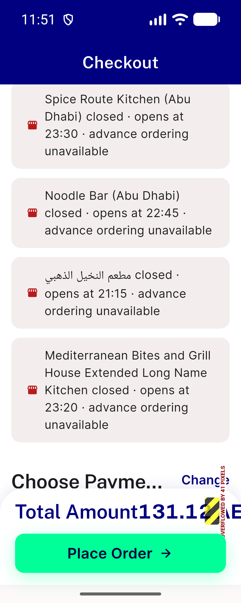</a> C en 320dp 1.3x</td>
<td align="center" width="33%"><a href="C-en-360dp-1.0x.png">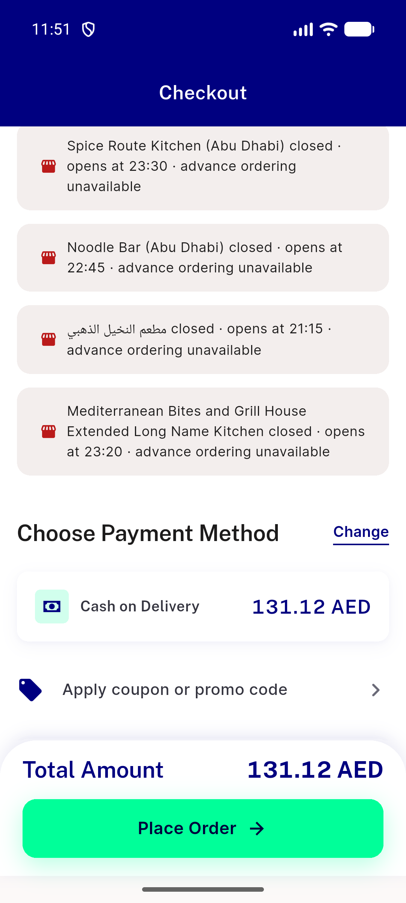</a> C en 360dp 1.0x</td>
</tr>
<tr>
<td align="center" width="33%"><a href="C-en-360dp-1.3x.png">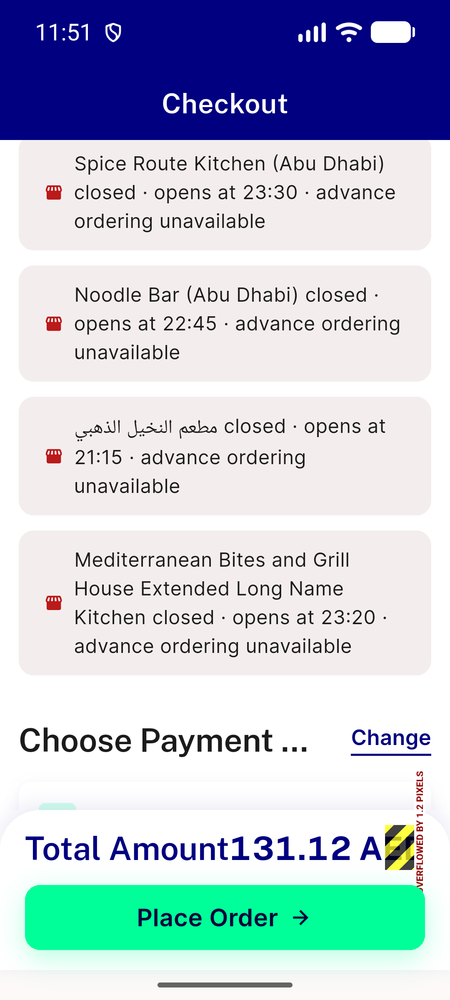</a> C en 360dp 1.3x</td>
<td align="center" width="33%"><a href="C-four-closed-ar-1.0x-448dp.png">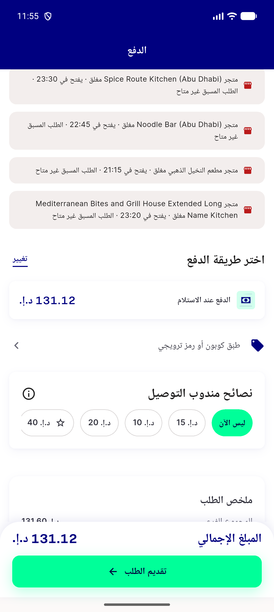</a> C four closed ar 1.0x 448dp</td>
<td align="center" width="33%"><a href="C-four-closed-en-1.0x-448dp.png">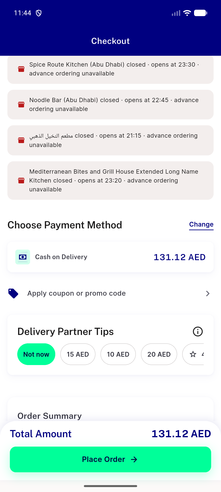</a> C four closed en 1.0x 448dp</td>
</tr>
<tr>
<td align="center" width="33%"><a href="D-single-store-closed-ar.png">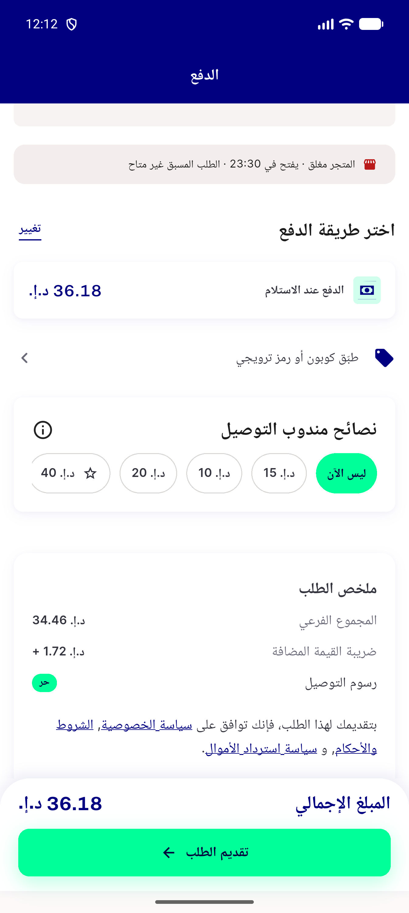</a> D single store closed ar</td>
<td align="center" width="33%"><a href="D-single-store-closed-en.png">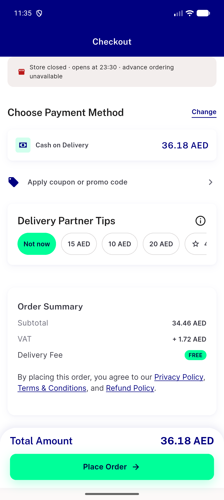</a> D single store closed en</td>
<td align="center" width="33%"> E flag off same module en</td>
</tr>
<tr>
<td align="center" width="33%"><a href="F-lead-closed-two-banners-en.png">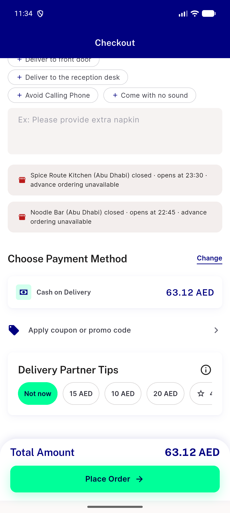</a> F lead closed two banners en</td>
<td align="center" width="33%"><a href="regress-all-open-checkout-no-notice.png">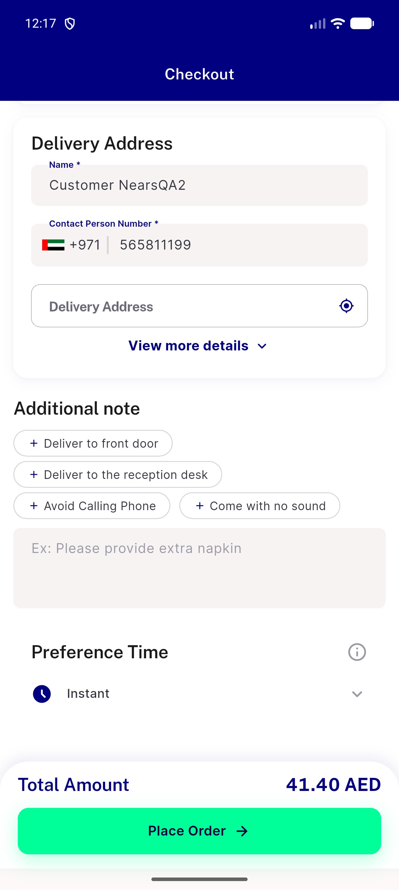</a> regress all open checkout no notice</td>
<td align="center" width="33%"><a href="regress-item-sheet-closed-notice.png">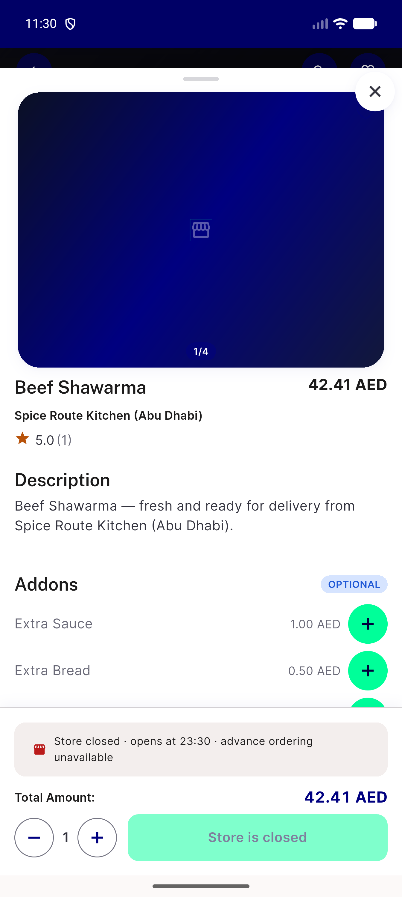</a> regress item sheet closed notice</td>
</tr>
</table>

### Other artifacts
- [`A-ar-320dp-1.0x.a11y.xml`](A-ar-320dp-1.0x.a11y.xml)
- [`A-ar-320dp-1.3x.a11y.xml`](A-ar-320dp-1.3x.a11y.xml)
- [`A-ar-360dp-1.0x.a11y.xml`](A-ar-360dp-1.0x.a11y.xml)
- [`A-ar-360dp-1.3x.a11y.xml`](A-ar-360dp-1.3x.a11y.xml)
- [`A-en-320dp-1.0x.a11y.xml`](A-en-320dp-1.0x.a11y.xml)
- [`A-en-320dp-1.3x.a11y.xml`](A-en-320dp-1.3x.a11y.xml)
- [`A-en-360dp-1.0x.a11y.xml`](A-en-360dp-1.0x.a11y.xml)
- [`A-en-360dp-1.3x.a11y.xml`](A-en-360dp-1.3x.a11y.xml)
- [`A-mixed-one-closed-ar-1.0x-448dp.a11y.xml`](A-mixed-one-closed-ar-1.0x-448dp.a11y.xml)
- [`A-mixed-one-closed-en-1.0x-448dp.a11y.xml`](A-mixed-one-closed-en-1.0x-448dp.a11y.xml)
- [`B-two-closed-ar-1.0x-448dp.a11y.xml`](B-two-closed-ar-1.0x-448dp.a11y.xml)
- [`C-ar-320dp-1.0x.a11y.xml`](C-ar-320dp-1.0x.a11y.xml)
- [`C-ar-320dp-1.3x.a11y.xml`](C-ar-320dp-1.3x.a11y.xml)
- [`C-ar-360dp-1.0x.a11y.xml`](C-ar-360dp-1.0x.a11y.xml)
- [`C-ar-360dp-1.3x.a11y.xml`](C-ar-360dp-1.3x.a11y.xml)
- [`C-en-320dp-1.0x.a11y.xml`](C-en-320dp-1.0x.a11y.xml)
- [`C-en-320dp-1.3x.a11y.xml`](C-en-320dp-1.3x.a11y.xml)
- [`C-en-360dp-1.0x.a11y.xml`](C-en-360dp-1.0x.a11y.xml)
- [`C-en-360dp-1.3x.a11y.xml`](C-en-360dp-1.3x.a11y.xml)
- [`C-four-closed-ar-1.0x-448dp.a11y.xml`](C-four-closed-ar-1.0x-448dp.a11y.xml)
- [`C-four-closed-en-1.0x-448dp.a11y.xml`](C-four-closed-en-1.0x-448dp.a11y.xml)
- [`D-single-store-closed-ar.a11y.xml`](D-single-store-closed-ar.a11y.xml)
- [`D-single-store-closed-en.a11y.xml`](D-single-store-closed-en.a11y.xml)
- [`E-flag-off-same-module-en.a11y.xml`](E-flag-off-same-module-en.a11y.xml)
- [`F-lead-closed-two-banners-en.a11y.xml`](F-lead-closed-two-banners-en.a11y.xml)
- [`bug-checkout-total-bar-overflow-320dp-1.3x.log`](bug-checkout-total-bar-overflow-320dp-1.3x.log)
- [`progress.md`](progress.md)
- [`regress-all-open-checkout-no-notice.a11y.xml`](regress-all-open-checkout-no-notice.a11y.xml)

---
*From `nears/docs/qa-evidence/NEARS-3919/` · public-repo scrub policy (no live secrets; verified clean).*
