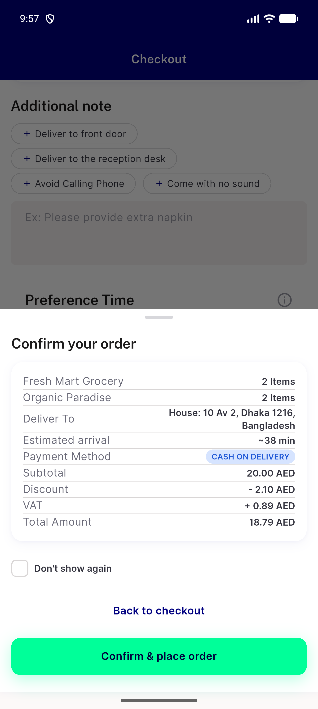
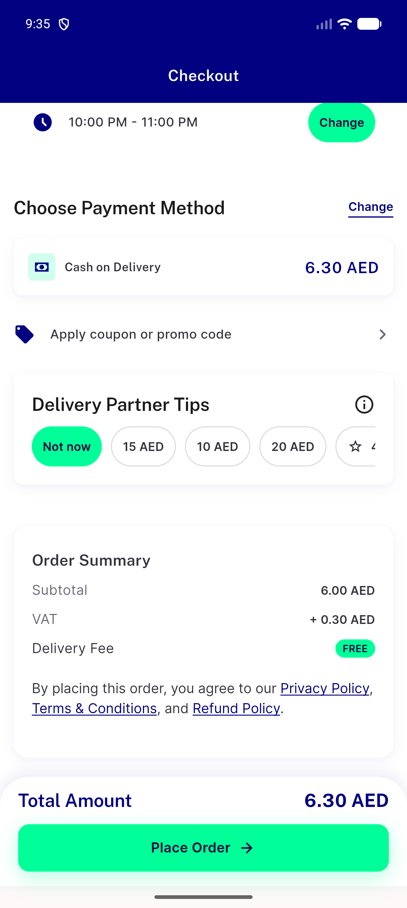
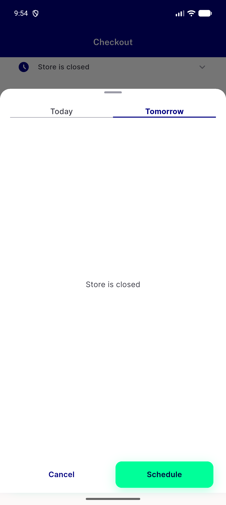
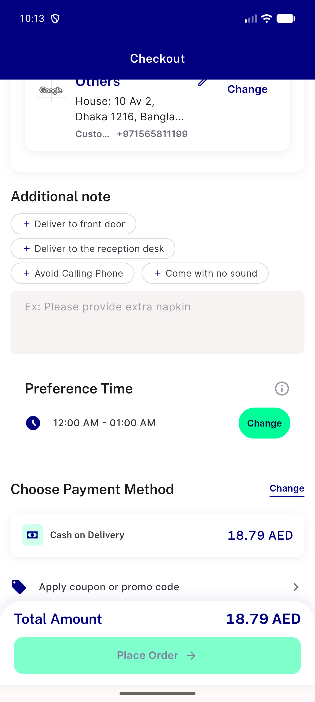
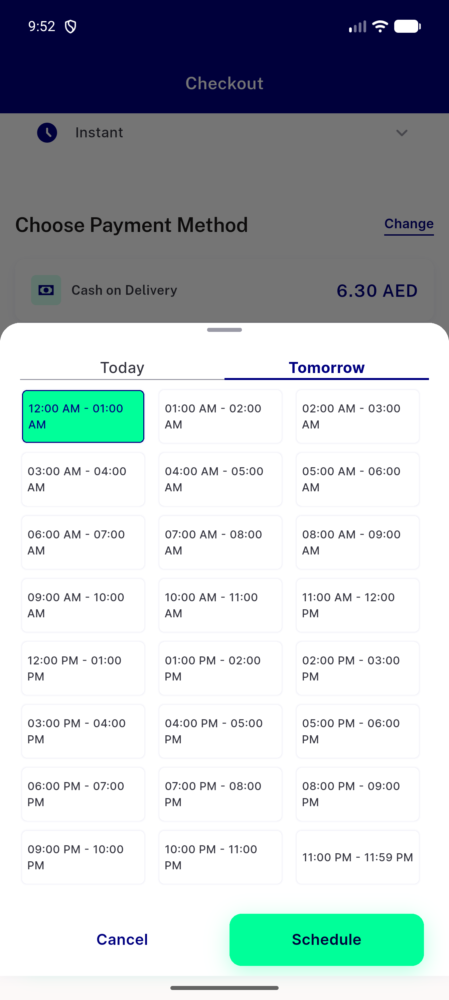

# QA Evidence — NEARS-3920

**NEARS-3920 QA: first-listed slot pick places scheduled (RED base repro + GREEN fix)**

**9 screenshot(s).** Click any thumbnail for full resolution.

<table>
<tr>
<td align="center" width="33%"> bug closed tomorrow group confirm sheet stuck</td>
<td align="center" width="33%"> bug closed tomorrow single confirm sheet stuck</td>
<td align="center" width="33%"> green ac1s section after schedule</td>
</tr>
<tr>
<td align="center" width="33%"> green ac1s sheet open</td>
<td align="center" width="33%"> green b today instant sheet</td>
<td align="center" width="33%"> green closed tomorrow single sheet</td>
</tr>
<tr>
<td align="center" width="33%"> green group secondary closed tomorrow after confirm</td>
<td align="center" width="33%"> green tomorrow no tap section</td>
<td align="center" width="33%"> green tomorrow no tap sheet</td>
</tr>
</table>

### Other artifacts
- [`bug-closed-tomorrow-group-confirm-sheet-stuck.dump.xml`](bug-closed-tomorrow-group-confirm-sheet-stuck.dump.xml)
- [`bug-closed-tomorrow-group-confirm-sheet-stuck.log`](bug-closed-tomorrow-group-confirm-sheet-stuck.log)
- [`bug-closed-tomorrow-single-confirm-sheet-stuck.dump.xml`](bug-closed-tomorrow-single-confirm-sheet-stuck.dump.xml)
- [`bug-closed-tomorrow-single-confirm-sheet-stuck.log`](bug-closed-tomorrow-single-confirm-sheet-stuck.log)
- [`exit-reset-surge-lookups.log`](exit-reset-surge-lookups.log)
- [`mixed-checkout-all-labels.txt`](mixed-checkout-all-labels.txt)
- [`progress.md`](progress.md)

---
*From `nears/docs/qa-evidence/NEARS-3920/` · public-repo scrub policy (no live secrets; verified clean).*
