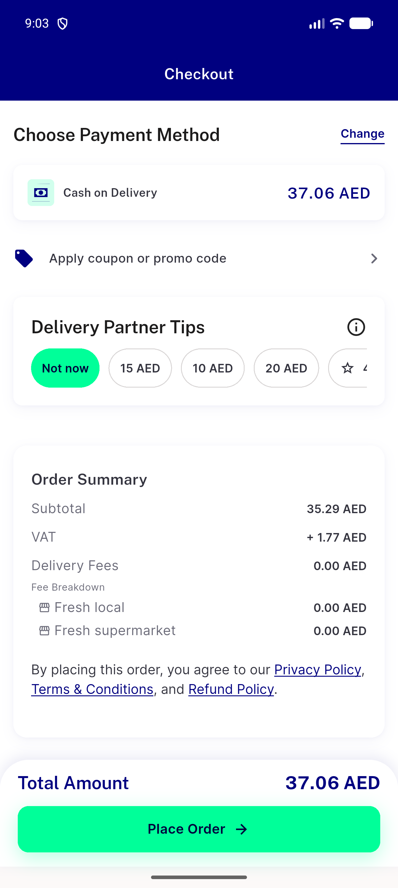

# QA Evidence — NEARS-3921

**PASS — group VAT per-store round: AC1 1.77/37.06 == children (base 1.76/37.05), AC2 1.08/22.56 == children (base 1.07/22.55)**

**1 screenshot(s).** Click any thumbnail for full resolution.

<table>
<tr>
<td align="center" width="33%"> ac1 branch checkout vat 1.77</td>
</tr>
</table>

### Other artifacts
- [`ac1-base-checkout-a11y.xml`](ac1-base-checkout-a11y.xml)
- [`ac1-branch-checkout-a11y.xml`](ac1-branch-checkout-a11y.xml)
- [`ac1-branch-checkout-home-addr-a11y.xml`](ac1-branch-checkout-home-addr-a11y.xml)
- [`ac1-branch-placed-children.tsv`](ac1-branch-placed-children.tsv)
- [`ac2-base-checkout-a11y.xml`](ac2-base-checkout-a11y.xml)
- [`ac2-branch-checkout-a11y.xml`](ac2-branch-checkout-a11y.xml)
- [`ac2-branch-checkout-home-addr-a11y.xml`](ac2-branch-checkout-home-addr-a11y.xml)
- [`ac2-branch-placed-children.tsv`](ac2-branch-placed-children.tsv)
- [`ac3-get-tax-probes.log`](ac3-get-tax-probes.log)
- [`ac4-base-checkout-a11y.xml`](ac4-base-checkout-a11y.xml)
- [`ac4-branch-checkout-a11y.xml`](ac4-branch-checkout-a11y.xml)
- [`ac6-branch-one-store-403-a11y.xml`](ac6-branch-one-store-403-a11y.xml)
- [`ac6-branch-one-store-403.log`](ac6-branch-one-store-403.log)
- [`app-flutter-log-excerpt.log`](app-flutter-log-excerpt.log)
- [`progress.md`](progress.md)

---
*From `nears/docs/qa-evidence/NEARS-3921/` · public-repo scrub policy (no live secrets; verified clean).*
