# QA Evidence — NEARS-3922

**fix-cycle 1 follow-up P4 PASS (bounded) @ 9f2da28da**

**16 screenshot(s).** Click any thumbnail for full resolution.

<table>
<tr>
<td align="center" width="33%"><a href="ac1-after-fix-w2-slot-fee-6.00.png">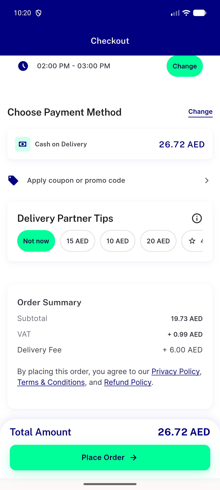</a> ac1 after fix w2 slot fee 6.00</td>
<td align="center" width="33%"><a href="ac1-before-base-confirm-total-23.72.png">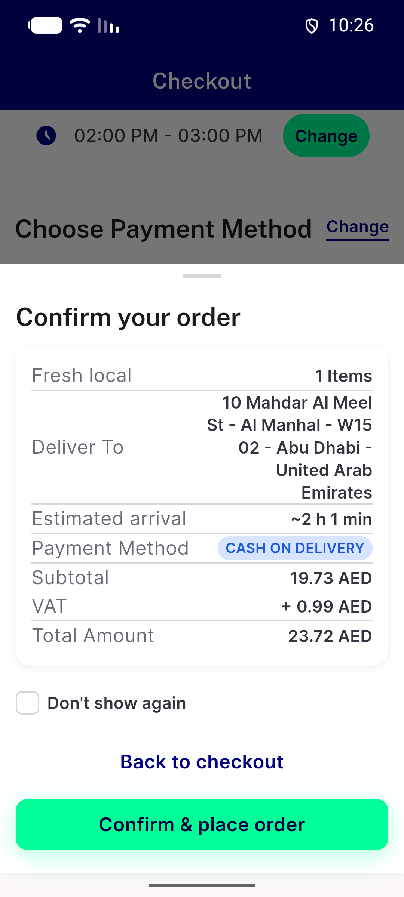</a> ac1 before base confirm total 23.72</td>
<td align="center" width="33%"><a href="ac1-before-base-w2-slot-fee-stays-3.00.png">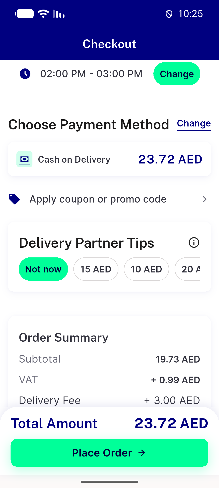</a> ac1 before base w2 slot fee stays 3.00</td>
</tr>
<tr>
<td align="center" width="33%"> ac2 flagoff fix w2 group fees 6.00x2</td>
<td align="center" width="33%"><a href="ac2-flagon-fix-w2-group-fees-6.00x2.png">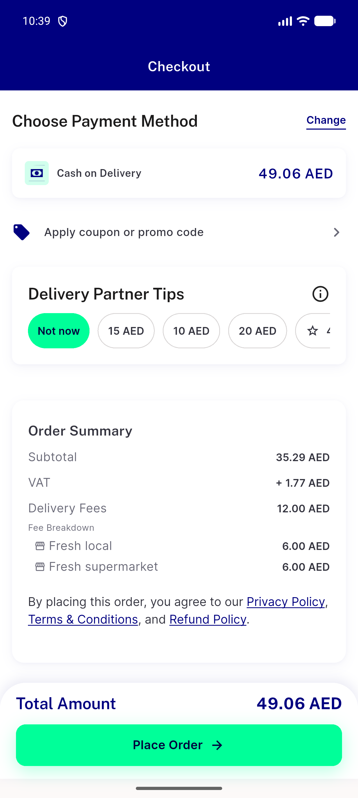</a> ac2 flagon fix w2 group fees 6.00x2</td>
<td align="center" width="33%"><a href="ac4-fix-group-fault-slot-change-no-toast.png">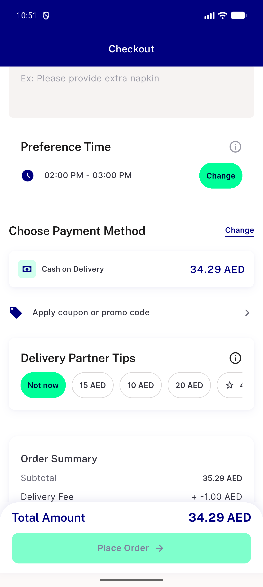</a> ac4 fix group fault slot change no toast</td>
</tr>
<tr>
<td align="center" width="33%"><a href="ac4-positive-control-base-group-toast-something-went-wrong.png">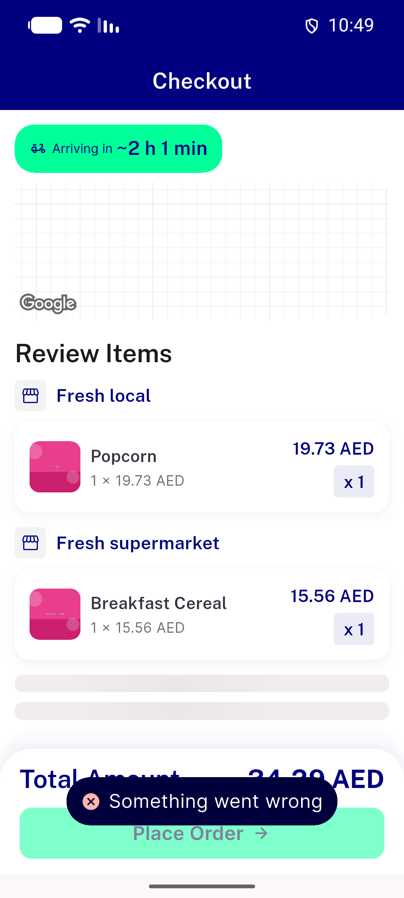</a> ac4 positive control base group toast something went wrong</td>
<td align="center" width="33%"><a href="ac5-fix-single-fault-entry-toast-once.png">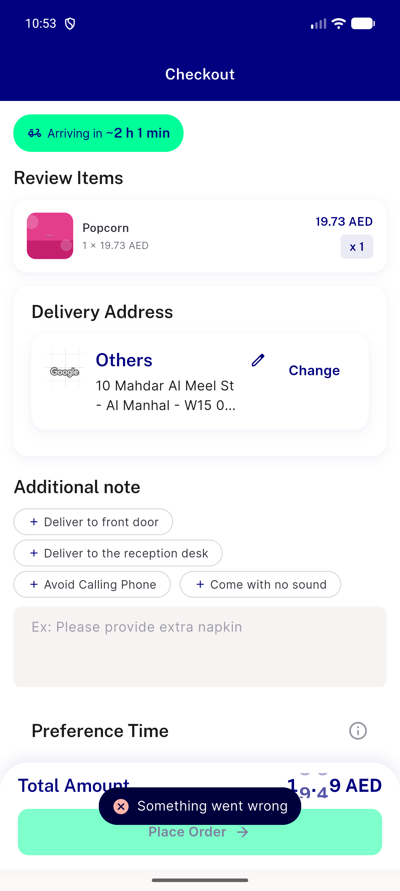</a> ac5 fix single fault entry toast once</td>
<td align="center" width="33%"><a href="ac5-fix-single-fault-new-key-toast.png">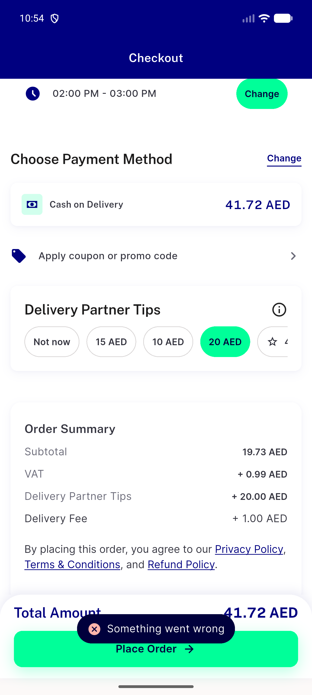</a> ac5 fix single fault new key toast</td>
</tr>
<tr>
<td align="center" width="33%"><a href="bug-c3-confirm-sheet.png">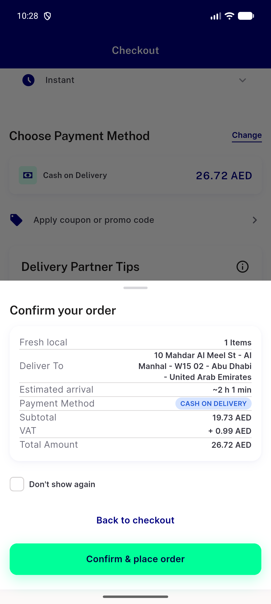</a> bug c3 confirm sheet</td>
<td align="center" width="33%"><a href="bug-c3-daytab-cancel-label-instant-fee-6.00.png">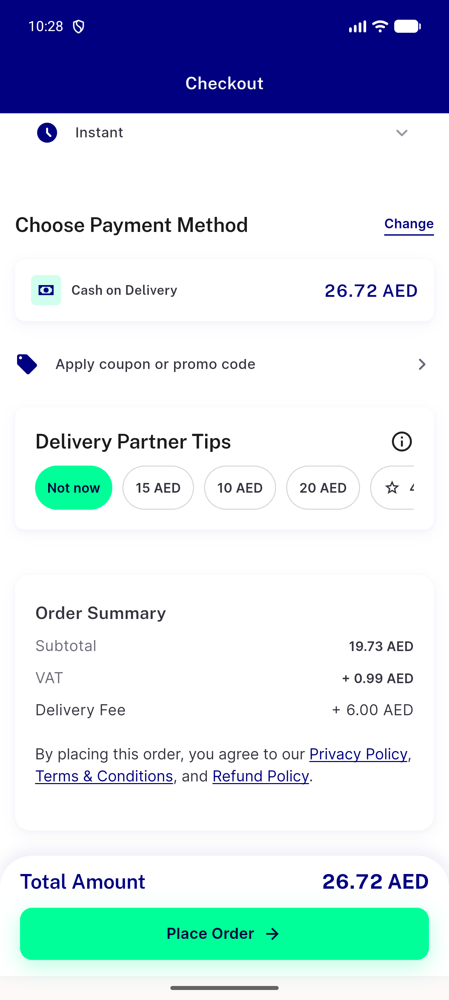</a> bug c3 daytab cancel label instant fee 6.00</td>
<td align="center" width="33%"><a href="bug-c7-shown-fee-1.00.png">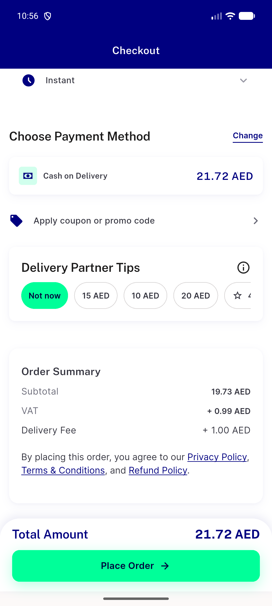</a> bug c7 shown fee 1.00</td>
</tr>
<tr>
<td align="center" width="33%"><a href="cycle1-p3-fault-entry-toast-once.png">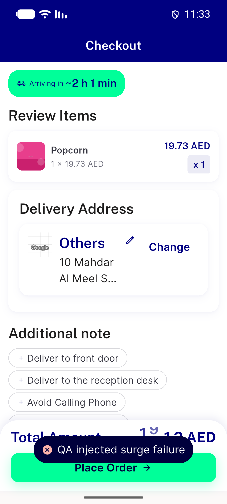</a> cycle1 p3 fault entry toast once</td>
<td align="center" width="33%"><a href="p4-cod-switch-success-91443.png">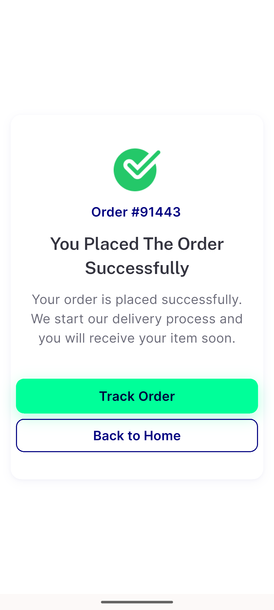</a> p4 cod switch success 91443</td>
<td align="center" width="33%"><a href="p4-next-entry-confirm-sheet.png">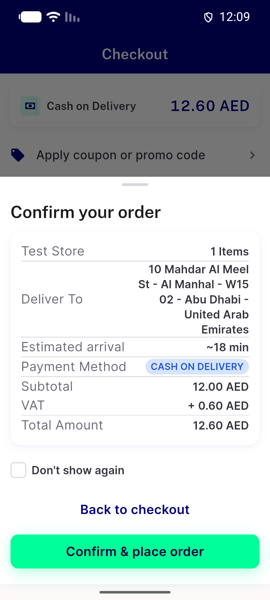</a> p4 next entry confirm sheet</td>
</tr>
<tr>
<td align="center" width="33%"> p4 webview after paypal place</td>
</tr>
</table>

### Other artifacts
- [`ac1-after-fix-w2-slot-a11y.xml`](ac1-after-fix-w2-slot-a11y.xml)
- [`ac1-before-base-w2-slot-a11y.xml`](ac1-before-base-w2-slot-a11y.xml)
- [`ac1-edge-repick-instant-fee-3.00-a11y.xml`](ac1-edge-repick-instant-fee-3.00-a11y.xml)
- [`ac1-fix-requote-inflight-place-disabled-a11y.xml`](ac1-fix-requote-inflight-place-disabled-a11y.xml)
- [`ac2-base-w2-group-a11y.xml`](ac2-base-w2-group-a11y.xml)
- [`ac2-flagoff-fix-w2-group-a11y.xml`](ac2-flagoff-fix-w2-group-a11y.xml)
- [`ac2-flagon-fix-w2-group-a11y.xml`](ac2-flagon-fix-w2-group-a11y.xml)
- [`ac3-buynow-base-entry-a11y.xml`](ac3-buynow-base-entry-a11y.xml)
- [`ac3-buynow-fix-entry-a11y.xml`](ac3-buynow-fix-entry-a11y.xml)
- [`ac3-mixed-base-entry-a11y.xml`](ac3-mixed-base-entry-a11y.xml)
- [`ac3-mixed-fix-entry-a11y.xml`](ac3-mixed-fix-entry-a11y.xml)
- [`ac4-fix-group-fault-after-slot-a11y.xml`](ac4-fix-group-fault-after-slot-a11y.xml)
- [`ac5-fix-single-fault-final-a11y.xml`](ac5-fix-single-fault-final-a11y.xml)
- [`bug-c3-daytab-cancel-a11y.xml`](bug-c3-daytab-cancel-a11y.xml)
- [`bug-c7-shown-fee-1.00-a11y.xml`](bug-c7-shown-fee-1.00-a11y.xml)
- [`bug-delivery-section-contact-row-overflow.log`](bug-delivery-section-contact-row-overflow.log)
- [`bug-nitemcard-row-overflow-15px.log`](bug-nitemcard-row-overflow-15px.log)
- [`bug-post-placement-surge-refetch.log`](bug-post-placement-surge-refetch.log)
- [`bug-search-results-rendertable-semantics-assert.log`](bug-search-results-rendertable-semantics-assert.log)
- [`bug-stale-slot-index-rangeerror.log`](bug-stale-slot-index-rangeerror.log)
- [`bug-stale-slot-index-state-a11y.xml`](bug-stale-slot-index-state-a11y.xml)
- [`c2-flagoff-basket-after-back-a11y.xml`](c2-flagoff-basket-after-back-a11y.xml)
- [`c2-flagoff-checkout-w2-a11y.xml`](c2-flagoff-checkout-w2-a11y.xml)
- [`cycle1-app-surge-fail-lines.log`](cycle1-app-surge-fail-lines.log)
- [`cycle1-post-placement-no-surge.log`](cycle1-post-placement-no-surge.log)
- [`cycle1-qaproxy-request-log.jsonl`](cycle1-qaproxy-request-log.jsonl)
- [`cycle1b-p4-app-lines.log`](cycle1b-p4-app-lines.log)
- [`cycle1b-p4-qaproxy-request-log.jsonl`](cycle1b-p4-qaproxy-request-log.jsonl)
- [`p4-next-entry-confirm-sheet-nodes.txt`](p4-next-entry-confirm-sheet-nodes.txt)
- [`progress.md`](progress.md)
- [`qaproxy-request-log.jsonl`](qaproxy-request-log.jsonl)
- [`qaproxy.py`](qaproxy.py)

---
*From `nears/docs/qa-evidence/NEARS-3922/` · public-repo scrub policy (no live secrets; verified clean).*
