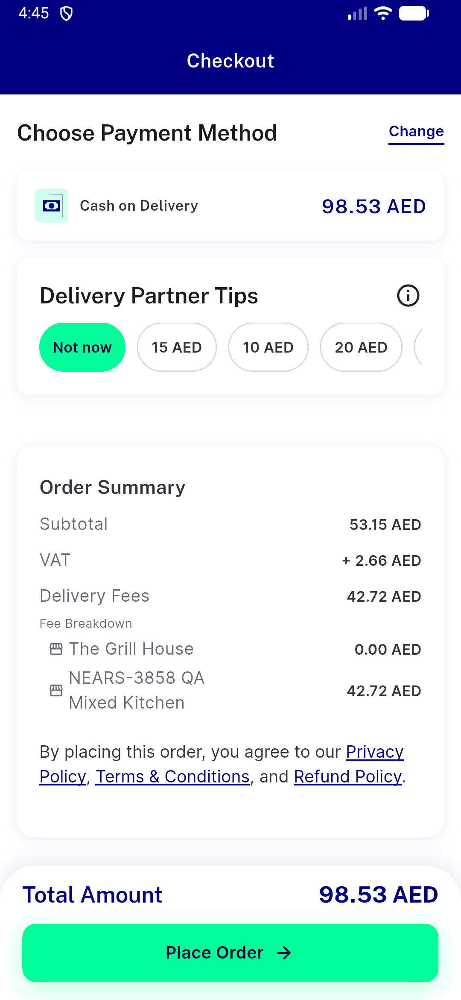
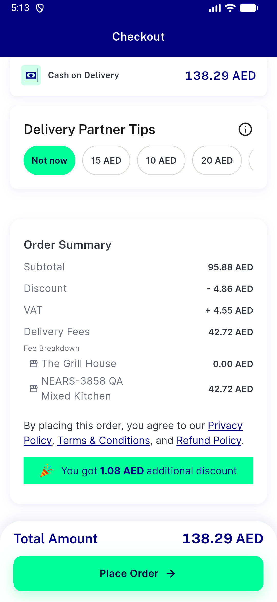
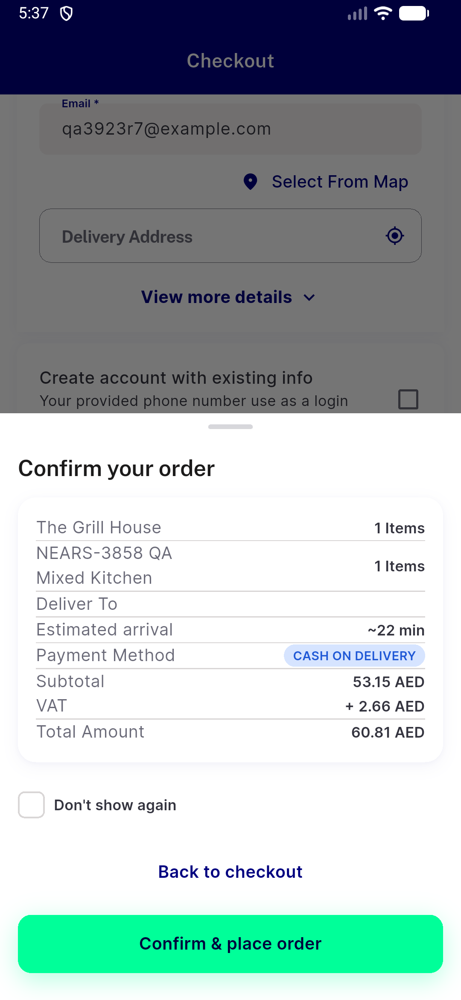
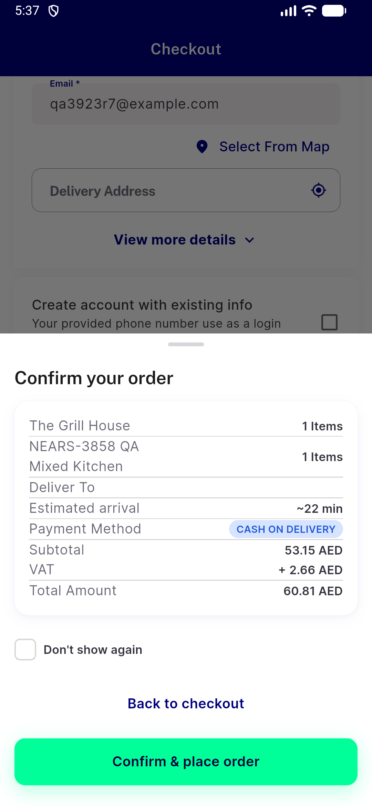
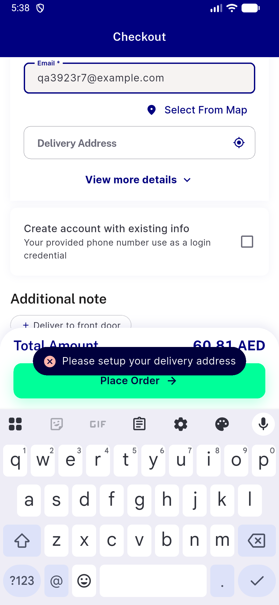

# QA Evidence — NEARS-3923

**NEARS-3923 fix1 R7 — guest cannot place with emptied address (refused at confirm)**

**5 screenshot(s).** Click any thumbnail for full resolution.

<table>
<tr>
<td align="center" width="33%"> ac1 flagON after mapedit addrB summary</td>
<td align="center" width="33%"> ac5 flagOFF after mapedit addrB summary</td>
<td align="center" width="33%"> r7 confirm sheet empty address</td>
</tr>
<tr>
<td align="center" width="33%"> r7 place refused snackbar</td>
<td align="center" width="33%"> r7 snackbar behind sheet</td>
</tr>
</table>

### Other artifacts
- [`ac1-ac2-flagON-mapedit-place.log`](ac1-ac2-flagON-mapedit-place.log)
- [`ac1-flagON-after-mapedit-addrB-summary.a11y.txt`](ac1-flagON-after-mapedit-addrB-summary.a11y.txt)
- [`ac1-flagON-before-addrA-summary.a11y.txt`](ac1-flagON-before-addrA-summary.a11y.txt)
- [`ac4-loggedin-address-sheet-regression.log`](ac4-loggedin-address-sheet-regression.log)
- [`ac5-ac2-flagOFF-mapedit-place.log`](ac5-ac2-flagOFF-mapedit-place.log)
- [`ac5-flagOFF-after-mapedit-addrB-summary.a11y.txt`](ac5-flagOFF-after-mapedit-addrB-summary.a11y.txt)
- [`ac7-flutter-test.log`](ac7-flutter-test.log)
- [`bug-flash-discount-split-rounding.log`](bug-flash-discount-split-rounding.log)
- [`bug-map-preview-dropped-store-coords.log`](bug-map-preview-dropped-store-coords.log)
- [`bug-search-rendertable-semantics-assert.log`](bug-search-rendertable-semantics-assert.log)
- [`k1-ac3-base-vs-head.log`](k1-ac3-base-vs-head.log)
- [`k2-ac3-k3-flagON-head.log`](k2-ac3-k3-flagON-head.log)
- [`k3-ooz-pickmap-no-confirm.a11y.txt`](k3-ooz-pickmap-no-confirm.a11y.txt)
- [`progress.md`](progress.md)
- [`r7-confirm-sheet.a11y.txt`](r7-confirm-sheet.a11y.txt)
- [`r7-field-states.txt`](r7-field-states.txt)
- [`reg-guest-single-store-mapedit.log`](reg-guest-single-store-mapedit.log)

---
*From `nears/docs/qa-evidence/NEARS-3923/` · public-repo scrub policy (no live secrets; verified clean).*
