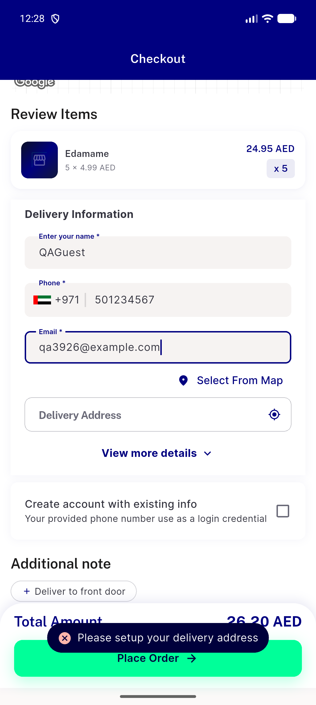
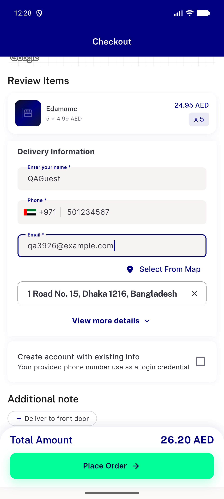
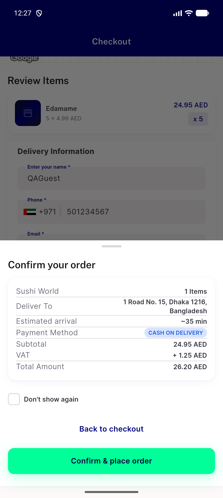
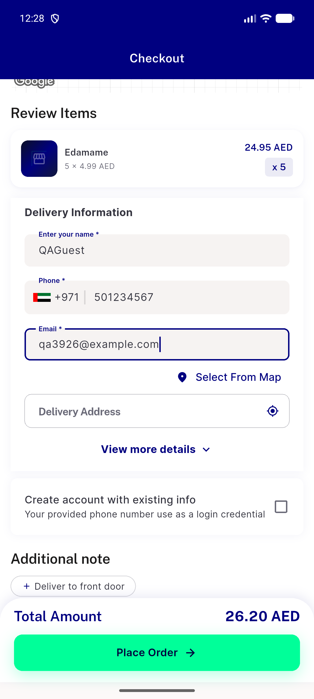
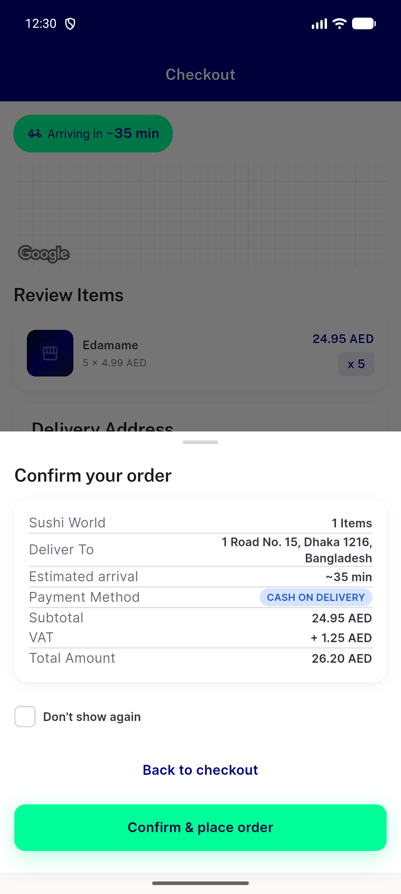
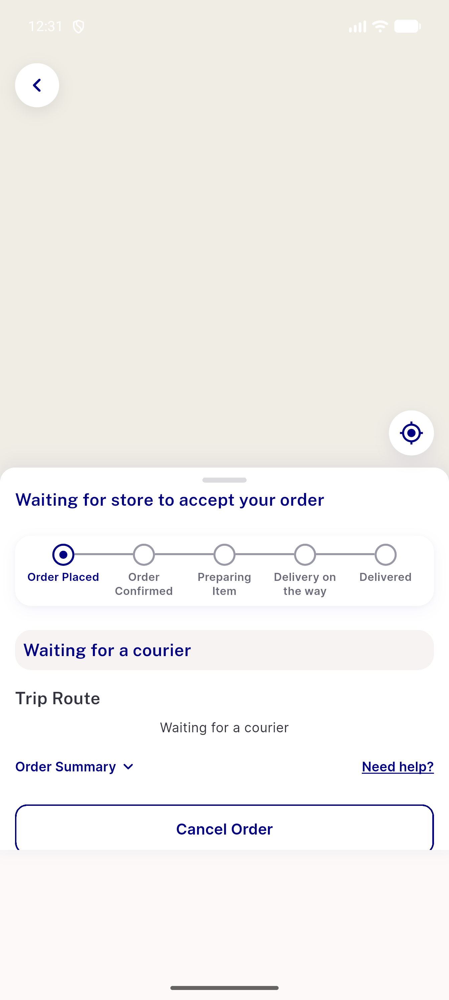
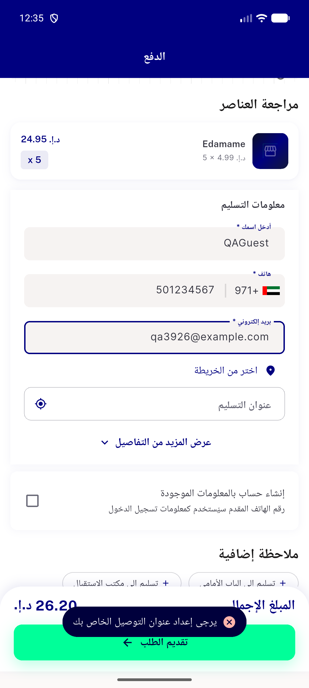

# QA Evidence — NEARS-3926

**QA PASS: guest empty-address pre-sheet gate live (toast on checkout, no sheet, 1 FAIL line/tap, no order/place); logged-in placement OK on private DB**

**9 screenshot(s).** Click any thumbnail for full resolution.

<table>
<tr>
<td align="center" width="33%"> ac1 after tap plus1s</td>
<td align="center" width="33%"> ac1 after tap toast no sheet</td>
<td align="center" width="33%"> ac1 before clear address filled</td>
</tr>
<tr>
<td align="center" width="33%"> ac1 control sheet opens address set</td>
<td align="center" width="33%"> ac1 empty address before tap</td>
<td align="center" width="33%"> ac2 loggedin confirm sheet</td>
</tr>
<tr>
<td align="center" width="33%"> ac2 loggedin order success</td>
<td align="center" width="33%"> ext ar rtl toast no sheet</td>
<td align="center" width="33%"> ext skipsheet on guest empty controller toast</td>
</tr>
</table>

### Other artifacts
- [`ac-logcat-excerpt.log`](ac-logcat-excerpt.log)

---
*From `nears/docs/qa-evidence/NEARS-3926/` · public-repo scrub policy (no live secrets; verified clean).*
