# QA Evidence — NEARS-3927

**QA [8] cycle 0: FAIL - AC3 strike not drawn at 1.3x in rail ('+' state, EN+AR); AC1/AC2/AC4/AC5 PASS, zero overflow**

**23 screenshot(s).** Click any thumbnail for full resolution.

<table>
<tr>
<td align="center" width="33%"><a href="bug-rail-13x-discount-strike-dropped.png">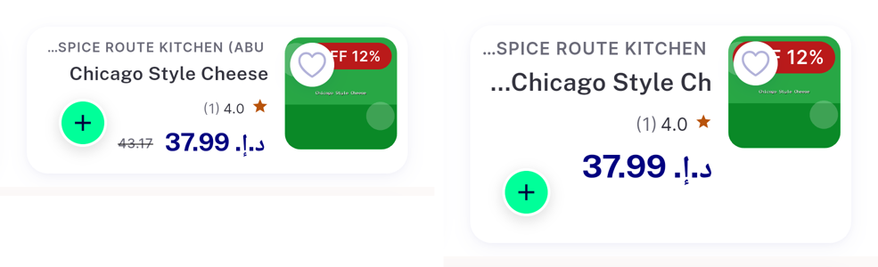</a> bug rail 13x discount strike dropped</td>
<td align="center" width="33%"> iv fav ar13 brandrating</td>
<td align="center" width="33%"> iv fav ar13 brandunit</td>
</tr>
<tr>
<td align="center" width="33%"> iv fav en10</td>
<td align="center" width="33%"> iv fav en13 brandrating</td>
<td align="center" width="33%"> iv fav en13 brandunit</td>
</tr>
<tr>
<td align="center" width="33%"><a href="iv-store-ar13.png">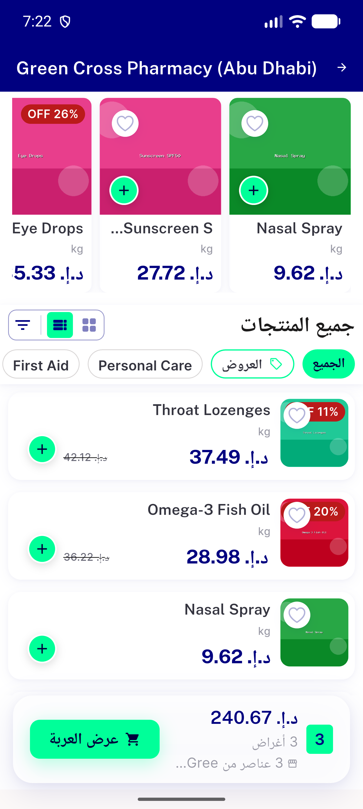</a> iv store ar13</td>
<td align="center" width="33%"><a href="iv-store-en10.png">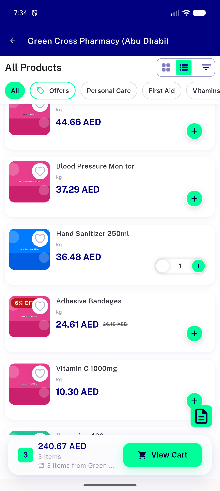</a> iv store en10</td>
<td align="center" width="33%"><a href="iv-store-en13.png">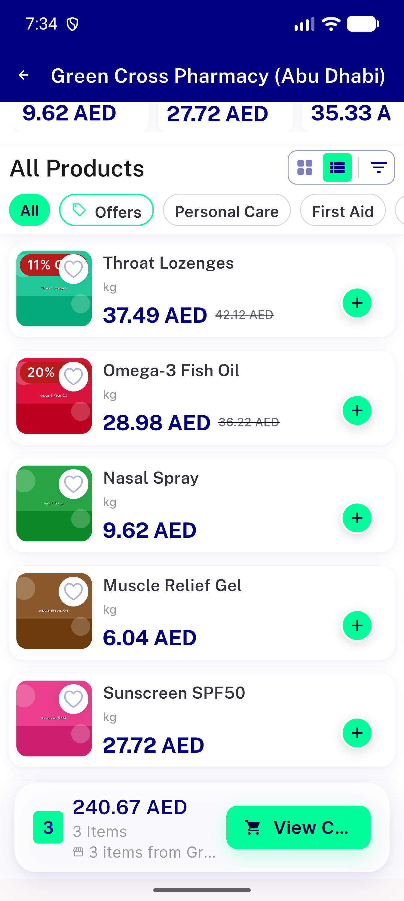</a> iv store en13</td>
</tr>
<tr>
<td align="center" width="33%"><a href="montage-ac4-iv13.png">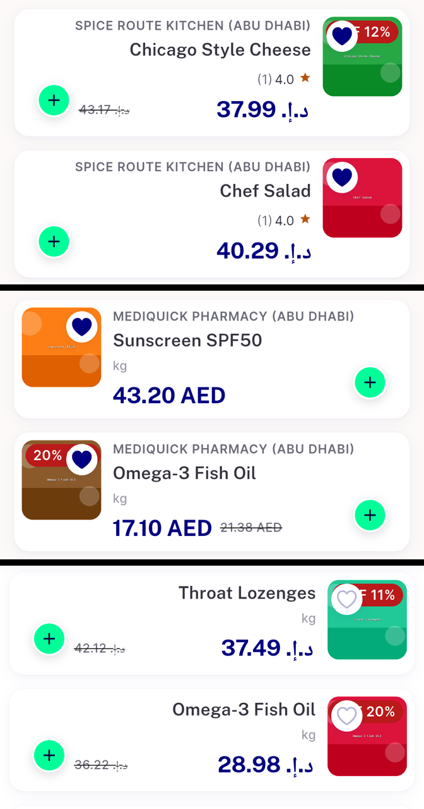</a> montage ac4 iv13</td>
<td align="center" width="33%"> rail ar10 brandrating disc</td>
<td align="center" width="33%"><a href="rail-ar13-brandrating-disc-crop.png">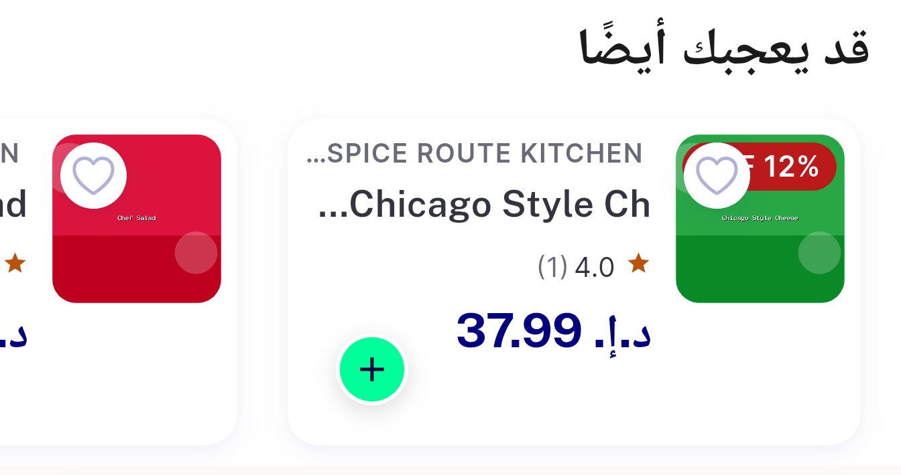</a> rail ar13 brandrating disc crop</td>
</tr>
<tr>
<td align="center" width="33%"> rail ar13 brandrating disc</td>
<td align="center" width="33%"><a href="rail-ar13-brandunit-crop.png">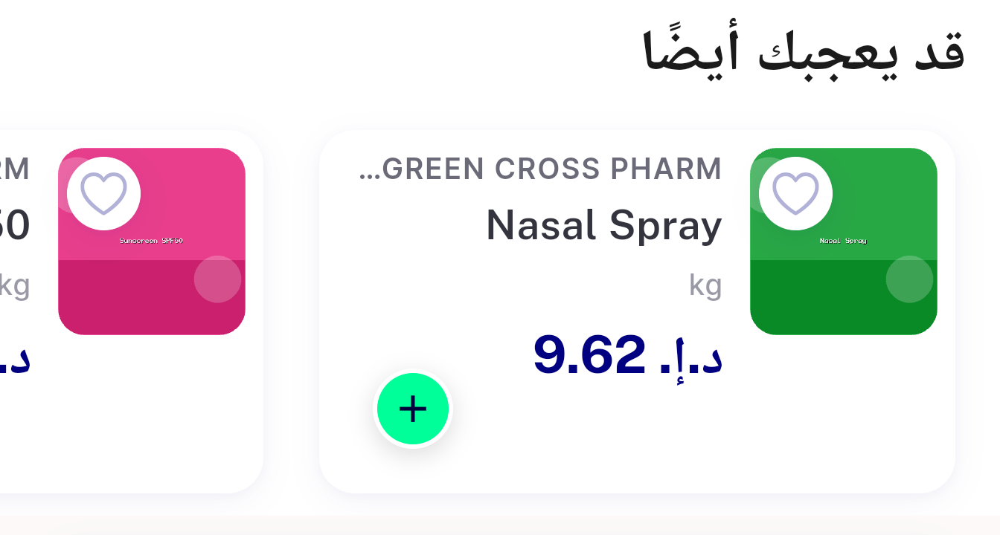</a> rail ar13 brandunit crop</td>
<td align="center" width="33%"> rail ar13 brandunit</td>
</tr>
<tr>
<td align="center" width="33%"><a href="rail-en10-brandrating.png">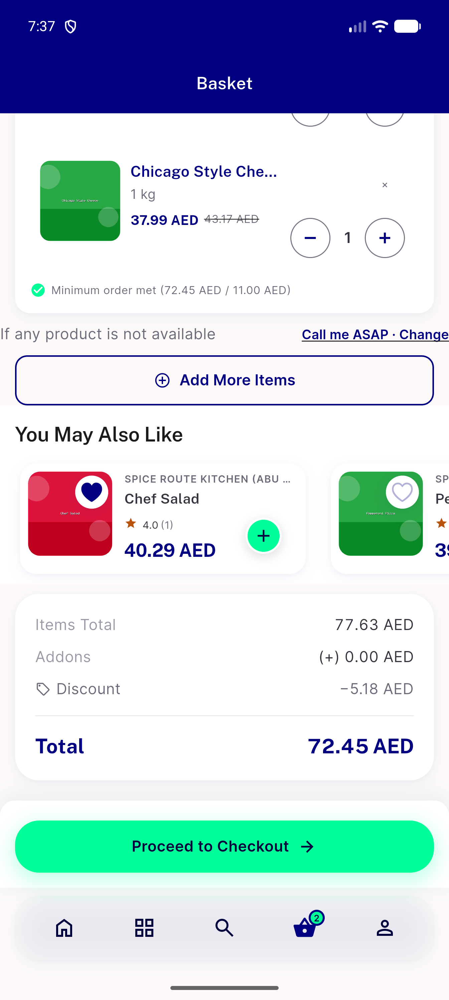</a> rail en10 brandrating</td>
<td align="center" width="33%"><a href="rail-en10-brandunit.png">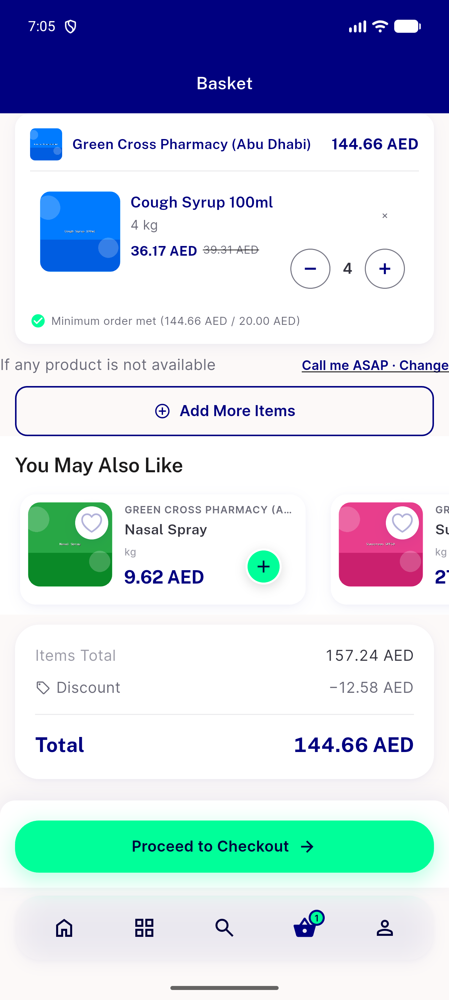</a> rail en10 brandunit</td>
<td align="center" width="33%"><a href="rail-en13-brandrating-disc.png">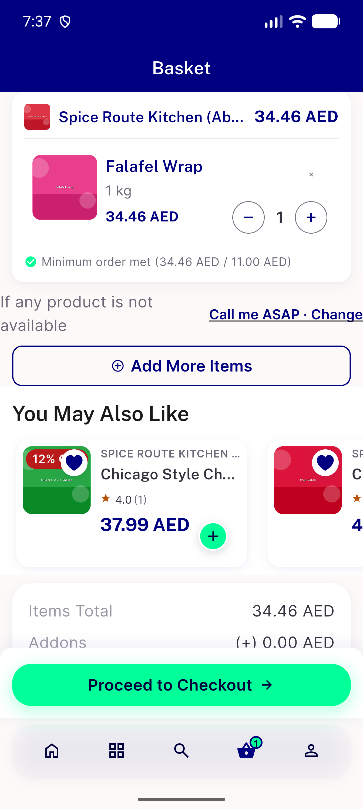</a> rail en13 brandrating disc</td>
</tr>
<tr>
<td align="center" width="33%"><a href="rail-en13-brandunit-crop.png">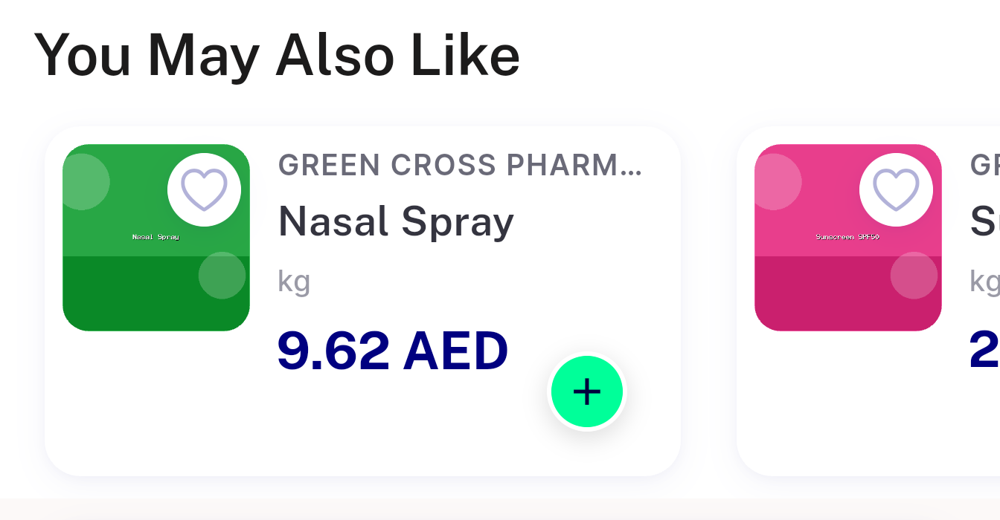</a> rail en13 brandunit crop</td>
<td align="center" width="33%"><a href="rail-en13-brandunit.png">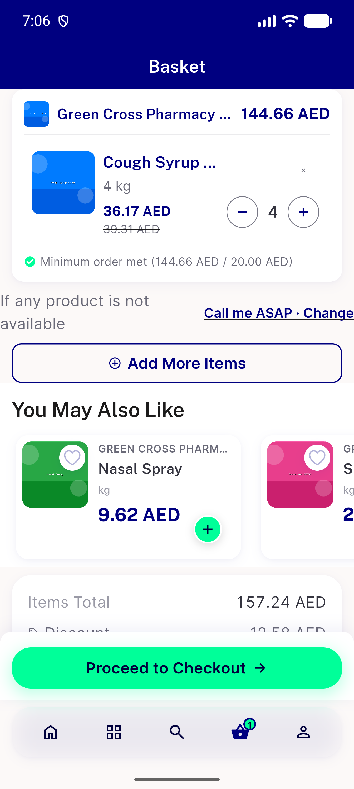</a> rail en13 brandunit</td>
<td align="center" width="33%"><a href="rail-en13-disc-stepper-transient.png">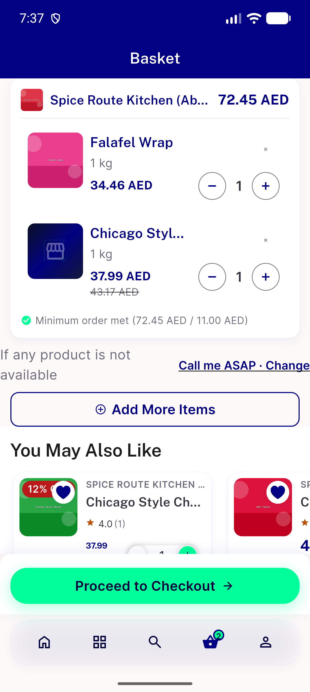</a> rail en13 disc stepper transient</td>
</tr>
<tr>
<td align="center" width="33%"><a href="rail-en13-end.png">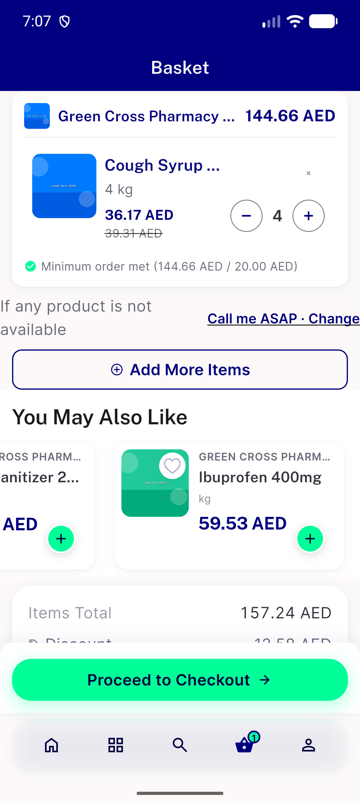</a> rail en13 end</td>
<td align="center" width="33%"><a href="rail-en13-stepper-transient.png">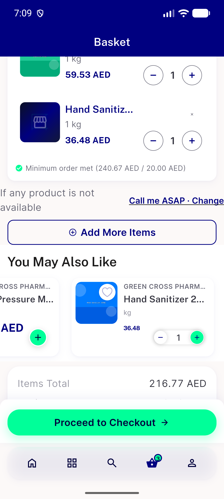</a> rail en13 stepper transient</td>
</tr>
</table>

### Other artifacts
- [`anr-environment.log`](anr-environment.log)
- [`bug-rail-13x-discount-strike-dropped.log`](bug-rail-13x-discount-strike-dropped.log)
- [`progress.md`](progress.md)

---
*From `nears/docs/qa-evidence/NEARS-3927/` · public-repo scrub policy (no live secrets; verified clean).*
