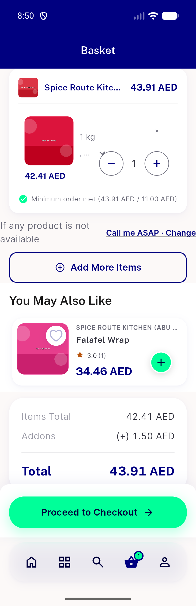
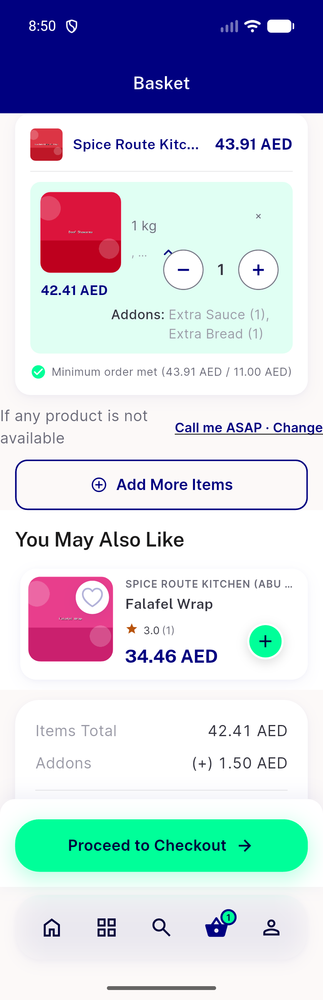
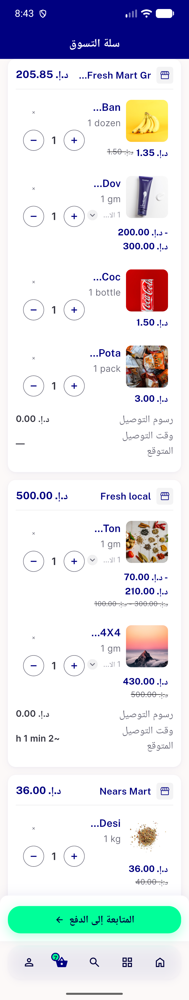
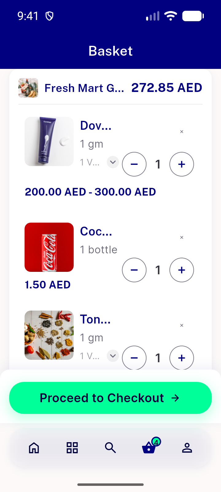
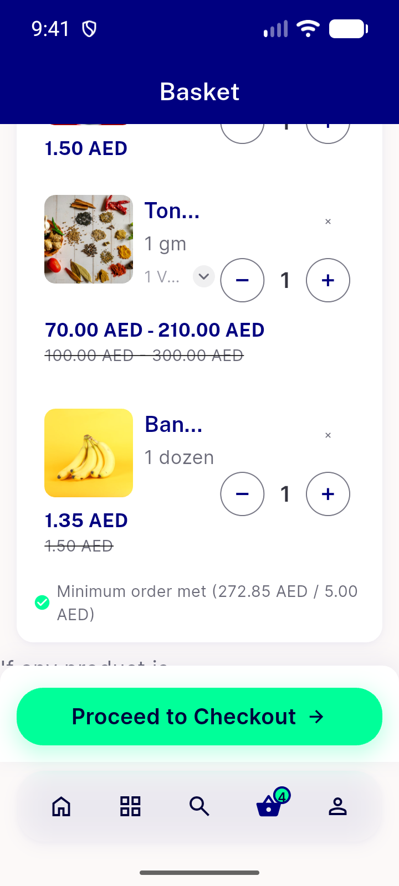
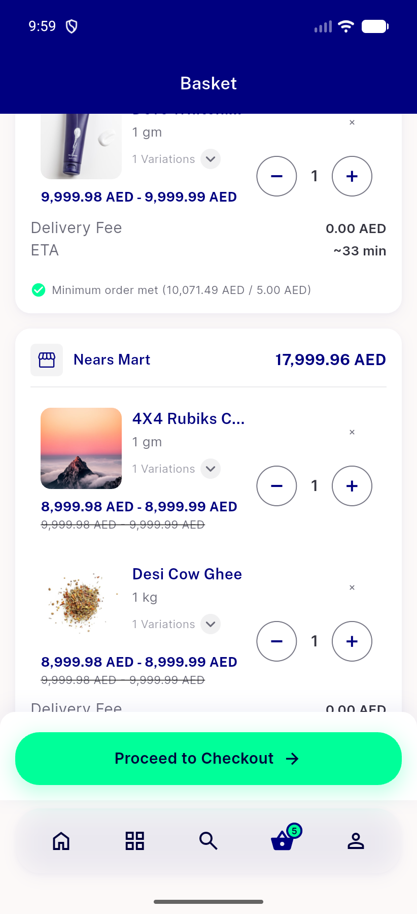
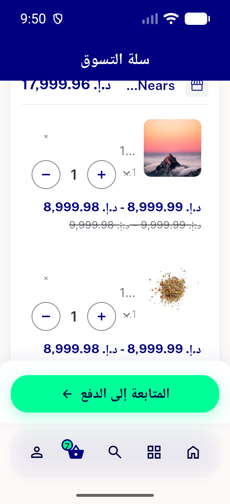
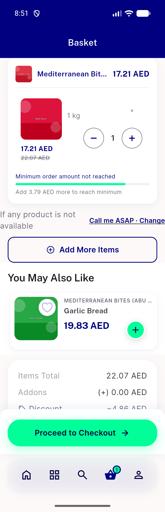
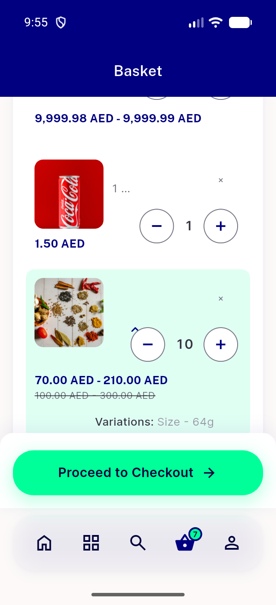

# QA Evidence — NEARS-3928

**cycle-1 delta re-QA PASS @a27e1cf23: range prices one line, all 8 configs**

**54 screenshot(s).** Click any thumbnail for full resolution.

<table>
<tr>
<td align="center" width="33%"> ac 320dp 1.0x AR qty11 after plusminus dove</td>
<td align="center" width="33%"> ac 320dp 1.0x AR qty12 dove</td>
<td align="center" width="33%"> ac 320dp 1.0x AR toggle open dove</td>
</tr>
<tr>
<td align="center" width="33%"> ac 320dp 1.0x EN addons closed</td>
<td align="center" width="33%"> ac 320dp 1.0x EN addons open</td>
<td align="center" width="33%"> cfg 320dp 1.0x AR full</td>
</tr>
<tr>
<td align="center" width="33%"> cfg 320dp 1.0x AR qty100</td>
<td align="center" width="33%"> cfg 320dp 1.0x EN full</td>
<td align="center" width="33%"> cfg 320dp 1.0x EN qty100</td>
</tr>
<tr>
<td align="center" width="33%"> cfg 320dp 1.3x AR full</td>
<td align="center" width="33%"> cfg 320dp 1.3x EN full</td>
<td align="center" width="33%"> cfg 320dp 1.3x EN qty100</td>
</tr>
<tr>
<td align="center" width="33%"> cfg 360dp 1.0x AR full</td>
<td align="center" width="33%"> cfg 360dp 1.0x EN full</td>
<td align="center" width="33%"> cfg 360dp 1.3x AR full</td>
</tr>
<tr>
<td align="center" width="33%"> cfg 360dp 1.3x EN full</td>
<td align="center" width="33%"> cfg 448dp 1.0x EN full</td>
<td align="center" width="33%"> cfg2 320dp 1.0x AR a</td>
</tr>
<tr>
<td align="center" width="33%"> cfg2 320dp 1.0x AR b</td>
<td align="center" width="33%"> cfg2 320dp 1.0x EN a</td>
<td align="center" width="33%"> cfg2 320dp 1.0x EN b</td>
</tr>
<tr>
<td align="center" width="33%"> cfg2 320dp 1.0x EN ranges</td>
<td align="center" width="33%"> cfg2 320dp 1.3x AR a</td>
<td align="center" width="33%"> cfg2 320dp 1.3x AR b</td>
</tr>
<tr>
<td align="center" width="33%"> cfg2 320dp 1.3x EN a</td>
<td align="center" width="33%"> cfg2 320dp 1.3x EN b</td>
<td align="center" width="33%"> cfg2 360dp 1.0x AR a</td>
</tr>
<tr>
<td align="center" width="33%"> cfg2 360dp 1.0x AR b</td>
<td align="center" width="33%"> cfg2 360dp 1.0x EN a</td>
<td align="center" width="33%"> cfg2 360dp 1.0x EN b</td>
</tr>
<tr>
<td align="center" width="33%"> cfg2 360dp 1.3x AR a</td>
<td align="center" width="33%"> cfg2 360dp 1.3x AR b</td>
<td align="center" width="33%"> cfg2 360dp 1.3x EN a</td>
</tr>
<tr>
<td align="center" width="33%"> cfg2 360dp 1.3x EN b</td>
<td align="center" width="33%"> cfg2 411dp 1.0x EN a</td>
<td align="center" width="33%"> cfg2 411dp 1.0x EN b</td>
</tr>
<tr>
<td align="center" width="33%"> cfg2 448dp 1.0x EN ranges</td>
<td align="center" width="33%"> long 320dp 1.3x AR a</td>
<td align="center" width="33%"> long 320dp 1.3x AR c</td>
</tr>
<tr>
<td align="center" width="33%"> long 320dp 1.3x AR e</td>
<td align="center" width="33%"> long 320dp 1.3x EN a</td>
<td align="center" width="33%"> long 320dp 1.3x EN c</td>
</tr>
<tr>
<td align="center" width="33%"> long 320dp 1.3x EN e</td>
<td align="center" width="33%"> mixed 320dp 1.0x AR single range single</td>
<td align="center" width="33%"> mixed 320dp 1.0x EN single range single</td>
</tr>
<tr>
<td align="center" width="33%"> reg 320dp 1.0x EN added from empty smash burger</td>
<td align="center" width="33%"> reg 320dp 1.0x EN empty cart after decrease at qty1</td>
<td align="center" width="33%"> reg 320dp 1.0x EN row tap item sheet</td>
</tr>
<tr>
<td align="center" width="33%"> reg 320dp 1.0x EN swipe open chips</td>
<td align="center" width="33%"> reg2 320dp 1.0x EN swipe banana</td>
<td align="center" width="33%"> stab 320dp 1.0x EN qty1 restored tones</td>
</tr>
<tr>
<td align="center" width="33%"> stab 320dp 1.0x EN qty1 tones</td>
<td align="center" width="33%"> stab 320dp 1.0x EN qty12 tones</td>
<td align="center" width="33%"> stab 320dp 1.0x EN toggle open tones</td>
</tr>
</table>

### Other artifacts
- [`ac-320dp-1.0x-AR-qty12-dove.xml`](ac-320dp-1.0x-AR-qty12-dove.xml)
- [`ac-320dp-1.0x-EN-addons-closed.xml`](ac-320dp-1.0x-EN-addons-closed.xml)
- [`bug-checkout-shimmer-overflow-320dp.log`](bug-checkout-shimmer-overflow-320dp.log)
- [`bug-nitemcard-you-may-also-like-overflow-320dp-1.3x.log`](bug-nitemcard-you-may-also-like-overflow-320dp-1.3x.log)
- [`cfg-320dp-1.0x-AR-full.xml`](cfg-320dp-1.0x-AR-full.xml)
- [`cfg-320dp-1.0x-AR-qty100.xml`](cfg-320dp-1.0x-AR-qty100.xml)
- [`cfg-320dp-1.0x-EN-full.xml`](cfg-320dp-1.0x-EN-full.xml)
- [`cfg-320dp-1.3x-AR-full.xml`](cfg-320dp-1.3x-AR-full.xml)
- [`cfg-320dp-1.3x-EN-full.xml`](cfg-320dp-1.3x-EN-full.xml)
- [`cfg-360dp-1.0x-AR-full.xml`](cfg-360dp-1.0x-AR-full.xml)
- [`cfg-360dp-1.0x-EN-full.xml`](cfg-360dp-1.0x-EN-full.xml)
- [`cfg-360dp-1.3x-AR-full.xml`](cfg-360dp-1.3x-AR-full.xml)
- [`cfg-360dp-1.3x-EN-full.xml`](cfg-360dp-1.3x-EN-full.xml)
- [`cfg-448dp-1.0x-EN-full.xml`](cfg-448dp-1.0x-EN-full.xml)
- [`cfg2-320dp-1.0x-AR-a.xml`](cfg2-320dp-1.0x-AR-a.xml)
- [`cfg2-320dp-1.0x-AR-b.xml`](cfg2-320dp-1.0x-AR-b.xml)
- [`cfg2-320dp-1.0x-EN-a.xml`](cfg2-320dp-1.0x-EN-a.xml)
- [`cfg2-320dp-1.0x-EN-b.xml`](cfg2-320dp-1.0x-EN-b.xml)
- [`cfg2-320dp-1.0x-EN-ranges.xml`](cfg2-320dp-1.0x-EN-ranges.xml)
- [`cfg2-320dp-1.3x-AR-a.xml`](cfg2-320dp-1.3x-AR-a.xml)
- [`cfg2-320dp-1.3x-AR-b.xml`](cfg2-320dp-1.3x-AR-b.xml)
- [`cfg2-320dp-1.3x-EN-a.xml`](cfg2-320dp-1.3x-EN-a.xml)
- [`cfg2-320dp-1.3x-EN-b.xml`](cfg2-320dp-1.3x-EN-b.xml)
- [`cfg2-360dp-1.0x-AR-a.xml`](cfg2-360dp-1.0x-AR-a.xml)
- [`cfg2-360dp-1.0x-AR-b.xml`](cfg2-360dp-1.0x-AR-b.xml)
- [`cfg2-360dp-1.0x-EN-a.xml`](cfg2-360dp-1.0x-EN-a.xml)
- [`cfg2-360dp-1.0x-EN-b.xml`](cfg2-360dp-1.0x-EN-b.xml)
- [`cfg2-360dp-1.3x-AR-a.xml`](cfg2-360dp-1.3x-AR-a.xml)
- [`cfg2-360dp-1.3x-AR-b.xml`](cfg2-360dp-1.3x-AR-b.xml)
- [`cfg2-360dp-1.3x-EN-a.xml`](cfg2-360dp-1.3x-EN-a.xml)
- [`cfg2-360dp-1.3x-EN-b.xml`](cfg2-360dp-1.3x-EN-b.xml)
- [`cfg2-411dp-1.0x-EN-a.xml`](cfg2-411dp-1.0x-EN-a.xml)
- [`cfg2-411dp-1.0x-EN-b.xml`](cfg2-411dp-1.0x-EN-b.xml)
- [`cfg2-448dp-1.0x-EN-ranges.xml`](cfg2-448dp-1.0x-EN-ranges.xml)
- [`long-320dp-1.3x-AR-a.xml`](long-320dp-1.3x-AR-a.xml)
- [`long-320dp-1.3x-AR-c.xml`](long-320dp-1.3x-AR-c.xml)
- [`long-320dp-1.3x-AR-e.xml`](long-320dp-1.3x-AR-e.xml)
- [`long-320dp-1.3x-EN-a.xml`](long-320dp-1.3x-EN-a.xml)
- [`long-320dp-1.3x-EN-c.xml`](long-320dp-1.3x-EN-c.xml)
- [`long-320dp-1.3x-EN-e.xml`](long-320dp-1.3x-EN-e.xml)
- [`mixed-320dp-1.0x-AR-single-range-single.xml`](mixed-320dp-1.0x-AR-single-range-single.xml)
- [`mixed-320dp-1.0x-EN-single-range-single.xml`](mixed-320dp-1.0x-EN-single-range-single.xml)
- [`progress.md`](progress.md)
- [`stab-320dp-1.0x-EN-qty1-restored-tones.xml`](stab-320dp-1.0x-EN-qty1-restored-tones.xml)
- [`stab-320dp-1.0x-EN-qty1-tones.xml`](stab-320dp-1.0x-EN-qty1-tones.xml)
- [`stab-320dp-1.0x-EN-qty12-tones.xml`](stab-320dp-1.0x-EN-qty12-tones.xml)
- [`stab-320dp-1.0x-EN-toggle-open-tones.xml`](stab-320dp-1.0x-EN-toggle-open-tones.xml)

---
*From `nears/docs/qa-evidence/NEARS-3928/` · public-repo scrub policy (no live secrets; verified clean).*
