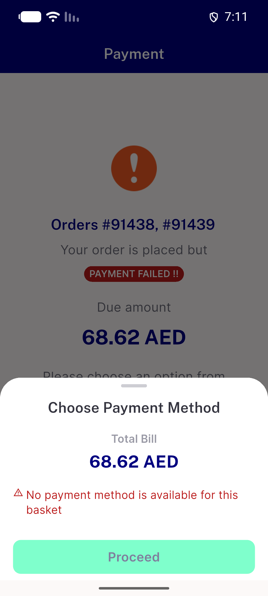
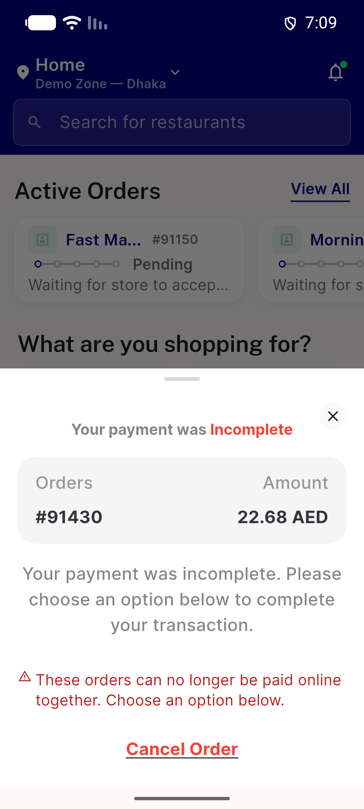
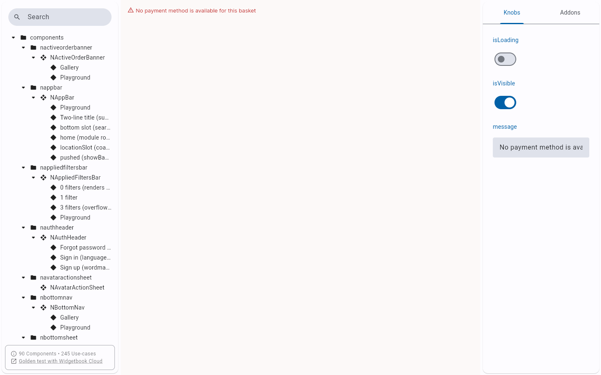

# QA Evidence — NEARS-3930

**NEARS-3930 QA PASS - NInlineStatusRow, outlined glyph at 6 places, EN/AR 1.0x/1.3x**

**8 screenshot(s).** Click any thumbnail for full resolution.

<table>
<tr>
<td align="center" width="33%"> ac1a ac1f nomethod ar 1.3x</td>
<td align="center" width="33%"> ac1a ac1f nomethod en 1.0x</td>
<td align="center" width="33%"> ac1b ac1f codcap en 1.0x</td>
</tr>
<tr>
<td align="center" width="33%"> ac1c group sheet nomethod en 1.3x</td>
<td align="center" width="33%"> ac1d failed screen notice en 1.0x</td>
<td align="center" width="33%"> ac1e resume sheet notice en 1.3x</td>
</tr>
<tr>
<td align="center" width="33%"> widgetbook fill</td>
<td align="center" width="33%"> widgetbook hug</td>
</tr>
</table>

### Other artifacts
- [`ac1a-ac1f-nomethod-ar-1.0x.xml`](ac1a-ac1f-nomethod-ar-1.0x.xml)
- [`ac1a-ac1f-nomethod-ar-1.3x.xml`](ac1a-ac1f-nomethod-ar-1.3x.xml)
- [`ac1a-ac1f-nomethod-en-1.0x.xml`](ac1a-ac1f-nomethod-en-1.0x.xml)
- [`ac1a-ac1f-nomethod-en-1.3x.xml`](ac1a-ac1f-nomethod-en-1.3x.xml)
- [`ac1b-ac1f-codcap-ar-1.0x.xml`](ac1b-ac1f-codcap-ar-1.0x.xml)
- [`ac1b-ac1f-codcap-ar-1.3x.xml`](ac1b-ac1f-codcap-ar-1.3x.xml)
- [`ac1b-ac1f-codcap-en-1.0x.xml`](ac1b-ac1f-codcap-en-1.0x.xml)
- [`ac1b-ac1f-codcap-en-1.3x.xml`](ac1b-ac1f-codcap-en-1.3x.xml)
- [`ac1c-group-sheet-nomethod-ar-1.0x.xml`](ac1c-group-sheet-nomethod-ar-1.0x.xml)
- [`ac1c-group-sheet-nomethod-ar-1.3x.xml`](ac1c-group-sheet-nomethod-ar-1.3x.xml)
- [`ac1c-group-sheet-nomethod-en-1.0x.xml`](ac1c-group-sheet-nomethod-en-1.0x.xml)
- [`ac1c-group-sheet-nomethod-en-1.3x.xml`](ac1c-group-sheet-nomethod-en-1.3x.xml)
- [`ac1d-failed-screen-notice-ar-1.0x.xml`](ac1d-failed-screen-notice-ar-1.0x.xml)
- [`ac1d-failed-screen-notice-ar-1.3x.xml`](ac1d-failed-screen-notice-ar-1.3x.xml)
- [`ac1d-failed-screen-notice-en-1.0x.xml`](ac1d-failed-screen-notice-en-1.0x.xml)
- [`ac1d-failed-screen-notice-en-1.3x.xml`](ac1d-failed-screen-notice-en-1.3x.xml)
- [`ac1e-resume-sheet-notice-ar-1.0x.xml`](ac1e-resume-sheet-notice-ar-1.0x.xml)
- [`ac1e-resume-sheet-notice-ar-1.3x.xml`](ac1e-resume-sheet-notice-ar-1.3x.xml)
- [`ac1e-resume-sheet-notice-en-1.0x.xml`](ac1e-resume-sheet-notice-en-1.0x.xml)
- [`ac1e-resume-sheet-notice-en-1.3x.xml`](ac1e-resume-sheet-notice-en-1.3x.xml)
- [`glyph-measurements.log`](glyph-measurements.log)
- [`progress.md`](progress.md)

---
*From `nears/docs/qa-evidence/NEARS-3930/` · public-repo scrub policy (no live secrets; verified clean).*
