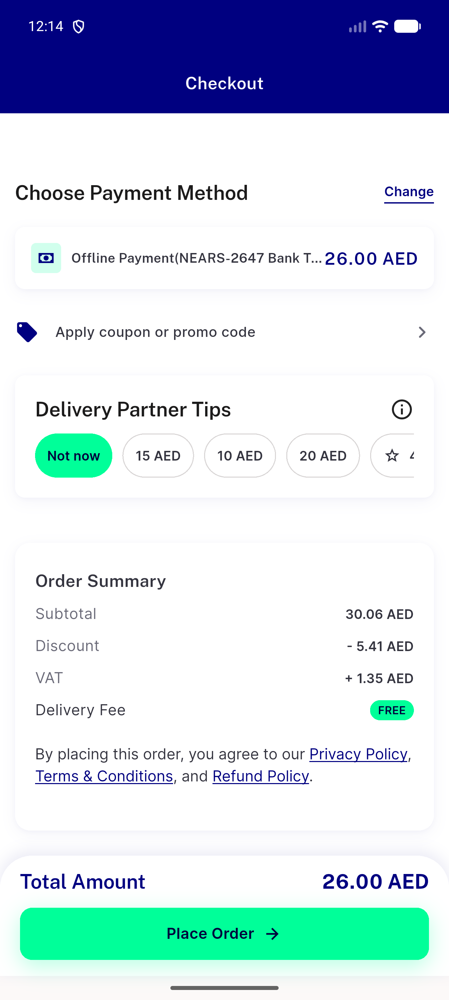
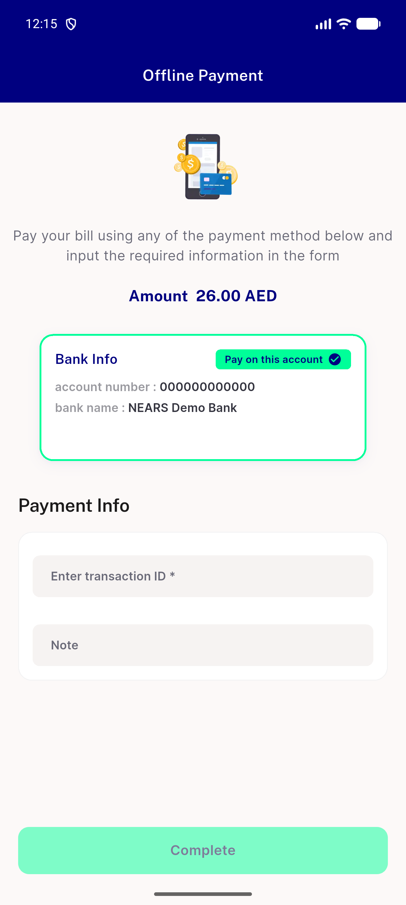
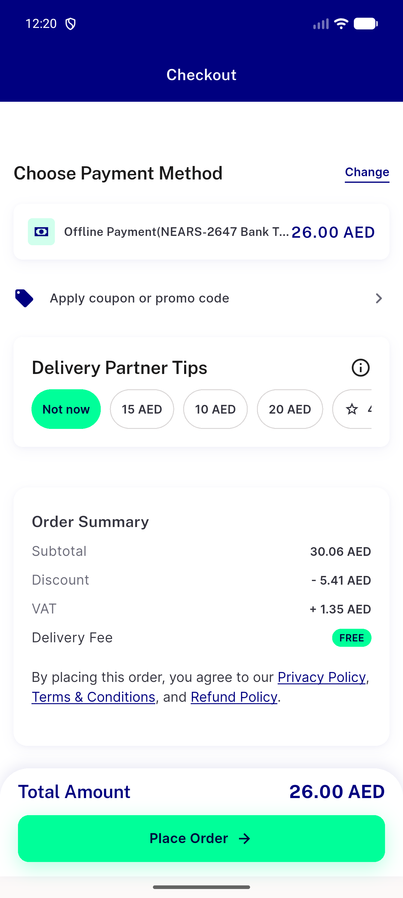
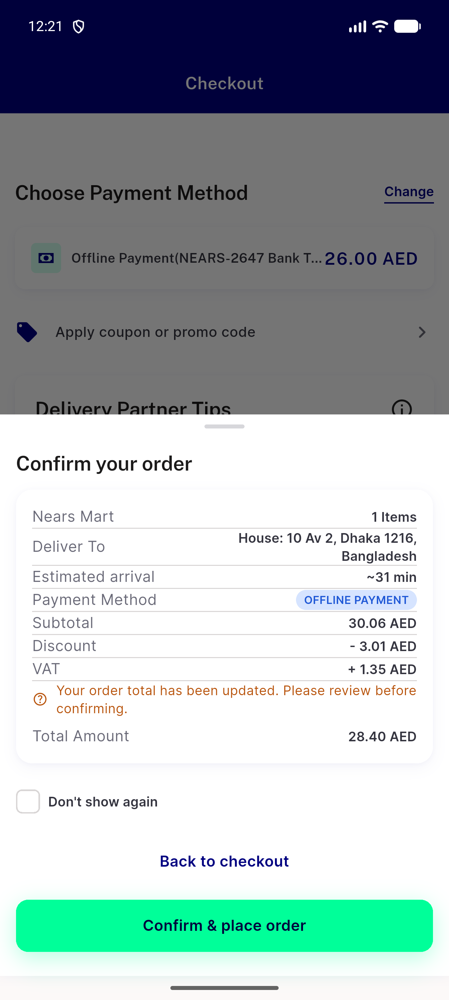
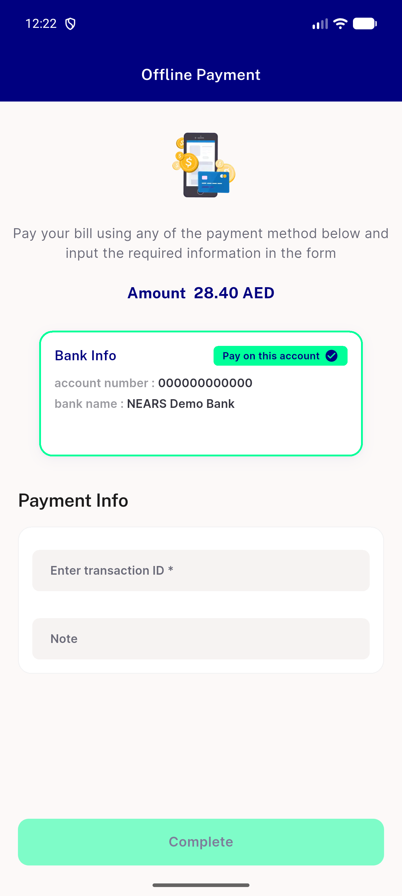
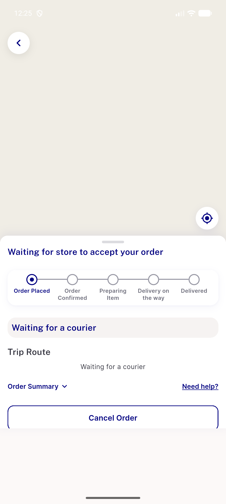
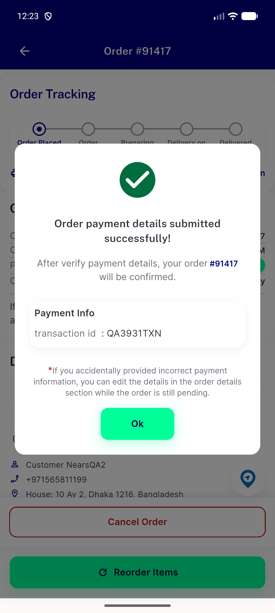

# QA Evidence — NEARS-3931

**NEARS-3931 [8] QA PASS - offline form shows placed order_amount (28.40) on fix, stale 26.00 reproduced on base**

**8 screenshot(s).** Click any thumbnail for full resolution.

<table>
<tr>
<td align="center" width="33%"> ac1 base checkout bill</td>
<td align="center" width="33%"> ac1 base confirm sheet</td>
<td align="center" width="33%"> ac1 base offline screen</td>
</tr>
<tr>
<td align="center" width="33%"> ac2 fix checkout bill</td>
<td align="center" width="33%"> ac2 fix confirm sheet</td>
<td align="center" width="33%"> ac2 fix offline screen</td>
</tr>
<tr>
<td align="center" width="33%"> ac5 fix cod after place</td>
<td align="center" width="33%"> reg offline submit ok</td>
</tr>
</table>

### Other artifacts
- [`ac1-base-placement.log`](ac1-base-placement.log)
- [`ac2-ac4-fix-placement.log`](ac2-ac4-fix-placement.log)
- [`ac3-place-response-trace.jsonl`](ac3-place-response-trace.jsonl)
- [`ac5-fix-cod-placement.log`](ac5-fix-cod-placement.log)
- [`progress.md`](progress.md)

---
*From `nears/docs/qa-evidence/NEARS-3931/` · public-repo scrub policy (no live secrets; verified clean).*
