# QA Evidence — NEARS-3933

**PASS - AC1-4 RED/GREEN, private DB, emulator-5554**

**22 screenshot(s).** Click any thumbnail for full resolution.

<table>
<tr>
<td align="center" width="33%"> green ac1 open0</td>
<td align="center" width="33%"> green ac1 reopen after back</td>
<td align="center" width="33%"> green ac1 reopen after drag</td>
</tr>
<tr>
<td align="center" width="33%"> green ac1 reopen after scrim</td>
<td align="center" width="33%"><a href="green-ac1-reopen.png">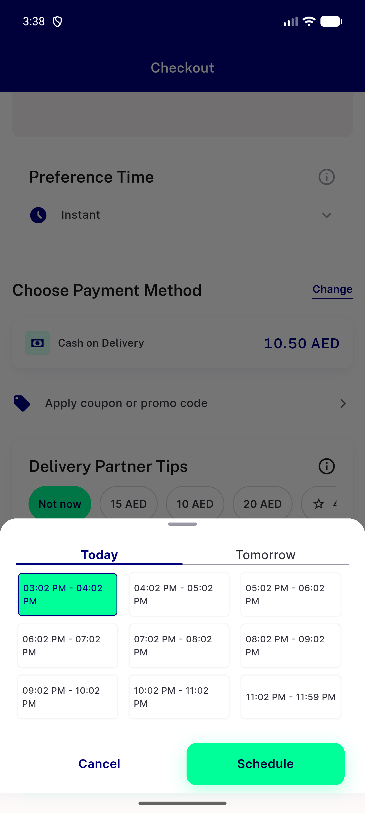</a> green ac1 reopen</td>
<td align="center" width="33%"> green ac1 tomorrow tab</td>
</tr>
<tr>
<td align="center" width="33%"><a href="green-ac2b-reopen.png">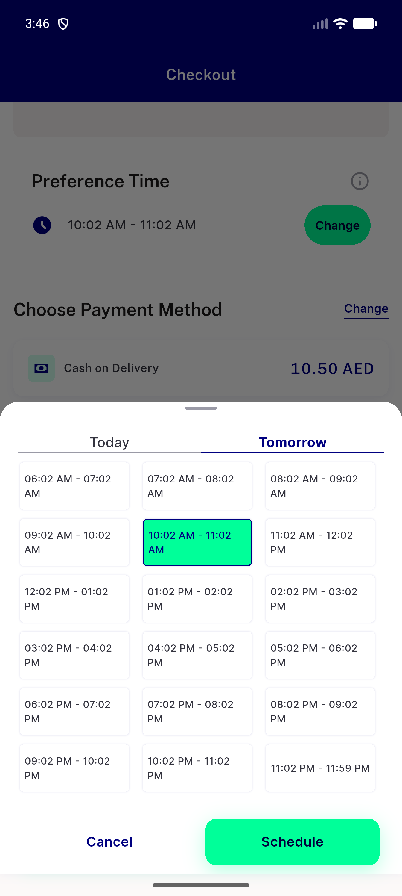</a> green ac2b reopen</td>
<td align="center" width="33%"><a href="green-ac2b-today-tab.png">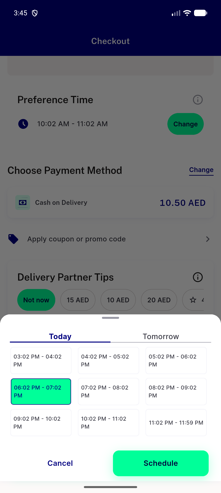</a> green ac2b today tab</td>
<td align="center" width="33%"><a href="green-ac2b-tomorrow-10am.png">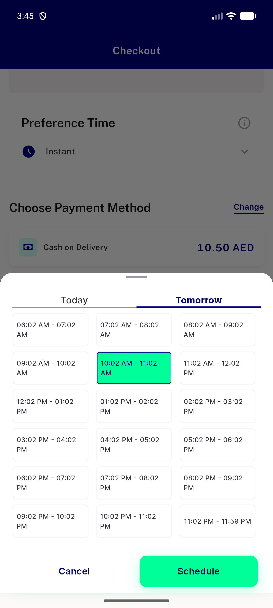</a> green ac2b tomorrow 10am</td>
</tr>
<tr>
<td align="center" width="33%"><a href="green-ac3-today-tab.png">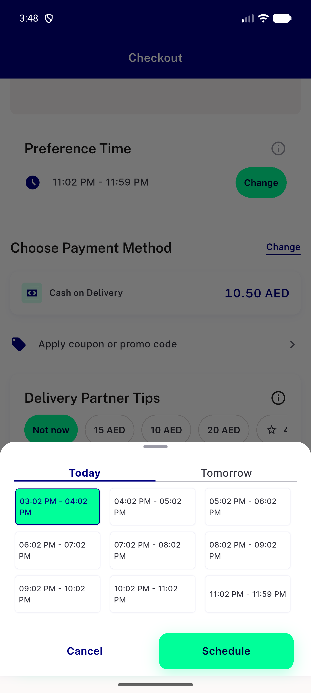</a> green ac3 today tab</td>
<td align="center" width="33%"><a href="green-ac3-tomorrow-last.png">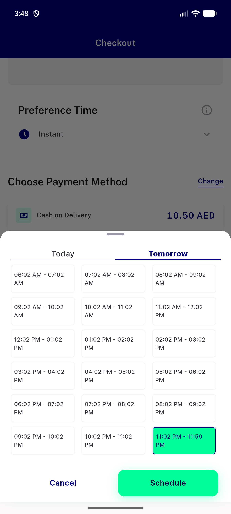</a> green ac3 tomorrow last</td>
<td align="center" width="33%"><a href="green-ac3b-today-tab.png">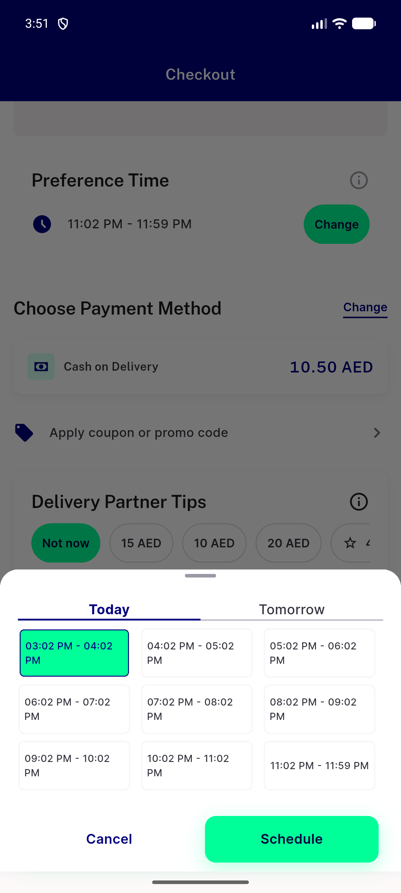</a> green ac3b today tab</td>
</tr>
<tr>
<td align="center" width="33%"><a href="green-ac3b2-today-6pm.png">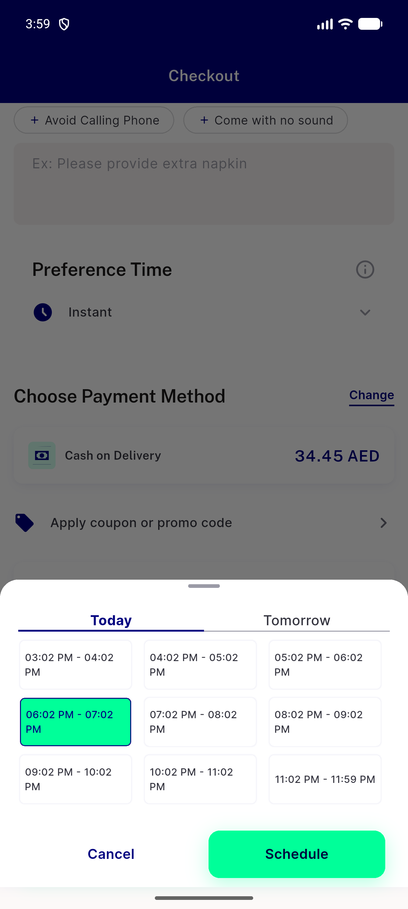</a> green ac3b2 today 6pm</td>
<td align="center" width="33%"><a href="green-closed-reopen.png">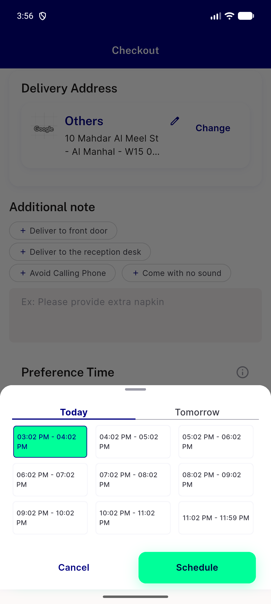</a> green closed reopen</td>
<td align="center" width="33%"><a href="green-closed-tomorrow-tab.png">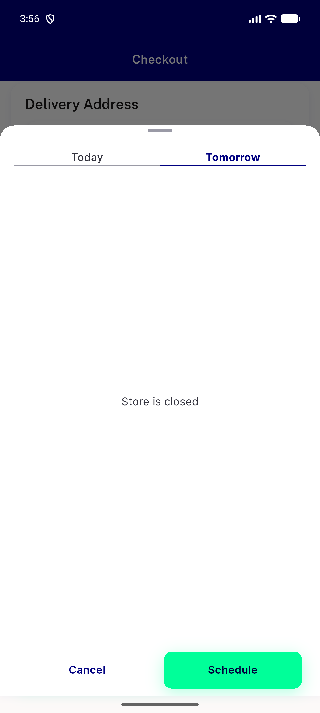</a> green closed tomorrow tab</td>
</tr>
<tr>
<td align="center" width="33%"><a href="green-followup-tomorrow-slot0-reopen.png">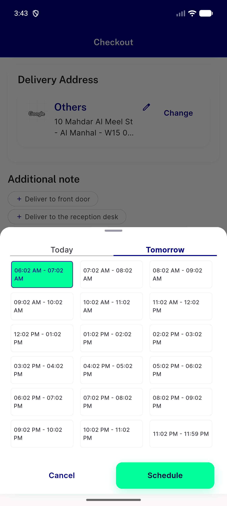</a> green followup tomorrow slot0 reopen</td>
<td align="center" width="33%"><a href="green-scale13-tomorrow.png">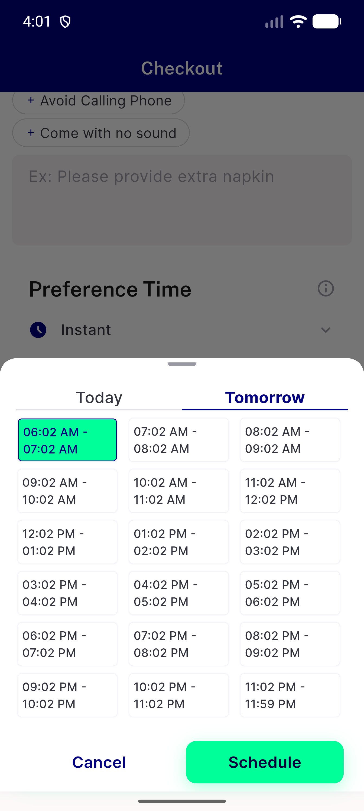</a> green scale13 tomorrow</td>
<td align="center" width="33%"><a href="red-ac1-open-initial-today-selected.png">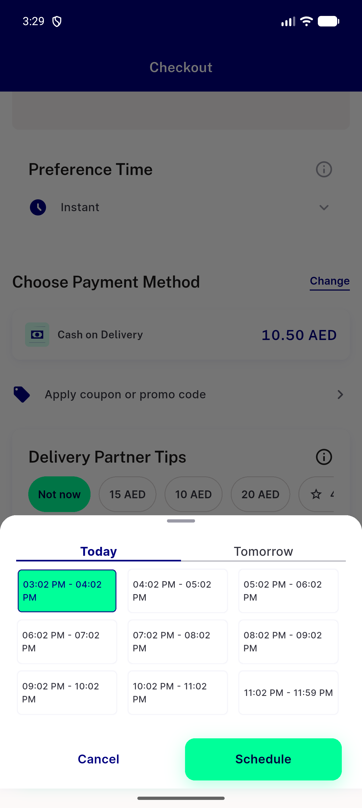</a> red ac1 open initial today selected</td>
</tr>
<tr>
<td align="center" width="33%"><a href="red-ac1-reopen-tomorrow-still-selected.png">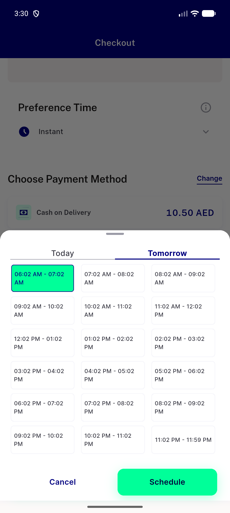</a> red ac1 reopen tomorrow still selected</td>
<td align="center" width="33%"> red ac1 sheet tomorrow tab tapped</td>
<td align="center" width="33%"><a href="red-ac3-today-tab-no-slot-selected.png">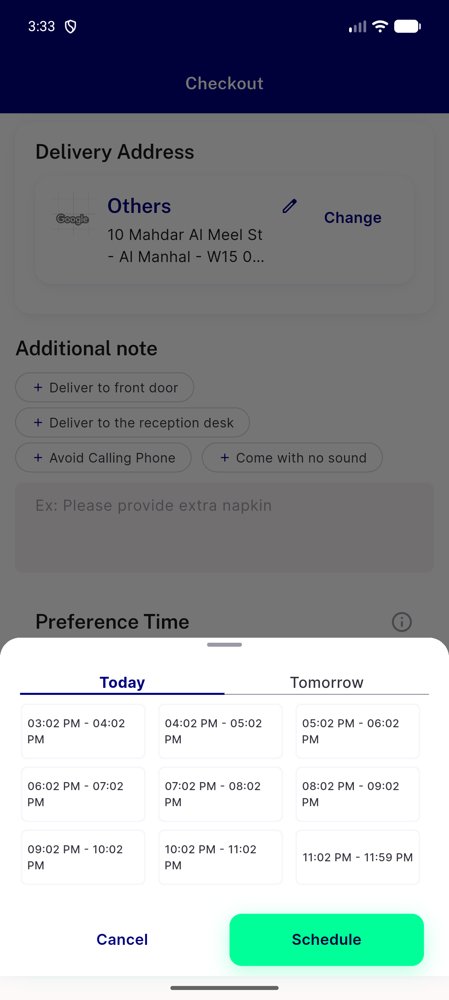</a> red ac3 today tab no slot selected</td>
</tr>
<tr>
<td align="center" width="33%"> red ac3 tomorrow last slot</td>
</tr>
</table>

### Other artifacts
- [`bug-followup-nitemcard-overflow-1-3x.log`](bug-followup-nitemcard-overflow-1-3x.log)
- [`bug-followup-tomorrow-default-slot-label-instant.log`](bug-followup-tomorrow-default-slot-label-instant.log)
- [`green-fail-err-lines.log`](green-fail-err-lines.log)
- [`green-flutter-logcat-full.log`](green-flutter-logcat-full.log)
- [`green-schedule-restored-and-clamp-lines.log`](green-schedule-restored-and-clamp-lines.log)
- [`private-db-orders-created.txt`](private-db-orders-created.txt)
- [`progress.md`](progress.md)
- [`red-ac2-order-91416-db.txt`](red-ac2-order-91416-db.txt)
- [`red-ac2-place-and-surge-calls.log`](red-ac2-place-and-surge-calls.log)
- [`red-ac3-rangeerror-fail.log`](red-ac3-rangeerror-fail.log)
- [`red-flutter-logcat-full.log`](red-flutter-logcat-full.log)

---
*From `nears/docs/qa-evidence/NEARS-3933/` · public-repo scrub policy (no live secrets; verified clean).*
