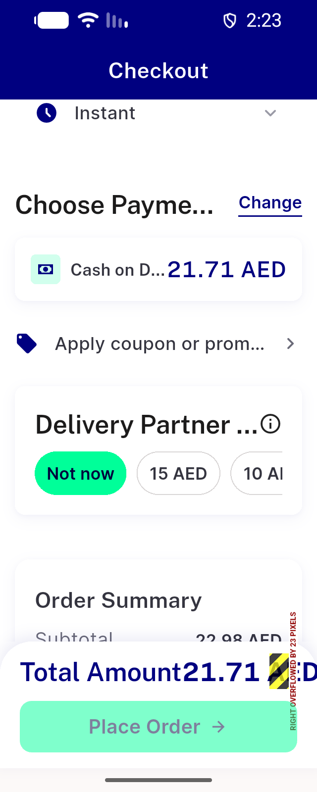
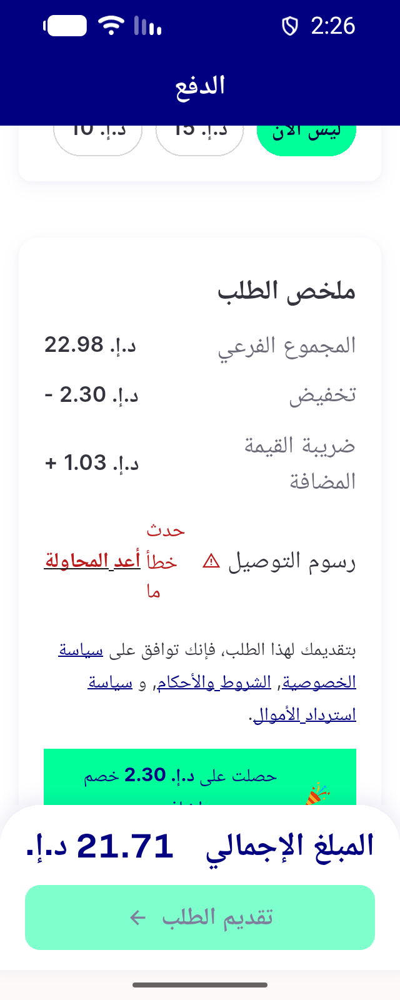
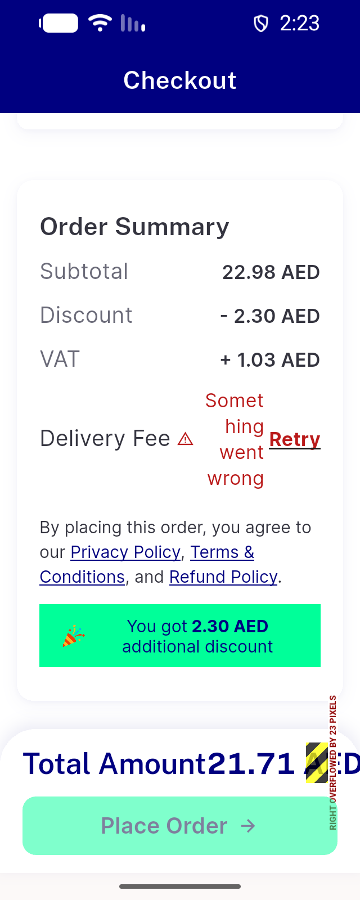
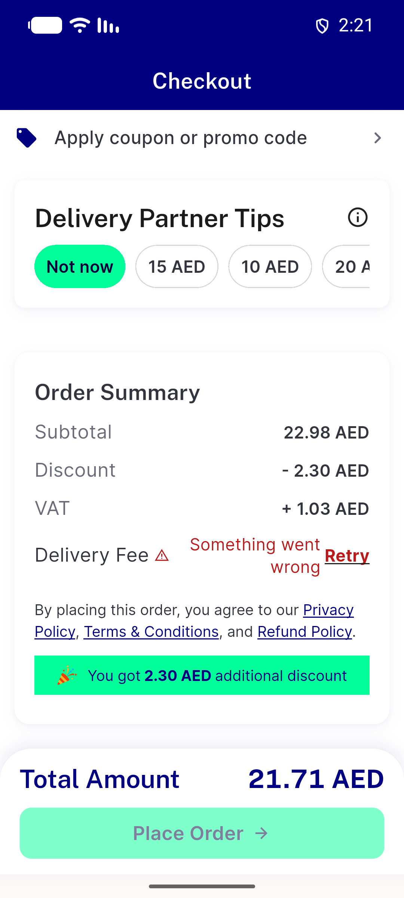
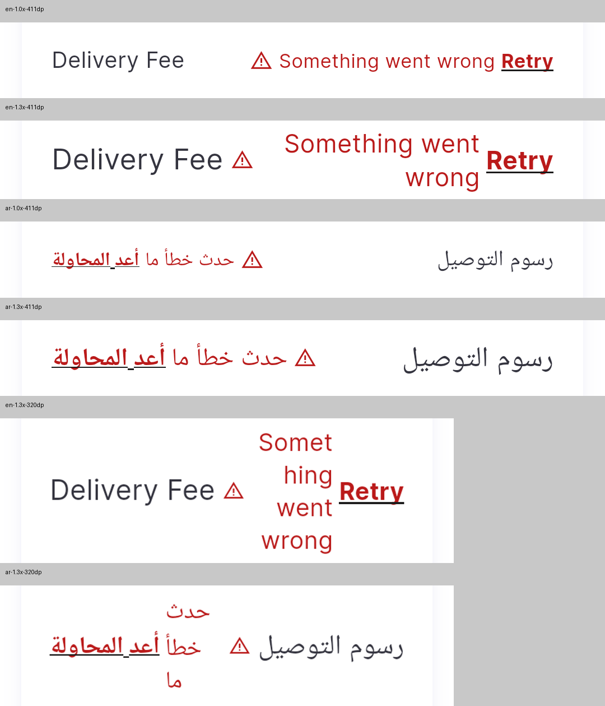

# QA Evidence — NEARS-3934

**NEARS-3934 cycle 1 (RB1 delta): FAIL - EN 1.3x 320dp label breaks mid-word; 5/6 cells PASS, 0 fee-row overflow**

**16 screenshot(s).** Click any thumbnail for full resolution.

<table>
<tr>
<td align="center" width="33%"> ac1 retry row place disabled</td>
<td align="center" width="33%"> ac3 retry success fee 8 place enabled</td>
<td align="center" width="33%"> ac4 self delivery surge fail no block</td>
</tr>
<tr>
<td align="center" width="33%"> bug checkout total row overflow 320dp 1.3x</td>
<td align="center" width="33%"> bug rb1 label midword break 320dp 1.3x</td>
<td align="center" width="33%"> bug rb1 warning icon detached 1.3x</td>
</tr>
<tr>
<td align="center" width="33%"> bug retry row overflow 1.3x</td>
<td align="center" width="33%"> c1 ar 1.0x 411dp</td>
<td align="center" width="33%"> c1 ar 1.0x pending</td>
</tr>
<tr>
<td align="center" width="33%"> c1 ar 1.0x resolved</td>
<td align="center" width="33%"> c1 ar 1.3x 320dp</td>
<td align="center" width="33%"> c1 ar 1.3x 411dp</td>
</tr>
<tr>
<td align="center" width="33%"> c1 en 1.0x 411dp</td>
<td align="center" width="33%"> c1 en 1.3x 320dp</td>
<td align="center" width="33%"> c1 en 1.3x 411dp</td>
</tr>
<tr>
<td align="center" width="33%"> c1 rb1 fee row 6cells</td>
</tr>
</table>

### Other artifacts
- [`ac1-fault500-checkout-a11y.xml`](ac1-fault500-checkout-a11y.xml)
- [`ac1-fault500-checkout-nodes.txt`](ac1-fault500-checkout-nodes.txt)
- [`ac3-after-retry-success-a11y.xml`](ac3-after-retry-success-a11y.xml)
- [`ac4-self-delivery-a11y.xml`](ac4-self-delivery-a11y.xml)
- [`ac6-group-basket-fault500-a11y.xml`](ac6-group-basket-fault500-a11y.xml)
- [`app-log-excerpt.log`](app-log-excerpt.log)
- [`bug-checkout-shimmer-overflow-320dp-1.3x-ar.log`](bug-checkout-shimmer-overflow-320dp-1.3x-ar.log)
- [`bug-checkout-total-row-overflow-320dp-1.3x.log`](bug-checkout-total-row-overflow-320dp-1.3x.log)
- [`bug-nitemcard-overflow-1.3x.log`](bug-nitemcard-overflow-1.3x.log)
- [`bug-retry-row-overflow-1.3x.log`](bug-retry-row-overflow-1.3x.log)
- [`bug-search-results-rendertable-semantics.log`](bug-search-results-rendertable-semantics.log)
- [`c1-ar-1.0x-411dp-a11y.xml`](c1-ar-1.0x-411dp-a11y.xml)
- [`c1-ar-1.0x-pending-a11y.xml`](c1-ar-1.0x-pending-a11y.xml)
- [`c1-ar-1.0x-resolved-a11y.xml`](c1-ar-1.0x-resolved-a11y.xml)
- [`c1-ar-1.3x-320dp-a11y.xml`](c1-ar-1.3x-320dp-a11y.xml)
- [`c1-ar-1.3x-411dp-a11y.xml`](c1-ar-1.3x-411dp-a11y.xml)
- [`c1-en-1.0x-411dp-a11y.xml`](c1-en-1.0x-411dp-a11y.xml)
- [`c1-en-1.3x-320dp-a11y.xml`](c1-en-1.3x-320dp-a11y.xml)
- [`c1-en-1.3x-411dp-a11y.xml`](c1-en-1.3x-411dp-a11y.xml)
- [`pre-free-delivery-config-checkout-nodes.txt`](pre-free-delivery-config-checkout-nodes.txt)
- [`progress.md`](progress.md)
- [`proxy-trace.jsonl`](proxy-trace.jsonl)
- [`qa-rtl-ar-1.0x-retry-row-a11y.xml`](qa-rtl-ar-1.0x-retry-row-a11y.xml)
- [`qa-rtl-ar-1.3x-retry-row-a11y.xml`](qa-rtl-ar-1.3x-retry-row-a11y.xml)

---
*From `nears/docs/qa-evidence/NEARS-3934/` · public-repo scrub policy (no live secrets; verified clean).*
