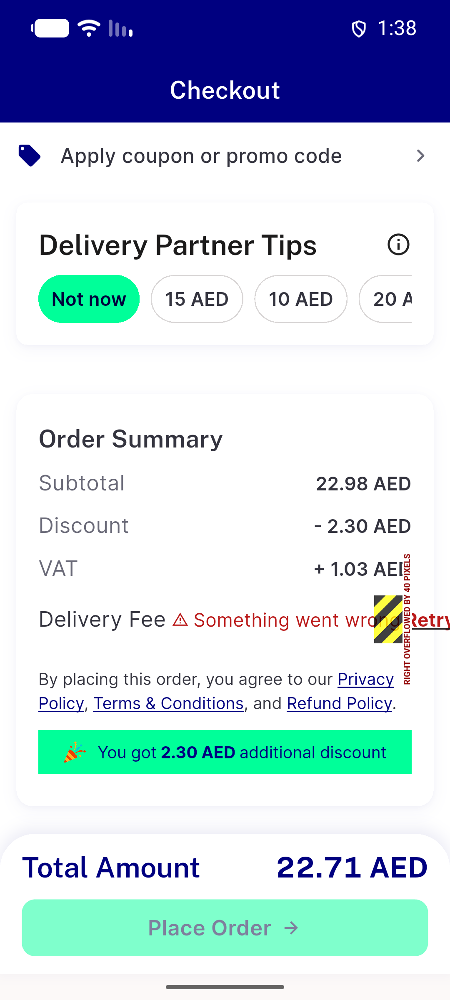
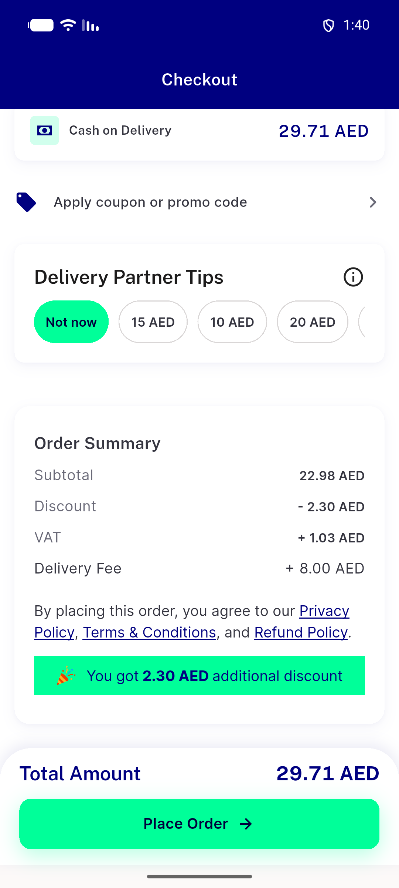
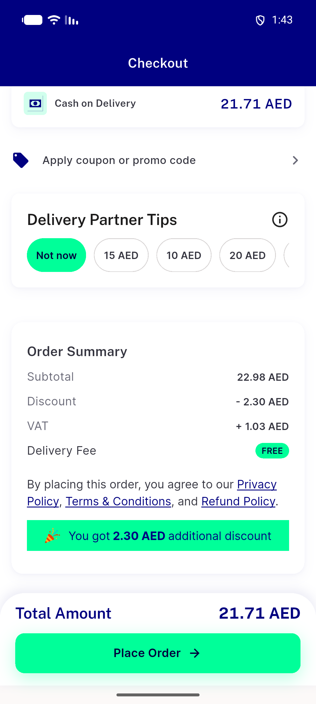

# QA Evidence — NEARS-3934

**NEARS-3934 QA [8] cycle 0: PASS - surge-fetch failure blocks single-store placement (retry row, Place disabled, 0 /order/place); retry -> 7.00 surge, #91417 delta 7.00 == fee == charged**

**4 screenshot(s).** Click any thumbnail for full resolution.

<table>
<tr>
<td align="center" width="33%"> ac1 retry row place disabled</td>
<td align="center" width="33%"> ac3 retry success fee 8 place enabled</td>
<td align="center" width="33%"> ac4 self delivery surge fail no block</td>
</tr>
<tr>
<td align="center" width="33%"> bug retry row overflow 1.3x</td>
</tr>
</table>

### Other artifacts
- [`ac1-fault500-checkout-a11y.xml`](ac1-fault500-checkout-a11y.xml)
- [`ac1-fault500-checkout-nodes.txt`](ac1-fault500-checkout-nodes.txt)
- [`ac3-after-retry-success-a11y.xml`](ac3-after-retry-success-a11y.xml)
- [`ac4-self-delivery-a11y.xml`](ac4-self-delivery-a11y.xml)
- [`ac6-group-basket-fault500-a11y.xml`](ac6-group-basket-fault500-a11y.xml)
- [`app-log-excerpt.log`](app-log-excerpt.log)
- [`bug-nitemcard-overflow-1.3x.log`](bug-nitemcard-overflow-1.3x.log)
- [`bug-retry-row-overflow-1.3x.log`](bug-retry-row-overflow-1.3x.log)
- [`bug-search-results-rendertable-semantics.log`](bug-search-results-rendertable-semantics.log)
- [`pre-free-delivery-config-checkout-nodes.txt`](pre-free-delivery-config-checkout-nodes.txt)
- [`progress.md`](progress.md)
- [`proxy-trace.jsonl`](proxy-trace.jsonl)
- [`qa-rtl-ar-1.0x-retry-row-a11y.xml`](qa-rtl-ar-1.0x-retry-row-a11y.xml)
- [`qa-rtl-ar-1.3x-retry-row-a11y.xml`](qa-rtl-ar-1.3x-retry-row-a11y.xml)

---
*From `nears/docs/qa-evidence/NEARS-3934/` · public-repo scrub policy (no live secrets; verified clean).*
