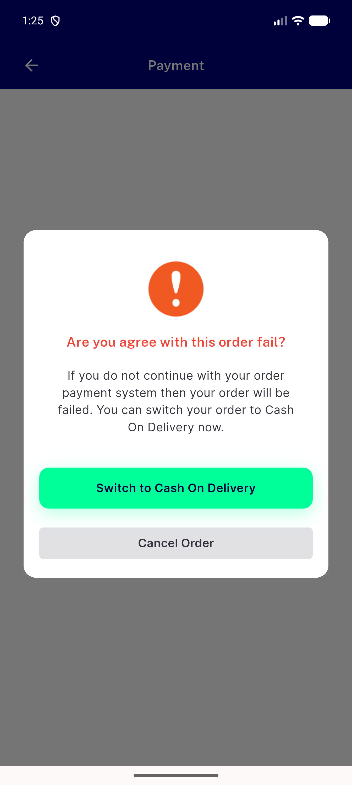
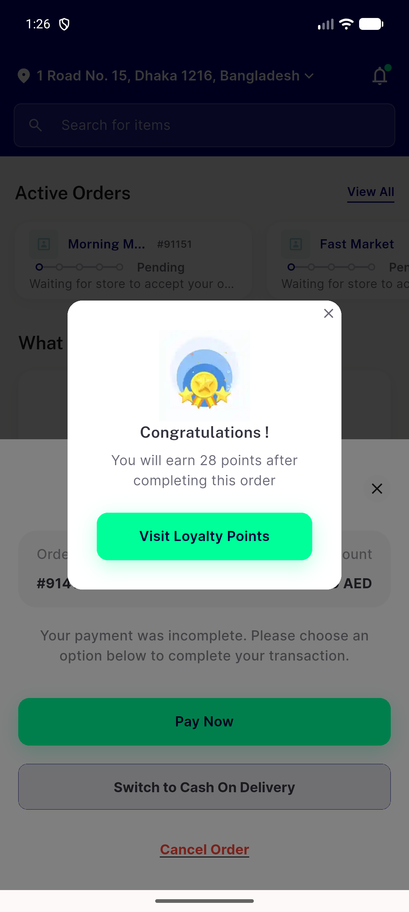

# QA Evidence — NEARS-3935

**NEARS-3935 QA PASS - purchase value, digital route amount, loyalty message all = server order_amount 28.40 (client 26.00); emulator-5556 fix feaa11718; private DB nears_qa_3935**

**2 screenshot(s).** Click any thumbnail for full resolution.

<table>
<tr>
<td align="center" width="33%"> ac2 fix payment failed dialog</td>
<td align="center" width="33%"> ac3 fix congratulation 28 points</td>
</tr>
</table>

### Other artifacts
- [`ac1-ac3-ac4-cod-91416.log`](ac1-ac3-ac4-cod-91416.log)
- [`ac2-ac4-digital-91417.log`](ac2-ac4-digital-91417.log)
- [`db-readback-nears_qa_3935.txt`](db-readback-nears_qa_3935.txt)
- [`place-and-quote-trace.jsonl`](place-and-quote-trace.jsonl)
- [`progress.md`](progress.md)
- [`reg-offline-91418.log`](reg-offline-91418.log)

---
*From `nears/docs/qa-evidence/NEARS-3935/` · public-repo scrub policy (no live secrets; verified clean).*
