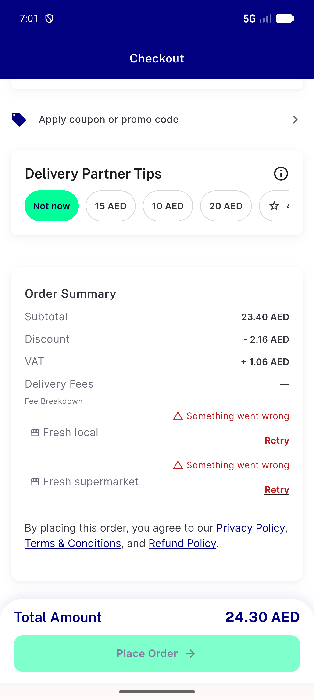
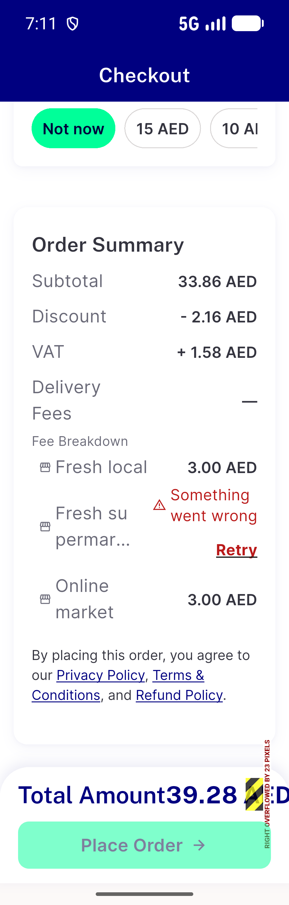
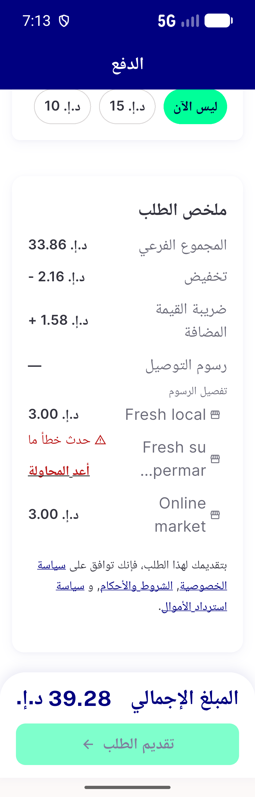
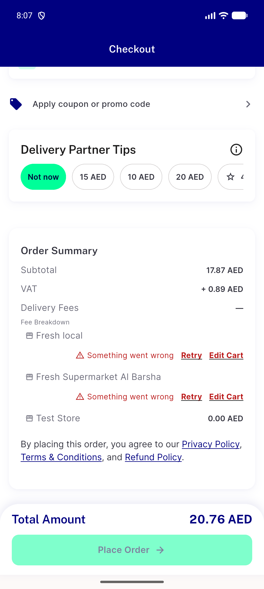
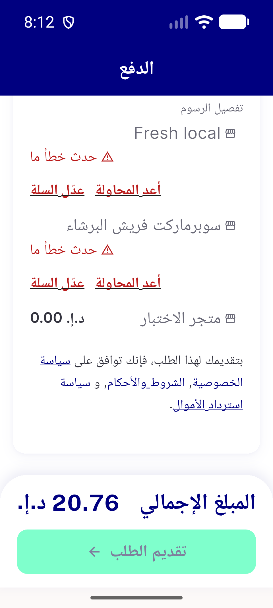
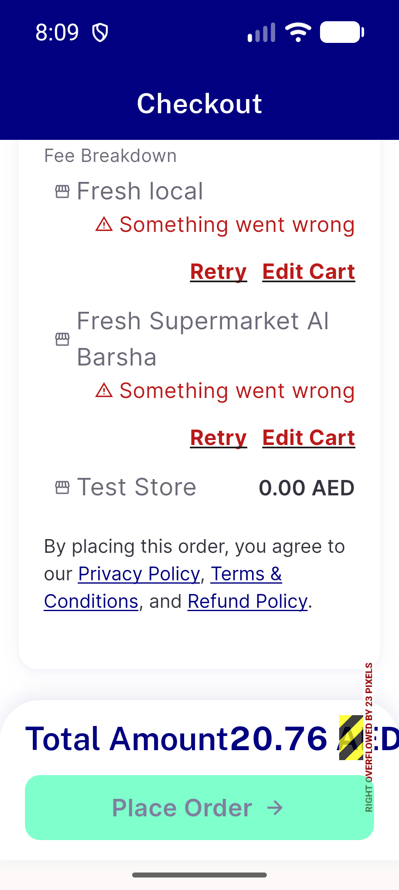
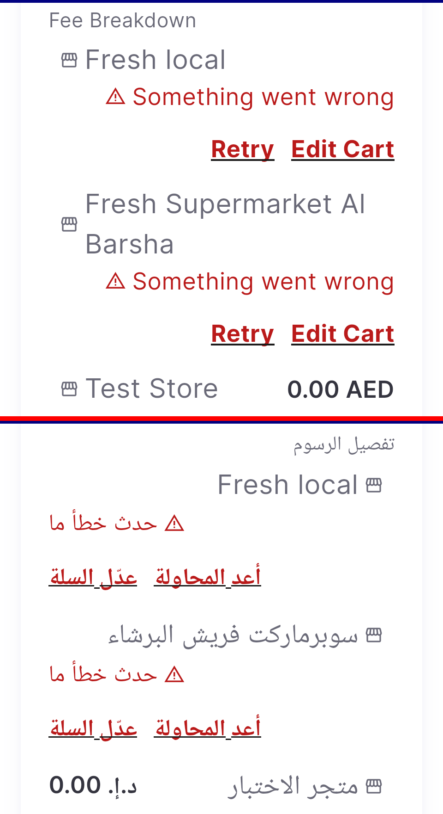

# QA Evidence — NEARS-3936

**PASS (fix cycle 1) @ d0cc1dcd8 - v3 failure row: AC1/AC2/AC3 + C1/C2/C3 live, 0 orders**

**7 screenshot(s).** Click any thumbnail for full resolution.

<table>
<tr>
<td align="center" width="33%"> ac1 surge fail bill en</td>
<td align="center" width="33%"> ac2 perstore quote fail en 320dp 1 3x</td>
<td align="center" width="33%"> ac3 ar 320dp 1 3x row visible no toast</td>
</tr>
<tr>
<td align="center" width="33%"> v3 ac1 surge bill en</td>
<td align="center" width="33%"> v3 c1 ar 320 13x</td>
<td align="center" width="33%"> v3 c1 en 320 13x</td>
</tr>
<tr>
<td align="center" width="33%"> v3 c1 en ar 320 13x feebreakdown</td>
</tr>
</table>

### Other artifacts
- [`L1-en-320-13x.xml`](L1-en-320-13x.xml)
- [`L1b-en-320-13x.xml`](L1b-en-320-13x.xml)
- [`L2-ar-320-13x.xml`](L2-ar-320-13x.xml)
- [`S1-compute-threw.xml`](S1-compute-threw.xml)
- [`S2-input-missing.xml`](S2-input-missing.xml)
- [`S3-surge-threw.xml`](S3-surge-threw.xml)
- [`bug-coupon-at-threshold-group-fee-shown-free-server-charges.log`](bug-coupon-at-threshold-group-fee-shown-free-server-charges.log)
- [`bug-dls-nitemcard-bottom-overflow-320dp-1_3x.log`](bug-dls-nitemcard-bottom-overflow-320dp-1_3x.log)
- [`bug-permanent-unresolvable-store-retry-only.log`](bug-permanent-unresolvable-store-retry-only.log)
- [`bug-total-amount-row-overflow-320dp-1_3x.log`](bug-total-amount-row-overflow-320dp-1_3x.log)
- [`bug-unresolved-row-storename-midword-break.log`](bug-unresolved-row-storename-midword-break.log)
- [`c0-cart-baseline.xml`](c0-cart-baseline.xml)
- [`c1-checkout-nosurge-bill.xml`](c1-checkout-nosurge-bill.xml)
- [`c1-checkout-nosurge-top.xml`](c1-checkout-nosurge-top.xml)
- [`c3-cart-3store-surgefail.xml`](c3-cart-3store-surgefail.xml)
- [`c3b.xml`](c3b.xml)
- [`c3c.xml`](c3c.xml)
- [`d1-after-place-tap.xml`](d1-after-place-tap.xml)
- [`d1-bill.xml`](d1-bill.xml)
- [`d1-cart.xml`](d1-cart.xml)
- [`d1-top.xml`](d1-top.xml)
- [`e1-after-remove-bill.xml`](e1-after-remove-bill.xml)
- [`e1-after-remove-top.xml`](e1-after-remove-top.xml)
- [`e2-after-remove-403-bill.xml`](e2-after-remove-403-bill.xml)
- [`e2-after-remove-403-top.xml`](e2-after-remove-403-top.xml)
- [`f1-threshold-bill.xml`](f1-threshold-bill.xml)
- [`f1-threshold-top.xml`](f1-threshold-top.xml)
- [`k1-surge-configured.xml`](k1-surge-configured.xml)
- [`k2-free-self-bill.xml`](k2-free-self-bill.xml)
- [`k2-free-self-top.xml`](k2-free-self-top.xml)
- [`k3-free-self-bill.xml`](k3-free-self-bill.xml)
- [`k3-free-self-top.xml`](k3-free-self-top.xml)
- [`n3691-confirm-sheet.xml`](n3691-confirm-sheet.xml)
- [`n3894-after-confirm.xml`](n3894-after-confirm.xml)
- [`n3934-single-store.xml`](n3934-single-store.xml)
- [`p1-403-after-retry.xml`](p1-403-after-retry.xml)
- [`p1-403-top.xml`](p1-403-top.xml)
- [`progress.md`](progress.md)
- [`q1-bill.xml`](q1-bill.xml)
- [`q1-top.xml`](q1-top.xml)
- [`r1-t1-inflight.xml`](r1-t1-inflight.xml)
- [`r1-t2-inflight.xml`](r1-t2-inflight.xml)
- [`r1-t3-settled.xml`](r1-t3-settled.xml)
- [`r2-t1-inflight.xml`](r2-t1-inflight.xml)
- [`r2-t2-inflight.xml`](r2-t2-inflight.xml)
- [`r2-t3-resolved.xml`](r2-t3-resolved.xml)
- [`s1-checkout-surgefail-bill.xml`](s1-checkout-surgefail-bill.xml)
- [`s1-checkout-surgefail-top.xml`](s1-checkout-surgefail-top.xml)
- [`s3-bill.xml`](s3-bill.xml)
- [`s3-top.xml`](s3-top.xml)
- [`v3-ac1-surge-bill-en.xml`](v3-ac1-surge-bill-en.xml)
- [`v3-ac2-retry-success.xml`](v3-ac2-retry-success.xml)
- [`v3-c1-ar-320-13x.xml`](v3-c1-ar-320-13x.xml)
- [`v3-c1-en-320-13x.xml`](v3-c1-en-320-13x.xml)
- [`v3-c2-basket-after-editcart.xml`](v3-c2-basket-after-editcart.xml)
- [`v3-c2-checkout-after-back.xml`](v3-c2-checkout-after-back.xml)
- [`v3-c3-403-after-remove.xml`](v3-c3-403-after-remove.xml)
- [`v3-c3-403-after-retry.xml`](v3-c3-403-after-retry.xml)
- [`v3-c3-403-basket.xml`](v3-c3-403-basket.xml)
- [`v3-c3-403-bill.xml`](v3-c3-403-bill.xml)
- [`v3-c3-403-top.xml`](v3-c3-403-top.xml)
- [`v3-x-threshold-coupon.xml`](v3-x-threshold-coupon.xml)
- [`v3-x-threshold-nocoupon.xml`](v3-x-threshold-nocoupon.xml)

---
*From `nears/docs/qa-evidence/NEARS-3936/` · public-repo scrub policy (no live secrets; verified clean).*
