# QA Evidence — NEARS-3937

**PASS - NEARS-3937 cycle 1 delta re-QA (FIR-1 fee-row wrap) on 2a91f4511, emulator-5562**

**16 screenshot(s).** Click any thumbnail for full resolution.

<table>
<tr>
<td align="center" width="33%"><a href="ac1-a-single-pending-skeleton-feerow-and-total.png">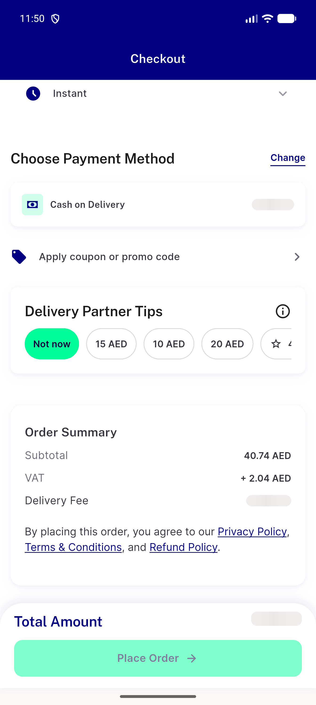</a> ac1 a single pending skeleton feerow and total</td>
<td align="center" width="33%"><a href="ac1-a-single-quote-failed-feerow-and-total.png">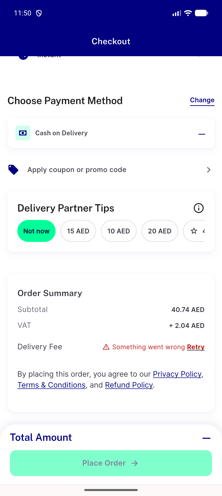</a> ac1 a single quote failed feerow and total</td>
<td align="center" width="33%"><a href="ac1-ac2-c-never-scheduled-feerow-and-total.png">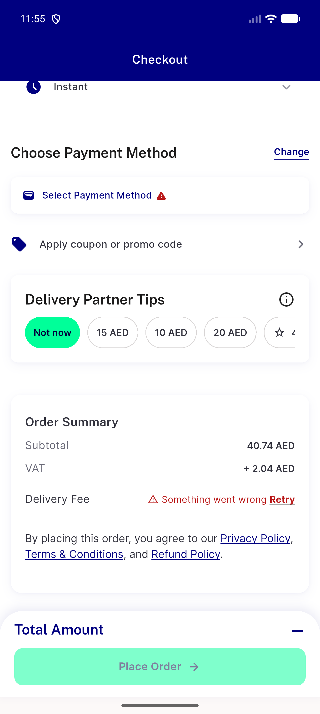</a> ac1 ac2 c never scheduled feerow and total</td>
</tr>
<tr>
<td align="center" width="33%"><a href="ac1-ac2-group-one-store-failed-breakdown-and-total.png">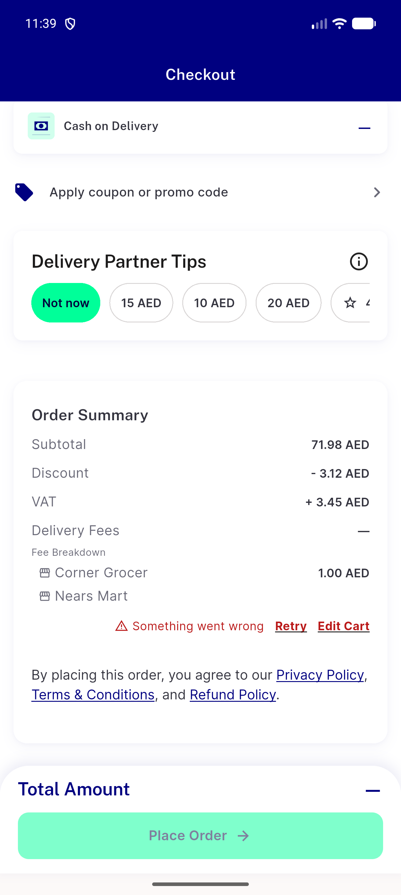</a> ac1 ac2 group one store failed breakdown and total</td>
<td align="center" width="33%"><a href="ac1-b-single-surge-failed-feerow-and-total.png">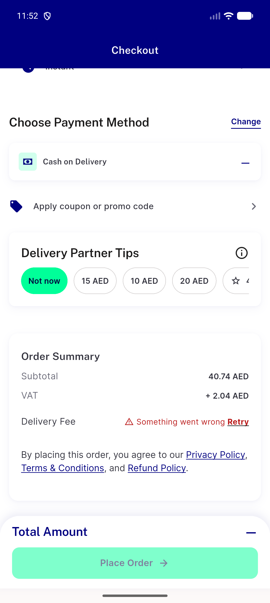</a> ac1 b single surge failed feerow and total</td>
<td align="center" width="33%"><a href="ac1-group-pending-retry-skeleton.png">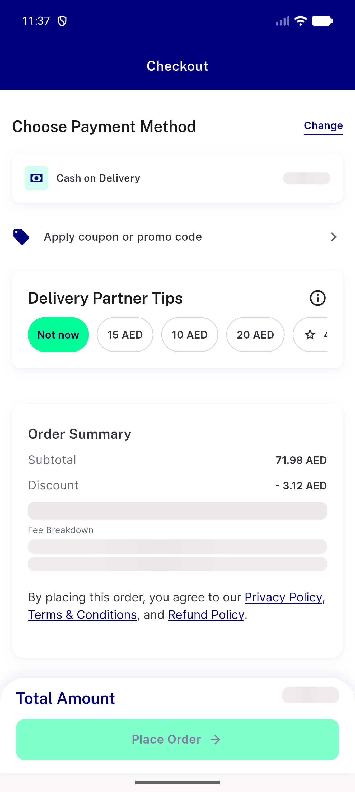</a> ac1 group pending retry skeleton</td>
</tr>
<tr>
<td align="center" width="33%"><a href="ac1-group-surge-failed-bill-breakdown-and-total.png">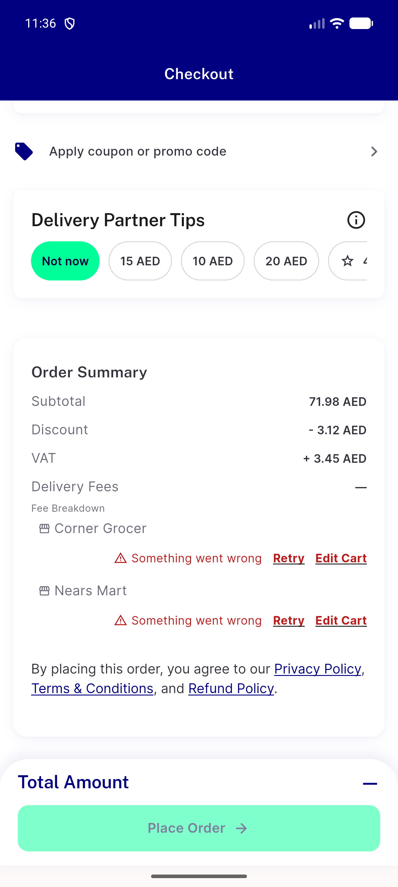</a> ac1 group surge failed bill breakdown and total</td>
<td align="center" width="33%"><a href="ac1-group-surge-failed-breakdown-and-total.png">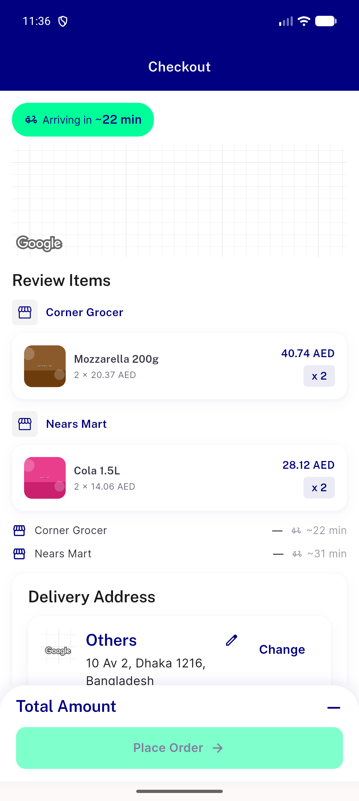</a> ac1 group surge failed breakdown and total</td>
<td align="center" width="33%"><a href="ac1-site3-due-payment-failed-bill-and-sticky.png">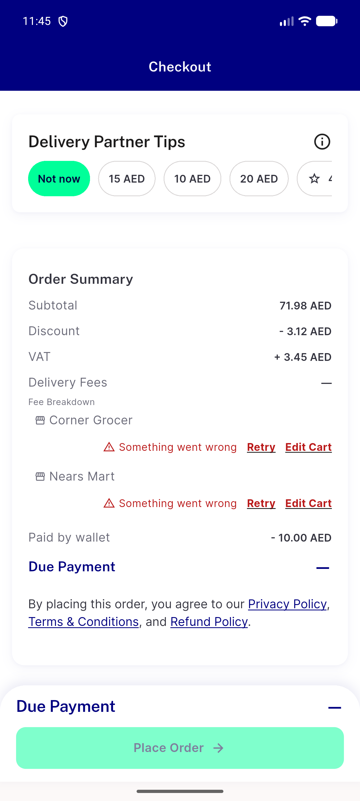</a> ac1 site3 due payment failed bill and sticky</td>
</tr>
<tr>
<td align="center" width="33%"><a href="ac1-site3-due-payment-pending-skeleton.png">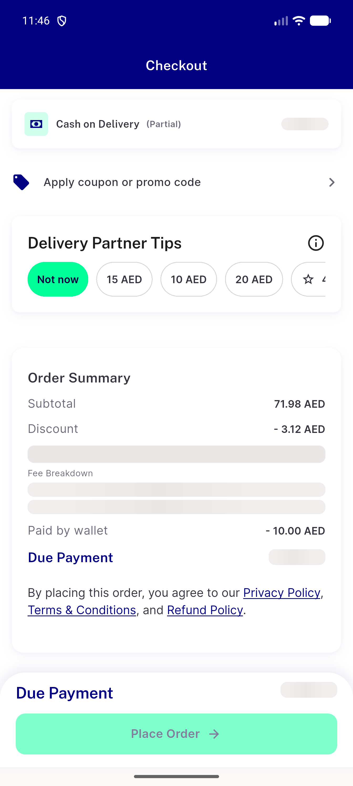</a> ac1 site3 due payment pending skeleton</td>
<td align="center" width="33%"><a href="ac1-site4-payment-method-failed-group.png">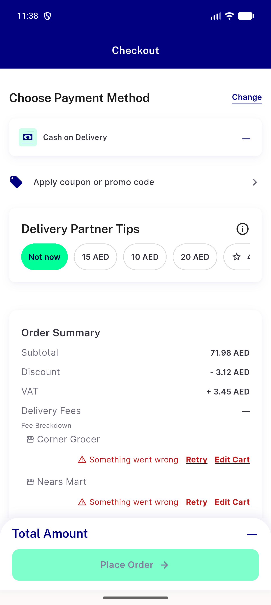</a> ac1 site4 payment method failed group</td>
<td align="center" width="33%"><a href="ac1-site5-storeid-cod-failed-feerow-and-total.png">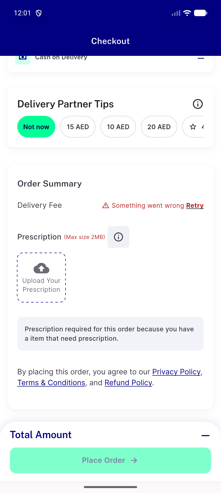</a> ac1 site5 storeid cod failed feerow and total</td>
</tr>
<tr>
<td align="center" width="33%"><a href="ac2-stale-reset-reentry-frames.png">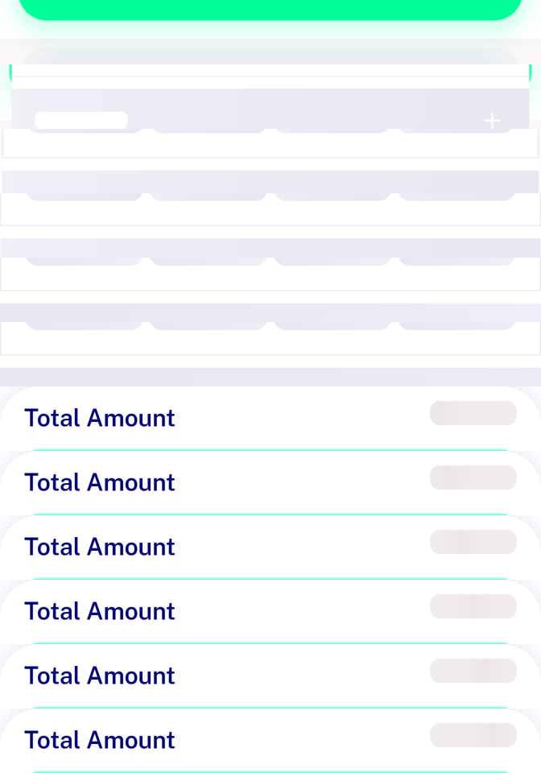</a> ac2 stale reset reentry frames</td>
<td align="center" width="33%"><a href="instrument-backend-paused-before-body-shimmer-only.png">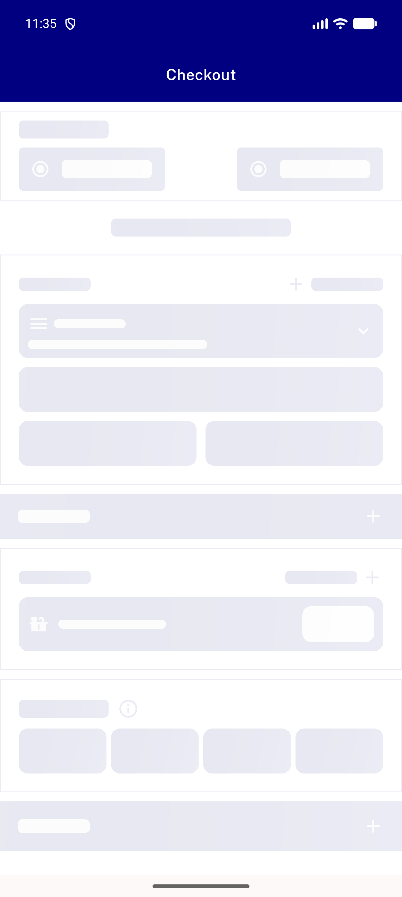</a> instrument backend paused before body shimmer only</td>
<td align="center" width="33%"><a href="layout-320dp-1.3x-AR-failed-feerow-and-sticky-rtl.png">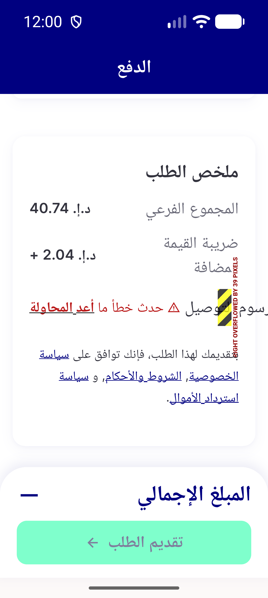</a> layout 320dp 1.3x AR failed feerow and sticky rtl</td>
</tr>
<tr>
<td align="center" width="33%"><a href="layout-320dp-1.3x-EN-failed-feerow-and-sticky.png">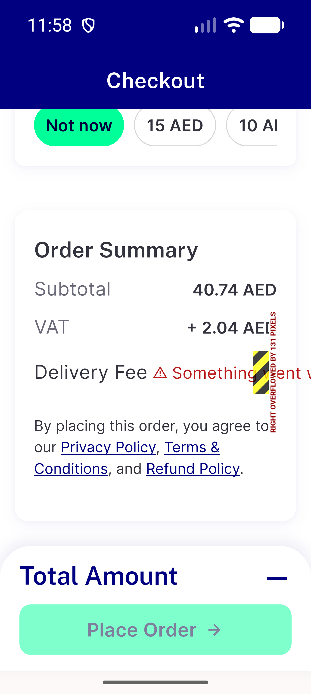</a> layout 320dp 1.3x EN failed feerow and sticky</td>
</tr>
</table>

### Other artifacts
- [`ac-log-excerpt.log`](ac-log-excerpt.log)
- [`ac1-a-single-quote-failed.xml`](ac1-a-single-quote-failed.xml)
- [`ac1-ac2-c-never-scheduled.xml`](ac1-ac2-c-never-scheduled.xml)
- [`ac1-ac2-group-one-store-failed.xml`](ac1-ac2-group-one-store-failed.xml)
- [`ac1-b-single-surge-failed.xml`](ac1-b-single-surge-failed.xml)
- [`ac1-group-surge-failed-bill.xml`](ac1-group-surge-failed-bill.xml)
- [`ac1-group-surge-failed.xml`](ac1-group-surge-failed.xml)
- [`ac1-site3-due-payment-failed.xml`](ac1-site3-due-payment-failed.xml)
- [`ac1-site4-payment-method-failed-group.xml`](ac1-site4-payment-method-failed-group.xml)
- [`ac1-site5-storeid-cod-failed.xml`](ac1-site5-storeid-cod-failed.xml)
- [`ac3-control-self-delivery-surge-failing-real-total.xml`](ac3-control-self-delivery-surge-failing-real-total.xml)
- [`bug-feerow-failed-overflow-320dp.log`](bug-feerow-failed-overflow-320dp.log)
- [`cycle1`](cycle1)
- [`layout-320dp-1.3x-AR-failed.xml`](layout-320dp-1.3x-AR-failed.xml)
- [`layout-320dp-1.3x-EN-failed.xml`](layout-320dp-1.3x-EN-failed.xml)
- [`progress.md`](progress.md)

---
*From `nears/docs/qa-evidence/NEARS-3937/` · public-repo scrub policy (no live secrets; verified clean).*
