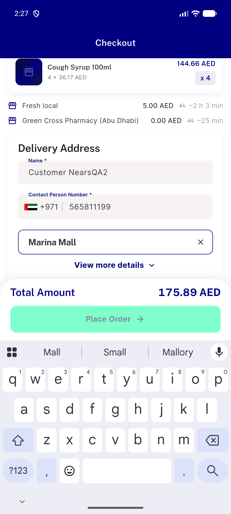
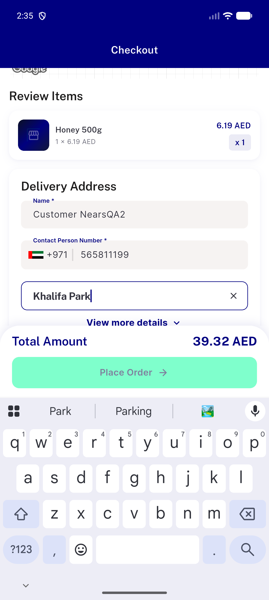
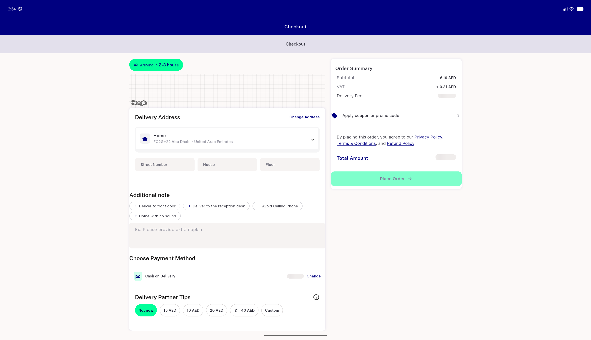
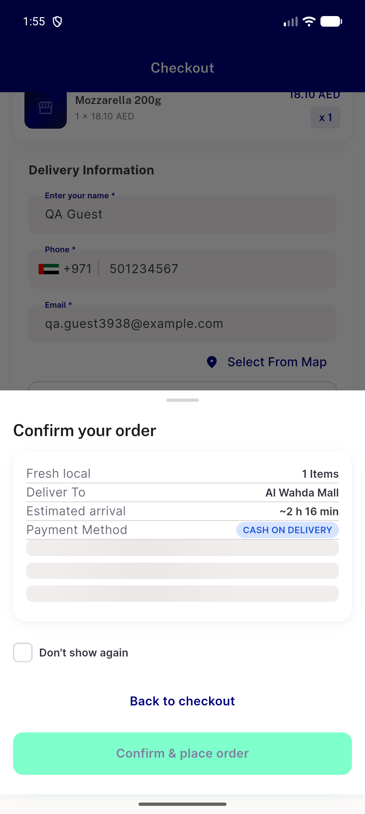
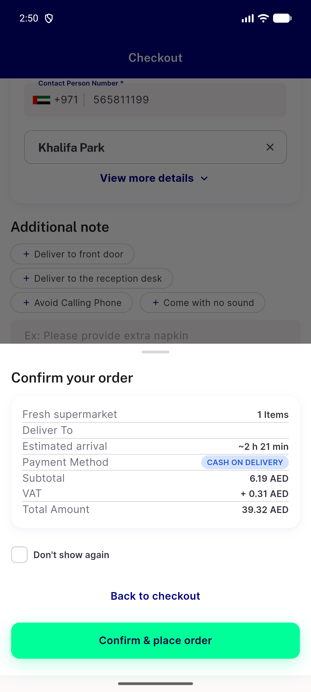

# QA Evidence — NEARS-3938

**fix-cycle-1 delta PASS on 34446e8db: cells a,b,c,d,e,g PASS; f UNVERIFIABLE live (trigger closed by fix)**

**9 screenshot(s).** Click any thumbnail for full resolution.

<table>
<tr>
<td align="center" width="33%"> ac1 place order disabled in window</td>
<td align="center" width="33%"> ac2 flagoff place order disabled in window</td>
<td align="center" width="33%"> ac3 desktop place order disabled in window</td>
</tr>
<tr>
<td align="center" width="33%"> b1 notice after self close</td>
<td align="center" width="33%"> b1 sheet open before land</td>
<td align="center" width="33%"> b1 sheet open stale total</td>
</tr>
<tr>
<td align="center" width="33%"> bug typeahead overlay overlaps notice</td>
<td align="center" width="33%"> control base sheet open stale total</td>
<td align="center" width="33%"> rtl ar notice after self close</td>
</tr>
</table>

### Other artifacts
- [`ac1-window-a11y-dump.xml`](ac1-window-a11y-dump.xml)
- [`ac2-flagoff-window-a11y-dump.xml`](ac2-flagoff-window-a11y-dump.xml)
- [`ac3-desktop-window-a11y-dump.xml`](ac3-desktop-window-a11y-dump.xml)
- [`bug-basket-hides-rows-checkout-includes.log`](bug-basket-hides-rows-checkout-includes.log)
- [`bug-dont-show-again-no-reenable.log`](bug-dont-show-again-no-reenable.log)
- [`bug-guest-preapply-confirm-places-stale-fee.log`](bug-guest-preapply-confirm-places-stale-fee.log)
- [`bug-search-results-semantics-assert.log`](bug-search-results-semantics-assert.log)
- [`control-base-window-a11y-dump.xml`](control-base-window-a11y-dump.xml)
- [`fc1`](fc1)
- [`frameB-confirm-disabled-a11y-dump.xml`](frameB-confirm-disabled-a11y-dump.xml)
- [`progress.md`](progress.md)

---
*From `nears/docs/qa-evidence/NEARS-3938/` · public-repo scrub policy (no live secrets; verified clean).*
