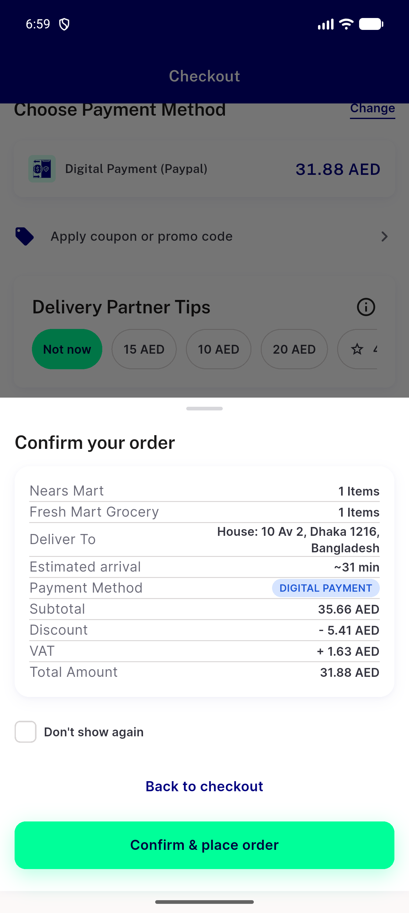
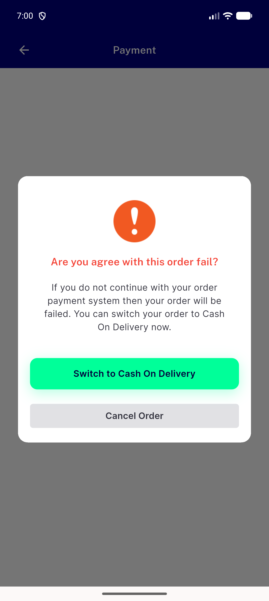

# QA Evidence — NEARS-3939

**PASS - group digital route amount = server total_amount 34.28 (client 31.88); single-store unchanged 28.40**

**2 screenshot(s).** Click any thumbnail for full resolution.

<table>
<tr>
<td align="center" width="33%"> ac1 group confirm sheet client 31.88</td>
<td align="center" width="33%"> scope7 group payment failed dialog</td>
</tr>
</table>

### Other artifacts
- [`ac1-acreg-money-proxy.log`](ac1-acreg-money-proxy.log)
- [`bug-semantics-rendertable-assert.log`](bug-semantics-rendertable-assert.log)
- [`logs-placements.log`](logs-placements.log)
- [`progress.md`](progress.md)

---
*From `nears/docs/qa-evidence/NEARS-3939/` · public-repo scrub policy (no live secrets; verified clean).*
