# QA Evidence — NEARS-394

**PASS — Phase 0 theme re-point + 6 upgraded DLS widgets verified live (light/dark/RTL); 855 tests green**

**19 screenshot(s).** Click any thumbnail for full resolution.

<table>
<tr>
<td align="center" width="33%"><a href="00-address-select-light.png">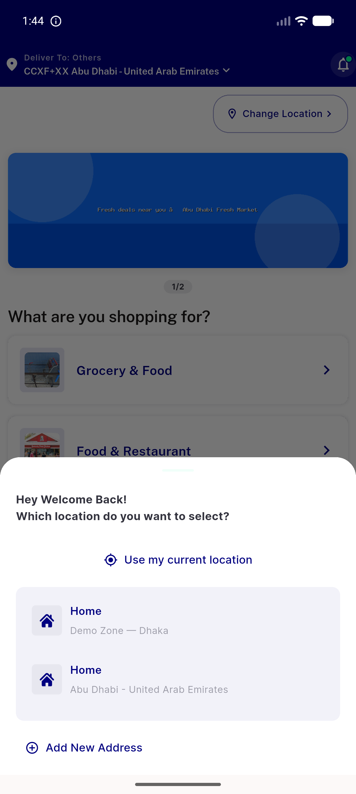</a> address select light</td>
<td align="center" width="33%"><a href="01-home-light.png">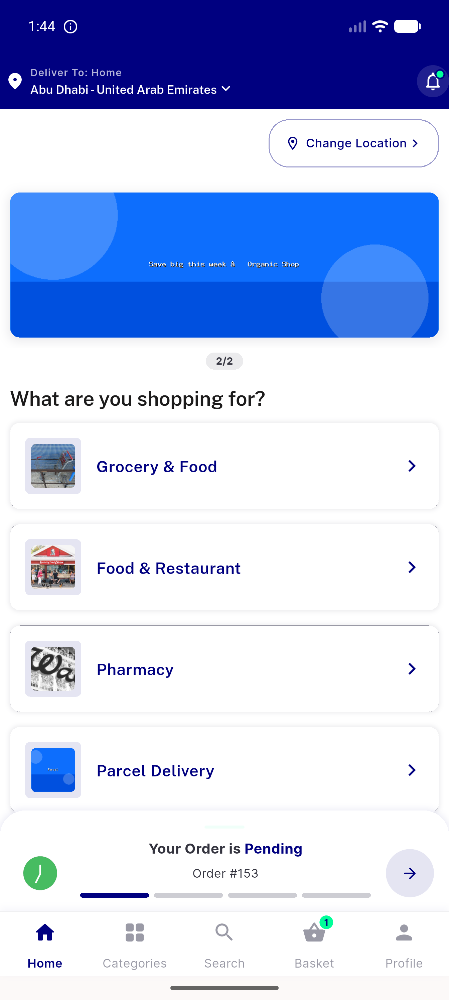</a> home light</td>
<td align="center" width="33%"><a href="02-home-stores-cards-light.png">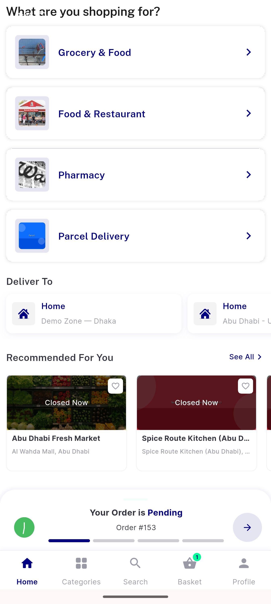</a> home stores cards light</td>
</tr>
<tr>
<td align="center" width="33%"><a href="03-store-detail-light.png">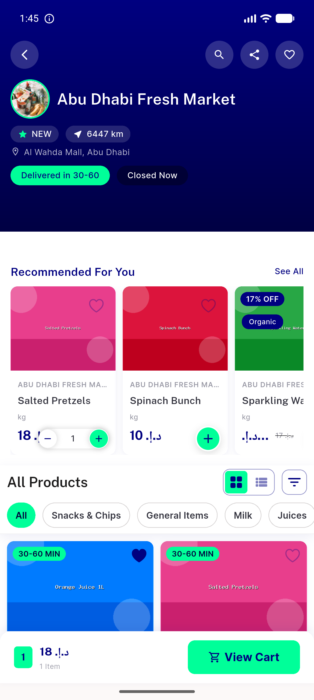</a> store detail light</td>
<td align="center" width="33%"><a href="04-item-detail-qtystepper-light.png">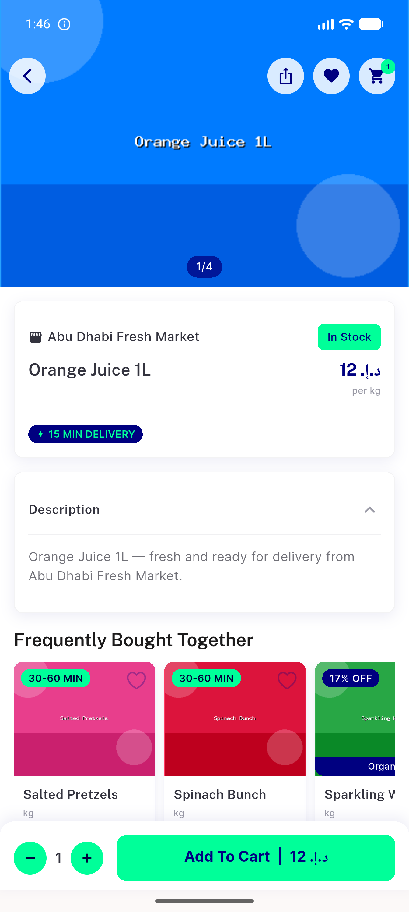</a> item detail qtystepper light</td>
<td align="center" width="33%"><a href="05-item-qty-incremented-light.png">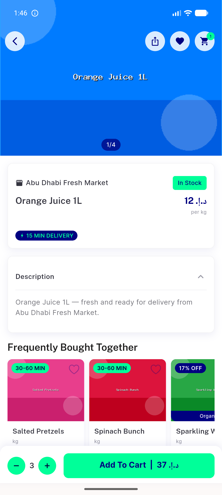</a> item qty incremented light</td>
</tr>
<tr>
<td align="center" width="33%"><a href="06-basket-light.png">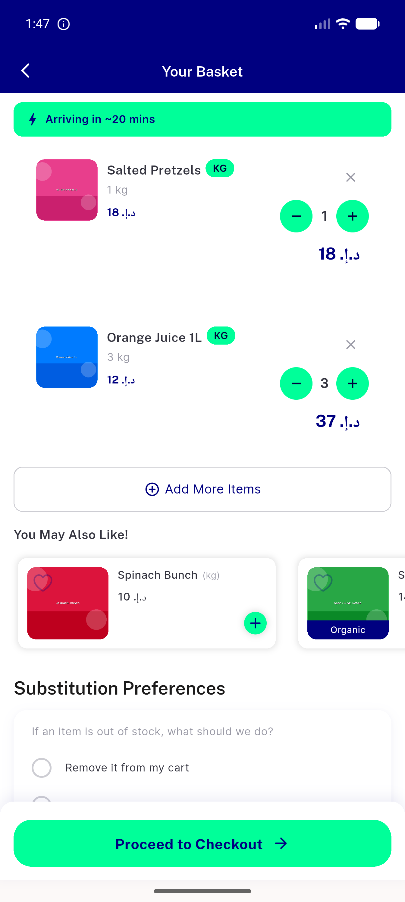</a> basket light</td>
<td align="center" width="33%"><a href="07-checkout-light.png">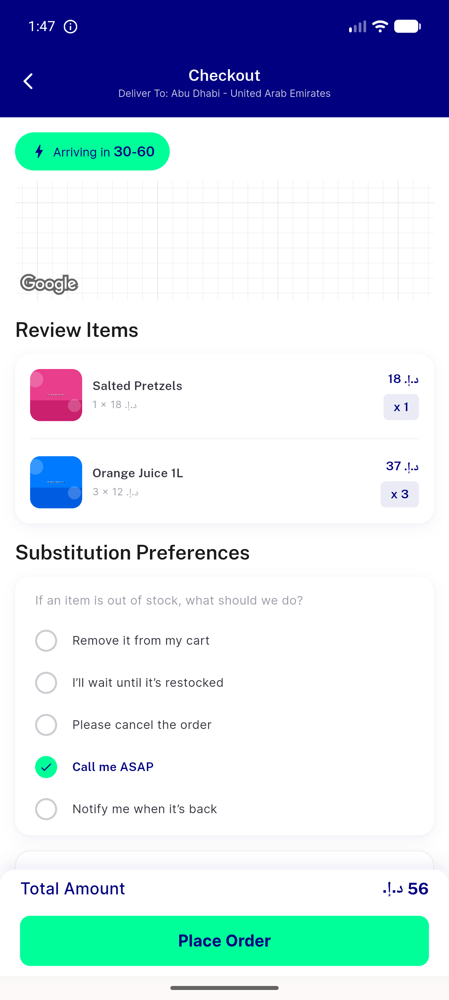</a> checkout light</td>
<td align="center" width="33%"><a href="08-profile-menu-light.png">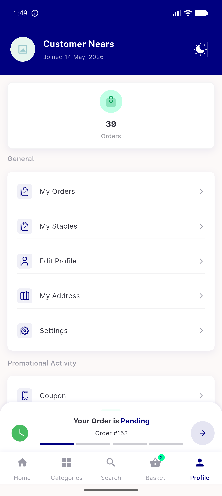</a> profile menu light</td>
</tr>
<tr>
<td align="center" width="33%"><a href="09-my-orders-light.png">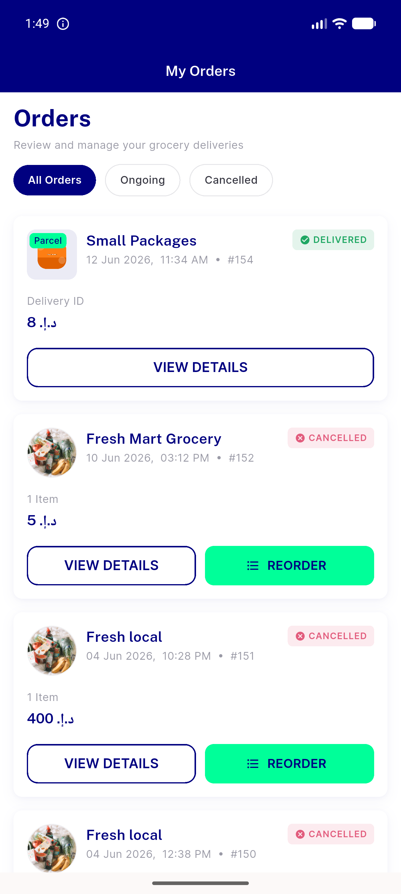</a> my orders light</td>
<td align="center" width="33%"> settings light</td>
<td align="center" width="33%"><a href="11-settings-dark.png">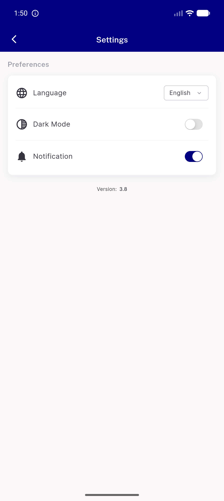</a> settings dark</td>
</tr>
<tr>
<td align="center" width="33%"><a href="12-home-dark.png">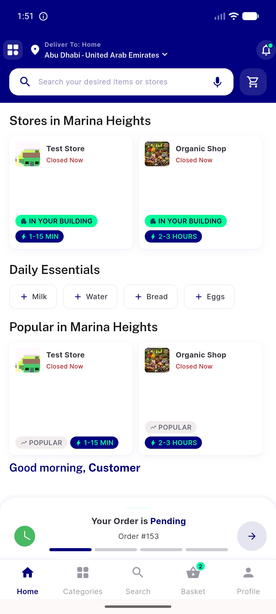</a> home dark</td>
<td align="center" width="33%"><a href="13-home-stores-dark.png">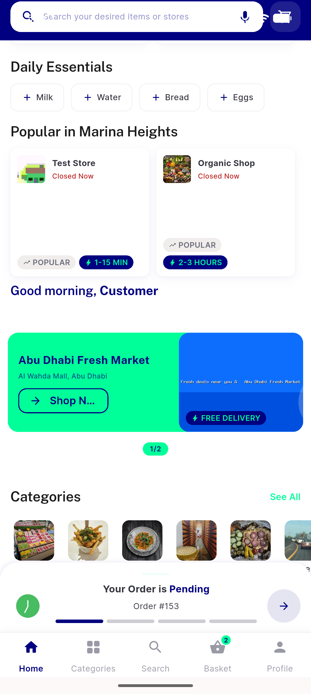</a> home stores dark</td>
<td align="center" width="33%"><a href="14-store-detail-dark.png">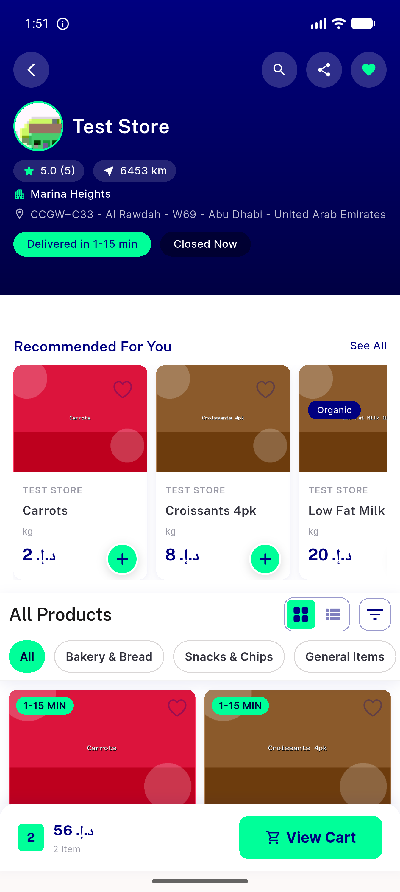</a> store detail dark</td>
</tr>
<tr>
<td align="center" width="33%"><a href="15-item-detail-dark.png">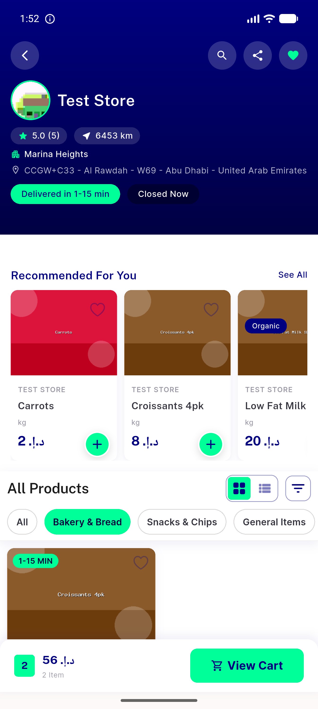</a> item detail dark</td>
<td align="center" width="33%"><a href="16-home-rtl-arabic-dark.png">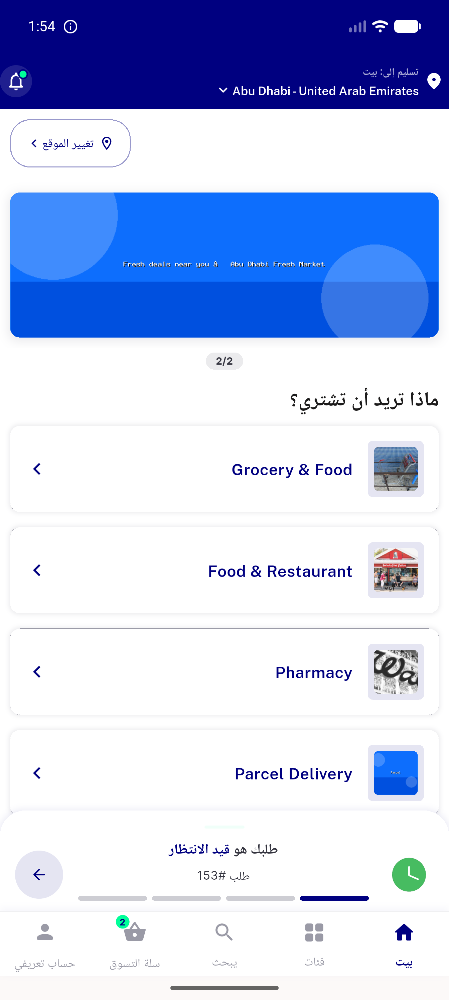</a> home rtl arabic dark</td>
<td align="center" width="33%"><a href="17-home-rtl-stores-dark.png">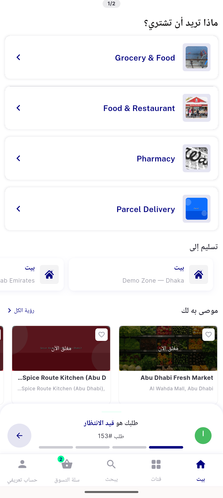</a> home rtl stores dark</td>
</tr>
<tr>
<td align="center" width="33%"><a href="18-edit-profile-form-light.png">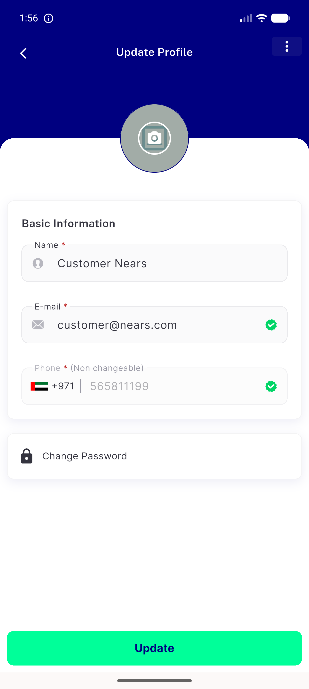</a> edit profile form light</td>
</tr>
</table>

### Other artifacts
- [`progress.md`](progress.md)

---
*From `nears/docs/qa-evidence/NEARS-394/` · public-repo scrub policy (no live secrets; verified clean).*
