# QA Evidence — NEARS-3940

**QA cycle 0: COD full-amount verdict (head cfd6b9341 vs base f04c3a21b)**

**15 screenshot(s).** Click any thumbnail for full resolution.

<table>
<tr>
<td align="center" width="33%"><a href="01-base-cod-offered-cap27.50.png">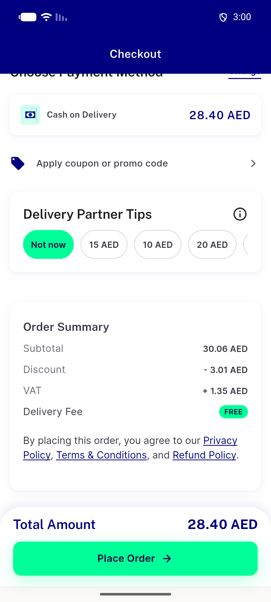</a> base cod offered cap27.50</td>
<td align="center" width="33%"><a href="01-base-confirm-sheet-cod.png">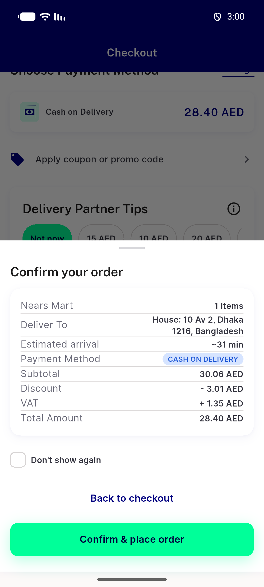</a> base confirm sheet cod</td>
<td align="center" width="33%"><a href="01-base-order-failed-203.png">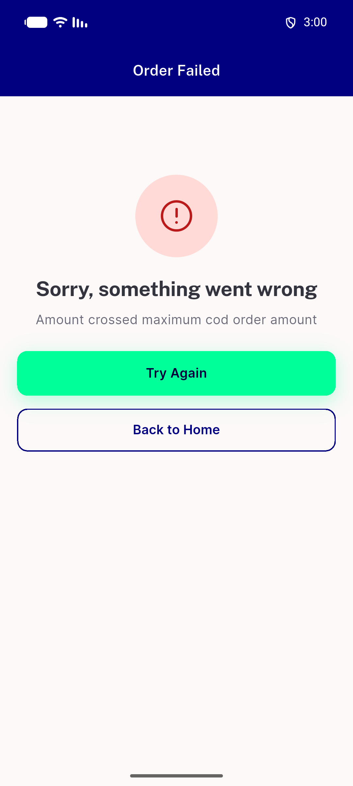</a> base order failed 203</td>
</tr>
<tr>
<td align="center" width="33%"><a href="01-head-cash-hidden-cap27.50.png">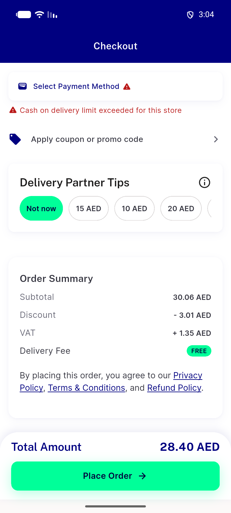</a> head cash hidden cap27.50</td>
<td align="center" width="33%"> head cash offered cap29.40</td>
<td align="center" width="33%"><a href="04-head-tip-over-cap-pick-reset.png">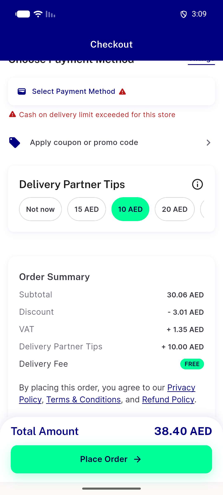</a> head tip over cap pick reset</td>
</tr>
<tr>
<td align="center" width="33%"><a href="06-head-fail-open-refused-203.png">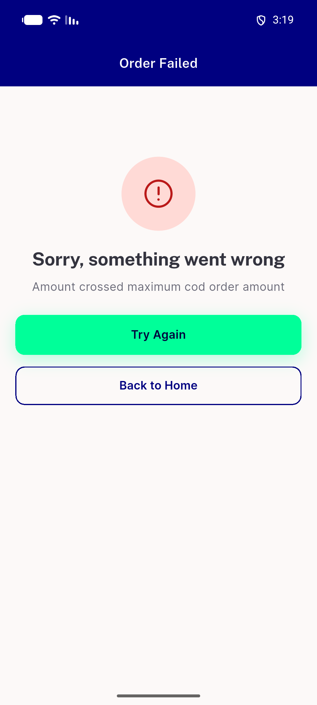</a> head fail open refused 203</td>
<td align="center" width="33%"> head verdict 500 cash kept</td>
<td align="center" width="33%"><a href="08-head-packaging-rekey-cash-hidden.png">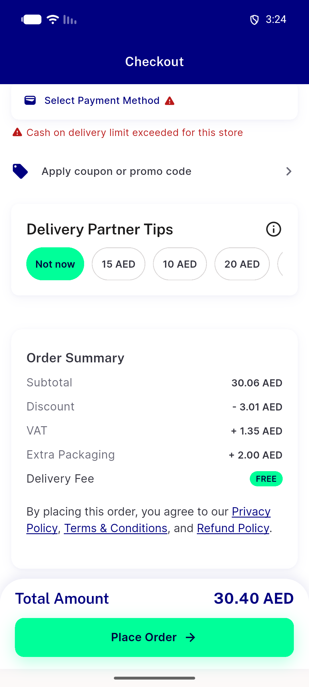</a> head packaging rekey cash hidden</td>
</tr>
<tr>
<td align="center" width="33%"><a href="10-head-fee-payable-cap29.39-hidden.png">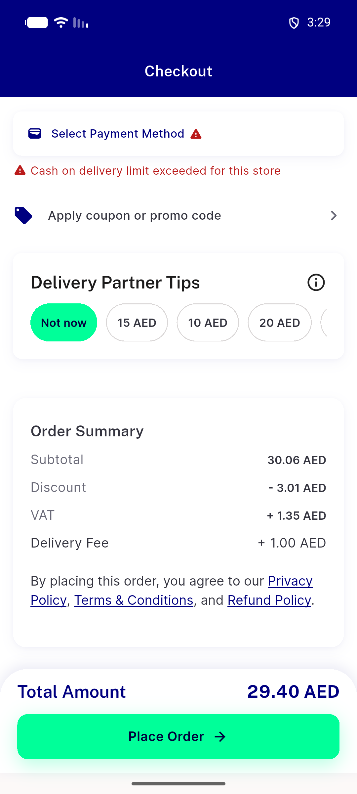</a> head fee payable cap29.39 hidden</td>
<td align="center" width="33%"><a href="10-head-tax-included-cash-offered.png">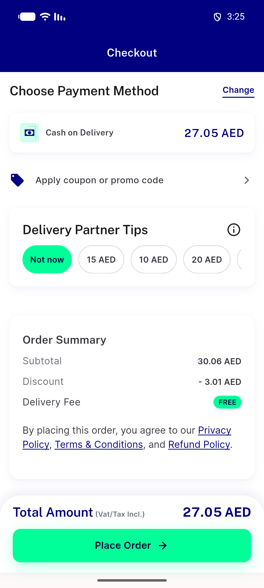</a> head tax included cash offered</td>
<td align="center" width="33%"><a href="11-head-cashonly-nomethod-precedence.png">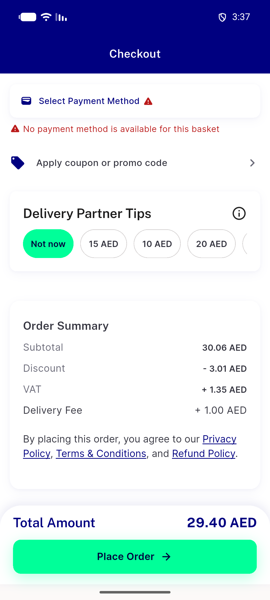</a> head cashonly nomethod precedence</td>
</tr>
<tr>
<td align="center" width="33%"><a href="11-head-multistore-cash-unchanged.png">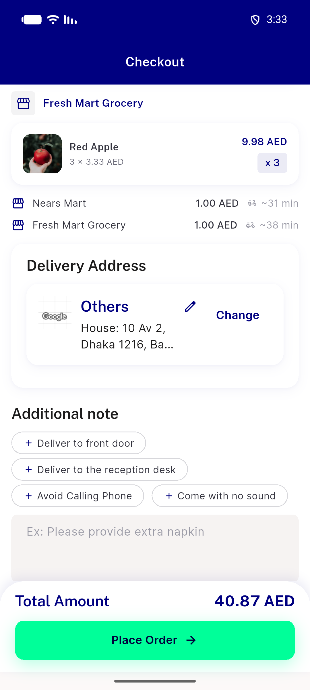</a> head multistore cash unchanged</td>
<td align="center" width="33%"><a href="12-head-rtl-arabic-cod-limit-row.png">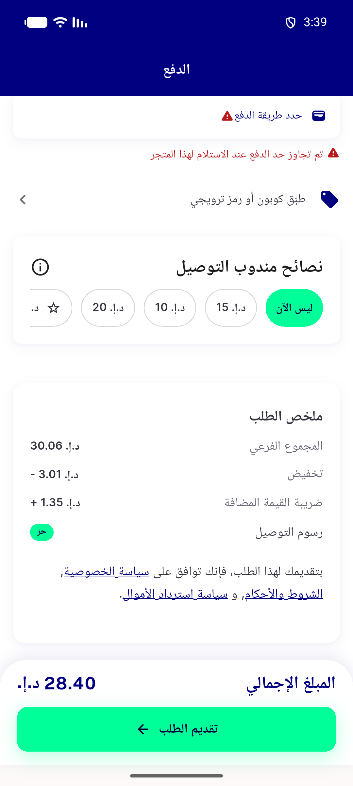</a> head rtl arabic cod limit row</td>
<td align="center" width="33%"> head nocap cash offered</td>
</tr>
</table>

### Other artifacts
- [`01-base-cod-offered-cap27.50.xml`](01-base-cod-offered-cap27.50.xml)
- [`01-base-order-failed-203.xml`](01-base-order-failed-203.xml)
- [`01-base-red-app-lines.log.txt`](01-base-red-app-lines.log.txt)
- [`01-head-cash-hidden-cap27.50.xml`](01-head-cash-hidden-cap27.50.xml)
- [`01-head-payment-sheet-no-cash.xml`](01-head-payment-sheet-no-cash.xml)
- [`04-head-tip-over-cap.xml`](04-head-tip-over-cap.xml)
- [`06-head-verdict-500-cash-kept.xml`](06-head-verdict-500-cash-kept.xml)
- [`08-head-packaging-rekey.xml`](08-head-packaging-rekey.xml)
- [`11-head-cashonly-nomethod-precedence.xml`](11-head-cashonly-nomethod-precedence.xml)
- [`12-head-rtl-arabic.xml`](12-head-rtl-arabic.xml)
- [`12-rtl-pixel-analysis.txt`](12-rtl-pixel-analysis.txt)
- [`app-head-all-flutter-lines-part1.log.txt`](app-head-all-flutter-lines-part1.log.txt)
- [`app-head-all-flutter-lines-part2.log.txt`](app-head-all-flutter-lines-part2.log.txt)
- [`app-head-cell11-cashonly.log.txt`](app-head-cell11-cashonly.log.txt)
- [`app-head-cell11-mixed.log.txt`](app-head-cell11-mixed.log.txt)
- [`app-head-cell11-multistore.log.txt`](app-head-cell11-multistore.log.txt)
- [`app-head-cell5-rapid.log.txt`](app-head-cell5-rapid.log.txt)
- [`app-head-cell6-fail-open.log.txt`](app-head-cell6-fail-open.log.txt)
- [`bug-refusal-203-no-fail-log.log`](bug-refusal-203-no-fail-log.log)
- [`flutter-test-checkout.log.txt`](flutter-test-checkout.log.txt)
- [`progress.md`](progress.md)
- [`proxy-base-red.log.txt`](proxy-base-red.log.txt)
- [`proxy-harness.py.txt`](proxy-harness.py.txt)
- [`proxy-head-boundary-2839.log.txt`](proxy-head-boundary-2839.log.txt)
- [`proxy-head-cell10-fee-payable.log.txt`](proxy-head-cell10-fee-payable.log.txt)
- [`proxy-head-cell11-mixed.log.txt`](proxy-head-cell11-mixed.log.txt)
- [`proxy-head-cell11-multistore.log.txt`](proxy-head-cell11-multistore.log.txt)
- [`proxy-head-cell15-nocap.log.txt`](proxy-head-cell15-nocap.log.txt)
- [`proxy-head-cell5-rapid-changes.log.txt`](proxy-head-cell5-rapid-changes.log.txt)
- [`proxy-head-cell6-recovery.log.txt`](proxy-head-cell6-recovery.log.txt)
- [`proxy-head-cell8-packaging.log.txt`](proxy-head-cell8-packaging.log.txt)
- [`proxy-head-headline.log.txt`](proxy-head-headline.log.txt)
- [`shared-db-untouched.txt`](shared-db-untouched.txt)

---
*From `nears/docs/qa-evidence/NEARS-3940/` · public-repo scrub policy (no live secrets; verified clean).*
