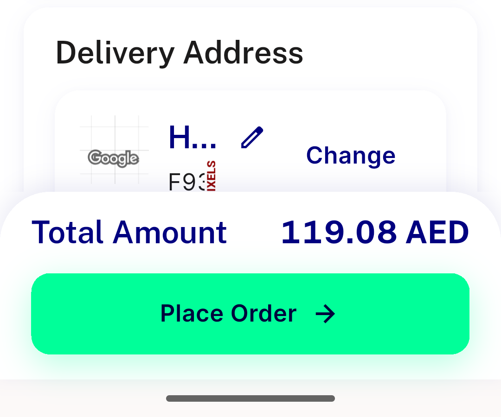
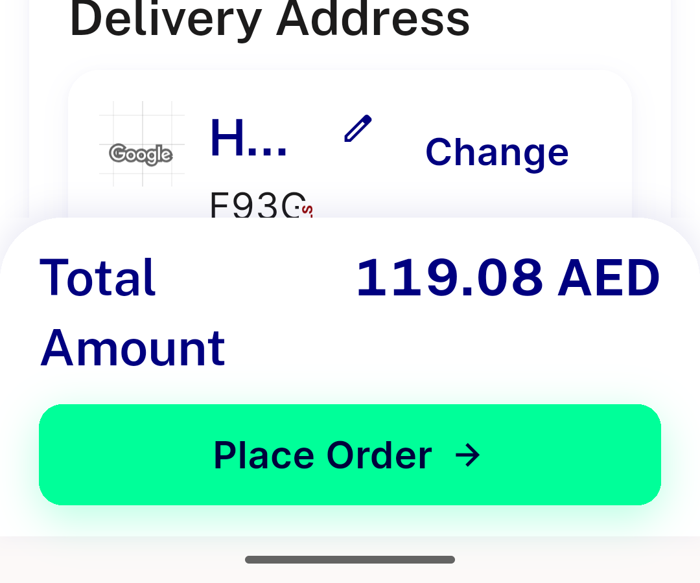
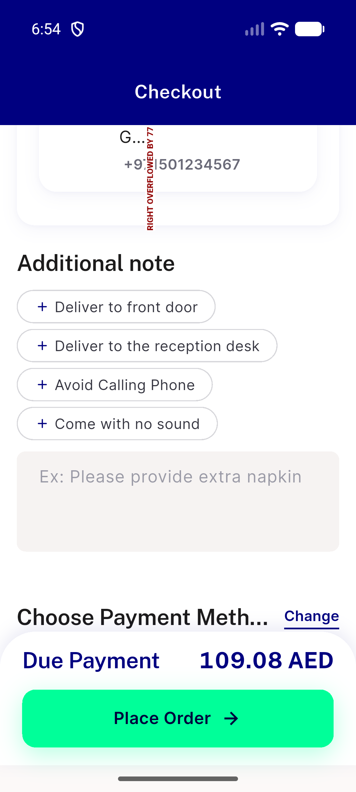
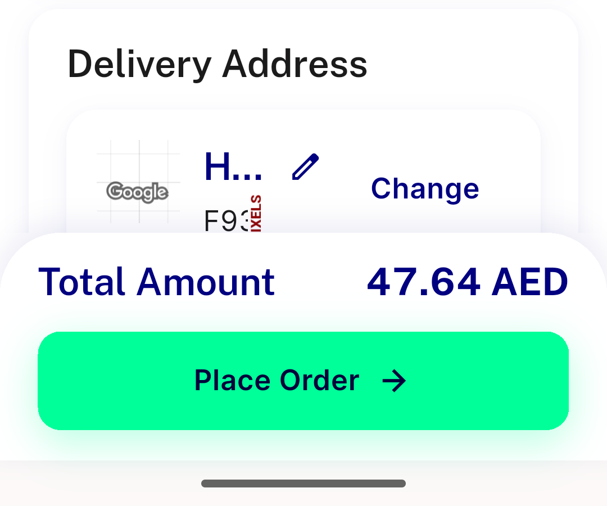
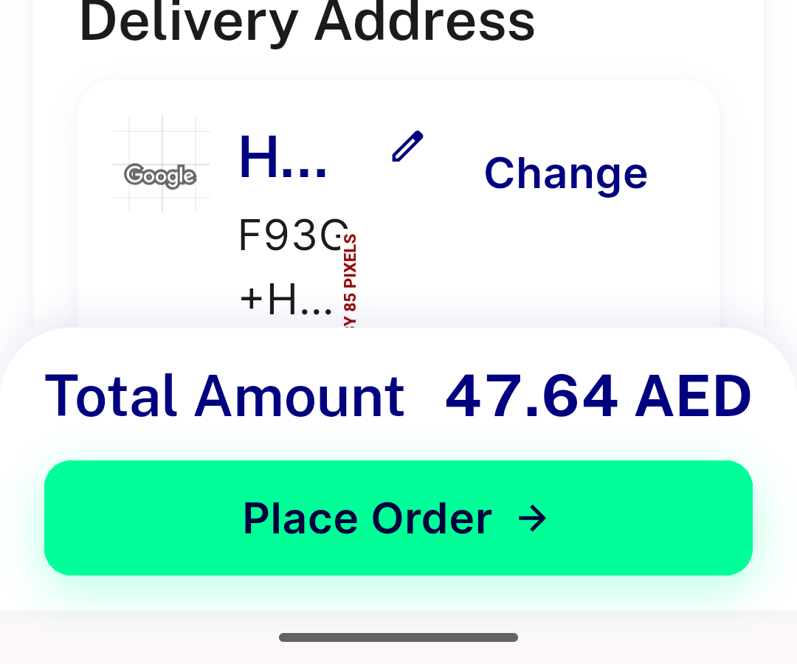
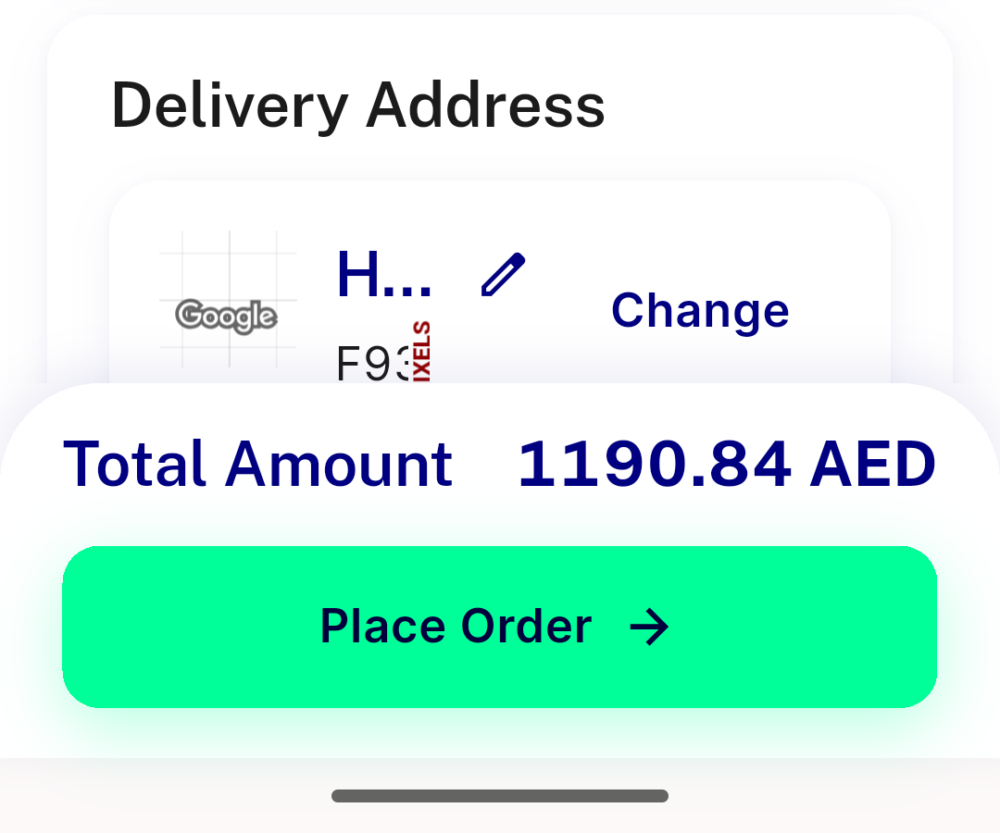
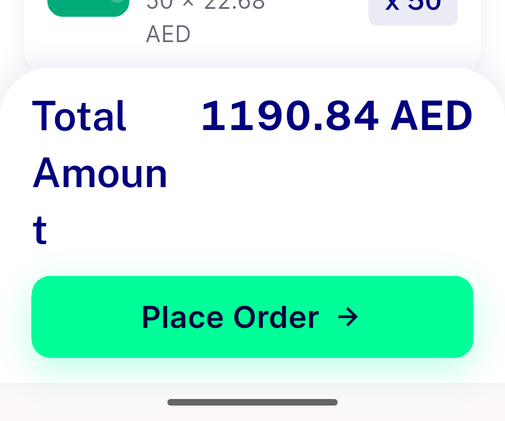
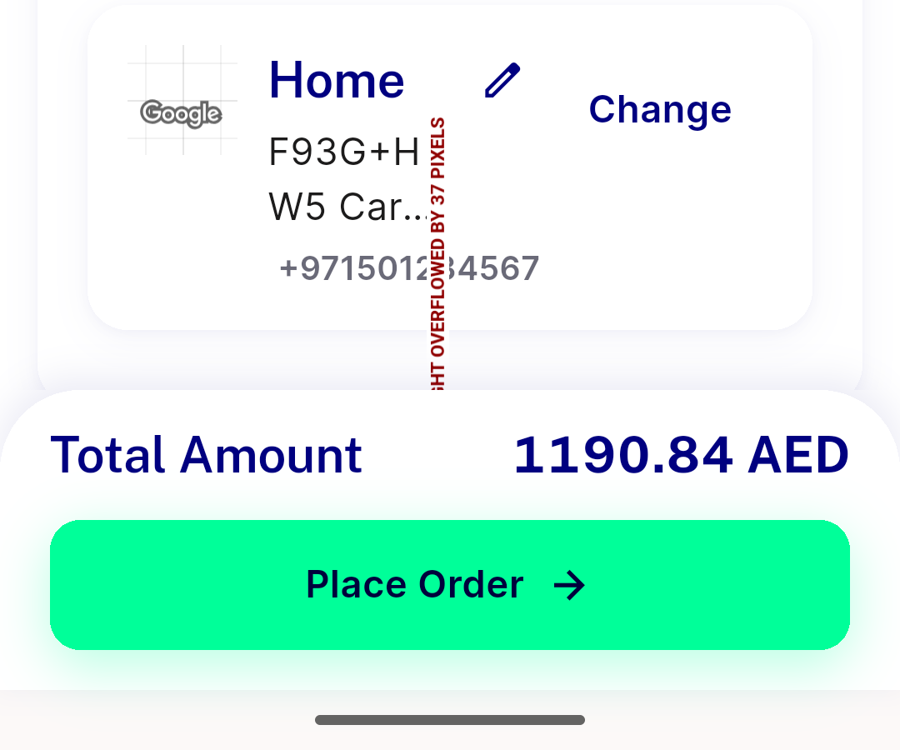
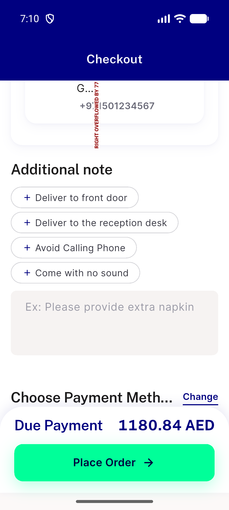
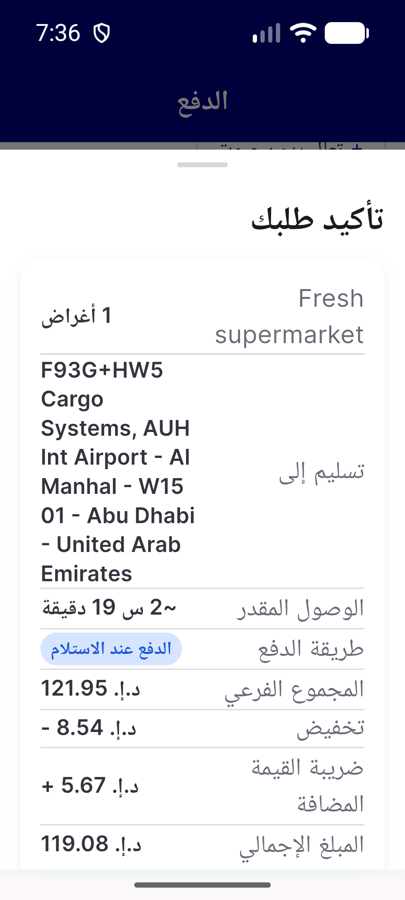

# QA Evidence — NEARS-3941

**post-fix full QA PASS (sha 6d32183a7): sticky Total row zero overflow 320/360dp x1.0/1.3 EN+AR; fix- prefixed**

**130 screenshot(s).** Click any thumbnail for full resolution.

<table>
<tr>
<td align="center" width="33%"> en 320dp 1.3x total106.90 nontax bar crop</td>
<td align="center" width="33%"> en 320dp 1.3x total106.90 nontax</td>
<td align="center" width="33%"> en 320dp 1.3x ac3 labels</td>
</tr>
<tr>
<td align="center" width="33%"> en 320dp 1.0x fresh entry bar crop</td>
<td align="center" width="33%"> en 320dp 1.0x fresh entry</td>
<td align="center" width="33%"> en 360dp 1.0x fresh entry bar crop</td>
</tr>
<tr>
<td align="center" width="33%"> en 360dp 1.0x fresh entry</td>
<td align="center" width="33%"> en 320dp 1.3x fresh entry nontax 112.25 bar crop</td>
<td align="center" width="33%"> en 320dp 1.3x fresh entry nontax 112.25</td>
</tr>
<tr>
<td align="center" width="33%"> en 320dp 1.3x taxincl fresh entry bar crop</td>
<td align="center" width="33%"> en 320dp 1.3x taxincl fresh entry</td>
<td align="center" width="33%"> en 320dp 1.3x taxincl reentry bar crop</td>
</tr>
<tr>
<td align="center" width="33%"> en 320dp 1.3x taxincl reentry</td>
<td align="center" width="33%"> en 320dp 1.3x nontax 4digit 1134 bar crop</td>
<td align="center" width="33%"> en 320dp 1.3x nontax 4digit 1134</td>
</tr>
<tr>
<td align="center" width="33%"> en 320dp 1.3x due payment 4digit 1180 bar crop</td>
<td align="center" width="33%"> en 320dp 1.3x due payment 4digit 1180</td>
<td align="center" width="33%"> ar 320dp 1.3x nontax 4digit bar crop</td>
</tr>
<tr>
<td align="center" width="33%"> ar 320dp 1.3x nontax 4digit</td>
<td align="center" width="33%"> ar 320dp 1.3x nontax 3digit bar crop</td>
<td align="center" width="33%"> ar 320dp 1.3x nontax 3digit</td>
</tr>
<tr>
<td align="center" width="33%"> ar 320dp 1.3x ac3 labels</td>
<td align="center" width="33%"> en 320dp 1.3x nontax 2digit ticket shape bar crop</td>
<td align="center" width="33%"> en 320dp 1.3x nontax 2digit ticket shape</td>
</tr>
<tr>
<td align="center" width="33%"> en 360dp 1.3x nontax 2digit bar crop</td>
<td align="center" width="33%"> en 360dp 1.3x nontax 2digit</td>
<td align="center" width="33%"> fix A nontax 3d EN 320dp 1.0x bar crop</td>
</tr>
<tr>
<td align="center" width="33%"> fix A nontax 3d EN 320dp 1.0x</td>
<td align="center" width="33%"> fix A nontax 3d EN 320dp 1.3x bar crop</td>
<td align="center" width="33%"> fix A nontax 3d EN 320dp 1.3x</td>
</tr>
<tr>
<td align="center" width="33%"> fix A nontax 3d EN 360dp 1.0x bar crop</td>
<td align="center" width="33%"> fix A nontax 3d EN 360dp 1.0x</td>
<td align="center" width="33%"> fix A nontax 3d EN 360dp 1.3x bar crop</td>
</tr>
<tr>
<td align="center" width="33%"> fix A nontax 3d EN 360dp 1.3x</td>
<td align="center" width="33%"> fix B taxincl 3d EN 320dp 1.0x bar crop</td>
<td align="center" width="33%"> fix B taxincl 3d EN 320dp 1.0x</td>
</tr>
<tr>
<td align="center" width="33%"> fix B taxincl 3d EN 320dp 1.3x bar crop</td>
<td align="center" width="33%"> fix B taxincl 3d EN 320dp 1.3x</td>
<td align="center" width="33%"> fix B taxincl 3d EN 360dp 1.0x bar crop</td>
</tr>
<tr>
<td align="center" width="33%"> fix B taxincl 3d EN 360dp 1.0x</td>
<td align="center" width="33%"> fix B taxincl 3d EN 360dp 1.3x bar crop</td>
<td align="center" width="33%"> fix B taxincl 3d EN 360dp 1.3x</td>
</tr>
<tr>
<td align="center" width="33%"> fix C duepay 3d EN 320dp 1.0x bar crop</td>
<td align="center" width="33%"> fix C duepay 3d EN 320dp 1.0x</td>
<td align="center" width="33%"> fix C duepay 3d EN 320dp 1.3x bar crop</td>
</tr>
<tr>
<td align="center" width="33%"> fix C duepay 3d EN 320dp 1.3x</td>
<td align="center" width="33%"> fix C duepay 3d EN 360dp 1.0x bar crop</td>
<td align="center" width="33%"> fix C duepay 3d EN 360dp 1.0x</td>
</tr>
<tr>
<td align="center" width="33%"> fix C duepay 3d EN 360dp 1.3x bar crop</td>
<td align="center" width="33%"> fix C duepay 3d EN 360dp 1.3x</td>
<td align="center" width="33%"> fix D nontax 2d EN 320dp 1.0x bar crop</td>
</tr>
<tr>
<td align="center" width="33%"> fix D nontax 2d EN 320dp 1.0x</td>
<td align="center" width="33%"> fix D nontax 2d EN 320dp 1.3x bar crop</td>
<td align="center" width="33%"> fix D nontax 2d EN 320dp 1.3x</td>
</tr>
<tr>
<td align="center" width="33%"> fix D nontax 2d EN 360dp 1.0x bar crop</td>
<td align="center" width="33%"> fix D nontax 2d EN 360dp 1.0x</td>
<td align="center" width="33%"> fix D nontax 2d EN 360dp 1.3x bar crop</td>
</tr>
<tr>
<td align="center" width="33%"> fix D nontax 2d EN 360dp 1.3x</td>
<td align="center" width="33%"> fix E nontax 4d EN 320dp 1.0x bar crop</td>
<td align="center" width="33%"> fix E nontax 4d EN 320dp 1.0x</td>
</tr>
<tr>
<td align="center" width="33%"> fix E nontax 4d EN 320dp 1.3x bar crop</td>
<td align="center" width="33%"> fix E nontax 4d EN 320dp 1.3x</td>
<td align="center" width="33%"> fix E nontax 4d EN 360dp 1.0x bar crop</td>
</tr>
<tr>
<td align="center" width="33%"> fix E nontax 4d EN 360dp 1.0x</td>
<td align="center" width="33%"> fix E nontax 4d EN 360dp 1.3x bar crop</td>
<td align="center" width="33%"> fix E nontax 4d EN 360dp 1.3x</td>
</tr>
<tr>
<td align="center" width="33%"> fix F duepay 4d EN 320dp 1.0x bar crop</td>
<td align="center" width="33%"> fix F duepay 4d EN 320dp 1.0x</td>
<td align="center" width="33%"> fix F duepay 4d EN 320dp 1.3x bar crop</td>
</tr>
<tr>
<td align="center" width="33%"> fix F duepay 4d EN 320dp 1.3x</td>
<td align="center" width="33%"> fix F duepay 4d EN 360dp 1.0x bar crop</td>
<td align="center" width="33%"> fix F duepay 4d EN 360dp 1.0x</td>
</tr>
<tr>
<td align="center" width="33%"> fix F duepay 4d EN 360dp 1.3x bar crop</td>
<td align="center" width="33%"> fix F duepay 4d EN 360dp 1.3x</td>
<td align="center" width="33%"> fix G ac3 EN 320dp 1.3x labels</td>
</tr>
<tr>
<td align="center" width="33%"> fix G ac3 EN 320dp 1.3x labels2</td>
<td align="center" width="33%"> fix H nontax 4d AR 320dp 1.0x bar crop</td>
<td align="center" width="33%"> fix H nontax 4d AR 320dp 1.0x</td>
</tr>
<tr>
<td align="center" width="33%"> fix H nontax 4d AR 320dp 1.3x bar crop</td>
<td align="center" width="33%"> fix H nontax 4d AR 320dp 1.3x</td>
<td align="center" width="33%"> fix H nontax 4d AR 360dp 1.0x bar crop</td>
</tr>
<tr>
<td align="center" width="33%"> fix H nontax 4d AR 360dp 1.0x</td>
<td align="center" width="33%"> fix H nontax 4d AR 360dp 1.3x bar crop</td>
<td align="center" width="33%"> fix H nontax 4d AR 360dp 1.3x</td>
</tr>
<tr>
<td align="center" width="33%"> fix I duepay 4d AR 320dp 1.0x bar crop</td>
<td align="center" width="33%"> fix I duepay 4d AR 320dp 1.0x</td>
<td align="center" width="33%"> fix I duepay 4d AR 320dp 1.3x bar crop</td>
</tr>
<tr>
<td align="center" width="33%"> fix I duepay 4d AR 320dp 1.3x</td>
<td align="center" width="33%"> fix I duepay 4d AR 360dp 1.0x bar crop</td>
<td align="center" width="33%"> fix I duepay 4d AR 360dp 1.0x</td>
</tr>
<tr>
<td align="center" width="33%"> fix I duepay 4d AR 360dp 1.3x bar crop</td>
<td align="center" width="33%"> fix I duepay 4d AR 360dp 1.3x</td>
<td align="center" width="33%"> fix J ac3 AR 320dp 1.3x labels</td>
</tr>
<tr>
<td align="center" width="33%"> fix J ac3 AR 320dp 1.3x labels2</td>
<td align="center" width="33%"> fix K nontax 3d AR 320dp 1.0x bar crop</td>
<td align="center" width="33%"> fix K nontax 3d AR 320dp 1.0x</td>
</tr>
<tr>
<td align="center" width="33%"> fix K nontax 3d AR 320dp 1.3x bar crop</td>
<td align="center" width="33%"> fix K nontax 3d AR 320dp 1.3x</td>
<td align="center" width="33%"> fix K nontax 3d AR 360dp 1.0x bar crop</td>
</tr>
<tr>
<td align="center" width="33%"> fix K nontax 3d AR 360dp 1.0x</td>
<td align="center" width="33%"> fix K nontax 3d AR 360dp 1.3x bar crop</td>
<td align="center" width="33%"> fix K nontax 3d AR 360dp 1.3x</td>
</tr>
<tr>
<td align="center" width="33%"> fix L taxincl 3d AR 320dp 1.0x bar crop</td>
<td align="center" width="33%"> fix L taxincl 3d AR 320dp 1.0x</td>
<td align="center" width="33%"> fix L taxincl 3d AR 320dp 1.3x bar crop</td>
</tr>
<tr>
<td align="center" width="33%"> fix L taxincl 3d AR 320dp 1.3x</td>
<td align="center" width="33%"> fix L taxincl 3d AR 360dp 1.0x bar crop</td>
<td align="center" width="33%"> fix L taxincl 3d AR 360dp 1.0x</td>
</tr>
<tr>
<td align="center" width="33%"> fix L taxincl 3d AR 360dp 1.3x bar crop</td>
<td align="center" width="33%"> fix L taxincl 3d AR 360dp 1.3x</td>
<td align="center" width="33%"> fix M ar 320dp 1.3x taxincl3d left nontax4d right bar pair</td>
</tr>
<tr>
<td align="center" width="33%"> fix N duepay 3d AR 320dp 1.0x bar crop</td>
<td align="center" width="33%"> fix N duepay 3d AR 320dp 1.0x</td>
<td align="center" width="33%"> fix N duepay 3d AR 320dp 1.3x bar crop</td>
</tr>
<tr>
<td align="center" width="33%"> fix N duepay 3d AR 320dp 1.3x</td>
<td align="center" width="33%"> fix N duepay 3d AR 360dp 1.0x bar crop</td>
<td align="center" width="33%"> fix N duepay 3d AR 360dp 1.0x</td>
</tr>
<tr>
<td align="center" width="33%"> fix N duepay 3d AR 360dp 1.3x bar crop</td>
<td align="center" width="33%"> fix N duepay 3d AR 360dp 1.3x</td>
<td align="center" width="33%"> fix O nontax 2d AR 320dp 1.0x bar crop</td>
</tr>
<tr>
<td align="center" width="33%"> fix O nontax 2d AR 320dp 1.0x</td>
<td align="center" width="33%"> fix O nontax 2d AR 320dp 1.3x bar crop</td>
<td align="center" width="33%"> fix O nontax 2d AR 320dp 1.3x</td>
</tr>
<tr>
<td align="center" width="33%"> fix O nontax 2d AR 360dp 1.0x bar crop</td>
<td align="center" width="33%"> fix O nontax 2d AR 360dp 1.0x</td>
<td align="center" width="33%"> fix O nontax 2d AR 360dp 1.3x bar crop</td>
</tr>
<tr>
<td align="center" width="33%"> fix O nontax 2d AR 360dp 1.3x</td>
<td align="center" width="33%"> fix P before vs after 320dp 1.3x nontax 3d EN bar pair</td>
<td align="center" width="33%"> fix P before vs after 360dp 1.0x nontax EN bar pair</td>
</tr>
<tr>
<td align="center" width="33%"> fix R regress place order confirm sheet AR 320dp 1.3x</td>
</tr>
</table>

### Other artifacts
- [`03-en-320dp-1.3x-ac3-dump.xml`](03-en-320dp-1.3x-ac3-dump.xml)
- [`06-en-320dp-1.0x-fresh-entry-dump.xml`](06-en-320dp-1.0x-fresh-entry-dump.xml)
- [`06-en-320dp-1.0x-fresh-entry-overflow.log`](06-en-320dp-1.0x-fresh-entry-overflow.log)
- [`07-en-360dp-1.0x-fresh-entry-dump.xml`](07-en-360dp-1.0x-fresh-entry-dump.xml)
- [`07-en-360dp-1.0x-fresh-entry-overflow.log`](07-en-360dp-1.0x-fresh-entry-overflow.log)
- [`08-en-320dp-1.3x-fresh-entry-nontax-112.25-dump.xml`](08-en-320dp-1.3x-fresh-entry-nontax-112.25-dump.xml)
- [`08-en-320dp-1.3x-fresh-entry-nontax-112.25-overflow.log`](08-en-320dp-1.3x-fresh-entry-nontax-112.25-overflow.log)
- [`09-en-320dp-1.3x-taxincl-fresh-entry-dump.xml`](09-en-320dp-1.3x-taxincl-fresh-entry-dump.xml)
- [`09-en-320dp-1.3x-taxincl-fresh-entry-overflow.log`](09-en-320dp-1.3x-taxincl-fresh-entry-overflow.log)
- [`10-en-320dp-1.3x-taxincl-reentry-dump.xml`](10-en-320dp-1.3x-taxincl-reentry-dump.xml)
- [`10-en-320dp-1.3x-taxincl-reentry-overflow.log`](10-en-320dp-1.3x-taxincl-reentry-overflow.log)
- [`11-en-320dp-1.3x-nontax-4digit-1134-dump.xml`](11-en-320dp-1.3x-nontax-4digit-1134-dump.xml)
- [`11-en-320dp-1.3x-nontax-4digit-1134-overflow.log`](11-en-320dp-1.3x-nontax-4digit-1134-overflow.log)
- [`12-en-320dp-1.3x-due-payment-4digit-1180-dump.xml`](12-en-320dp-1.3x-due-payment-4digit-1180-dump.xml)
- [`12-en-320dp-1.3x-due-payment-4digit-1180-overflow.log`](12-en-320dp-1.3x-due-payment-4digit-1180-overflow.log)
- [`13-ar-320dp-1.3x-nontax-4digit-dump.xml`](13-ar-320dp-1.3x-nontax-4digit-dump.xml)
- [`13-ar-320dp-1.3x-nontax-4digit-overflow.log`](13-ar-320dp-1.3x-nontax-4digit-overflow.log)
- [`14-ar-320dp-1.3x-nontax-3digit-dump.xml`](14-ar-320dp-1.3x-nontax-3digit-dump.xml)
- [`14-ar-320dp-1.3x-nontax-3digit-overflow.log`](14-ar-320dp-1.3x-nontax-3digit-overflow.log)
- [`15-ar-320dp-1.3x-ac3-labels-dump.xml`](15-ar-320dp-1.3x-ac3-labels-dump.xml)
- [`15-ar-320dp-1.3x-ac3-labels-overflow.log`](15-ar-320dp-1.3x-ac3-labels-overflow.log)
- [`16-en-320dp-1.3x-nontax-2digit-ticket-shape-dump.xml`](16-en-320dp-1.3x-nontax-2digit-ticket-shape-dump.xml)
- [`16-en-320dp-1.3x-nontax-2digit-ticket-shape-overflow.log`](16-en-320dp-1.3x-nontax-2digit-ticket-shape-overflow.log)
- [`17-en-360dp-1.3x-nontax-2digit-dump.xml`](17-en-360dp-1.3x-nontax-2digit-dump.xml)
- [`17-en-360dp-1.3x-nontax-2digit-overflow.log`](17-en-360dp-1.3x-nontax-2digit-overflow.log)
- [`fix-A-nontax-3d-EN-320dp-1.0x-dump.xml`](fix-A-nontax-3d-EN-320dp-1.0x-dump.xml)
- [`fix-A-nontax-3d-EN-320dp-1.0x-overflow.log`](fix-A-nontax-3d-EN-320dp-1.0x-overflow.log)
- [`fix-A-nontax-3d-EN-320dp-1.3x-dump.xml`](fix-A-nontax-3d-EN-320dp-1.3x-dump.xml)
- [`fix-A-nontax-3d-EN-320dp-1.3x-overflow.log`](fix-A-nontax-3d-EN-320dp-1.3x-overflow.log)
- [`fix-A-nontax-3d-EN-360dp-1.0x-dump.xml`](fix-A-nontax-3d-EN-360dp-1.0x-dump.xml)
- [`fix-A-nontax-3d-EN-360dp-1.0x-overflow.log`](fix-A-nontax-3d-EN-360dp-1.0x-overflow.log)
- [`fix-A-nontax-3d-EN-360dp-1.3x-dump.xml`](fix-A-nontax-3d-EN-360dp-1.3x-dump.xml)
- [`fix-A-nontax-3d-EN-360dp-1.3x-overflow.log`](fix-A-nontax-3d-EN-360dp-1.3x-overflow.log)
- [`fix-B-taxincl-3d-EN-320dp-1.0x-dump.xml`](fix-B-taxincl-3d-EN-320dp-1.0x-dump.xml)
- [`fix-B-taxincl-3d-EN-320dp-1.0x-overflow.log`](fix-B-taxincl-3d-EN-320dp-1.0x-overflow.log)
- [`fix-B-taxincl-3d-EN-320dp-1.3x-dump.xml`](fix-B-taxincl-3d-EN-320dp-1.3x-dump.xml)
- [`fix-B-taxincl-3d-EN-320dp-1.3x-overflow.log`](fix-B-taxincl-3d-EN-320dp-1.3x-overflow.log)
- [`fix-B-taxincl-3d-EN-360dp-1.0x-dump.xml`](fix-B-taxincl-3d-EN-360dp-1.0x-dump.xml)
- [`fix-B-taxincl-3d-EN-360dp-1.0x-overflow.log`](fix-B-taxincl-3d-EN-360dp-1.0x-overflow.log)
- [`fix-B-taxincl-3d-EN-360dp-1.3x-dump.xml`](fix-B-taxincl-3d-EN-360dp-1.3x-dump.xml)
- [`fix-B-taxincl-3d-EN-360dp-1.3x-overflow.log`](fix-B-taxincl-3d-EN-360dp-1.3x-overflow.log)
- [`fix-C-duepay-3d-EN-320dp-1.0x-dump.xml`](fix-C-duepay-3d-EN-320dp-1.0x-dump.xml)
- [`fix-C-duepay-3d-EN-320dp-1.0x-overflow.log`](fix-C-duepay-3d-EN-320dp-1.0x-overflow.log)
- [`fix-C-duepay-3d-EN-320dp-1.3x-dump.xml`](fix-C-duepay-3d-EN-320dp-1.3x-dump.xml)
- [`fix-C-duepay-3d-EN-320dp-1.3x-overflow.log`](fix-C-duepay-3d-EN-320dp-1.3x-overflow.log)
- [`fix-C-duepay-3d-EN-360dp-1.0x-dump.xml`](fix-C-duepay-3d-EN-360dp-1.0x-dump.xml)
- [`fix-C-duepay-3d-EN-360dp-1.0x-overflow.log`](fix-C-duepay-3d-EN-360dp-1.0x-overflow.log)
- [`fix-C-duepay-3d-EN-360dp-1.3x-dump.xml`](fix-C-duepay-3d-EN-360dp-1.3x-dump.xml)
- [`fix-C-duepay-3d-EN-360dp-1.3x-overflow.log`](fix-C-duepay-3d-EN-360dp-1.3x-overflow.log)
- [`fix-D-nontax-2d-EN-320dp-1.0x-dump.xml`](fix-D-nontax-2d-EN-320dp-1.0x-dump.xml)
- [`fix-D-nontax-2d-EN-320dp-1.0x-overflow.log`](fix-D-nontax-2d-EN-320dp-1.0x-overflow.log)
- [`fix-D-nontax-2d-EN-320dp-1.3x-dump.xml`](fix-D-nontax-2d-EN-320dp-1.3x-dump.xml)
- [`fix-D-nontax-2d-EN-320dp-1.3x-overflow.log`](fix-D-nontax-2d-EN-320dp-1.3x-overflow.log)
- [`fix-D-nontax-2d-EN-360dp-1.0x-dump.xml`](fix-D-nontax-2d-EN-360dp-1.0x-dump.xml)
- [`fix-D-nontax-2d-EN-360dp-1.0x-overflow.log`](fix-D-nontax-2d-EN-360dp-1.0x-overflow.log)
- [`fix-D-nontax-2d-EN-360dp-1.3x-dump.xml`](fix-D-nontax-2d-EN-360dp-1.3x-dump.xml)
- [`fix-D-nontax-2d-EN-360dp-1.3x-overflow.log`](fix-D-nontax-2d-EN-360dp-1.3x-overflow.log)
- [`fix-E-nontax-4d-EN-320dp-1.0x-dump.xml`](fix-E-nontax-4d-EN-320dp-1.0x-dump.xml)
- [`fix-E-nontax-4d-EN-320dp-1.0x-overflow.log`](fix-E-nontax-4d-EN-320dp-1.0x-overflow.log)
- [`fix-E-nontax-4d-EN-320dp-1.3x-dump.xml`](fix-E-nontax-4d-EN-320dp-1.3x-dump.xml)
- [`fix-E-nontax-4d-EN-320dp-1.3x-overflow.log`](fix-E-nontax-4d-EN-320dp-1.3x-overflow.log)
- [`fix-E-nontax-4d-EN-360dp-1.0x-dump.xml`](fix-E-nontax-4d-EN-360dp-1.0x-dump.xml)
- [`fix-E-nontax-4d-EN-360dp-1.0x-overflow.log`](fix-E-nontax-4d-EN-360dp-1.0x-overflow.log)
- [`fix-E-nontax-4d-EN-360dp-1.3x-dump.xml`](fix-E-nontax-4d-EN-360dp-1.3x-dump.xml)
- [`fix-E-nontax-4d-EN-360dp-1.3x-overflow.log`](fix-E-nontax-4d-EN-360dp-1.3x-overflow.log)
- [`fix-F-duepay-4d-EN-320dp-1.0x-dump.xml`](fix-F-duepay-4d-EN-320dp-1.0x-dump.xml)
- [`fix-F-duepay-4d-EN-320dp-1.0x-overflow.log`](fix-F-duepay-4d-EN-320dp-1.0x-overflow.log)
- [`fix-F-duepay-4d-EN-320dp-1.3x-dump.xml`](fix-F-duepay-4d-EN-320dp-1.3x-dump.xml)
- [`fix-F-duepay-4d-EN-320dp-1.3x-overflow.log`](fix-F-duepay-4d-EN-320dp-1.3x-overflow.log)
- [`fix-F-duepay-4d-EN-360dp-1.0x-dump.xml`](fix-F-duepay-4d-EN-360dp-1.0x-dump.xml)
- [`fix-F-duepay-4d-EN-360dp-1.0x-overflow.log`](fix-F-duepay-4d-EN-360dp-1.0x-overflow.log)
- [`fix-F-duepay-4d-EN-360dp-1.3x-dump.xml`](fix-F-duepay-4d-EN-360dp-1.3x-dump.xml)
- [`fix-F-duepay-4d-EN-360dp-1.3x-overflow.log`](fix-F-duepay-4d-EN-360dp-1.3x-overflow.log)
- [`fix-G-ac3-EN-320dp-1.3x-labels-dump.xml`](fix-G-ac3-EN-320dp-1.3x-labels-dump.xml)
- [`fix-G-ac3-EN-320dp-1.3x-labels-overflow.log`](fix-G-ac3-EN-320dp-1.3x-labels-overflow.log)
- [`fix-G-ac3-EN-320dp-1.3x-labels2-dump.xml`](fix-G-ac3-EN-320dp-1.3x-labels2-dump.xml)
- [`fix-G-ac3-EN-320dp-1.3x-labels2-overflow.log`](fix-G-ac3-EN-320dp-1.3x-labels2-overflow.log)
- [`fix-H-nontax-4d-AR-320dp-1.0x-dump.xml`](fix-H-nontax-4d-AR-320dp-1.0x-dump.xml)
- [`fix-H-nontax-4d-AR-320dp-1.0x-overflow.log`](fix-H-nontax-4d-AR-320dp-1.0x-overflow.log)
- [`fix-H-nontax-4d-AR-320dp-1.3x-dump.xml`](fix-H-nontax-4d-AR-320dp-1.3x-dump.xml)
- [`fix-H-nontax-4d-AR-320dp-1.3x-overflow.log`](fix-H-nontax-4d-AR-320dp-1.3x-overflow.log)
- [`fix-H-nontax-4d-AR-360dp-1.0x-dump.xml`](fix-H-nontax-4d-AR-360dp-1.0x-dump.xml)
- [`fix-H-nontax-4d-AR-360dp-1.0x-overflow.log`](fix-H-nontax-4d-AR-360dp-1.0x-overflow.log)
- [`fix-H-nontax-4d-AR-360dp-1.3x-dump.xml`](fix-H-nontax-4d-AR-360dp-1.3x-dump.xml)
- [`fix-H-nontax-4d-AR-360dp-1.3x-overflow.log`](fix-H-nontax-4d-AR-360dp-1.3x-overflow.log)
- [`fix-I-duepay-4d-AR-320dp-1.0x-dump.xml`](fix-I-duepay-4d-AR-320dp-1.0x-dump.xml)
- [`fix-I-duepay-4d-AR-320dp-1.0x-overflow.log`](fix-I-duepay-4d-AR-320dp-1.0x-overflow.log)
- [`fix-I-duepay-4d-AR-320dp-1.3x-dump.xml`](fix-I-duepay-4d-AR-320dp-1.3x-dump.xml)
- [`fix-I-duepay-4d-AR-320dp-1.3x-overflow.log`](fix-I-duepay-4d-AR-320dp-1.3x-overflow.log)
- [`fix-I-duepay-4d-AR-360dp-1.0x-dump.xml`](fix-I-duepay-4d-AR-360dp-1.0x-dump.xml)
- [`fix-I-duepay-4d-AR-360dp-1.0x-overflow.log`](fix-I-duepay-4d-AR-360dp-1.0x-overflow.log)
- [`fix-I-duepay-4d-AR-360dp-1.3x-dump.xml`](fix-I-duepay-4d-AR-360dp-1.3x-dump.xml)
- [`fix-I-duepay-4d-AR-360dp-1.3x-overflow.log`](fix-I-duepay-4d-AR-360dp-1.3x-overflow.log)
- [`fix-J-ac3-AR-320dp-1.3x-labels-dump.xml`](fix-J-ac3-AR-320dp-1.3x-labels-dump.xml)
- [`fix-J-ac3-AR-320dp-1.3x-labels-overflow.log`](fix-J-ac3-AR-320dp-1.3x-labels-overflow.log)
- [`fix-J-ac3-AR-320dp-1.3x-labels2-dump.xml`](fix-J-ac3-AR-320dp-1.3x-labels2-dump.xml)
- [`fix-J-ac3-AR-320dp-1.3x-labels2-overflow.log`](fix-J-ac3-AR-320dp-1.3x-labels2-overflow.log)
- [`fix-K-nontax-3d-AR-320dp-1.0x-dump.xml`](fix-K-nontax-3d-AR-320dp-1.0x-dump.xml)
- [`fix-K-nontax-3d-AR-320dp-1.0x-overflow.log`](fix-K-nontax-3d-AR-320dp-1.0x-overflow.log)
- [`fix-K-nontax-3d-AR-320dp-1.3x-dump.xml`](fix-K-nontax-3d-AR-320dp-1.3x-dump.xml)
- [`fix-K-nontax-3d-AR-320dp-1.3x-overflow.log`](fix-K-nontax-3d-AR-320dp-1.3x-overflow.log)
- [`fix-K-nontax-3d-AR-360dp-1.0x-dump.xml`](fix-K-nontax-3d-AR-360dp-1.0x-dump.xml)
- [`fix-K-nontax-3d-AR-360dp-1.0x-overflow.log`](fix-K-nontax-3d-AR-360dp-1.0x-overflow.log)
- [`fix-K-nontax-3d-AR-360dp-1.3x-dump.xml`](fix-K-nontax-3d-AR-360dp-1.3x-dump.xml)
- [`fix-K-nontax-3d-AR-360dp-1.3x-overflow.log`](fix-K-nontax-3d-AR-360dp-1.3x-overflow.log)
- [`fix-L-taxincl-3d-AR-320dp-1.0x-dump.xml`](fix-L-taxincl-3d-AR-320dp-1.0x-dump.xml)
- [`fix-L-taxincl-3d-AR-320dp-1.0x-overflow.log`](fix-L-taxincl-3d-AR-320dp-1.0x-overflow.log)
- [`fix-L-taxincl-3d-AR-320dp-1.3x-dump.xml`](fix-L-taxincl-3d-AR-320dp-1.3x-dump.xml)
- [`fix-L-taxincl-3d-AR-320dp-1.3x-overflow.log`](fix-L-taxincl-3d-AR-320dp-1.3x-overflow.log)
- [`fix-L-taxincl-3d-AR-360dp-1.0x-dump.xml`](fix-L-taxincl-3d-AR-360dp-1.0x-dump.xml)
- [`fix-L-taxincl-3d-AR-360dp-1.0x-overflow.log`](fix-L-taxincl-3d-AR-360dp-1.0x-overflow.log)
- [`fix-L-taxincl-3d-AR-360dp-1.3x-dump.xml`](fix-L-taxincl-3d-AR-360dp-1.3x-dump.xml)
- [`fix-L-taxincl-3d-AR-360dp-1.3x-overflow.log`](fix-L-taxincl-3d-AR-360dp-1.3x-overflow.log)
- [`fix-N-duepay-3d-AR-320dp-1.0x-dump.xml`](fix-N-duepay-3d-AR-320dp-1.0x-dump.xml)
- [`fix-N-duepay-3d-AR-320dp-1.0x-overflow.log`](fix-N-duepay-3d-AR-320dp-1.0x-overflow.log)
- [`fix-N-duepay-3d-AR-320dp-1.3x-dump.xml`](fix-N-duepay-3d-AR-320dp-1.3x-dump.xml)
- [`fix-N-duepay-3d-AR-320dp-1.3x-overflow.log`](fix-N-duepay-3d-AR-320dp-1.3x-overflow.log)
- [`fix-N-duepay-3d-AR-360dp-1.0x-dump.xml`](fix-N-duepay-3d-AR-360dp-1.0x-dump.xml)
- [`fix-N-duepay-3d-AR-360dp-1.0x-overflow.log`](fix-N-duepay-3d-AR-360dp-1.0x-overflow.log)
- [`fix-N-duepay-3d-AR-360dp-1.3x-dump.xml`](fix-N-duepay-3d-AR-360dp-1.3x-dump.xml)
- [`fix-N-duepay-3d-AR-360dp-1.3x-overflow.log`](fix-N-duepay-3d-AR-360dp-1.3x-overflow.log)
- [`fix-O-nontax-2d-AR-320dp-1.0x-dump.xml`](fix-O-nontax-2d-AR-320dp-1.0x-dump.xml)
- [`fix-O-nontax-2d-AR-320dp-1.0x-overflow.log`](fix-O-nontax-2d-AR-320dp-1.0x-overflow.log)
- [`fix-O-nontax-2d-AR-320dp-1.3x-dump.xml`](fix-O-nontax-2d-AR-320dp-1.3x-dump.xml)
- [`fix-O-nontax-2d-AR-320dp-1.3x-overflow.log`](fix-O-nontax-2d-AR-320dp-1.3x-overflow.log)
- [`fix-O-nontax-2d-AR-360dp-1.0x-dump.xml`](fix-O-nontax-2d-AR-360dp-1.0x-dump.xml)
- [`fix-O-nontax-2d-AR-360dp-1.0x-overflow.log`](fix-O-nontax-2d-AR-360dp-1.0x-overflow.log)
- [`fix-O-nontax-2d-AR-360dp-1.3x-dump.xml`](fix-O-nontax-2d-AR-360dp-1.3x-dump.xml)
- [`fix-O-nontax-2d-AR-360dp-1.3x-overflow.log`](fix-O-nontax-2d-AR-360dp-1.3x-overflow.log)
- [`fix-measurements.md`](fix-measurements.md)
- [`progress.md`](progress.md)

---
*From `nears/docs/qa-evidence/NEARS-3941/` · public-repo scrub policy (no live secrets; verified clean).*
