# QA Evidence — NEARS-3943

**QA PASS: saved-address card contact row, head 12-cell matrix green, base RED 8 cells**

**29 screenshot(s).** Click any thumbnail for full resolution.

<table>
<tr>
<td align="center" width="33%"> base ar 320 1.0</td>
<td align="center" width="33%"><a href="base_ar_320_1.3.png">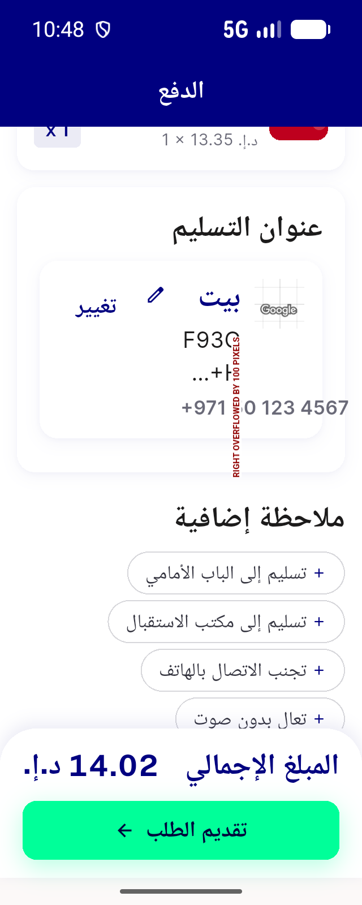</a> base ar 320 1.3</td>
<td align="center" width="33%"> base ar 360 1.0</td>
</tr>
<tr>
<td align="center" width="33%"><a href="base_en_320_1.0.png">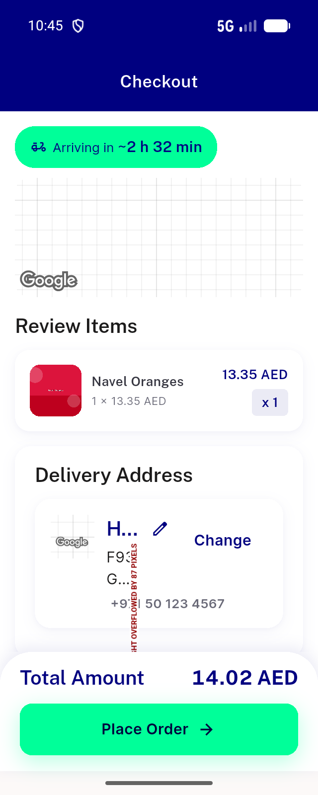</a> base en 320 1.0</td>
<td align="center" width="33%"><a href="base_en_320_1.3.png">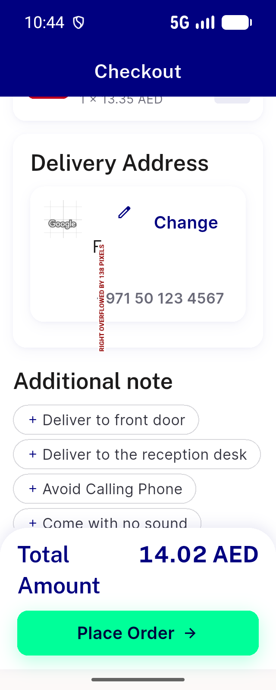</a> base en 320 1.3</td>
<td align="center" width="33%"><a href="base_en_320_1.3b.png">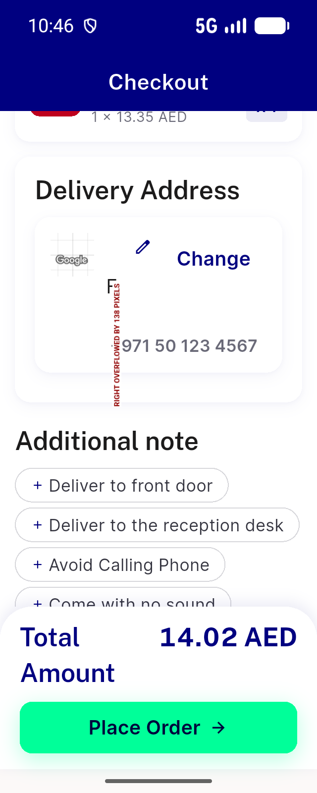</a> base en 320 1.3b</td>
</tr>
<tr>
<td align="center" width="33%"><a href="base_en_360_1.0.png">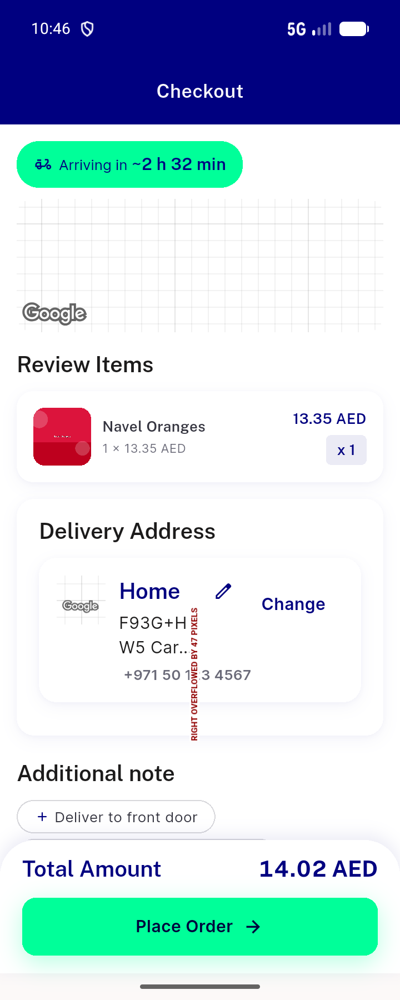</a> base en 360 1.0</td>
<td align="center" width="33%"><a href="base_en_360_1.3.png">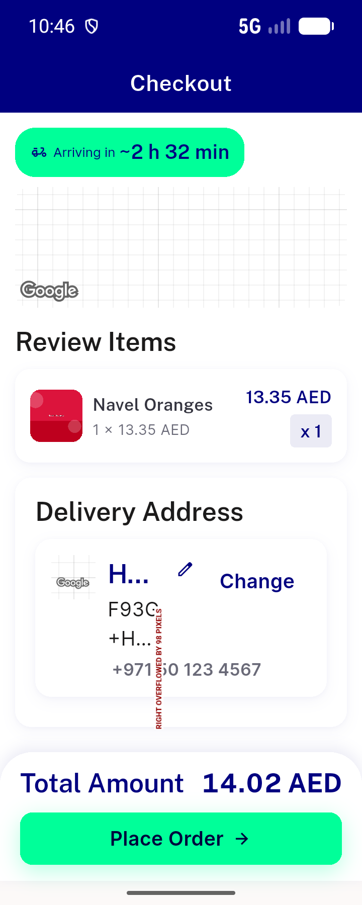</a> base en 360 1.3</td>
<td align="center" width="33%"><a href="compare_ar_320_1.3_base_vs_head.png">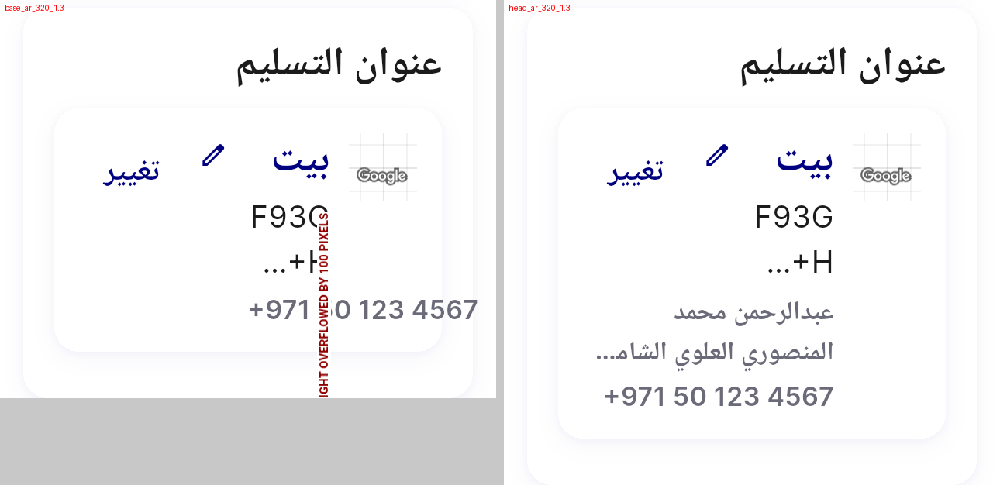</a> compare ar 320 1.3 base vs head</td>
</tr>
<tr>
<td align="center" width="33%"> compare ar 360 1.0 base vs head</td>
<td align="center" width="33%"><a href="compare_en_320_1.0_base_vs_head.png">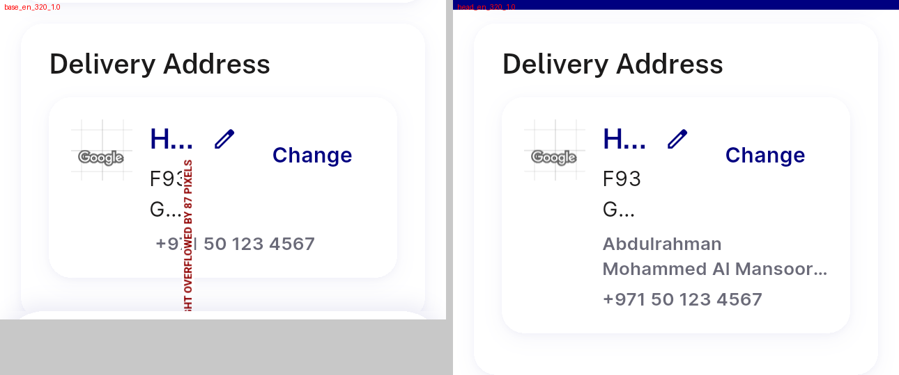</a> compare en 320 1.0 base vs head</td>
<td align="center" width="33%"><a href="compare_en_320_1.3_base_vs_head.png">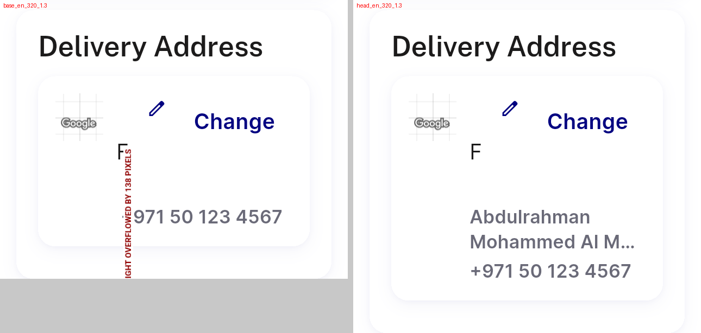</a> compare en 320 1.3 base vs head</td>
</tr>
<tr>
<td align="center" width="33%"><a href="compare_en_360_1.0_base_vs_head.png">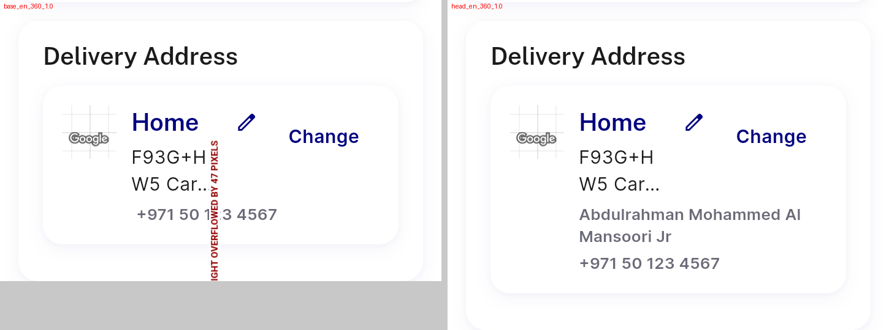</a> compare en 360 1.0 base vs head</td>
<td align="center" width="33%"><a href="head_ar_320_1.0.png">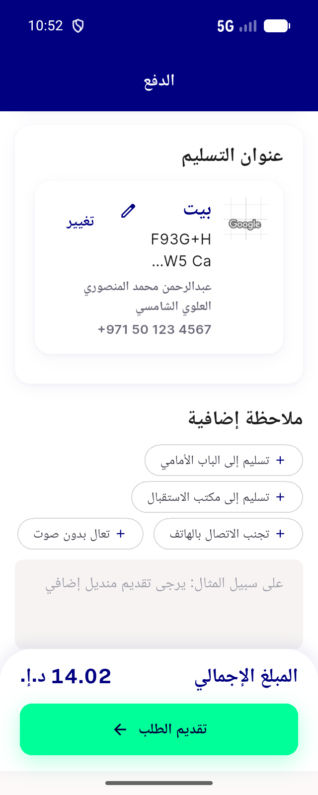</a> head ar 320 1.0</td>
<td align="center" width="33%"><a href="head_ar_320_1.3.png">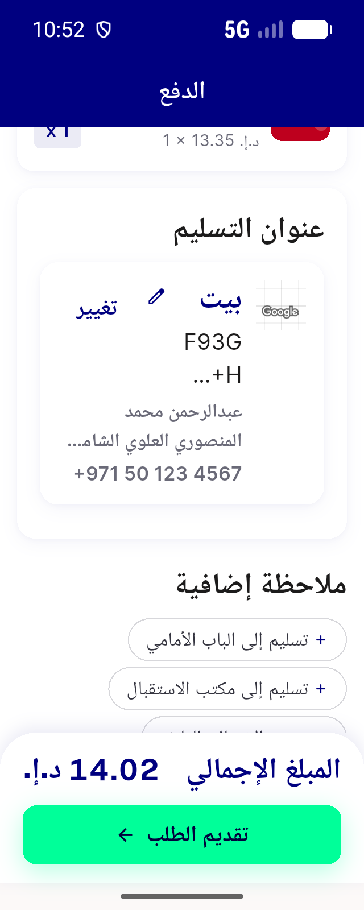</a> head ar 320 1.3</td>
</tr>
<tr>
<td align="center" width="33%"> head ar 320 1.3 tap0</td>
<td align="center" width="33%"> head ar 320 1.3 tap change</td>
<td align="center" width="33%"><a href="head_ar_320_1.3_tap_edit.png">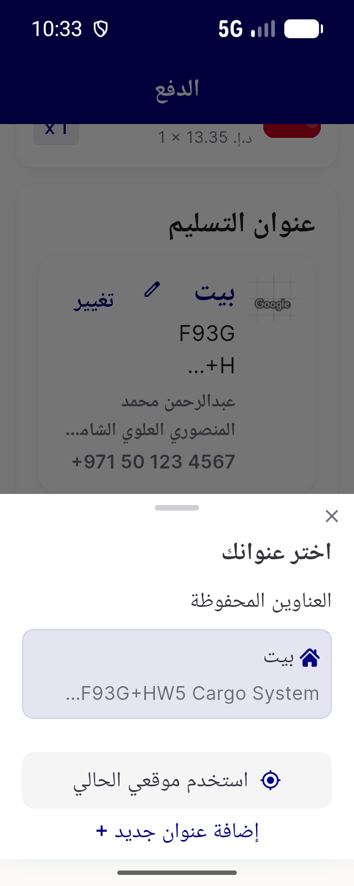</a> head ar 320 1.3 tap edit</td>
</tr>
<tr>
<td align="center" width="33%"> head ar 360 1.0</td>
<td align="center" width="33%"> head ar 360 1.0 COMPACT</td>
<td align="center" width="33%"> head ar 360 1.3</td>
</tr>
<tr>
<td align="center" width="33%"><a href="head_en_320_1.0.png">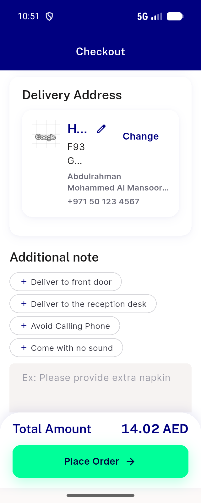</a> head en 320 1.0</td>
<td align="center" width="33%"><a href="head_en_320_1.3.png">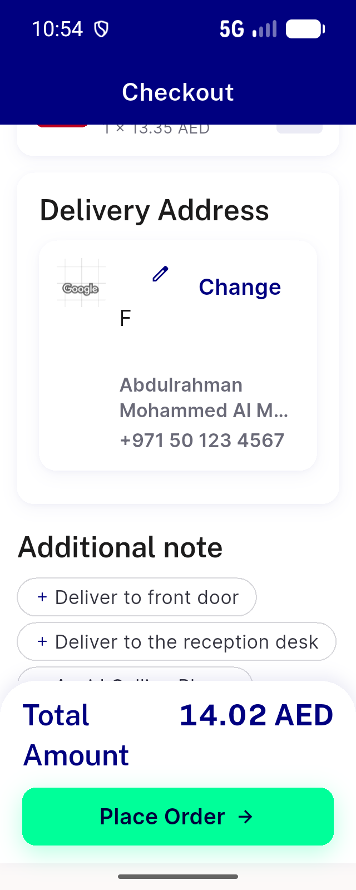</a> head en 320 1.3</td>
<td align="center" width="33%"><a href="head_en_320_1.3_EXT.png">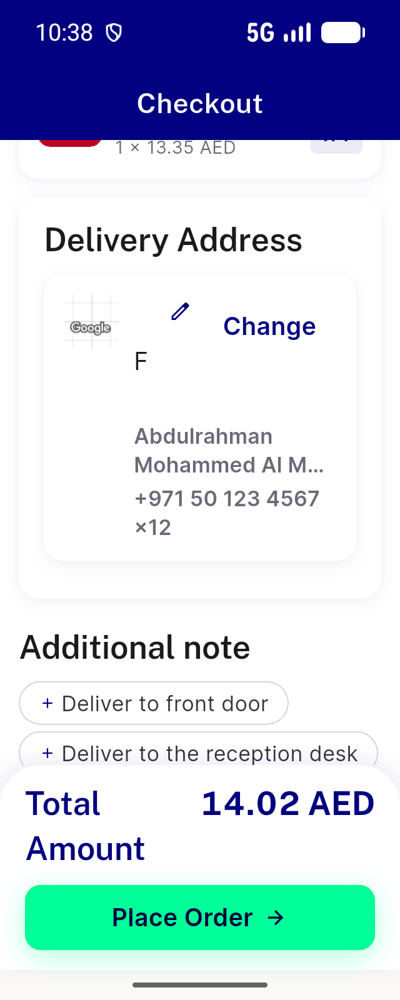</a> head en 320 1.3 EXT</td>
</tr>
<tr>
<td align="center" width="33%"><a href="head_en_320_1.3_NAMEONLY.png">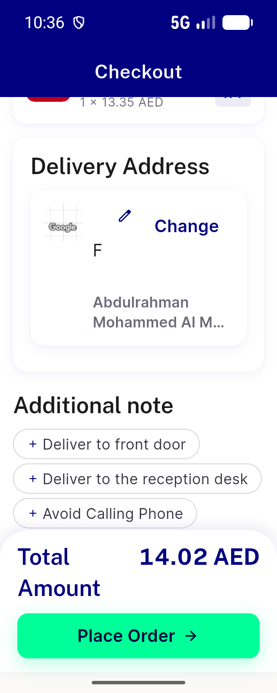</a> head en 320 1.3 NAMEONLY</td>
<td align="center" width="33%"><a href="head_en_320_1.3_PHONEONLY.png">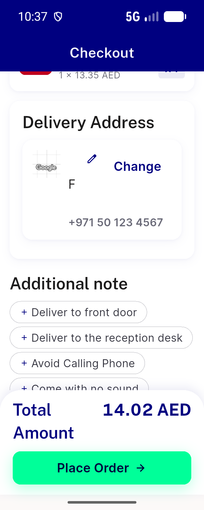</a> head en 320 1.3 PHONEONLY</td>
<td align="center" width="33%"> head en 360 1.0</td>
</tr>
<tr>
<td align="center" width="33%"><a href="head_en_360_1.0_COMPACT.png">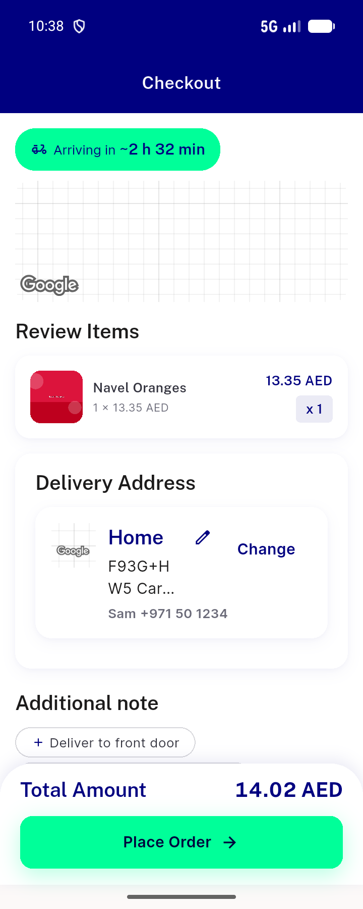</a> head en 360 1.0 COMPACT</td>
<td align="center" width="33%"><a href="head_en_360_1.3.png">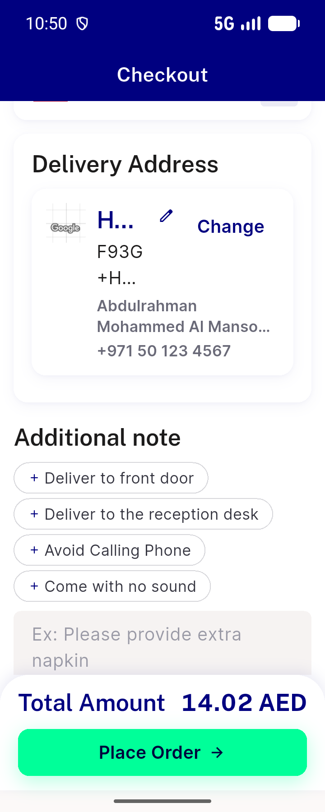</a> head en 360 1.3</td>
</tr>
</table>

### Other artifacts
- [`base_ar_320_1.0.log`](base_ar_320_1.0.log)
- [`base_ar_320_1.0.xml`](base_ar_320_1.0.xml)
- [`base_ar_320_1.3.log`](base_ar_320_1.3.log)
- [`base_ar_320_1.3.xml`](base_ar_320_1.3.xml)
- [`base_ar_360_1.0.log`](base_ar_360_1.0.log)
- [`base_ar_360_1.0.xml`](base_ar_360_1.0.xml)
- [`base_en_320_1.0.log`](base_en_320_1.0.log)
- [`base_en_320_1.0.xml`](base_en_320_1.0.xml)
- [`base_en_320_1.3.log`](base_en_320_1.3.log)
- [`base_en_320_1.3.xml`](base_en_320_1.3.xml)
- [`base_en_320_1.3b.log`](base_en_320_1.3b.log)
- [`base_en_320_1.3b.xml`](base_en_320_1.3b.xml)
- [`base_en_360_1.0.log`](base_en_360_1.0.log)
- [`base_en_360_1.0.xml`](base_en_360_1.0.xml)
- [`base_en_360_1.3.log`](base_en_360_1.3.log)
- [`base_en_360_1.3.xml`](base_en_360_1.3.xml)
- [`bug-checkout-shimmer-overflow.log`](bug-checkout-shimmer-overflow.log)
- [`head_ar_320_1.0.log`](head_ar_320_1.0.log)
- [`head_ar_320_1.0.xml`](head_ar_320_1.0.xml)
- [`head_ar_320_1.3.log`](head_ar_320_1.3.log)
- [`head_ar_320_1.3.xml`](head_ar_320_1.3.xml)
- [`head_ar_360_1.0.log`](head_ar_360_1.0.log)
- [`head_ar_360_1.0.xml`](head_ar_360_1.0.xml)
- [`head_ar_360_1.0_COMPACT.log`](head_ar_360_1.0_COMPACT.log)
- [`head_ar_360_1.0_COMPACT.xml`](head_ar_360_1.0_COMPACT.xml)
- [`head_ar_360_1.3.log`](head_ar_360_1.3.log)
- [`head_ar_360_1.3.xml`](head_ar_360_1.3.xml)
- [`head_en_320_1.0.log`](head_en_320_1.0.log)
- [`head_en_320_1.0.xml`](head_en_320_1.0.xml)
- [`head_en_320_1.3.log`](head_en_320_1.3.log)
- [`head_en_320_1.3.xml`](head_en_320_1.3.xml)
- [`head_en_320_1.3_EXT.log`](head_en_320_1.3_EXT.log)
- [`head_en_320_1.3_EXT.xml`](head_en_320_1.3_EXT.xml)
- [`head_en_320_1.3_NAMEONLY.log`](head_en_320_1.3_NAMEONLY.log)
- [`head_en_320_1.3_NAMEONLY.xml`](head_en_320_1.3_NAMEONLY.xml)
- [`head_en_320_1.3_PHONEONLY.log`](head_en_320_1.3_PHONEONLY.log)
- [`head_en_320_1.3_PHONEONLY.xml`](head_en_320_1.3_PHONEONLY.xml)
- [`head_en_360_1.0.log`](head_en_360_1.0.log)
- [`head_en_360_1.0.xml`](head_en_360_1.0.xml)
- [`head_en_360_1.0_COMPACT.log`](head_en_360_1.0_COMPACT.log)
- [`head_en_360_1.0_COMPACT.xml`](head_en_360_1.0_COMPACT.xml)
- [`head_en_360_1.3.log`](head_en_360_1.3.log)
- [`head_en_360_1.3.xml`](head_en_360_1.3.xml)

---
*From `nears/docs/qa-evidence/NEARS-3943/` · public-repo scrub policy (no live secrets; verified clean).*
