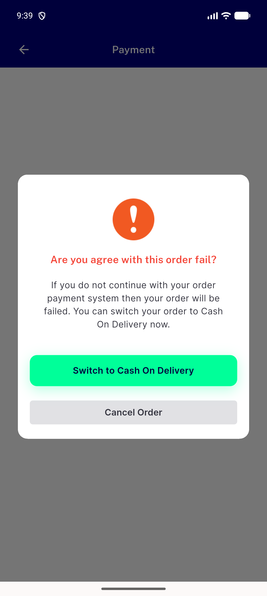
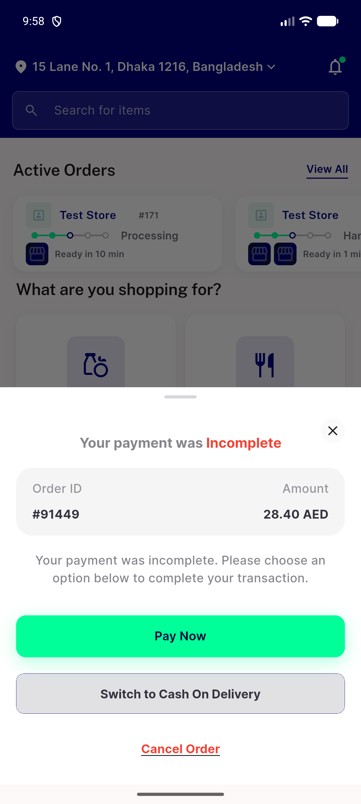

# QA Evidence — NEARS-3944

**NEARS-3944 cycle-0 QA: PASS (AC1-AC4 + AC-LOG live on nears_qa_3944; base positive control for AC3)**

**2 screenshot(s).** Click any thumbnail for full resolution.

<table>
<tr>
<td align="center" width="33%"> g3 partial dialog held after back barrier edgeswipe</td>
<td align="center" width="33%"> g6 after partial kill relaunch resume sheet 91449</td>
</tr>
</table>

### Other artifacts
- [`ac-log-fail-lines.log`](ac-log-fail-lines.log)
- [`ac3-fix-vs-base-proxy.log`](ac3-fix-vs-base-proxy.log)
- [`bug-create-account-guest-group-unrecoverable.log`](bug-create-account-guest-group-unrecoverable.log)
- [`bug-group-action-no-feedback-on-roster-failure.log`](bug-group-action-no-feedback-on-roster-failure.log)
- [`g3-partial-retry.log`](g3-partial-retry.log)
- [`g4b-terminal-g5-409.log`](g4b-terminal-g5-409.log)
- [`progress.md`](progress.md)

---
*From `nears/docs/qa-evidence/NEARS-3944/` · public-repo scrub policy (no live secrets; verified clean).*
