# QA Evidence — NEARS-3947

**NEARS-3947 [8] fix-cycle 0: PASS - all fixed-state ACs demonstrated live on emulator-5680 (flag OFF same-module + flag ON mixed), backend 96107e7ad on private copy nears_qa_3947**

**17 screenshot(s).** Click any thumbnail for full resolution.

<table>
<tr>
<td align="center" width="33%"><a href="ac4-g1-resume-sheet-token-cash.png">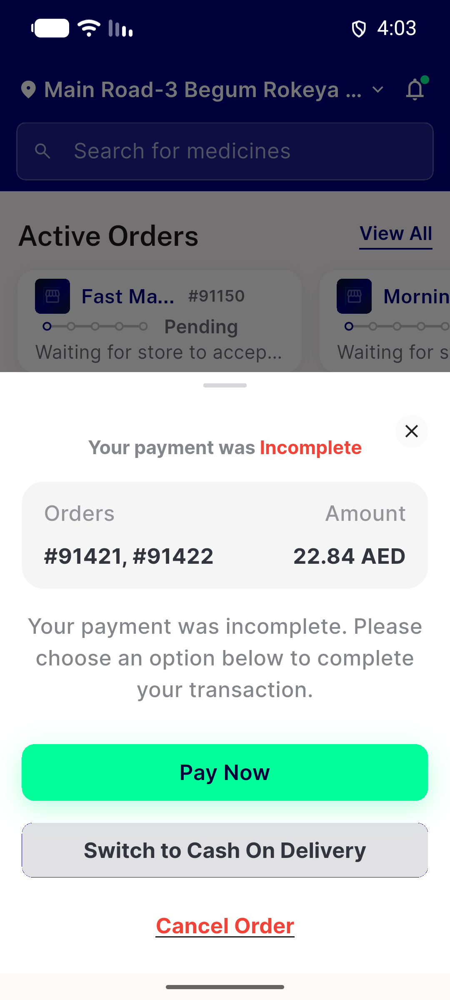</a> ac4 g1 resume sheet token cash</td>
<td align="center" width="33%"><a href="ac4-g2-resume-sheet-failed-retry-leave.png">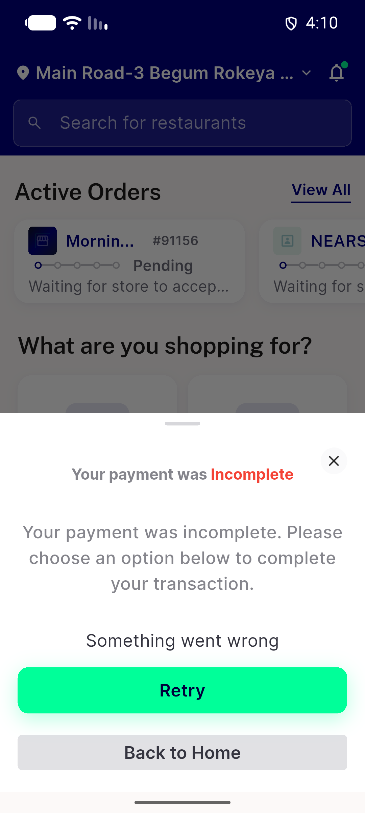</a> ac4 g2 resume sheet failed retry leave</td>
<td align="center" width="33%"><a href="ac4-g2-resume-sheet-resolving.png">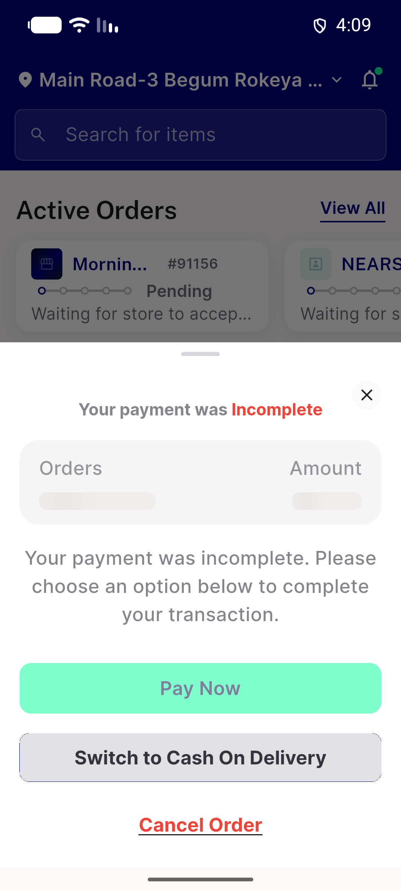</a> ac4 g2 resume sheet resolving</td>
</tr>
<tr>
<td align="center" width="33%"><a href="ac5-g1-failed-screen-token-cash.png">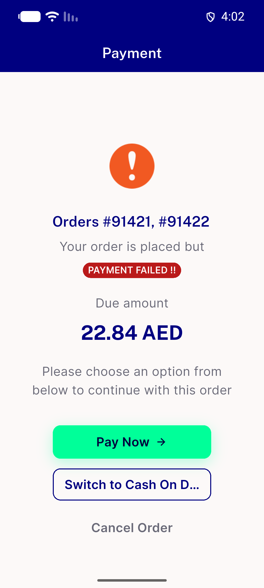</a> ac5 g1 failed screen token cash</td>
<td align="center" width="33%"><a href="ac5-guest-failed-screen-failed-resolve.png">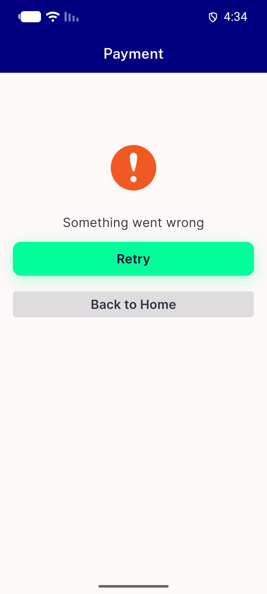</a> ac5 guest failed screen failed resolve</td>
<td align="center" width="33%"><a href="ac5-guest-failed-screen-gate.png">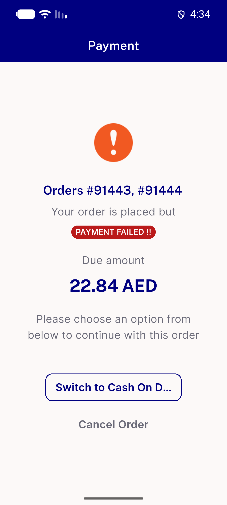</a> ac5 guest failed screen gate</td>
</tr>
<tr>
<td align="center" width="33%"><a href="ac6-payagain-single-sheet-91421.png">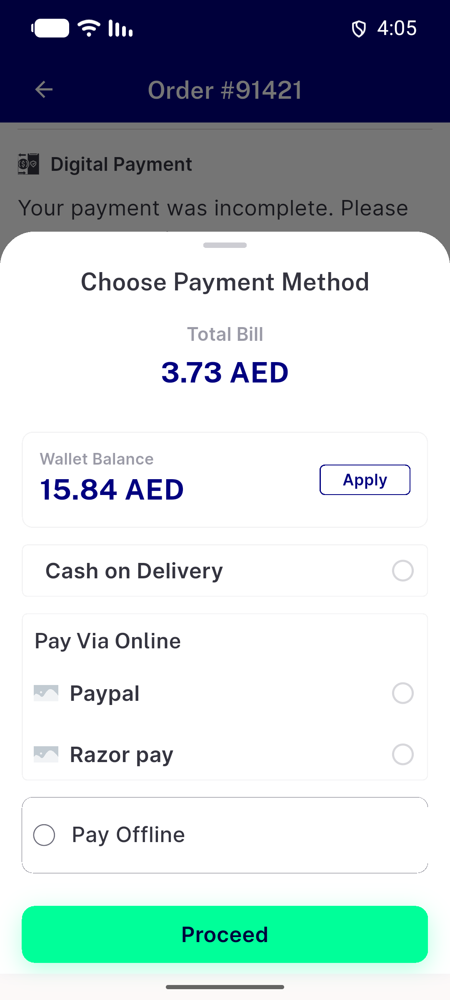</a> ac6 payagain single sheet 91421</td>
<td align="center" width="33%"><a href="ac6-zero-methods-sheet.png">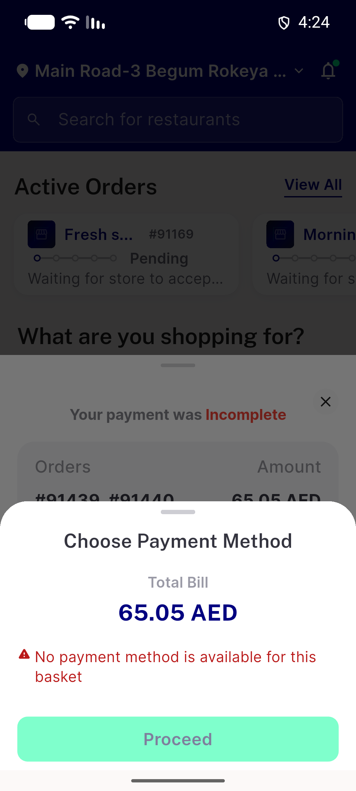</a> ac6 zero methods sheet</td>
<td align="center" width="33%"><a href="d1-resume-sheet-notoken-cash-3f64a660.png">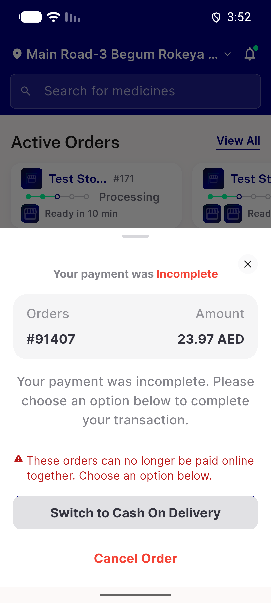</a> d1 resume sheet notoken cash 3f64a660</td>
</tr>
<tr>
<td align="center" width="33%"><a href="mixed-g7-failed-screen-token-nocash.png">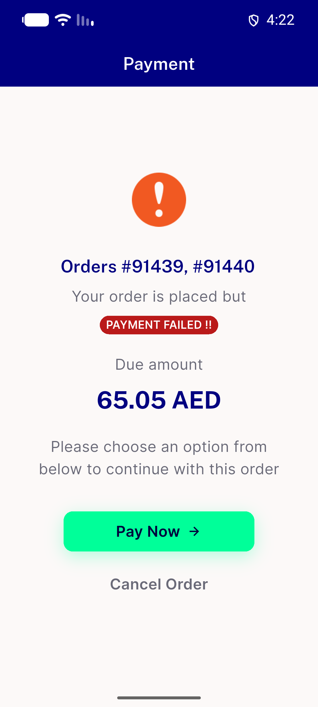</a> mixed g7 failed screen token nocash</td>
<td align="center" width="33%"><a href="mixed-g7-resume-sheet-notoken-nocash.png">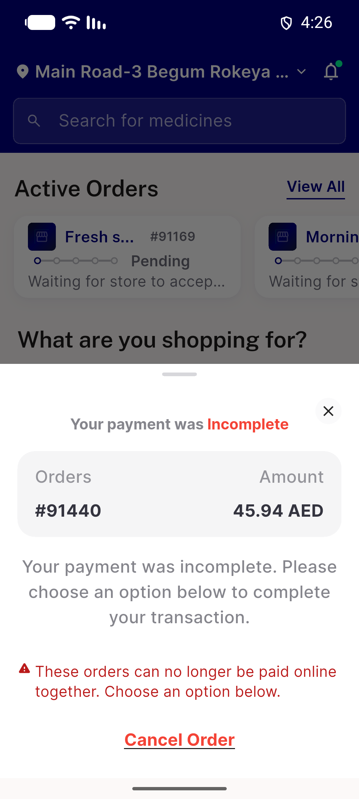</a> mixed g7 resume sheet notoken nocash</td>
<td align="center" width="33%"><a href="p4-g5-ar-resume-sheet-paid-pending.png">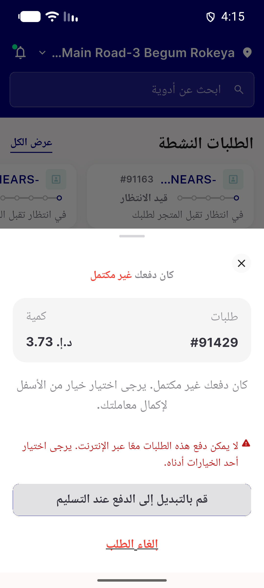</a> p4 g5 ar resume sheet paid pending</td>
</tr>
<tr>
<td align="center" width="33%"><a href="p4-g6-ar-resume-sheet-notice.png">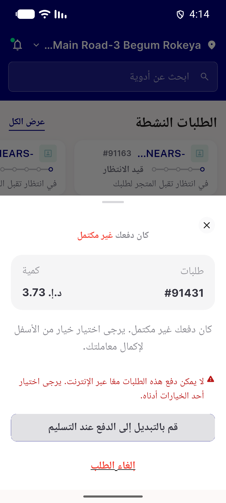</a> p4 g6 ar resume sheet notice</td>
<td align="center" width="33%"><a href="rtl-ar-g2-failed-screen-token.png">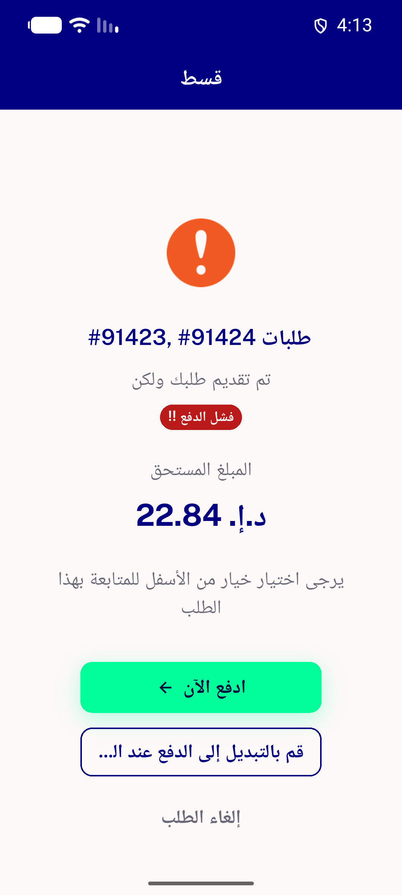</a> rtl ar g2 failed screen token</td>
<td align="center" width="33%"><a href="rtl-ar-g2-resume-sheet-token.png">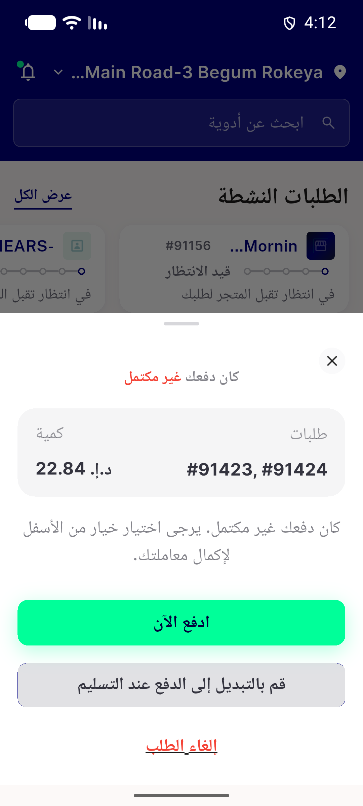</a> rtl ar g2 resume sheet token</td>
</tr>
<tr>
<td align="center" width="33%"><a href="rtl-ar-id-run-crops-sheet-top-failed-bottom.png">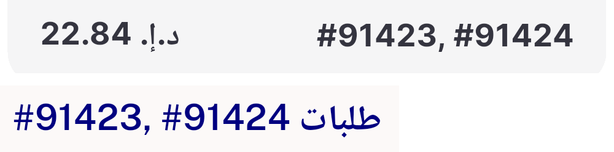</a> rtl ar id run crops sheet top failed bottom</td>
<td align="center" width="33%"><a href="s1-single-order-resume-sheet-91404.png">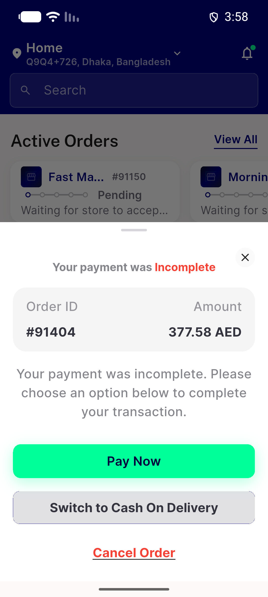</a> s1 single order resume sheet 91404</td>
</tr>
</table>

### Other artifacts
- [`ac4-g1-resume-sheet-token-cash.xml`](ac4-g1-resume-sheet-token-cash.xml)
- [`ac4-g2-failed-retry-leave.log`](ac4-g2-failed-retry-leave.log)
- [`ac4-g2-resume-sheet-failed-retry-leave.xml`](ac4-g2-resume-sheet-failed-retry-leave.xml)
- [`ac4-g2-resume-sheet-resolving.xml`](ac4-g2-resume-sheet-resolving.xml)
- [`ac4-g2-resume-sheet-switch-whole-group.log`](ac4-g2-resume-sheet-switch-whole-group.log)
- [`ac4-g4-resume-sheet-cancel-whole-group.log`](ac4-g4-resume-sheet-cancel-whole-group.log)
- [`ac5-failed-screen-failed-resolve-leave.log`](ac5-failed-screen-failed-resolve-leave.log)
- [`ac5-g1-failed-screen-switch-whole-group.log`](ac5-g1-failed-screen-switch-whole-group.log)
- [`ac5-g1-failed-screen-token-cash.xml`](ac5-g1-failed-screen-token-cash.xml)
- [`ac5-g1-failed-screen.log`](ac5-g1-failed-screen.log)
- [`ac5-g1-paynow-group-webview.log`](ac5-g1-paynow-group-webview.log)
- [`ac5-guest-failed-screen-failed-resolve.xml`](ac5-guest-failed-screen-failed-resolve.xml)
- [`ac5-guest-failed-screen-gate.xml`](ac5-guest-failed-screen-gate.xml)
- [`ac5-guest-gate.log`](ac5-guest-gate.log)
- [`ac6-g1-method-sheet-group-mode.xml`](ac6-g1-method-sheet-group-mode.xml)
- [`ac6-g3-method-sheet-cash-whole-group.log`](ac6-g3-method-sheet-cash-whole-group.log)
- [`ac6-g3-method-sheet-from-resume.xml`](ac6-g3-method-sheet-from-resume.xml)
- [`ac6-payagain-single-child.log`](ac6-payagain-single-child.log)
- [`ac6-payagain-single-sheet-91421.xml`](ac6-payagain-single-sheet-91421.xml)
- [`ac6-refusal-toast-instrumented.log`](ac6-refusal-toast-instrumented.log)
- [`ac6-zero-methods-sheet.xml`](ac6-zero-methods-sheet.xml)
- [`ac6-zero-methods.log`](ac6-zero-methods.log)
- [`acbe-head-vs-base.log`](acbe-head-vs-base.log)
- [`acbe-redeem-amount.log`](acbe-redeem-amount.log)
- [`aclog-token-absent.log`](aclog-token-absent.log)
- [`acsec-guestN-vs-userN.log`](acsec-guestN-vs-userN.log)
- [`acsec-idor.log`](acsec-idor.log)
- [`acsec-replay-cancel.log`](acsec-replay-cancel.log)
- [`acsec-replay-cod.log`](acsec-replay-cod.log)
- [`backstop-flutter-test-tail.log`](backstop-flutter-test-tail.log)
- [`backstop-phpunit.log`](backstop-phpunit.log)
- [`bug-switch-targets-paid-child-no-server-guard.log`](bug-switch-targets-paid-child-no-server-guard.log)
- [`d1-resume-sheet-notoken-cash-3f64a660.xml`](d1-resume-sheet-notoken-cash-3f64a660.xml)
- [`mixed-g7-failed-screen-token-nocash.xml`](mixed-g7-failed-screen-token-nocash.xml)
- [`mixed-g7-failed-screen.log`](mixed-g7-failed-screen.log)
- [`mixed-g7-method-sheet-online-only.xml`](mixed-g7-method-sheet-online-only.xml)
- [`mixed-g7-notoken-nocash-cancel.log`](mixed-g7-notoken-nocash-cancel.log)
- [`mixed-g7-resume-sheet-notoken-nocash.xml`](mixed-g7-resume-sheet-notoken-nocash.xml)
- [`p4-g5-ar-resume-sheet-paid-pending.xml`](p4-g5-ar-resume-sheet-paid-pending.xml)
- [`p4-g5-device.log`](p4-g5-device.log)
- [`p4-g6-ar-resume-sheet-notice.xml`](p4-g6-ar-resume-sheet-notice.xml)
- [`p4-g6-device.log`](p4-g6-device.log)
- [`p4-server-payable-set.log`](p4-server-payable-set.log)
- [`progress.md`](progress.md)
- [`rtl-ar-g2-failed-screen-token.xml`](rtl-ar-g2-failed-screen-token.xml)
- [`rtl-ar-g2-resume-sheet-token.xml`](rtl-ar-g2-resume-sheet-token.xml)
- [`rtl-ar-id-run-pixel-check.log`](rtl-ar-id-run-pixel-check.log)
- [`s1-single-order-resume-sheet-91404.xml`](s1-single-order-resume-sheet-91404.xml)

---
*From `nears/docs/qa-evidence/NEARS-3947/` · public-repo scrub policy (no live secrets; verified clean).*
