# QA Evidence — NEARS-3949

**NEARS-3949 QA delta cycle 1: PASS - out_of_zone row under override ON and OFF, AC2 transient + Retry, AC4 latch live**

**16 screenshot(s).** Click any thumbnail for full resolution.

<table>
<tr>
<td align="center" width="33%"><a href="ac-addr-resolved-line-address45-mobile.png">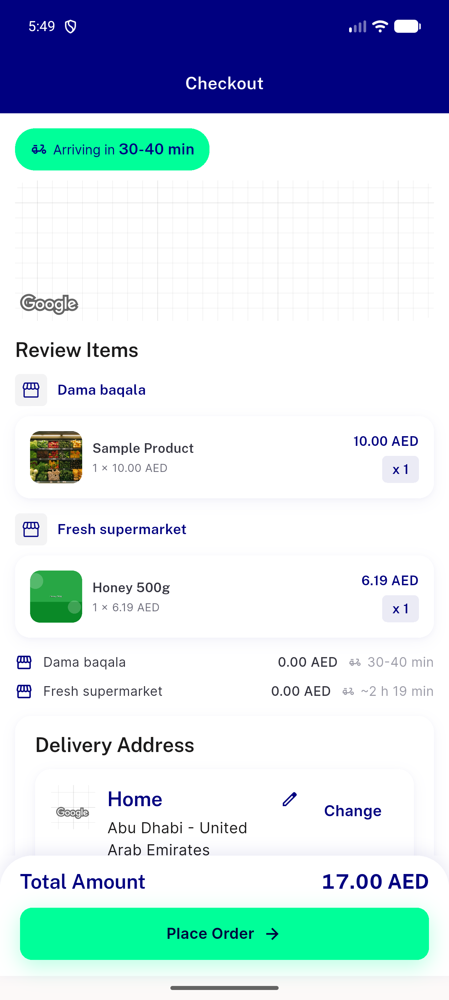</a> ac addr resolved line address45 mobile</td>
<td align="center" width="33%"><a href="ac-reg-single-store-out-of-zone-panel-EN.png">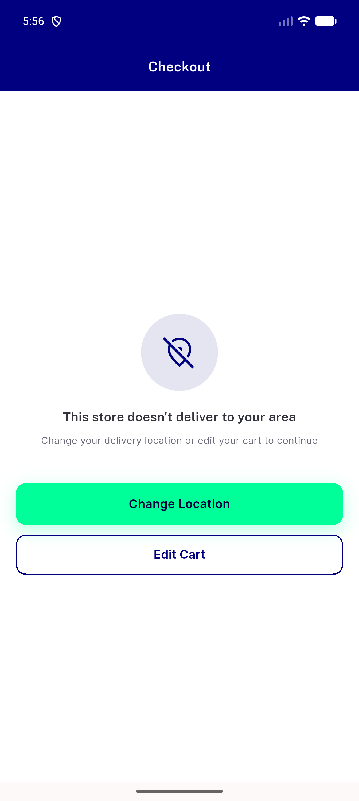</a> ac reg single store out of zone panel EN</td>
<td align="center" width="33%"><a href="bug-hostB-mobile-fee-breakdown-zero-fee-EN.png">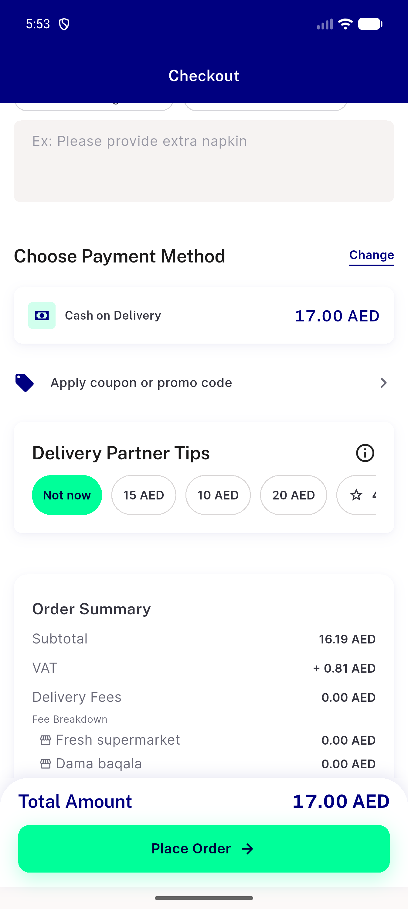</a> bug hostB mobile fee breakdown zero fee EN</td>
</tr>
<tr>
<td align="center" width="33%"><a href="bug-out-of-zone-place-enabled-lead13-mobile.png">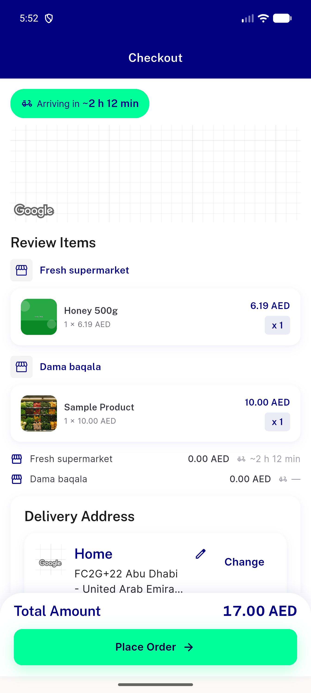</a> bug out of zone place enabled lead13 mobile</td>
<td align="center" width="33%"><a href="bug-out-of-zone-store-renders-resolved-zero-fee-mobile.png">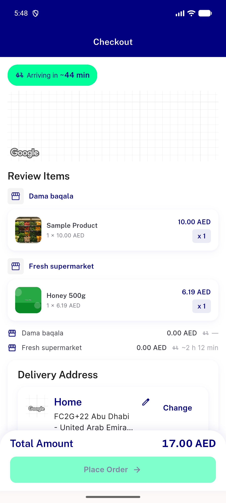</a> bug out of zone store renders resolved zero fee mobile</td>
<td align="center" width="33%"><a href="bug-out-of-zone-store-renders-resolved-zero-fee-wide.png">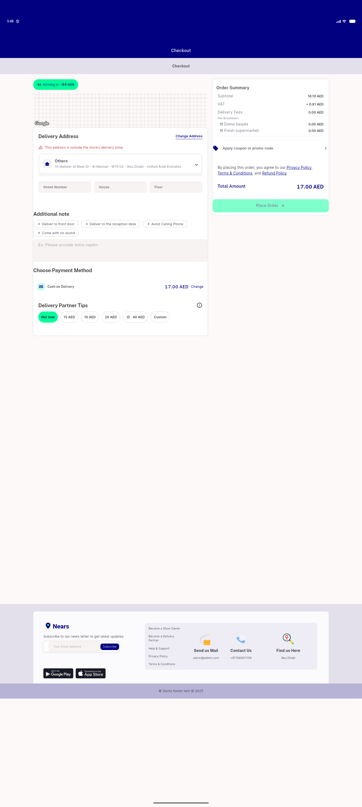</a> bug out of zone store renders resolved zero fee wide</td>
</tr>
<tr>
<td align="center" width="33%"><a href="c1-ac2-transient-row-wide-AR-overrideOFF.png">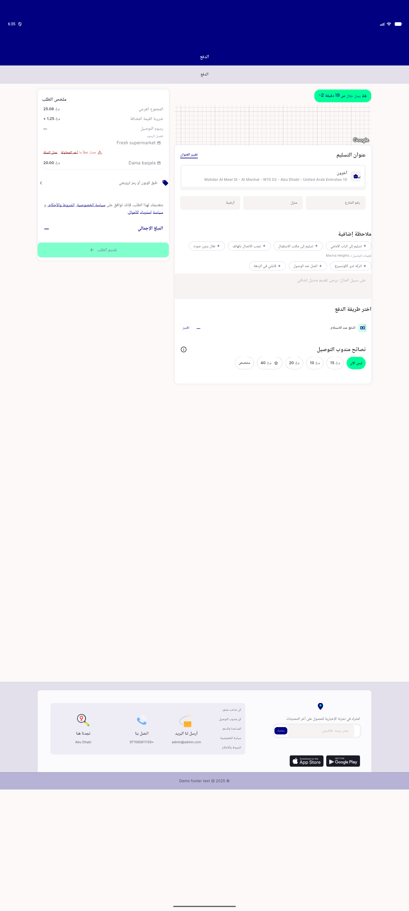</a> c1 ac2 transient row wide AR overrideOFF</td>
<td align="center" width="33%"><a href="c1-ac4-both-rows-wide-AR.png">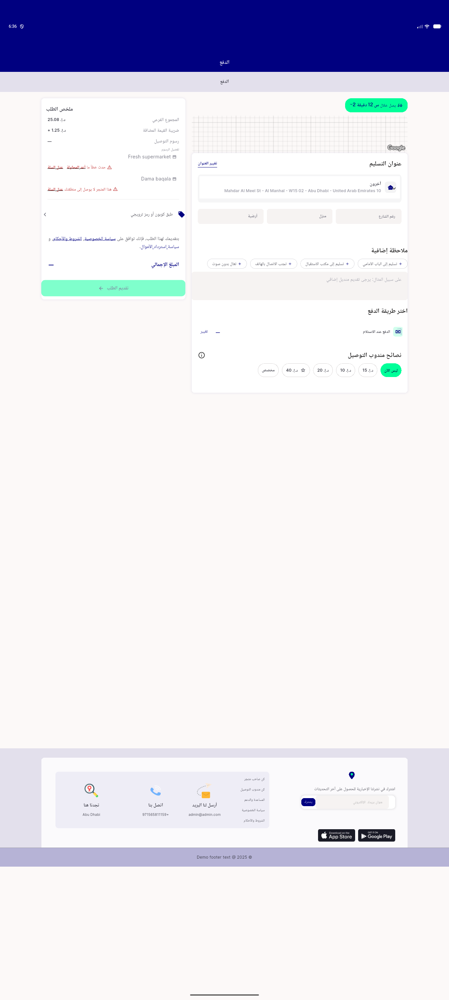</a> c1 ac4 both rows wide AR</td>
<td align="center" width="33%"><a href="c1-ac5-13lead-addr60-overrideON-top.png">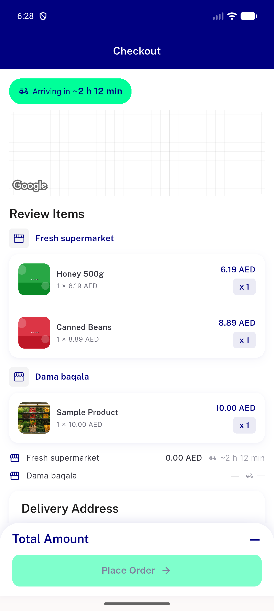</a> c1 ac5 13lead addr60 overrideON top</td>
</tr>
<tr>
<td align="center" width="33%"><a href="c1-hostB-320dp-1.3x-AR.png">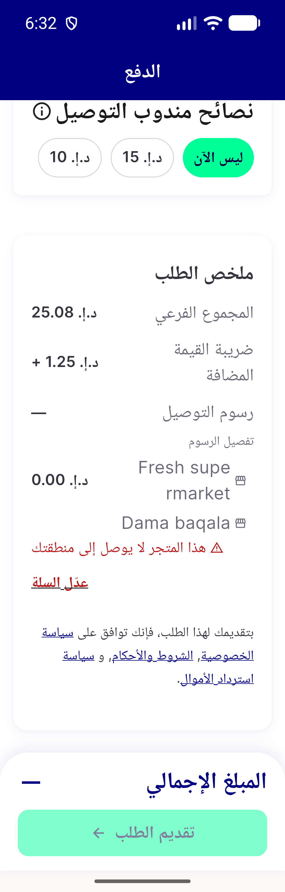</a> c1 hostB 320dp 1.3x AR</td>
<td align="center" width="33%"><a href="c1-hostB-320dp-1.3x-EN.png">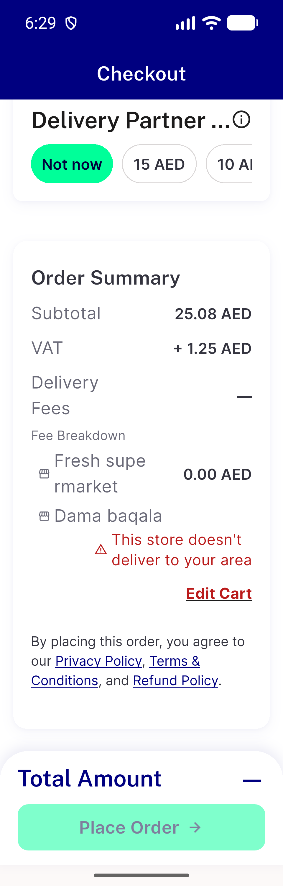</a> c1 hostB 320dp 1.3x EN</td>
<td align="center" width="33%"><a href="c1-hostB-mobile-AR-overrideON.png">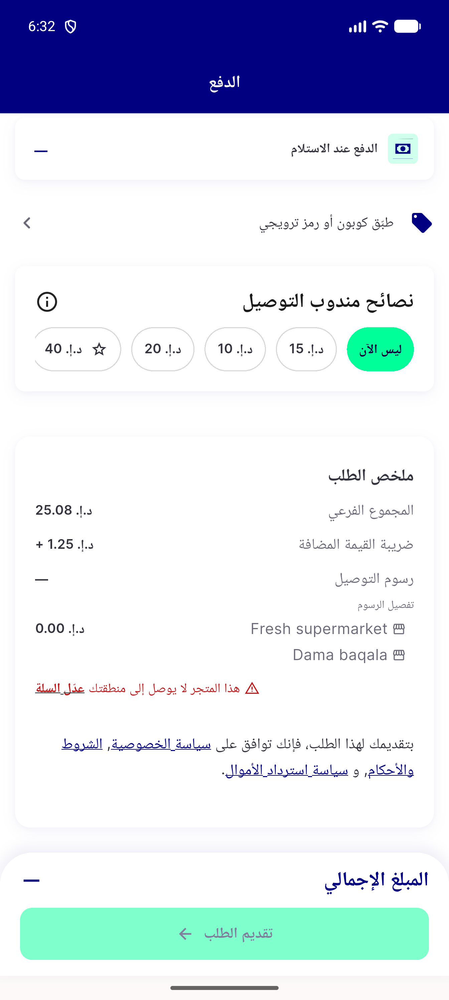</a> c1 hostB mobile AR overrideON</td>
</tr>
<tr>
<td align="center" width="33%"><a href="c1-hostB-mobile-EN-overrideON-3168lead.png">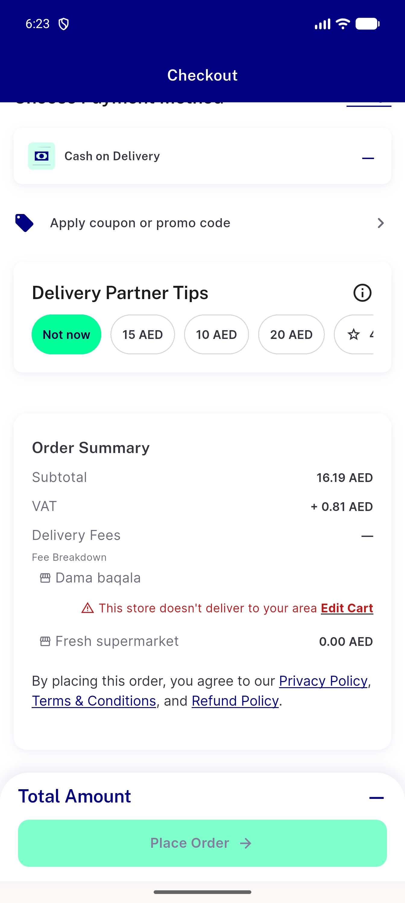</a> c1 hostB mobile EN overrideON 3168lead</td>
<td align="center" width="33%"><a href="c1-hostB-wide-AR-overrideOFF.png">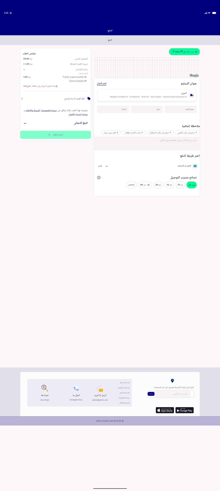</a> c1 hostB wide AR overrideOFF</td>
<td align="center" width="33%"> c1 hostB wide AR overrideON</td>
</tr>
<tr>
<td align="center" width="33%"><a href="c1-hostB-wide-EN-overrideON-3168lead.png">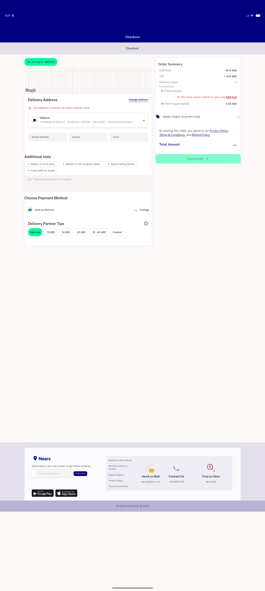</a> c1 hostB wide EN overrideON 3168lead</td>
</tr>
</table>

### Other artifacts
- [`ac-addr-resolved-a11y-dump.xml`](ac-addr-resolved-a11y-dump.xml)
- [`bug-lead13-addr60-mobile-a11y-dump.xml`](bug-lead13-addr60-mobile-a11y-dump.xml)
- [`bug-out-of-zone-store-mobile-a11y-dump.xml`](bug-out-of-zone-store-mobile-a11y-dump.xml)
- [`bug-search-results-semantics-table-assert.log`](bug-search-results-semantics-table-assert.log)
- [`c1-ac2-after-retry-dump.xml`](c1-ac2-after-retry-dump.xml)
- [`c1-ac2-transient-wide-AR-dump.xml`](c1-ac2-transient-wide-AR-dump.xml)
- [`c1-ac4-after-retry-dump.xml`](c1-ac4-after-retry-dump.xml)
- [`c1-ac4-both-rows-dump.xml`](c1-ac4-both-rows-dump.xml)
- [`c1-ac5-13lead-addr60-overrideON-dump.xml`](c1-ac5-13lead-addr60-overrideON-dump.xml)
- [`c1-ac5-13lead-addr60-overrideON-feebreakdown-dump.xml`](c1-ac5-13lead-addr60-overrideON-feebreakdown-dump.xml)
- [`c1-ac5-3168lead-overrideOFF-dump.xml`](c1-ac5-3168lead-overrideOFF-dump.xml)
- [`c1-hostB-320dp-1.3x-AR-dump.xml`](c1-hostB-320dp-1.3x-AR-dump.xml)
- [`c1-hostB-320dp-1.3x-EN-dump.xml`](c1-hostB-320dp-1.3x-EN-dump.xml)
- [`c1-hostB-mobile-AR-dump.xml`](c1-hostB-mobile-AR-dump.xml)
- [`c1-hostB-mobile-EN-overrideON-dump.xml`](c1-hostB-mobile-EN-overrideON-dump.xml)
- [`c1-hostB-wide-AR-dump.xml`](c1-hostB-wide-AR-dump.xml)
- [`c1-hostB-wide-AR-overrideOFF-dump.xml`](c1-hostB-wide-AR-overrideOFF-dump.xml)
- [`c1-hostB-wide-EN-overrideON-dump.xml`](c1-hostB-wide-EN-overrideON-dump.xml)
- [`progress.md`](progress.md)

---
*From `nears/docs/qa-evidence/NEARS-3949/` · public-repo scrub policy (no live secrets; verified clean).*
