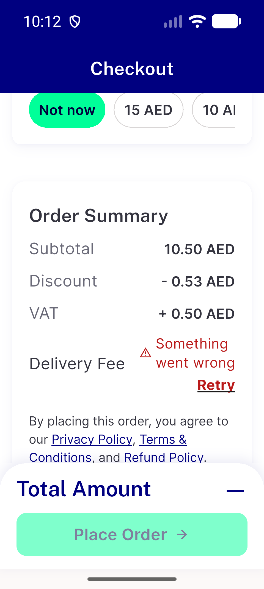
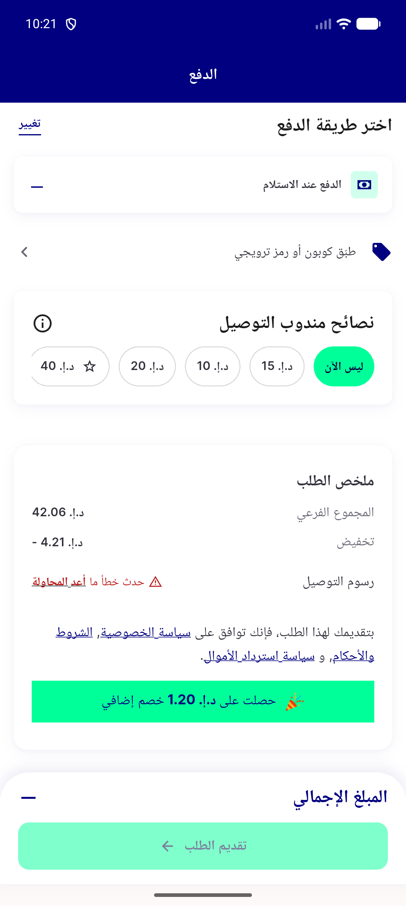
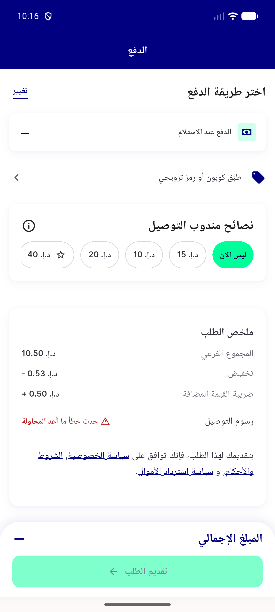
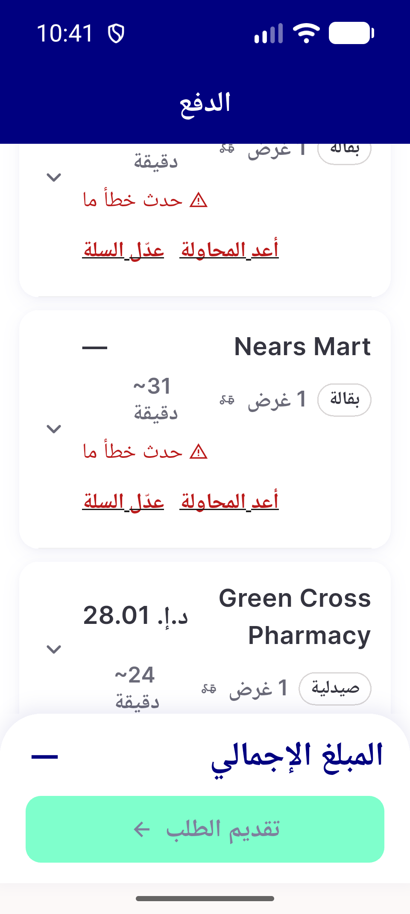
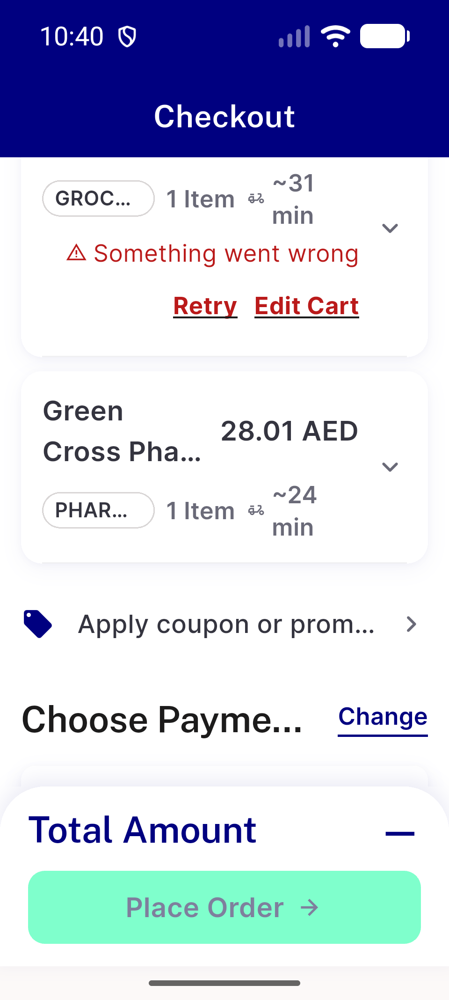
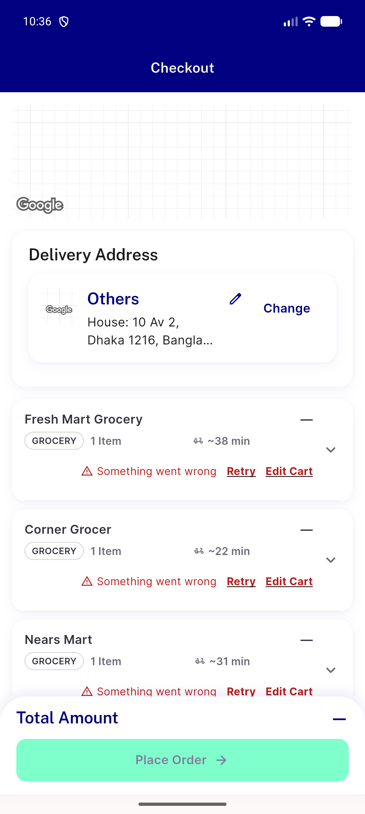

# QA Evidence — NEARS-3950

**QA resume - all 8 bill cells within the growth formula on device; AR literal 72 exceeded (74) pending advisor ruling**

**16 screenshot(s).** Click any thumbnail for full resolution.

<table>
<tr>
<td align="center" width="33%"> base bill single ar 320x1.3</td>
<td align="center" width="33%"> base bill single ar default</td>
<td align="center" width="33%"> base bill single en 320x1.3</td>
</tr>
<tr>
<td align="center" width="33%"> base bill single en default</td>
<td align="center" width="33%"> bill group ar 320x1.3</td>
<td align="center" width="33%"> bill group ar default</td>
</tr>
<tr>
<td align="center" width="33%"> bill group en 320x1.3</td>
<td align="center" width="33%"> bill group en default</td>
<td align="center" width="33%"> bill single ar 320x1.3</td>
</tr>
<tr>
<td align="center" width="33%"> bill single ar default</td>
<td align="center" width="33%"> bill single en 320x1.3</td>
<td align="center" width="33%"> bill single en default</td>
</tr>
<tr>
<td align="center" width="33%"> group breakdown en default</td>
<td align="center" width="33%"> mixed storeline ar 320x1.3</td>
<td align="center" width="33%"> mixed storeline en 320x1.3</td>
</tr>
<tr>
<td align="center" width="33%"> mixed storeline en default</td>
</tr>
</table>

### Other artifacts
- [`base-bill-single-ar-320x1.3.a11y.xml`](base-bill-single-ar-320x1.3.a11y.xml)
- [`base-bill-single-ar-320x1.3.render.txt`](base-bill-single-ar-320x1.3.render.txt)
- [`base-bill-single-ar-default.a11y.xml`](base-bill-single-ar-default.a11y.xml)
- [`base-bill-single-ar-default.render.txt`](base-bill-single-ar-default.render.txt)
- [`base-bill-single-en-320x1.3.a11y.xml`](base-bill-single-en-320x1.3.a11y.xml)
- [`base-bill-single-en-320x1.3.render.txt`](base-bill-single-en-320x1.3.render.txt)
- [`base-bill-single-en-default.a11y.xml`](base-bill-single-en-default.a11y.xml)
- [`base-bill-single-en-default.render.txt`](base-bill-single-en-default.render.txt)
- [`bill-group-ar-320x1.3.a11y.xml`](bill-group-ar-320x1.3.a11y.xml)
- [`bill-group-ar-320x1.3.render.txt`](bill-group-ar-320x1.3.render.txt)
- [`bill-group-ar-default.a11y.xml`](bill-group-ar-default.a11y.xml)
- [`bill-group-ar-default.render.txt`](bill-group-ar-default.render.txt)
- [`bill-group-en-320x1.3.a11y.xml`](bill-group-en-320x1.3.a11y.xml)
- [`bill-group-en-320x1.3.render.txt`](bill-group-en-320x1.3.render.txt)
- [`bill-group-en-default.a11y.xml`](bill-group-en-default.a11y.xml)
- [`bill-group-en-default.render.txt`](bill-group-en-default.render.txt)
- [`bill-single-ar-320x1.3.a11y.xml`](bill-single-ar-320x1.3.a11y.xml)
- [`bill-single-ar-320x1.3.render.txt`](bill-single-ar-320x1.3.render.txt)
- [`bill-single-ar-default.a11y.xml`](bill-single-ar-default.a11y.xml)
- [`bill-single-ar-default.render.txt`](bill-single-ar-default.render.txt)
- [`bill-single-en-320x1.3.a11y.xml`](bill-single-en-320x1.3.a11y.xml)
- [`bill-single-en-320x1.3.render.txt`](bill-single-en-320x1.3.render.txt)
- [`bill-single-en-default.a11y.xml`](bill-single-en-default.a11y.xml)
- [`bill-single-en-default.render.txt`](bill-single-en-default.render.txt)
- [`bug-bill-ar-320x1.3-row-74dp-over-72-ceiling.log`](bug-bill-ar-320x1.3-row-74dp-over-72-ceiling.log)
- [`bug-checkout-initcall-null-check-after-relogin.log`](bug-checkout-initcall-null-check-after-relogin.log)
- [`bug-checkout-shimmer-overflow-320x1.3.log`](bug-checkout-shimmer-overflow-320x1.3.log)
- [`group-breakdown-en-default.a11y.xml`](group-breakdown-en-default.a11y.xml)
- [`group-breakdown-en-default.render.txt`](group-breakdown-en-default.render.txt)
- [`mixed-storeline-ar-320x1.3.a11y.xml`](mixed-storeline-ar-320x1.3.a11y.xml)
- [`mixed-storeline-ar-320x1.3.render.txt`](mixed-storeline-ar-320x1.3.render.txt)
- [`mixed-storeline-en-320x1.3.a11y.xml`](mixed-storeline-en-320x1.3.a11y.xml)
- [`mixed-storeline-en-320x1.3.render.txt`](mixed-storeline-en-320x1.3.render.txt)
- [`mixed-storeline-en-default.a11y.xml`](mixed-storeline-en-default.a11y.xml)
- [`mixed-storeline-en-default.render.txt`](mixed-storeline-en-default.render.txt)

---
*From `nears/docs/qa-evidence/NEARS-3950/` · public-repo scrub policy (no live secrets; verified clean).*
