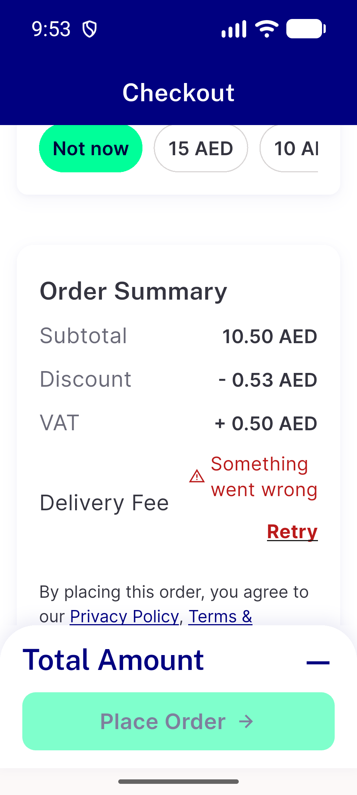

# QA Evidence — NEARS-3950

**QA FAIL - bill failed row AR 320dp x1.3 measures 74dp on device, ceiling 72**

**3 screenshot(s).** Click any thumbnail for full resolution.

<table>
<tr>
<td align="center" width="33%"> bill single ar 320x1.3</td>
<td align="center" width="33%"> bill single en 320x1.3</td>
<td align="center" width="33%"> bill single en default</td>
</tr>
</table>

### Other artifacts
- [`bill-single-ar-320x1.3.a11y.xml`](bill-single-ar-320x1.3.a11y.xml)
- [`bill-single-ar-320x1.3.render.txt`](bill-single-ar-320x1.3.render.txt)
- [`bill-single-en-320x1.3.a11y.xml`](bill-single-en-320x1.3.a11y.xml)
- [`bill-single-en-320x1.3.render.txt`](bill-single-en-320x1.3.render.txt)
- [`bill-single-en-default.a11y.xml`](bill-single-en-default.a11y.xml)
- [`bill-single-en-default.render.txt`](bill-single-en-default.render.txt)
- [`bug-bill-ar-320x1.3-row-74dp-over-72-ceiling.log`](bug-bill-ar-320x1.3-row-74dp-over-72-ceiling.log)
- [`bug-checkout-shimmer-overflow-320x1.3.log`](bug-checkout-shimmer-overflow-320x1.3.log)

---
*From `nears/docs/qa-evidence/NEARS-3950/` · public-repo scrub policy (no live secrets; verified clean).*
