# QA Evidence — NEARS-3953

**NEARS-3953 QA PASS - non-flash per-line discount: checkout == confirm sheet == charged (31.55/4.53), no total-updated step; base control shows the step**

**14 screenshot(s).** Click any thumbnail for full resolution.

<table>
<tr>
<td align="center" width="33%"> ac1 A BEFORE base checkout</td>
<td align="center" width="33%"><a href="ac1-A-BEFORE-base-confirm-sheet.png">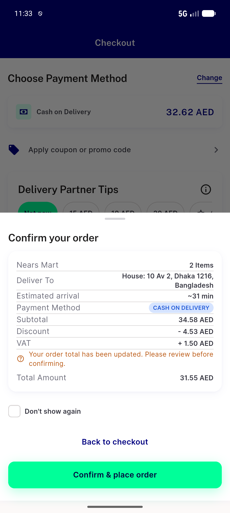</a> ac1 A BEFORE base confirm sheet</td>
<td align="center" width="33%"><a href="ac1-A-checkout-summary.png">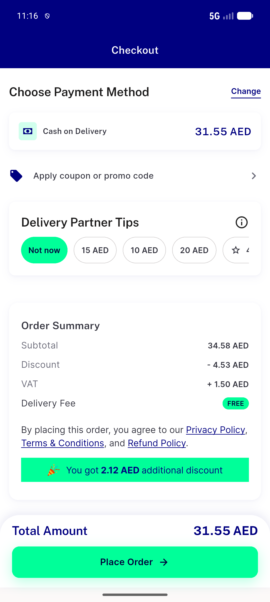</a> ac1 A checkout summary</td>
</tr>
<tr>
<td align="center" width="33%"><a href="ac1-A-confirm-sheet.png">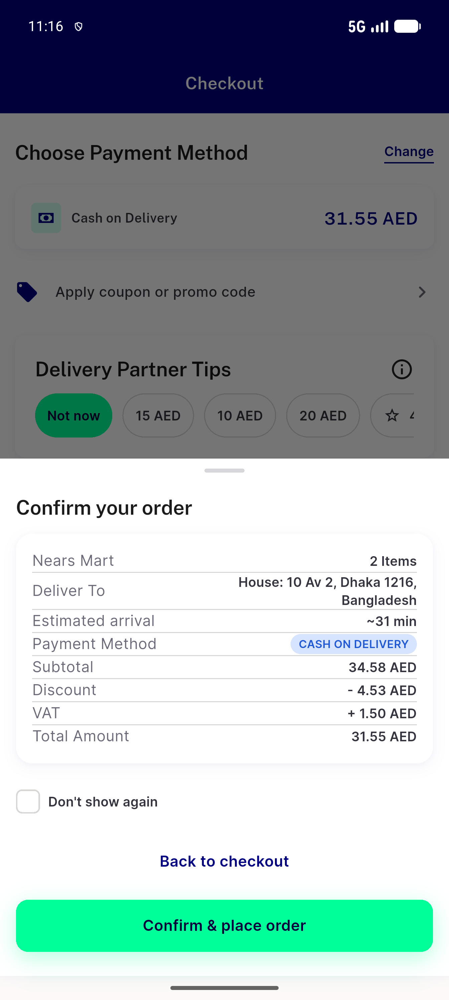</a> ac1 A confirm sheet</td>
<td align="center" width="33%"><a href="ac1-A-order-placed.png">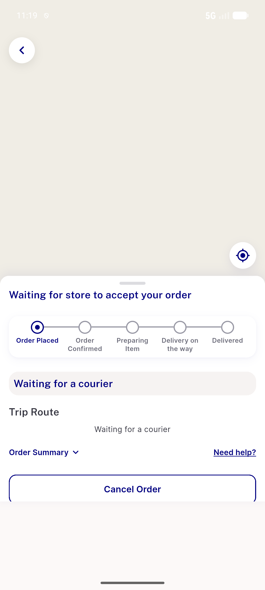</a> ac1 A order placed</td>
<td align="center" width="33%"><a href="ac1-B-cap1-checkout.png">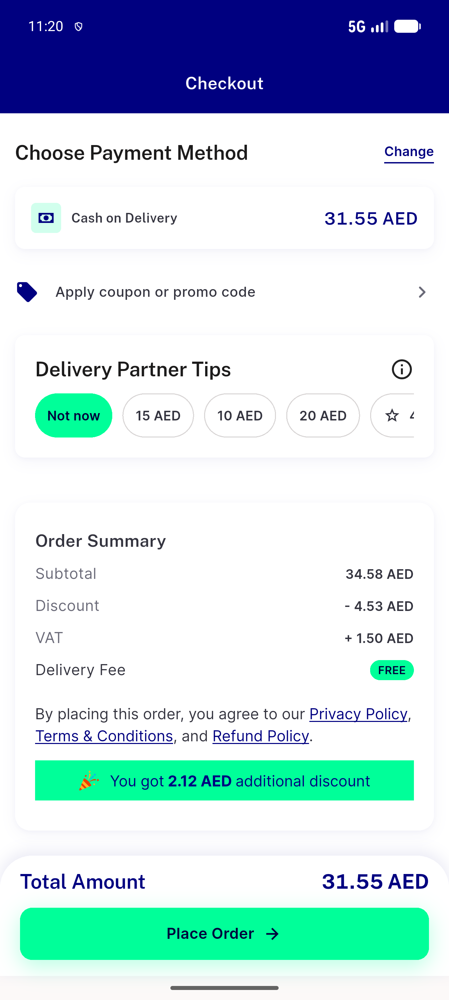</a> ac1 B cap1 checkout</td>
</tr>
<tr>
<td align="center" width="33%"> ac1 B cap1 confirm sheet</td>
<td align="center" width="33%"><a href="ac1-C-minpurchase-confirm-sheet.png">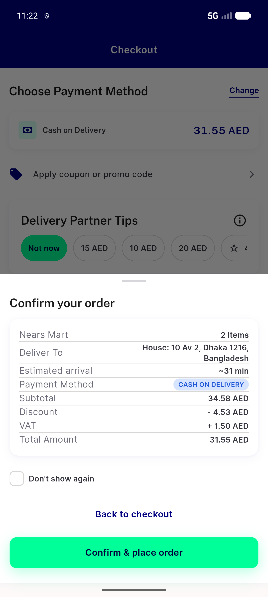</a> ac1 C minpurchase confirm sheet</td>
<td align="center" width="33%"><a href="ac1-D-group-checkout.png">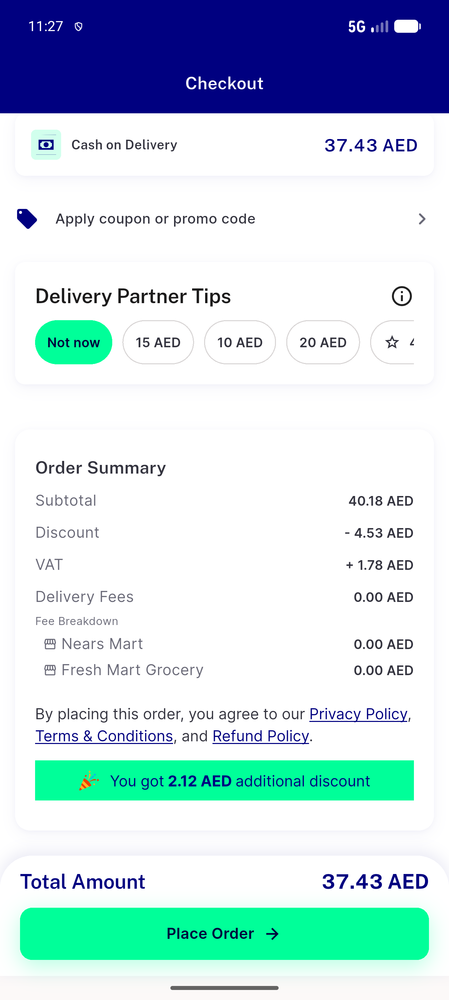</a> ac1 D group checkout</td>
</tr>
<tr>
<td align="center" width="33%"><a href="ac1-D-group-confirm-sheet.png">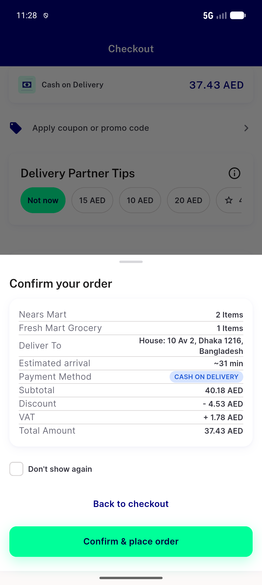</a> ac1 D group confirm sheet</td>
<td align="center" width="33%"><a href="reg-E1-flash-97x2-checkout.png">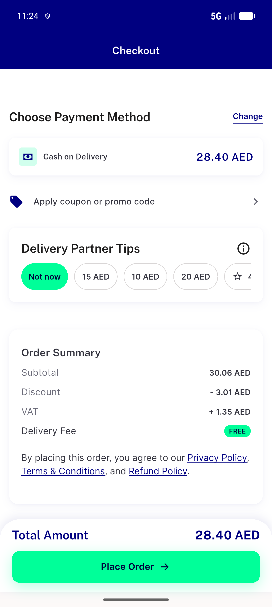</a> reg E1 flash 97x2 checkout</td>
<td align="center" width="33%"><a href="reg-E1-flash-97x2-confirm-sheet.png">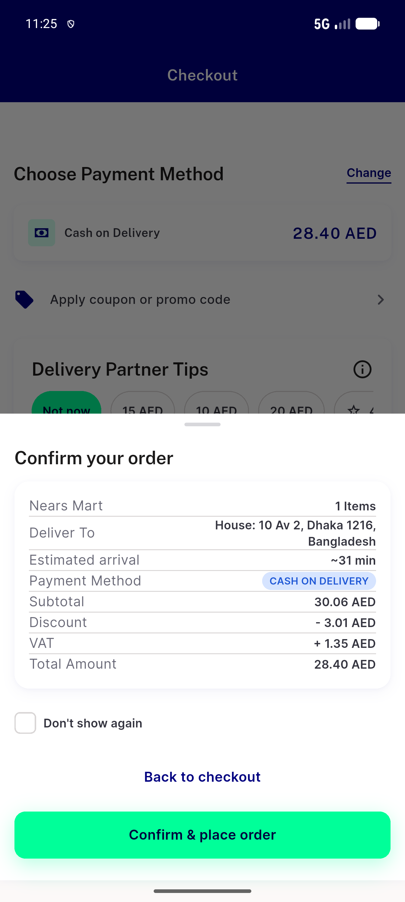</a> reg E1 flash 97x2 confirm sheet</td>
</tr>
<tr>
<td align="center" width="33%"> reg E2 storewins confirm sheet</td>
<td align="center" width="33%"><a href="reg-E3-flash-group-confirm-sheet.png">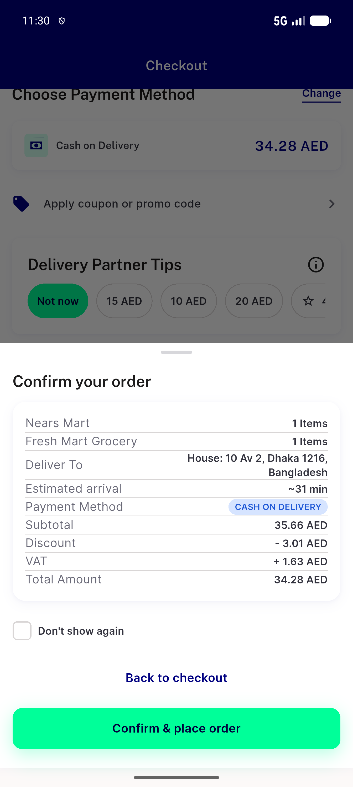</a> reg E3 flash group confirm sheet</td>
</tr>
</table>

### Other artifacts
- [`bug-closed-store-select-a-time-no-slot-row.log`](bug-closed-store-select-a-time-no-slot-row.log)
- [`progress.md`](progress.md)

---
*From `nears/docs/qa-evidence/NEARS-3953/` · public-repo scrub policy (no live secrets; verified clean).*
